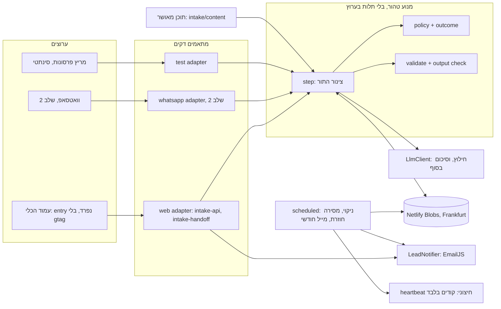
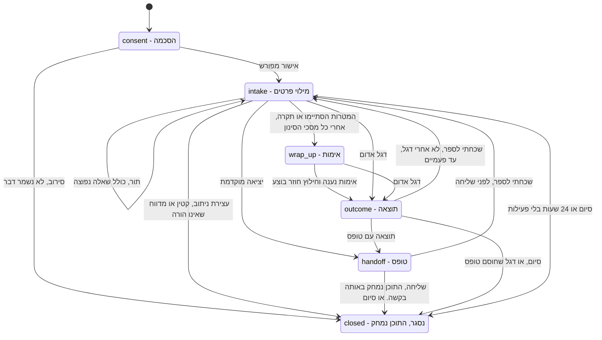
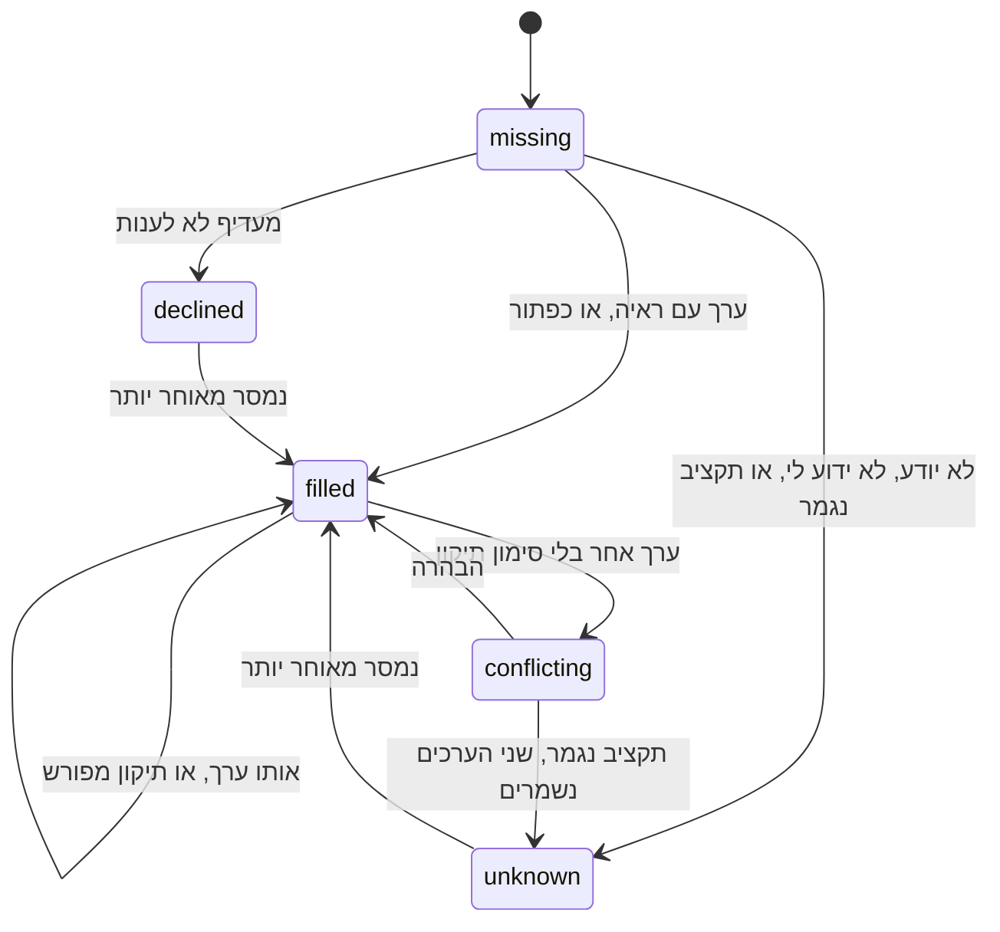
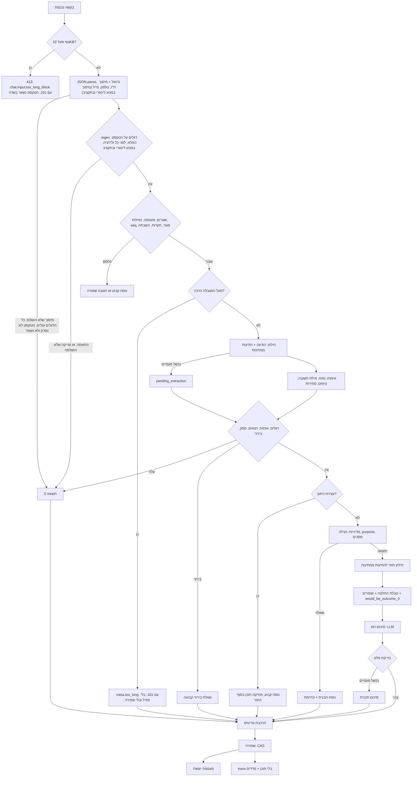
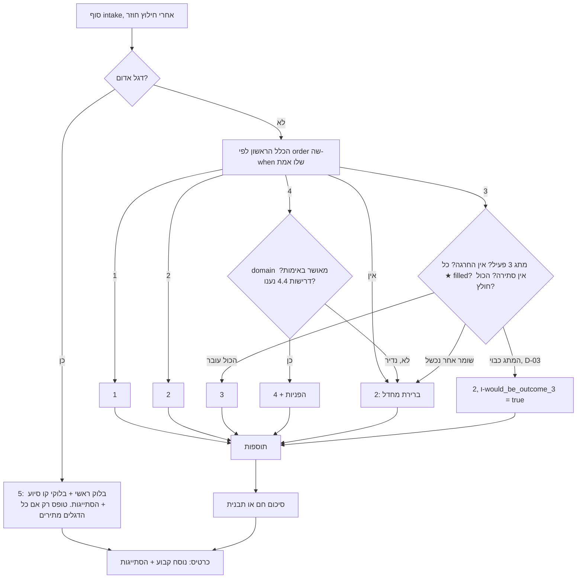
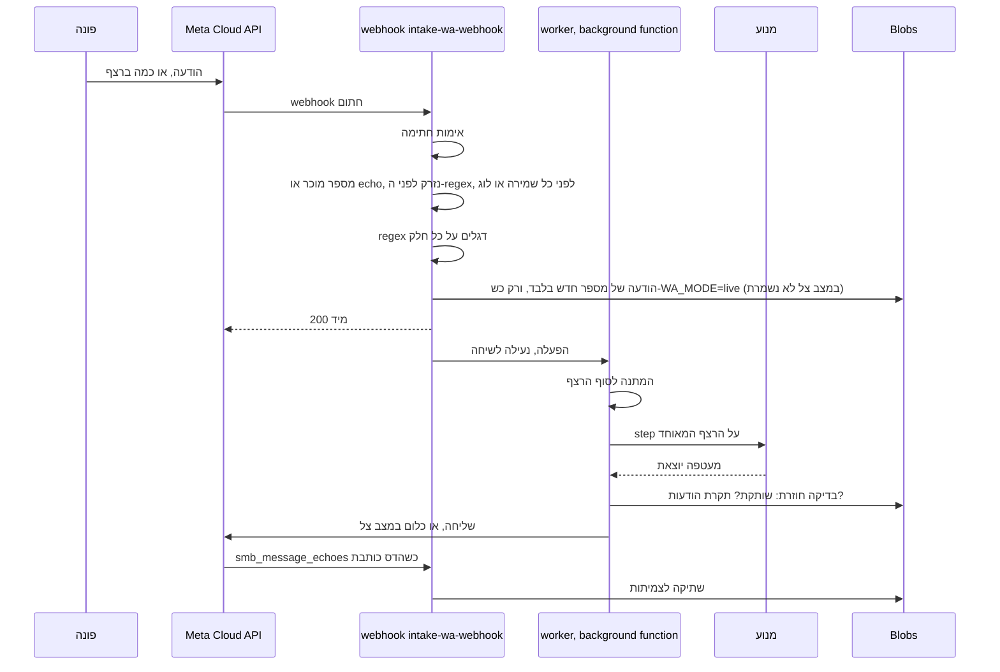
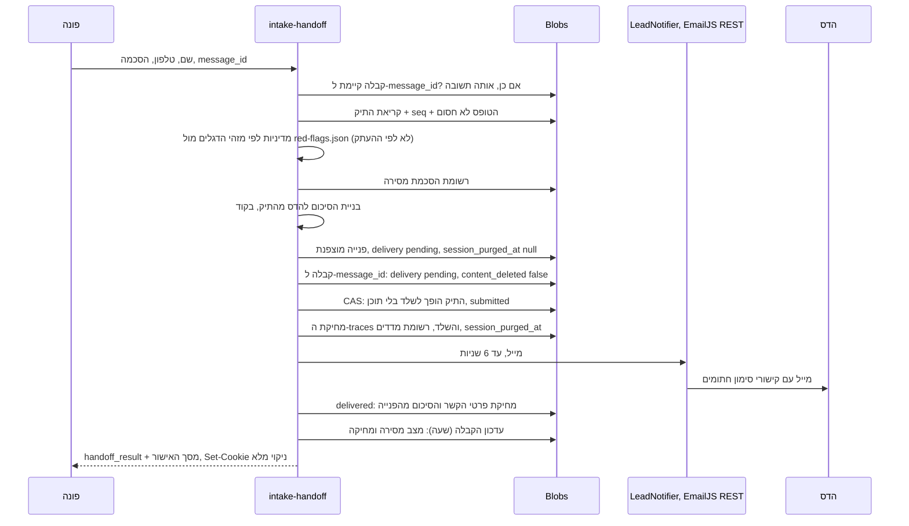

# ארכיטקטורה: מנוע שיחת ההיכרות

סטטוס: טיוטה 3.3 · 2026-10-06 · ארכיטקט ראשי (תפקיד 6) · מאשר: אליה (שער 1 עבר; הכרעות אליה ב-`DECISIONS.md`)
מקורות סמכות: `GOALS.md` גובר על המסמך הזה. **`DECISIONS.md`, סעיף "הכרעות אליה (שער 1)", גובר על ברירות המחדל D-01..D-14 של לפני השער.** טיוטה 3.3 מיישרת את המסמך אליו (§0.6). D-03, D-04, D-14 ו-D-09b לא השתנו כאן: ממתינות להדס, או לאליה ב-D-09b.
החוזים (JSON Schema, draft 2020-12) נמצאים ב-`contracts/`. **רק הארכיטקט משנה חוזים.**
יושר מול: `clinical/DRAFT_NOTES.md` §9 (תוכנית מטרות v2, מחליפה את §7), `clinical/REVIEW_FOR_HADAS.md`, `content/texts.he.md` + `texts.he.json`, `ux/UX_SPEC.md`, `qa/PERSONAS.md`, והביקורות ב-`reviews/` (critic, security, legal).

עיקרון אחד שכל השאר נגזר ממנו: **הקוד מחזיק את התיק ומחליט. המודל רק מבין (חילוץ מובנה עם הפניה למילים של הפונה), ובגרסה 1 מנסח רק את הסיכום החם. אין לו כלים ואין לו החלטות.**

---

## 0. איך לקרוא

| אם את/ה... | קראו |
|---|---|
| כולם | **§0.1** (מה נבנה בגרסה 1) |
| מנסח קליני, מעצב שיחה, UX, מהנדס הערכות | **§1** (פורמטים), ואז §4–§7 |
| מפתח Backend | הכול. §19 הוא מבנה המודולים |
| מפתח Frontend | §1.9–§1.10, §8.2, **§8.4** (עמוד הכלי: entry, chrome, גופנים, fallback סטטי, CSP), §10.6 |
| מבקרים | §10–§13, §20–§22 |

### 0.1 חתך גרסה 1

| נבנה עכשיו | נדחה | קוצץ |
|---|---|---|
| התיק בקוד, שפת התנאים התלת-ערכית, טבלת החלטה עם ברירת מחדל 2 | תוצאה 3 מוצגת לפונה (D-03: כבויה; `would_be_outcome_3` נרשם תמיד) | ניסוח של מודל בכל תור (קריטיק F6). המודל מנסח רק את הסיכום |
| בדיקת דגלים: regex לפני כל מודל, אותות מאומתים, תנאים, מסכי סינון | | סיכום שבועי (UX טיוטה 3: המייל החודשי מחליף אותו, §13.2) |
| מונה עלות יומי משלנו, תקציב לכתובת, המשך בלי מודל בתקרה (D-09, §10.3) | | |
| חילוץ אחד לכל תור + שאלות תבנית קבועות + חילוץ חוזר להודעה שנכשלה (F1) | `replay-live`, `what-if-content` | HMAC על רשומת ההסכמה, זיהוי כפילויות לפי טלפון |
| מטרות לפי `purpose`, דילוג כשההחלטה ידועה, מסכי סינון פטורים מתקרות (F2, §9 הקליני) | בנצ'מרק משוקלל על כמה ספקים (נשארים ספי פסילה על 1–2 מועמדים) | 7 מפתחות סוד (מפתח ראשי אחד + HKDF) |
| מסירה בצד השרת, התראות בערוץ עצמאי (heartbeat, D-12), שורת גיבוי במסך האישור (F10) | וואטסאפ (שלב 2), כולל התראה להדס בוואטסאפ | traces עם תוכן בייצור (D-07), שמירת תוכן אחרי סיום **בלי הסכמה** (D-01b) |
| מחיקה מיידית ב"סיום" **ובשליחת הטופס** (D-01), רשומת מדדים בלי תוכן | ממשק "השיחה ממשיכה בלשונית אחרת" (409 + טעינה מחדש מספיקים) | ביקורת סינון שבועית (D-01) |
| **שמירה מרצון בסיום (D-01b, טיוטה 3.3):** תיבה לא מסומנת, רק כש-`keep_offer_eligible`, מיסוך שמות לפני שמירה, מאגר `intake-kept` נפרד, 180 יום ואז מחיקה, צפייה עם 2FA ולוג (§11.1.1) | שמירה מרצון בוואטסאפ (שלב 2) | קוד מחיקה לביטול ההסכמה (D-01b': סיכון מקובל) |
| עמוד הכלי בלי GA ו-Ads, עם CSP משלו (D-06) | המרת Ads מצד השרת: בנויה, **כבויה** עד אישור עו"ד (§13.4) | 30 אירועי GA בתוך הכלי (D-06: אין GA בכלי) |
| משוב: הקשה אופציונלית אחת במייל + רשימה במייל החודשי (UX טיוטה 3, §13.3). התראה על כל פנייה = המייל עצמו + התראת Gmail (§13.2) | | תזכורות, תגיות סיבה, דירוג בשלוש רמות |

### 0.2 מה השתנה בטיוטה 2

| מקור | שינוי | איפה |
|---|---|---|
| D-01, SEC-01, L-04, F13 | "סיום" מוחק בשרת מיד; שיחה נטושה נמחקת אחרי 24 שעות; נשארת רשומת מדדים בלי תוכן | §4, §8.2, §11 |
| D-02, SEC-02, L-05 | עצירות ניתוב: קטין על עצמו, מדווח שאינו הורה | §1.6, §5.4 |
| D-03, F4 | תוצאה 3 כבויה, `would_be_outcome_3` | §1.6, §7 |
| D-04, SEC-11, L-02 | בלי טופס אחרי דגל חירום או סיוע; urgent: משני. נאכף ב-schema | §1.5 |
| D-05, SEC-03 | מצב צל בלי מודל ובלי תוכן | §8.3, §11.5 |
| D-06, SEC-04, SEC-18 | עמוד הכלי כ-entry נפרד בלי gtag, עם CSP | §8.4, §10.6 |
| D-07, L-03, SEC-08 | רשימת מעבדים סגורה; traces בלי תוכן; דיבוג רק על שיחות סינתטיות | §11.2, §16 |
| F1 | הודעה שהחילוץ שלה נכשל נשמרת ונחלצת שוב לפני כל תוצאה | §5.5, §6 |
| F2 | מסכי סינון פטורים מתקרות; תור FAQ נחשב התקדמות עד 4 | §5.4 |
| F5 | תוצאה 4 לא יורדת ל-2 בגלל ★; דרישות לפי טבלה 4.4 | §1.6, §7 |
| F6, L-25 | שאלות תבנית קבועות; המודל מנסח רק את הסיכום | §5.6 |
| F7 | ראיה כטווח מילים שהקוד גוזר; כלל "מילת תשובה בלבד" | §5.2 |
| F8 | משוב: רגע אחד במייל, השאר בפגישה חודשית (הוחלף בטיוטה 3 במנגנון של UX, §0.3) | §13.3 |
| F10 | התראות בערוץ עצמאי (heartbeat), שורת גיבוי, `away_until` | §13.2 |
| F11 | חריגת קרדיטים ב-Netlify משהה את כל האתר (אומת) | §10.7, §15 |
| F12 | קיצוץ שכבות הגבלה ומפתחות | §9.3, §10.3 |
| SEC-06 | regex על טקסט ארוך לפני דחייה; גוף עד 32KB; וואטסאפ בלי קיצוץ שקט | §6.1, §8.3 |
| SEC-07 | מיסוך ת"ז, טלפונים ומיילים לפני המודל ולפני שמירה | §6.1 |
| SEC-09 | סודות בהיקף Production בלבד | §9.3 |
| SEC-17 | הקשחת המייל להדס; שם בלי CR/LF; `preferred_time_note` הוסר | §7.1, §13 |
| L-19 | הסתייגות חובה גם במסך דגל אדום | §1.10 |
| §9 הקליני | 18 מטרות (בטיוטה 2 נכתב בטעות 17) עם `purpose`, choice sets, מסכי סינון, דרישות 4.4 | §1.4 |

### 0.3 מה השתנה בטיוטה 3 (סבב 4: חוסמי שער 1)

| מקור | שינוי | איפה |
|---|---|---|
| **חוסם 1** · SEC-01, L-04, סתירה 3 של מבקר התכנון | **שליחת הטופס מוחקת את תוכן השיחה באותה בקשה** ומנקה את ה-cookie. מסך האישור נבנה מהתשובה בלבד ונשאר בזיכרון הדף; רענון מציג S2 "כבר נשלחה" מהסימון המקומי. ה-schema פוסל תיק שנשלח ועדיין מחזיק תוכן | §4, §13.1, `case-file`, `channel-envelope` |
| **חוסם 2** · SEC-11, D-04 | **דגל שהדרגה שלו לא מתירה טופס מבטל את הטופס לכל השיחה.** S6 משולב: בלוק ראשי ובלוק קו סיוע. התוכן נמחק בסוף התור. נאכף בארבעה חוזים | §1.5, `red-flags`, `case-file`, `channel-envelope`, `lead-record` |
| **חוסם 3** · SEC-06 (רגרסיה) | **אין `maxlength` ואין חיתוך בצד הלקוח.** התקרה היחידה היא גוף בקשה של 32KB. ה-regex רץ על כל הטקסט, לפני ולידציית המעטפה. מעל התקרה: הודעה מפורשת עם 101, והטקסט נשאר בשדה | §6.1, §8.2, §10.4 |
| **חוסם 4** · D-13 | הצבעה ✔. שני הענפים מוגדרים וניתנים לבנייה | §1.4, §1.6 |
| D-09 (תנאי אבטחה ויעילות) | מונה עלות יומי משלנו, תקציב לכתובת, 80% חוסם שיחות חדשות ומתריע, 100% ממשיך בלי מודל. מבטל חלקית את קיצוץ F12 | §10.3 |
| D-12 | heartbeat בתנאי האבטחה | §13.2 |
| SEO ש2 | המרת Ads מצד השרת: **מתקבלת בתנאים**, כבויה עד אישור עו"ד | §13.4 |
| מבקר תכנון 4(א), 8, 9(ב), 10, סתירות 1–2 | `active` בנוסחים (נוסחי 3 פטורים כשהמתג כבוי); משוב לפי UX טיוטה 3; התראה לכל פנייה; בלי סיכום שבועי | §1.9, §1.11, §13.2, §13.3 |
| קליני §9.4, `routing_slots_open_questions` | בדיקת השגה ב-build, `if_applicable_slots`, נוסח לפי תנאי, מושא קטין ב"מישהו אחר", 18/19 מטרות, רישום למחלוקת 4.5 | §1.4, §1.6, §1.11, §16 |
| מעצב שיחה | `by_condition`, `active`, 12 משתנים, התחלה מחדש מוחקת, פטור אותיות לטיניות ל-`language.unsupported`, `chat.*` בבאנדל | §1.9, §4 |
| SEC-02/-03/-04/-08/-09/-10/-12/-13/-17, L-03/-09/-11/-15/-17 | ראו `reviews/FIX_REPORTS.md`, "ארכיטקט — סבב 4" | לפי הטבלה שם |

### 0.4 מה השתנה בטיוטה 3.1 (סבב 5: אימות הסגירה של האבטחה, סבב 2)

| מקור | שינוי | איפה |
|---|---|---|
| אבטחה ג.6, כלל 9 | **הבדיקות בריפו, עם מריץ:** `node docs/assessment/architecture/contracts/tests/run.mjs`. 17 schemas ב-Ajv strict, 183 מקרים (42 חיוביים, 141 שליליים), כל מקרה שלילי חייב להיכשל בנתיב שמוגדר לו, ובסיס כל מקרה שלילי חייב לעבור לבד. 117 המקרים של סבב 4 לא נשמרו, ולכן **המקרים נבנו מחדש** | §16, `contracts/tests/` |
| אבטחה ג.1 | **השדה המועתק:** המדיניות נגזרת מהדגל עצמו. ה-schema קושר את `form_after_message` לדרגה ולמזהה הדגל (`noFormFlagId`) בכל רשומה שמעתיקה אותו, ו-`intake-handoff` מחליט לפי מזהי הדגלים מול `red-flags.json`, לא לפי ההעתק | §1.5, §13.1, `common`, `case-file`, `channel-envelope`, `lead-record`, `metrics-record`, `red-flags` |
| אבטחה ג.2 | **ReDoS:** ביטויי הדגלים רצים רק במנוע לינארי (re2js), עם כללי ביטוי, תקציב לביטוי ולסריקה, ובדיקת CI עם קלט זדוני. סריקה שלא הושלמה מעלה את הדגלים שלא נבדקו (`scan_incomplete`), ולעולם לא מדלגת | §1.5, §6.1, §10.1, `common.regexRule`, `trace-record` |
| אבטחה ג.3 | **ניקוי ה-cookie:** אותו שם, אותו `Path`, בלי `Domain`, אותן תכונות, `Max-Age=0`. פונקציה אחת שמשותפת להגדרה ולניקוי | §8.2, §13.1 |
| אבטחה ג.4 (החלק שלי), ג.5 | כלל בחירת הנוסח ב-S8 לפי שני השדות (4 מצבים, כותרת לפי המסירה). קבלה עם `delivery: pending` נכתבת לפני המחיקה. הדפדפן מוחק את התמליל מהזיכרון אחרי שליחה | §13.1 |
| עצירת ניתוב | ה-schema אוכף את מה ש-§6.1 צעד 12 כבר אמר: בעצירה נשמר רק השלד, עם `purge_at` | `case-file` |
| מעצב השיחה | כותרת לכל בלוק משני: `title_text_ref` = `redflag.title.hotline.<flag_id>` | §1.5, §1.10, `channel-envelope` |
| מבקר התכנון, סבב 2 | D-14: **מחליטה הדס**. הארכיטקט רק המליץ | §13.2, §20 |

### 0.5 מה השתנה בטיוטה 3.2 (סבב 6: התייעצות Frontend, מיסוך במנוע הלינארי)

| מקור | שינוי | איפה |
|---|---|---|
| Frontend, התייעצות סבב 2 §3 | **עמוד הכלי הוא entry נפרד של Vite** (`intake/index.html`, build רב-דפי), עם CSP משלו ובלי gtag. `createRoot` משלו, בלי `lazy` למסכים הבטיחותיים, תקציב חבילה ב-CI. ה-rewrite של `/intake/*` מפנה ל-HTML של הכלי (לא כמו `/landing/*`), כדי ששום כתובת תחת `/intake/` לא תגיש את ה-HTML של האתר | §8.4 |
| Frontend, ממצא 1 | **בלי `Header`/`Footer` של האתר.** הם טוענים תוכן דרך `loadYamlContent`, שפונה קודם ל-Firestore (אומת: `Header.jsx:82`, `firebaseLoader.js:14,27`), וזה צד שלישי בדף הכלי (D-06). במקומם chrome סטטי ומינימלי, מ-`header.yml` ו-`footer.yml` בזמן build. `no-restricted-imports` אוכף | §8.4, §10.6 |
| Frontend, ממצא 2 | **גופנים מאוחסנים באתר.** שורה 1 ב-`global.css` היא `@import` של Google Fonts (אומת), וה-CSP חוסם אותו. Rubik ו-Heebo כ-woff2 מקומיים; ה-`@import` עובר לקובץ שרק האתר טוען (שינוי באתר: אישור אליה) | §8.4 |
| Frontend, ממצא 4 | **fallback סטטי ב-HTML של הכלי,** עם 101, למקרה ש-JS לא עולה. נוצר בזמן build מקובץ הנוסחים, לא נכתב ביד. גם ה-announcer הסטטי | §8.4, §10.8 |
| Frontend §3 | **צנרת ה-SEO לא משתנה:** `vitePrerender.routes`, `PAGE_META` ו-`staticPages` הן רשימות מפורשות (אומת), והכלי לא נכנס לאף אחת מהן | §8.4 |
| Frontend, נספח (לאבטחה) | ל-CSP נוספו `base-uri 'none'`, `object-src 'none'`, `form-action 'self'`. `base-uri` ו-`form-action` לא נגזרים מ-`default-src`; `object-src` כן נגזר, ונכתב במפורש כדי לא להיות תלוי בזה. לאישור האבטחה | §8.4 |
| אבטחה, אימות סגירה סבב 3 (בינוני) | **המיסוך רץ ב-re2js**, באותם כללים (P1–P4), באותם תקציבים (50/500ms בזמן ריצה, 20/250ms ב-CI) ובאותו כשל בטוח: מיסוך שלא הושלם מעלה את כל הדגלים (`scan_incomplete`), והטקסט לא נסרק, לא נשמר ולא נשלח. אף פעם לא מדלגים על המיסוך. במריץ: סט מיסוך לדוגמה, הסכמת מנועים על כל התאמה, מדידת find-all על 18 קלטים זדוניים, ובדיקה עצמית עם ביטוי הגישוש של האבטחה (עובר את ה-lint, נתפס בתקציב). ב-`trace-record`: `input.mask` ו-`scan.status: mask_incomplete`, קשורים זה לזה ב-schema | §1.5 פריט 7, §6.1, §10.1, §16, `trace-record`, `case-file` |

### 0.6 מה השתנה בטיוטה 3.3 (הכרעות אליה בשער 1)

המקור: `DECISIONS.md`, "הכרעות אליה (שער 1)", ו-`consults/propagation_plan.md` (P1–P8, והמזהים המשותפים). P9 לא נוגע כאן: D-03, D-04, D-14 ו-D-09b נשארות כמו שהן. **סינון הבוטים של D-09b לא נבנה כאן כמוחלט**, כי הוא עוד לא אושר.

| מקור | שינוי | איפה |
|---|---|---|
| **P1** · D-01b, D-01b' | **שמירה מרצון בסיום.** ברירת המחדל לא השתנתה: "סיום" מוחק הכול. חדש: תיבה לא מסומנת, שמוצעת רק כש-`keep_offer_eligible` (פונקציה אחת בקוד, ברשימה הסגורה של E1 §3). scope `keep_for_improvement`, מאגר `intake-kept` עם מפתח נפרד ובלי מזהה מקשר, מיסוך שמות לפני השמירה עם כשל בטוח, 180 יום מרגע ההסכמה ומחיקה בהרצה השעתית (`purge_failed`), צפייה רק בכלי עם 2FA ויומן גישה, בלי מודל ובלי עוזר AI. **אין קוד מחיקה** (D-01b'): סיכון מקובל, שאליה בחר נגד המלצת האבטחה. נפתחו ונסגרו מחדש: §12(4), §11.1, §11.2 | §0.1, §1.1, §1.10, §4, §8.2, §9.1, §9.3, §10.1, §11.1, §11.1.1, §11.2, §12, §13.2, §16, §18, §19, `consent-record`, `kept-conversation` (חדש), `channel-envelope`, `metrics-record` |
| **P2** · D-02 | **ההודעה הקבועה לקטין ולמי שאינו הורה: בלי 101 ובלי קווי סיוע.** `minor.self*` ו-`reporter.not_parent` יצאו מרשימת "101 חובה", עם החרגה מתועדת, ו-`intake:check` בודק שאין בהם 101 או 1201. הניתוב לא השתנה, והוא מה שמבטיח שדגל על המסלולים האלה מגיע ל-S6 (§1.6, "דגל על מסלול עצירה"). חדש ב-schema: עצירה ודגל לא מופיעים יחד בתיק, במעטפה ובמדדים. ההבטחה "101 בכל מצב" נוסחה מחדש בדיוק | §1.4, §1.6, §1.9, §1.11, §16, `case-file`, `channel-envelope`, `metrics-record`, `decision-table` |
| **P3** · D-13 ענף ב׳ | **אין כפתורי גיל.** המטרה `self_age_band` נשארת רק עם `active: false` (ה-schema אוכף), והנוסחים שלה `active: false`. הצהרת הגיל ב-`consent.checkbox@v3` נרשמת כ-`age_declaration: "adult_or_parent"` עם גרסת הנוסח. `self_declared_minor` על הטקסט החופשי נשאר | §1.4, §1.6, §1.11, §12, §16, `slot-catalog`, `consent-record`, `case-file` |
| **P4** · D-07, D-12, ממצא Cloudflare | **רשימת המעבדים הסגורה:** Netlify, ספק ה-AI, EmailJS, Gmail, ניטור בלי תוכן, Cloudflare, ו-Meta בשלב 6 | §11.2 |
| **P5** · D-09c | **Cloudflare:** ההגדרות שחובה, והחוסם לפני בנייה: איזו כתובת Netlify רואה (`CF-Connecting-IP`), ו-301 מ-`*.netlify.app` | §8.4.5, §8.4.7, §10.3, §10.9 (חדש), §22 |
| **P6** · D-06 | **אומת, בלי תיקון:** אין תגי Google בדף הכלי (§8.4, §10.6, §17), והמרת Ads מהשרת כבויה עד עו"ד (§13.4, §18). נוסף רק מה ש-Cloudflare יכול להזריק (Zaraz, Web Analytics), ב-§10.9 | §10.9 |
| **P7** · D-11 בוטל, D-10 לא דחוף | הוסרו ספירת הבסיס וכל מה שתלוי בה. הסיכון של קרדיטי Netlify נשאר מתועד, אבל ירד מ"לבדוק לפני בנייה" ל"לא דחוף, לפי אליה" | §10.3, §10.7, §13.3, §17, §22 |
| **P8** · D-05 | משימה בשלב 6: אימות מול התנאים הרשמיים של Meta ל-WhatsApp Business (מ-15.1.2026: צ'אטבוטים כלליים אסורים, בוטים עסקיים מובנים מותרים), ושמירה על דירוג האיכות של המספר | §8.3, §22 |

**מינוח:** "שלב 2" בפרק הערוצים של המסמך הזה (§8.3) הוא שלב 6 בתוכנית העבודה (E1, טבלת התפקידים). שני השמות מתארים את ערוץ הוואטסאפ.

---

## 1. חוזי נתונים: הפורמטים שכל התפקידים מתאימים אליהם

> כל תוכן אנושי (קליני, נוסחים, עובדות) נכנס למוצר רק כקובץ JSON שעובר את ה-schema שלו ואת בודק השלמות (§1.11). אף טקסט קליני או נוסח קבוע לא נכתב בקוד.

### 1.1 מפת הקבצים

| קובץ תוכן (בריפו) | Schema | מנסח | מאשר |
|---|---|---|---|
| `intake/content/slot-catalog.json` | `slot-catalog.schema.json` | קליני (5) | הדס |
| `intake/content/red-flags.json` | `red-flags.schema.json` | קליני (5) | הדס |
| `intake/content/decision-table.json` | `decision-table.schema.json` | קליני (5) | הדס (+ עו"ד על הנוסחים) |
| `intake/content/faq.json` | `faq.schema.json` | קליני (5) תבנית, הדס עובדות | הדס |
| `intake/content/referrals.json` | `referrals.schema.json` | הדס | הדס |
| `intake/content/fixed-texts.he.json` | `fixed-texts.schema.json` | **נוצר** מ-`texts.he.md` של מעצב השיחה (3) | הדס (טון), עו"ד (⚖️) |
| `intake/content/output-rules.json` | `output-rules.schema.json` | מעצב שיחה (3), כולל המגבלות מ-§6.3 | מבקר משפטי (13) |

חוזים פנימיים:

| Schema | מה |
|---|---|
| `common.schema.json` | מזהים, גרסאות, אישורים, **שפת התנאים**, ראיה, `wordSpan`, `goalPurpose` |
| `case-file.schema.json` | התיק: מצב השיחה כולה (התוכן נמחק ב"סיום", בשליחת הטופס, בעצירה, בדגל שחוסם טופס, או אחרי 24 שעות. ב"סיום" עם הסכמה לשמירה, עותק ממוסך נכתב קודם ל-`intake-kept`, והתיק נמחק בכל מקרה) |
| `extractor-output.schema.json` | פלט החילוץ (קריאת המודל היחידה בכל תור) |
| `generator-output.schema.json` | פלט הניסוח (בגרסה 1: רק `summary`) |
| `channel-envelope.schema.json` | המעטפה בין מתאם ערוץ למנוע |
| `trace-record.schema.json` | רשומת מעקב לכל תור. **בייצור בלי תוכן** (D-07) |
| `metrics-record.schema.json` | **חדש.** רשומת המדדים בלי תוכן, הדבר היחיד ששורד שיחה (D-01) |
| `lead-record.schema.json` | פנייה: פרטי קשר וסיכום רק עד המסירה, ואחר כך enums ומשוב |
| `consent-record.schema.json` | הוכחת הסכמה (בלי תוכן). **טיוטה 3.3:** הצהרת הגיל (`age_declaration`, D-13 ענף ב׳), ו-scope `keep_for_improvement` בלי `session_id` (D-01b) |
| `kept-conversation.schema.json` | **חדש בטיוטה 3.3.** שיחה שנשמרה בהסכמה (`intake-kept`, D-01b), ושורת יומן הגישה של כלי הצפייה (`$defs/accessLogEntry`). §11.1.1 |
| `eval-gold-extract.schema.json` | מקרה בסט הזהב (סינתטי בלבד) |

(בטיוטה 3.3 יש 18 schemas. המשפט הבא מתאר את הבדיקה של טיוטה 2; המצב הנוכחי ב-§16.) כל 17 ה-schemas עוברים את ה-metaschema, מתקמפלים ב-Ajv במצב `strict`, ונבדקו מול 22 דוגמאות חיוביות ו-95 דוגמאות שליליות, גם ב-Ajv וגם ב-jsonschema (טיוטה 3: 37 שליליות חדשות; השלילית הישנה "טקסט מעל 6,000" הוסרה, כי התקרה הזו בוטלה). בין השאר, ה-schema עצמו פוסל: נוסח ⚖️ "מאושר" בלי עו"ד; ברירת מחדל שאינה 2; טופס אחרי דגל חירום או סיוע; **תיק שנשלח ועדיין מחזיק תמליל, פרטים או סיכום; טופס או פנייה אחרי דגל שלא מתיר טופס, גם כשעלה יחד עם urgent; טקסט שנחתך** (התקרה היחידה מעל מה שכל ערוץ נושא); trace בייצור שמכיל תוכן או במצב `synthetic_full`; רשומת מדדים עם מזהה שיחה או תחום; שם עם ירידת שורה; `preferred_time_note` חופשי, גם ב-`form_request`; תוצאה בלי הפניה לנוסח ההסתייגות; `routing_stops` בלי שתי העצירות של D-02.

### 1.2 מוסכמות

- **מזהים:** `snake_case`. פרט: `^[a-z][a-z0-9_]{1,47}$`. מטרה, דגל, כלל, הפניה, ערך: `^[a-z][a-z0-9_]{1,63}$`. נוסח: נקודות, 2–6 מקטעים. מזהה שהגיע לייצור לא משנה משמעות. שינוי משמעות = מזהה חדש.
- **גרסת קובץ:** semver. MAJOR = מזהה הוסר או מבנה השתנה. MINOR = תוספת או שינוי משמעות. PATCH = ניסוח בלבד.
- **גרסת נוסח:** מספר שלם לכל נוסח, עולה בכל שינוי. ההיסטוריה ב-git.
- **אישורים:** `{by, at, ref, scope}`. **מדיניות PATCH משפטית** (קריטיק F15): אם עורך הדין מסכים מראש שתיקון ניסוח בלי שינוי משמעות לא דורש ביקורת חוזרת, האישור נרשם פעם אחת כ-`{by: "lawyer", scope: "patch_policy", ref: <ההסכמה>}`, ובודק השלמות מעביר אותו לגרסה הבאה רק כששינוי הקובץ סומן PATCH. בלי הסכמה כזו, כל גרסה של נוסח ⚖️ דורשת אישור.
- **סטטוס:** `draft` → `in_review` → `approved`. **build לייצור נכשל** אם קובץ או נוסח בשימוש אינו `approved`.

### 1.3 שפת התנאים

```json
{ "all": [
  { "slot": "core_relation", "op": "neq", "value": "child" },
  { "slot": "core_onset_pattern", "op": "in", "value": ["sudden", "recent_4w"] },
  { "any": [
    { "slot": "screen_neuro_any", "op": "eq", "value": "yes" },
    { "slot": "screen_neuro_any", "status_in": ["unknown"] }
  ]},
  { "not": { "slot": "core_sudden_evaluated", "op": "eq", "value": "evaluated" } }
]}
```

(דוגמה בסגנון התנאי של `sudden_onset` למבוגר ב-§9 הקליני: "לא ידוע לי" ברשימת הסינון מעלה את הדגל בדרגה א.)

- צורות: `all`, `any`, `not`, פרדיקט ערך (`slot` + `op` + `value`), פרדיקט סטטוס (`slot` + `status_in`), `red_flag`, `channel`, `ref` (תנאי נגזר בשם), `always`.
- אופרטורים: `eq`, `neq`, `in`, `not_in`, `lt`, `lte`, `gt`, `gte`, `contains`, `contains_any`.
- **לוגיקה תלת-ערכית.** פרדיקט ערך על פרט שאינו `filled` מחזיר **לא-ידוע**. `all` שקר אם אחד שקר, אחרת לא-ידוע אם אחד לא-ידוע. `any` אמת אם אחד אמת. `not` לא הופך לא-ידוע. `status_in`, `red_flag`, `channel` תמיד אמת או שקר.
- **כלל, מטרה, תוספת ועצירה פועלים רק על אמת.** לא-ידוע לעולם לא מפעיל כלל. ענף מפורש ל"לא ידוע" נכתב עם `status_in`.

### 1.4 קטלוג הפרטים והמטרות (`slot-catalog`)

**פרט (slot):** `type` (`enum`, `multi_enum`, `integer`, `number`, `boolean`, `quote`), `options` (עם `label_he` ו-`recap_label_he` לאימות), `range`/`unit`, `critical` (★ = **חוסם תוצאה 3**, ורק אותה), `inferred`, `applies_when`, `confirm_in_wrap_up`, `conflict_tolerance`, `may_contain_identifiers`.

**מצבי פרט:** `missing` (לא נאמר, או נשאל ולא נענה עדיין), `filled`, `unknown` ("לא יודע/ת", "לא ידוע לי", או תקציב שנגמר), `declined`, `conflicting`. "לא רלוונטי" נגזר מ-`applies_when`. הסיבה נשמרת ב-`status_reason`.

**מטרה (goal):**

| שדה | משמעות |
|---|---|
| `purpose` | **חדש, חובה** (§9 הקליני): `routing` (בלי זה אין תוצאה), `safety_screen` (לא מדלגים לעולם, פטור מכל תקרה), `decision` (יכול להפוך 2 ל-1, או לאפשר 3), `summary_only` (לתיק בלבד, לכל היותר `max_summary_only_goals`, ורק מתחת ל-`max_intake_turns`) |
| `priority` | גבוה קודם, מבין המטרות שה-`applies_when` שלהן אמת |
| `slots`, `completion` | הושלמה כשכל (`all`) או אחד (`any`) מהפרטים שחלים במצב סופי |
| `turn_budget` | 1–3. ברירת מחדל מומלצת: 1 ל-`decision`/`summary_only`, 2 ל-`routing`, 1–2 לסינון |
| `choice_sets` | כפתורים לשאלה. הראשון שה-`when` שלו אמת (למשל `screen_neuro` למבוגר או לילד) |
| `texts.ask/clarify/rephrase` | **חובה.** בגרסה 1 אלה הנוסחים שמוצגים (§5.6) |
| `texts.ask_alt1/ask_alt2` | אופציונלי: חלופות לנוסח ברירת המחדל, הקוד בוחר לפי `seq` |
| `texts.by_condition[]` | **חדש** (תשובה למעצב השיחה ולקליני §9.4(4)): `{when, ask, clarify?, rephrase?}`. הראשון שה-`when` שלו אמת מחליף את הנוסח; לא-ידוע לא בוחר. כך `goal.screen_voice.ask_3w` נבחר כש-`voice_duration_weeks ≥ 3`, ו-`screen_neuro.adult_after_known_event` (אם הדס תאשר) כש-`core_sudden_evaluated = evaluated`. התנאי זהה לזה של ה-choice set או של `show_when` המתאים, ובודק השלמות מזהיר אם אין התאמה |
| `display_stage` | 1 היכרות, 2 השלמת פרטים. wrap_up ואילך = 3 |

**choice sets** (חדש, מחליף את `quick_replies`): הקשה אחת, או בחירה מרובה, שממלאת כמה זוגות (פרט, ערך):

| שדה | משמעות |
|---|---|
| `options[].sets` | זוגות (פרט, ערך) שהאפשרות ממלאת. "הבן שלי" → `core_relation=child`, `core_relation_detail=son`, `reporter_role=parent` |
| `options[].when_unselected` | בבחירה מרובה: הערך שנכתב כשהאפשרות **לא** נבחרה (ורק אם הפרט עדיין חסר). כך "לא סומן = לא" של `signs_screen` |
| `options[].sets_unknown` | פרטים שהאפשרות מסמנת `unknown` ("לא בטוח/ה", "לא ידוע לי") |
| `options[].exclusive` | מנקה בחירות אחרות ("אף אחד מאלה") |
| `options[].show_when` | אפשרות מותנית (פריטי ה"3 שבועות" ב-`screen_voice`) |

בחירה בכפתור עוקפת את המודל: הראיה היא מזהה האפשרות (`source: ui_choice`). בוואטסאפ, רשימה ממוספרת ותשובה כמו "1, 3" או "אף אחד" מתפרשות בקוד לאותן אפשרויות.

**מסכי סינון:** כל רשימת סינון שייכת לדגל אחד ולדרגה אחת (§9.1 הקליני), וממלאת פרט enum אחד: `screen_neuro_any`, `screen_voice_any`, `screen_swallow_any` עם הערכים `yes` / `no`. **"לא ידוע לי" הוא סטטוס `unknown`, לא ערך** (`sets_unknown`), כדי שלמילה "לא ידוע" תהיה משמעות אחת במנוע. הדגל קורא `eq yes`, והספק נקרא דרך `status_in: [unknown]`.

**תנאים נגזרים (`derived`):** תנאי בשם, מוגדר פעם אחת, ונקרא עם `{"ref": id}`. כך ממומשים `wtc_*` (מחושבים מהפרטים, לא נשאלים), ו-`wtc_any_<group>`. כשהם אמת הם נרשמים ב-`outcome.derived_true`.

**פרטים אופורטוניסטיים:** פרט שאף מטרה לא מפנה אליו. נרשם אם הוזכר, ולא נשאל. בודק השלמות פוסל פרט ★ שאינו באף מטרה.

**bindings:** `subject_type` → `core_relation`, שערכיו בתוכן הם `self` / `child` / `other_adult`, וממופים למפתחות הווריאנט `self` / `child` / `other` (`{"other_adult": "other"}`; SEC-02(3)); `subject_gender` ו-`subject_ref` → **`core_relation_detail`**; `age` → `core_age_months`; `domains` → `domain`; `reporter_role`.

**ספירת תורות:** `turns.intake` ו-`max_intake_turns` (6, §9 הקליני) נספרים **מההודעה החופשית הראשונה**. הקשות פתיחה לפניה (`core_relation`) לא נספרות. כך יעד 2–3 השאלות של הקליני ותקרת המנוע מודדים את אותו דבר. (`self_age_band` לא פעילה מאז שער 1, D-13 ענף ב׳.)

**מטרה לא פעילה** (חדש בטיוטה 3.3): `active: false` ו-`inactive_reason` חובה. המנוע מתייחס אליה כאילו ה-`applies_when` שלה שקר: היא לא נשאלת, לא נספרת ולא נכנסת לבדיקות ההשגה, והנוסחים שלה יכולים להיות `active: false`. כך המטרה והנוסחים נשמרים, ואפשר לחזור אליהם בלי לבנות מחדש.

**18 המטרות של §9 הקליני** (D-13 ענף ב׳: `self_age_band`, אם היא בקובץ, לא פעילה; מזהים ו-`purpose` כמו שם):

| purpose | מטרות |
|---|---|
| `routing` | `core_relation`, `core_concern`, `core_age` (לילד, ולמושא שעשוי להיות קטין ב"מישהו אחר", למטה). `self_age_band` רק בענף א, ולכן לא פעילה |
| `safety_screen` | `core_onset_pattern`, `speech_since_childhood`, `stuttering_since_childhood`, `screen_neuro`, `screen_voice`, `screen_swallow`, `lang_regression` |
| `decision` | `voice_duration`, `stuttering_onset`, `speech_scope`, `speech_understood_by`, `lang_expressive`, `oral_concern_referrer`, `signs_screen` |
| `summary_only` | `core_anything_else` |

המטרות שיצאו משימוש ב-§9 נשארות כפרטים שממולאים ממסכי הסינון, מ-`signs_screen` או באופן אופורטוניסטי.

**פרטי הניתוב** (נמסרו ב-DRAFT §9 `routing_slots`; כאן התשובות לשלוש השאלות הפתוחות שם):
- `core_relation_detail` (enum: son, daughter, grandson, granddaughter, father, mother, spouse, sibling, other_relative, not_related): מקור `{{subject_ref}}` ומגדר הווריאנט. ממולא מכפתורי "הבן שלי"/"הבת שלי" ומ-`q.relation.other_followup`. לא חל על `self`.
- `reporter_role` (parent, other_family, professional, other). **ארבעה ערכים מספיקים** (שאלה 1): כש-`core_relation = self` הפרט לא חל (`applies_when: core_relation ≠ self`), ואין צורך בערך "עצמי".
- `self_declared_minor` (boolean, אופורטוניסטי, בכל תור כמו דגל). "אני בכיתה י'" ממלא אותו.
- `document_request` (boolean, אופורטוניסטי, L-15). **שורת תוספת, לא עצירה** (שאלה 3, ההנחה נכונה): השיחה ממשיכה; `outcome3_exclusions`, תוספת לתוצאה (`addenda`, נוסח ⚖️ של תפקיד 3 לפי L-15) ותגית `document_request` במייל.
- **שער ניתוב בלי תווית חדשה** (שאלה 2): `critical` נשאר "חוסם תוצאה 3 בלבד". פרט שמופיע ב-`when` של `routing_stops` הוא "שער ניתוב" **בגזירה**: בודק השלמות מחשב את הרשימה מ-`decision-table.json`, מדפיס אותה בדוח ה-build, ודורש לכל שער לפחות 3 מקרים חיוביים ו-3 שליליים בסט הזהב, כמו לדגל. תווית ידנית הייתה יכולה לצאת מסנכרון עם העצירות עצמן.

**מושא שעשוי להיות קטין במסלול "על מישהו אחר"** (קליני §9.4(6), L-05(2), SEC-02(3)): `core_age` חל גם כש-`core_relation = other_adult` **ו**-(`core_relation_detail` ∈ {grandson, granddaughter, sibling} **או** `reporter_role = professional`). התשובה מכריעה את העצירה (§1.6). **הורה על ילד בגיר** (§9.4(7), ממתין להדס): המנגנון הוא תנאים נגזרים `subject_minor` / `subject_adult` (`core_age_months` מול 216 חודשים, יחד עם `core_relation`), שה-`applies_when` של מסכי המבוגר והילד מפנים אליהם. ההחלטה של הדס היא שינוי תוכן בלבד, בלי קוד.

**D-13: שאלת גיל במסלול "על עצמי". הוכרע בשער 1: ענף ב׳** (אליה, מחשש לעייפות המשתמש, נגד ההמלצה של כל התפקידים על ענף א; תלוי בתשובת עו"ד לשאלה 17). מה זה אומר בפועל, מטיוטה 3.3:
- **אין כפתורי גיל.** אם המטרה `self_age_band` נשארת בקטלוג, היא חייבת `active: false` עם `inactive_reason` ("D-13 ענף ב׳, ממתין לשאלה 17 לעו"ד"). ה-schema של `slot-catalog` פוסל אותה כשהיא פעילה, וגם כשהשדה חסר. הנוסחים `goal.self_age_band.*` ו-`q.self_age_band.opt.*` לא נמחקים, ומסומנים `active: false` (תפקיד 3). חזרה לענף א היא שינוי חוזה אצלי, אחרי הכרעה חדשה של אליה.
- **הגיל נכנס לנוסח ההסכמה** (`consent.checkbox@v3`: "אני מעל גיל 18, או הורה שכותב על ילדו"). רשומת ההסכמה של scope `intake` נושאת `age_declaration: "adult_or_parent"` ו-`age_declaration_text` (המזהה והגרסה של הנוסח שנשא את ההצהרה, ו-`consent.checkbox` רק מגרסה 3). ה-schema פוסל רשומת `intake` בלי ההצהרה (§12).
- **`self_declared_minor` נשאר**, אופורטוניסטי, בכל תור, על הטקסט החופשי: "אני בכיתה י'" עוצר (`minor_self`).
- **הסיכון המוכר** (נרשם בשער, L-05): נער שמסמן בלי לקרוא ולא מזכיר את גילו מגיע לטופס, וההגנה היחידה היא ההצהרה בתיבה.

הטבלה למטה נשארת לתיעוד של שני הענפים. ענף ב׳ הוא המצב הפעיל:

| | ענף א: D-13 מאושרת (לא פעיל) | ענף ב: D-13 נדחית (**פעיל מאז שער 1**) |
|---|---|---|
| מטרה | `self_age_band` (routing, prio 995, `applies_when: core_relation = self`, `turn_budget` 1, `show_to_hadas: false`). כפתורים "מתחת ל-18" / "18 ומעלה", בלי "מעדיף/ה לא לומר". הכפתור "מתחת ל-18" כותב גם `self_declared_minor = true` (`sets`), כך שתנאי העצירה לא משתנה | אין. 18 מטרות |
| מתי | מיד אחרי ההקשה "על עצמי", לפני ההודעה החופשית הראשונה. אם הפונה כתב קודם, השאלה באה אחרי ההודעה (מקרה נדיר, ואז היא נספרת בתקציב) | — |
| טקסט חופשי במקום הקשה | לא ברור → ממשיכים כמבוגר. הציטוט וההצהרה בתיבת ההסכמה נשארים גיבוי | — |
| עצירה | `minor_self` בלי שינוי בתנאי. כשהיא קורית **לפני** טקסט חופשי, `message_variants` בוחר את `minor.self.before_text`. (בטיוטה 3.2 הנוסח הזה כלל 101, ער"ן 1201 וסה"ר, כתנאי הבטיחות של הקליני. **D-02 בשער 1 הסיר אותם**, ולכן חזרה לענף א מחייבת לפתוח מחדש את התנאי הקליני) | `minor_self` רק מציטוט מפורש או מגיל שנאמר, כלומר תמיד אחרי טקסט שה-regex והמחלץ כבר סרקו באותו תור. הנוסח `minor.self`, **בלי 101** (D-02) |
| מה נשמר | כלום מעבר לרשומת מדדים (`routing_stop: minor_self`). הטווח לא מגיע להדס | כמו היום, ועם `age_declaration` ברשומת ההסכמה |
| מגבלה ידועה | מי שמשקר לגבי גילו | בן 14 שלא מזכיר גיל מגיע לטופס, וההגנה היחידה היא ההצהרה בתיבת ההסכמה (L-05) |

**מטיוטה 3.3 (D-02):** בודק השלמות **לא** דורש 101 ב-`minor.self*` ו-`reporter.not_parent`. הוא בודק שאין בהם 101 או 1201 (§1.9, §1.11 צעד 11). ענף א, אם יחזור, מוסיף את נוסחי תפקיד 3: `goal.self_age_band.ask|clarify|rephrase`, תוויות לשני הכפתורים, `minor.self.before_text` ⚖️.

**שיחה על כמה מושאים:** גרסה 1 מטפלת במושא אחד. האחרים נרשמים כ-`notes`, והעוזר מציע שיחה נפרדת לכל אחד (נוסח של תפקיד 3).

### 1.5 דגלים אדומים (`red-flags`)

**שמות הדרגות הסופיים, בכל מקום:** `emergency` (דרגה א: `sudden_onset`, `airway`) · `urgent` (דרגה ב: `swallowing`, `voice_risk`, `child_regression`, `sudden_hearing_loss`, `adult_new_change`) · `hotline` (דרגה ג: `distress`, `child_safety`). אין `medical` ואין `helpline`.

| שדה | משמעות |
|---|---|
| `tier` | כנ"ל. הדרגה נקבעת לפי סוג הסימן, לא לפי הזמן שעבר |
| `triggers.immediate_patterns` | regex על הטקסט המנורמל **המלא**, לפני כל מודל, בכל שלב (גם לפני הסכמה, גם בשפה אחרת, גם במסלול הטקסט הארוך, גם כשהמודל או התקציב למטה). רק ביטויים ספציפיים מאוד. **לעולם לא "פתאום" לבדו**. **רץ רק במנוע הלינארי, לפי הכללים שבהמשך הסעיף** (סבב 5) |
| `triggers.extractor_signal` | אות מהמחלץ עם ראיה מאומתת |
| `triggers.condition` | תנאי על פרטים, כולל פרטי המסכים |
| `triggers.confirm` | שאלת בירור קבועה אחת לפרט אחד, פעם אחת לדגל לשיחה |
| `raise_on_unknown_after_confirm` | אחרי שאלת הבירור, לא-ידוע מעלה את הדגל |
| `doubt_condition`, `doubt_tier`, `doubt_message_text_id` | **חדש.** כשה-`doubt_condition` אמת (למשל `screen_voice_any` במצב `unknown`), הדגל עולה בדרגת הספק (בדרך כלל `urgent`) ובנוסח הספק |
| `form_after_message` | **`none` או `secondary` בלבד** (D-04). ה-schema אוכף `none` ל-`emergency` ול-`hotline`, כולל `child_safety` עד תשובת עו"ד, **וגם לכל דגל שה-`doubt_tier` שלו `emergency` או `hotline`**. `urgent`: `secondary` |
| `message_text_id`, `message_variants` | נוסח מלא לכל דגל (`redflag.type.<id>`), ווריאנטים לפי תנאי ולפי ערוץ (L-07: נוסח `distress` שונה בוואטסאפ) |
| `test_phrases_he` | לפחות 3 חיוביים ו-3 שליליים. הטיוטה: `DRAFT_NOTES.md` §8 |

כללי מנוע שלא תלויים בתוכן:
- דגל שעלה לא מתבטל. ציטוט החזרה נכנס לסיכום אם יש מסירה.
- דגל קודם לכל דבר אחר באותו תור, כולל תשובת FAQ.
- **כמה דגלים** (באותה הודעה או בתורות שונות; חוסם 2, SEC-11):
  - **תצוגה:** הבלוק הראשי ב-S6 הוא הדרגה הגבוהה (`emergency` > `urgent` > `hotline`, הראשון שעלה מבין השווים). **כל דגל נוסף בדרגת `hotline` מוסיף את הנוסח שלו כבלוק משני**, כדי שמי שכתב "מאז שאבא שלו מכה אותו הוא הפסיק לדבר" יראה גם את נוסח בטיחות הילד ולא רק את הפנייה לרופא. `urgent` לא מתווסף מתחת ל-`emergency`. לכל היותר 3 בלוקים, ו-`redflag.footer` פעם אחת בסוף. כולם נרשמים. המעטפה נושאת `red_flag_blocks` (§1.10).
  - **כותרות הבלוקים** (סבב 5, נוסחי מעצב השיחה): לבלוק הראשי אין כותרת משלו. הכותרת שלו היא `title` של פריט התוצאה (`redflag.title.<tier>`). **בלוק משני הוא תמיד דגל `hotline`, ונושא `title_text_ref` מפורש** = `redflag.title.hotline.<flag_id>` (למשל `redflag.title.hotline.child_safety`). המנוע ממלא אותו לפי הכלל הזה. ה-schema דורש אותו בבלוק משני, בודק את התבנית, ואוסר אותו בבלוק הראשי. `intake:check` נכשל אם לדגל `hotline` כלשהו חסר הנוסח הזה בבאנדל (§1.11 צעד 14), ולכן אין נפילה לכותרת כללית בזמן ריצה.
  - **טופס:** הטופס זמין אחרי S6 רק אם **כל** הדגלים שעלו מתירים אותו. **דגל אחד עם `none` מבטל את הטופס לכל השיחה**, כולל טופס שהוצע קודם ועוד לא נשלח (`handoff.status = blocked`). `intake-handoff` בודק שוב בצד השרת ומחזיר 403 `form_blocked`. לכן `child_safety` או `distress` יחד עם `urgent`: בלי טופס, בלי פנייה ובלי מייל, וכלום לא מגיע להדס (D-04).
  - **המדיניות נגזרת מהדגל, לא מההעתק** (סבב 5, אבטחה ג.1). `form_after_message` ו-`tier` מועתקים לתיק, למעטפה, לפנייה ולמדדים, ובאג אחד בהעתקה עקף בטיוטה 3 את שלוש השכבות. עכשיו:
    1. **פונקציה אחת** `formPolicy(flagDef, doubt)` ב-`engine/redflags` מחזירה את המדיניות מתוך `red-flags.json`. כל קריאה של מדיניות בקוד עוברת דרכה. ההעתק בתיק משמש לתצוגה ולרישום.
    2. **`intake-handoff` מחליט לפי מזהי הדגלים** שבתיק, מול `red-flags.json` שבבאנדל של הפונקציה, ולוקח את המחמיר מבין המדיניות הנגזרת וההעתק. מזהה שלא נמצא בקובץ → חסום (fail closed). כך באג בהעתקה יכול רק להחמיר, לא להקל (§13.1 צעד 1).
    3. **ה-schema קושר את ההעתק לדגל עצמו:** בכל רשומה, דרגה `emergency` או `hotline` מחייבת `none`, וגם מזהה מתוך `common.noFormFlagId` (`sudden_onset`, `airway`, `distress`, `child_safety`, כלומר כל הדגלים שבתוכן הם `none`) מחייב `none`. כלל השיחה בתיק (תיק שלד ו-`blocked`) נדלק לפי ההעתק, **או** לפי הדרגה, **או** לפי המזהה. במעטפה, גם `red_flag_tier` לבדו ודרגת כל בלוק מחייבים `form: none`. בפנייה, מזהה מהרשימה פסול תמיד, ו-`red_flag_tiers` חובה כש-`red_flag_ids` לא ריק. במדדים, דרגה או מזהה כאלה מחייבים `form_blocked: true` ו-`handed_off: false`. `intake:check` מוודא שהרשימה שווה בדיוק לקבוצת הדגלים שה-`form_after_message` שלהם `none` (§1.11 צעד 12).
  - **אכיפה ב-schema:** `red-flags` (דרגה, דרגת ספק, ומזהה מהרשימה), `case-file` (דרגה ומזהה בכל רשומת דגל; כלל השיחה מחייב `blocked` ותיק בלי תוכן), `channel-envelope` (דרגת בלוק, `red_flag_tier`, ובלוק עם `none` מחייבים `form: none`, ואסור `form_request` באותה מעטפה), `lead-record` (`red_flag_tiers` רק `urgent` וחובה עם מזהים; מזהי `noFormFlagId` אסורים), `metrics-record`. כל אלה מכוסים במקרים שליליים, כולל 4 בדיקות הגישוש של האבטחה (§16).
- **דגל שחוסם טופס מוחק את התוכן בסוף התור**, כמו עצירת ניתוב: אין טופס ואין חזרה לשיחה, ולכן אין סיבה לשמור את הטקסט (ובמיוחד גילוי של `child_safety`). נשאר "תיק שלד" בלי תוכן: מזהי הדגלים, הדרגות והנוסחים, כדי שרענון יציג את אותו S6 (UX). השלד נמחק אחרי 24 שעות. ב-`urgent` עם טופס משני התיק נשאר עד שליחה (ואז נמחק, §13.1) או עד 24 שעות.
- הבדיקה רצה בכל תור ובכל שלב. **אחרי דגל אין חזרה לשיחה** ("שכחתי לספר" לא קיים במסך הדגל).
- אין התראה מיידית להדס. אם הושאר טופס (רק אחרי `urgent`), המייל נפתח בפס דגל.
- **עצירת ניתוב (§1.6) מבטלת כל טופס**, גם את הטופס המשני של `urgent`.

**ריצה בזמן לינארי** (סבב 5, אבטחה ג.2: ReDoS). ה-regex רץ על גוף של עד 32KB **לפני כל ולידציה**. זה עד כ-16,000 תווי עברית, ועד כ-32,000 תווים בלטינית או בספרות. ביטוי אחד עם backtracking מעריכי מספיק כדי לשרוף CPU בכל בקשה, או להפיל את הפונקציה ב-timeout בדיוק כשיש דגל. לכן:
1. **מנוע.** ביטויי `regexRule` (דגלים ושאלות בירור), **ומסבב 6 גם ביטויי המיסוך (פריט 7)**, רצים **רק ב-re2js**, גרסת JavaScript טהורה של RE2. RE2 לא עושה backtracking, והזמן שלו פרופורציונלי לאורך הקלט. V8 לא מריץ אותם על טקסט של משתמש. גם משפטי הבדיקה (§1.11 צעד 6) עוברים דרך אותה עטיפה. **נמדד מקומית** (Node 24): `(א+)+ב` על 16,000 תווים לוקח ב-re2js 5–7ms, וב-V8 הוא נהרג אחרי 2 שניות. 60 ביטויים טיפוסיים על 16,000 תווים: 65–90ms. על 800 תווים: כ-5ms. **ביטוי שמתחיל באות קבועה כמעט חינמי** (פחות מ-0.1ms על 16,000 תווים), וביטוי שמתחיל במחלקה (למשל `(?:^|\P{L})`) עולה כ-2.5ms. לכן ההנחיה למנסח: להתחיל במילה עצמה כשאפשר. כלומר המחיר משמעותי רק בטקסט ארוך, שממילא לא עובר למודל.
2. **כללי ביטוי** (`common.regexRule`, ו-`contracts/tests/regex_safety.mjs` כמימוש לדוגמה ל-`intake:check`):
   - **P1:** מתקמפל ב-re2js וגם ב-ECMAScript עם `u`, ושני המנועים מסכימים על כל משפט בדיקה.
   - **P2:** בלי backreferences ובלי lookaround. ה-schema אוכף את זה.
   - **P3: בלי כמתים מקוננים.** כמת שחוזר (`*`, `+`, או `{m,n}` עם n>1) לא חל על קבוצה שיש בה כמת או `|`. במקום קבוצת חלופות שחוזרת כותבים מחלקת תווים. במקום "עד 3 מילים באמצע" כותבים מחלקה חסומה: `הפסיק[^.!?\n]{0,40}לדבר`.
   - **P4:** חזרה מספרית עד 50.
   - **גבול מילה:** `(?:^|\P{L})`, ולא `\b`, שמכיר רק ASCII בשני המנועים.
3. **תקציב.** בזמן ריצה הזמן נבדק אחרי כל ביטוי. **ביטוי שלקח יותר מ-50ms**, **סריקה שעברה 500ms**, או חריגה מהמנוע → כשל בטוח. ב-CI התקציב קשוח יותר: 20ms לביטוי ו-250ms לכל הסט, על כל קלט זדוני. הפער מכסה CPU איטי יותר בפונקציה. RE2 לא נעצר באמצע ביטוי, אבל הזמן שלו חסום לינארית, ולכן בדיקה בין ביטוי לביטוי מספיקה.
4. **כשל בטוח: מעלים, לא מדלגים.** כל דגל שהביטויים שלו לא נבדקו עד הסוף, או שאחד מהם חרג מהתקציב, **עולה** עם `source: scan_incomplete`. הוא עולה בדרגה שלו, עם `doubt_message_text_id` אם יש (אחרת הנוסח הרגיל), ועם ה-`form_after_message` שלו. ביטוי בירור שלא נבדק נחשב התאמה, ושאלת הבירור נשאלת. הטקסט לא עובר למודל. מה נרשם: `redflag_immediate.scan` ב-trace (מזהים ומספרים בלבד), `redflag_scan_incomplete` ברשומת המדדים, וקוד heartbeat `redflag_scan` (§13.2). **אסור:** לדלג על הסריקה, להמשיך לחילוץ, או להחזיר שגיאה בלי S6. המסלול הזה לא אמור לקרות, כי CI חוסם ביטוי איטי. לכן המחיר שלו מקובל: S6 לפונה שאולי לא כתב דגל.
5. **CI.** `contracts/tests/run.mjs` (ובהמשך גם `intake:check`, צעד 13) מריץ:
   - בדיקה עצמית של ה-lint: ביטויים רעים ידועים נדחים, וטובים עוברים.
   - lint על כל ביטוי.
   - מדידה של כל ביטוי על 8–10 קלטים זדוניים באורך המקסימלי: רצף של אות אחת, אות ורווח, אותיות שימוש, ספרות ומקפים, רווחים, ירידות שורה, ותחילת הביטוי עצמו שחוזרת ונכשלת בסוף.
6. **ביטויים שרצים ב-V8 (מעודכן בסבב 6).** רק שני סוגים, ושניהם חסומים מראש:
   - `output-rules`, שצריכים lookbehind ו-`\p{Script=…}`, רצים רק על טקסט חסום: סיכום ונוסחים, עד 3,000 תווים. חלים עליהם P1–P4, ועוד **P5**: לכל היותר כמת פתוח אחד בביטוי. המדידה שלהם רצה ב-worker עם timeout, כך שביטוי קטסטרופלי מכשיל את ה-CI ולא תוקע אותו. ביטוי של `output-rules` שחורג נחשב כשל של בדיקת הפלט, ולכן הסיכום הופך לסיכום תבנית.
   - **הנרמול** (§6.1 צעד 1) רץ על כל הקלט, ולכן מותרים בו רק `String.prototype.normalize` והחלפות של **מחלקת תו אחת בלי שום כמת** (למשל `/[֑-ׇ]/gu`). כל התאמה היא תו אחד, ולכן הזמן לינארי בכל מנוע. כל ביטוי נרמול אחר עובר ל-re2js, כמו המיסוך. `intake:check` צעד 13 בודק את הכלל.

   **המיסוך יצא מ-V8** (פריט 7). ביטוי גישוש של האבטחה, `\d{1,50}[- ]?\d{1,50}[- ]?\d{1,50}[- ]?\d{1,50}x`, עובר P1–P5 ובכל זאת לקח ב-V8 9.5 שניות על 200 ספרות. P5 לא תופס backtracking פולינומי עם כמתים חסומים, ו-V8 לא נעצר באמצע ביטוי.
7. **המיסוך במנוע הלינארי** (סבב 6, אבטחה סבב 3: "ביטויי V8: סגור חלקית"). ביטויי המיסוך (§6.1 צעד 1) רצים על כל הגוף, **לפני** סריקת הדגלים. ביטוי איטי שם היה מפיל את הפונקציה לפני הסריקה, ואז אין S6. לכן המיסוך מקבל בדיוק את הטיפול של הדגלים:
   - **מנוע:** re2js בלבד. הביטויים מתקמפלים בטעינת המודול, מחוץ לתקציב, כמו ביטויי הדגלים. הביטוי רק **מוצא מועמדים** (רצף ספרות עם מפרידים, מייל). הסיווג (ספרת ביקורת של ת"ז, קידומת טלפון, Luhn ל-13–19 ספרות) והחלפה ב-`[מספר הוסר]` / `[מייל הוסר]` נעשים בקוד, בזמן לינארי באורך הרצף. אין צורך ב-lookaround: גבולות הרצף נקבעים בקוד.
   - **כללים:** P1–P4 במצב `linear` (P1: re2js וגם ECMAScript `u`, ושני המנועים מוצאים **אותן התאמות** על כל משפט בדיקה; P2: בלי backreferences ובלי lookaround; P3; P4). רווח מפורש ולא `\s`, כי `\s` של RE2 הוא ASCII בלבד, והנרמול ממפה רווחים אחרים ל-U+0020 לפני המיסוך.
   - **תקציב:** כמו בסריקה, ובנפרד ממנה: 50ms לביטוי ו-500ms למיסוך כולו בזמן ריצה, ו-20/250ms ב-CI. הזמן נבדק אחרי כל ביטוי. המדידה היא **find-all**, כי לולאת ההחלפה עוברת על כל התאמה: ביטוי עם התאמות קצרות משלם את המחיר 32,000 פעם, ומדידה של התאמה ראשונה לא הייתה רואה את זה.
   - **כשל בטוח: מעלים, לא מדלגים.** ביטוי מיסוך שחרג, מיסוך כולו שעבר 500ms, או חריגה מהמנוע: **הטקסט לא נסרק, לא נשמר ולא נשלח** (לא למודל, לא לתיק ולא ל-trace, שבו נרשמים רק אורך וקודים). כל הדגלים עולים עם `source: scan_incomplete`, בדיוק כמו בפריט 4: בדרגה שלהם, עם `doubt_message_text_id` אם יש, ועם ה-`form_after_message` שלהם, ו-S6. **אסור:** לדלג על המיסוך, להריץ את הסריקה או החילוץ על טקסט לא ממוסך, לשמור אותו, או להחזיר שגיאה בלי S6. הנימוק לכשל הזה, ולא לסריקה על הטקסט הלא ממוסך בזיכרון: זה הכלל שכבר נבדק בפריט 4, והחלופה מוסיפה מסלול שלישי (לא דגל, אבל גם אי אפשר להמשיך) לאירוע ש-CI אמור למנוע. המחיר זהה למחיר של פריט 4, ואותה הערה של האבטחה חלה: וריאציה ניטרלית של S6 למצב הזה היא שאלה לקליני ולמשפטי.
   - **מה נרשם:** `input.mask` ב-trace (`status`, `ms`, `patterns_evaluated`, בלי טקסט), ו-`redflag_immediate.scan.status: mask_incomplete`. ה-schema קושר ביניהם בשני הכיוונים: מיסוך שנכשל מחייב `mask_incomplete`, כלומר סריקה שלא רצה, ו-`mask_incomplete` מחייב מיסוך שנכשל. ברשומת המדדים `redflag_scan_incomplete`, ו-heartbeat `redflag_scan`, כמו בפריט 4.
   - **CI:** `contracts/tests/run.mjs` מריץ את סט המיסוך: lint, הסכמת מנועים על כל ההתאמות, משפטי "מועמד" ו"לא מועמד" (גיל, שבוע, 101, שנה), ומדידת find-all על 18 קלטים זדוניים: שמונת הקלטים של פריט 5 ועוד רצפי ספרות פתוחים, ספרה ורווח, טלפונים חוזרים, `+972`, סוגריים, ת"ז בעברית, מיילים חוזרים, `@` ו-`.` חוזרים, וחלק מקומי בלי דומיין. **בדיקה עצמית של רשת הזמנים:** ביטוי הגישוש של האבטחה חייב לעבור את ה-lint (כדי שיהיה ברור שה-lint לבד לא מספיק) ולהיתפס בתקציב ב-re2js. עד שיש `intake/engine/normalize`, המריץ משתמש בסט לדוגמה (`MASK_REFERENCE` ב-`regex_safety.mjs`). אחר כך `intake:check` צעד 13 מריץ את אותה `timeMask` על הרשימה של תפקיד 7, והסט לדוגמה נשאר כרגרסיה של המריץ.

### 1.6 טבלת ההחלטה (`decision-table`)

| שדה | משמעות |
|---|---|
| `rules[]` | `order`, `when`, `outcome` (1–4), `referral_id` (חובה ל-4), `reason_code`, `reason_label_he` (להדס) |
| `outcome3_enabled` | **D-03: `false` בהשקה.** כשכבוי, כל 3 הופכת ל-2, ו-`would_be_outcome_3` נרשם |
| `outcome3_exclusions[]` | קבוצות 4.1. אמת **או לא-ידוע** מחריג |
| `outcome4_requirements` | (F5, טבלה 4.4): `require_domain_confirmed` + `by_domain[]` עם `answered_slots` (חייבים להיות `filled` או `unknown`). **חדש בטיוטה 3** (קליני §9.4(2)): `applies_when` לשורה (למשל `social_communication`: רק `core_relation = child`; מחוץ לזה אין 4 דרך השורה, כמו במטריצה 1.12), ו-`if_applicable_slots`: הפרטים שנחשבים מתקיימים כשאף מטרה שממלאת אותם לא חלה (ה"אם חל" של הקליני, למשל `screen_neuro_any`). **רק במפורש.** אין כלל גורף "מטרה שלא חלה = מתקיים" למסכי סינון. בודק ההשגה ב-§1.11. **פרטי ★ לא נוגעים בתוצאה 4** |
| `routing_stops[]` | (D-02): `when`, `text_id`, `end_reason` (`minor_self`, `non_parent_reporter`, `other_stop`), ו-**`message_variants`** (הראשון שה-`when` שלו אמת; D-13 ענף א). **ה-schema מחייב את שתי העצירות של D-02** (SEC-02(4)). נבדקות בכל תור אחרי הדגלים |
| `addenda[]` | שורות נוספות לתוצאה שנבחרה (מקרה מעורב, אא"ג לפני טיפול קול, תגיות להדס) |
| `engine_texts.extraction_gap_text_id` | **חדש** (F1): נוסח עם 101 לכרטיס התוצאה כשהודעה לא חולצה |
| `default` | תמיד 2 |
| `presentation["1"..."5"]` | נוסחי כותרת, גוף, הסתייגות (**חובה בכל תוצאה, כולל 5**, L-19), `form`. ב-5 `form` קבוע `none`, והטופס נקבע לפי הדגל |

**עצירות הניתוב של D-02** (בפורמט הזה, הנוסחים של תפקיד 3):
- `minor_self`: `core_relation = self` ו-(`self_declared_minor = true` או גיל מתחת ל-18) → נוסח קבוע (לשתף הורה, פרטי הקשר של הדס להורים). **בלי 101 ובלי קווי סיוע** (D-02, שער 1; הקליני ביקש 101, ואליה החליט נגד, מודע לנימוק). **בלי טופס, בלי איסוף טלפון.** לפני כל טקסט חופשי (רק בענף א של D-13, לא פעיל): `minor.self.before_text`, גם הוא בלי 101 וקווי סיוע.
- `non_parent_reporter` (**הורחב**, SEC-02(3), L-05(2), קליני §9.4(6)): `reporter_role ≠ parent` **וגם** אחד מאלה: `core_relation = child`; או `core_age_months < 216`; או `core_relation_detail` ∈ {grandson, granddaughter, sibling} **ו**-`core_age` במצב `unknown` או `declined`. → נוסח שמפנה להורים, בלי פרטים מזהים ובלי טופס, **ובלי 101 וקווי סיוע** (D-02). כך סבתא שבוחרת "מישהו אחר" וכותבת "הנכד שלי", גננת שכותבת בטקסט חופשי, ואח שמספר על אח קטן נעצרים, כי `core_age` נשאל אותם (§1.4). סבא וסבתא בינתיים כאן, עד תשובת עו"ד.
- מבוגר על מבוגר אחר: מותר, עם מינימום פרטים.
- בכל המקרים: הדגלים נבדקים קודם, בכל תור. אחרי עצירה **התוכן נמחק בסוף אותו תור** (התיק וה-traces), ונשארת רשומת מדדים. עצירה מבטלת כל טופס (`handoff.status = blocked`, נאכף ב-schema).

**דגל על מסלול עצירה (D-02, נבדק מחדש בטיוטה 3.3).** הנוסח הקבוע של העצירה כבר לא נושא 101, ולכן ההגנה כולה היא הסדר. מה שמבטיח שדגל שעולה על המסלולים האלה מגיע תמיד ל-S6 (בלוק הדגל עם הנוסחים שלו, וכפתור 101 בדרגת `emergency`), ולא לנוסח העצירה:
1. **אותו תור:** regex הדגלים רץ בצעד 2 של §6.1, לפני כל ולידציה. אותות המחלץ, התנאים והספק רצים בצעד 7. העצירות נבדקות רק בצעד 8, והשורה הראשונה במדיניות (§5.4) היא `if red_flags -> OUTCOME(5)`. כלומר דגל שעלה באותו תור שבו הייתה מתקיימת עצירה מנצח, וההודעה "אני בכיתה ט' ופתאום אני לא מצליח לדבר" מקבלת S6 של `sudden_onset`, לא את `minor.self`. גם סריקה או מיסוך שלא הושלמו מעלים דגלים (`scan_incomplete`), ולכן גם הם לא מגיעים לעצירה.
2. **ענף ב׳ של D-13:** אין הקשת גיל, ולכן `minor_self` נדלק רק מטקסט חופשי (`self_declared_minor` או גיל שנאמר), כלומר תמיד אחרי שהטקסט הזה נסרק באותו תור. עצירה של `non_parent_reporter` שנדלקת מהקשות בלבד, לפני טקסט חופשי, מציגה את הנוסח בלי 101. אין טקסט שיכול היה להעלות דגל, וזה בדיוק מה ש-D-02 קבע: "הודעת חירום רק אם זוהה סימן חריג".
3. **אחרי העצירה:** השיחה סגורה, התוכן נמחק וה-cookie מתנקה. בקשה נוספת עם טקסט עוברת שוב בצעד 2 לפני כל שער (גם בלי שיחה), ולכן התאמה מחזירה S6.
4. **נאכף ב-schema (חדש):** תיק עם `routing_stop` לא יכול להחזיק דגל (`case-file`), מעטפה עם `end` של עצירה לא יכולה לשאת כרטיס תוצאה (`channel-envelope`), ורשומת מדדים עם עצירה לא יכולה לסמן `red_flag.raised` (`metrics-record`). מכוסה במקרים שליליים (§16).

**ההבטחה "101 בכל מצב" אחרי D-02, בניסוח המדויק:** 101 מופיע בכל מסך דגל (S6) בדרגת `emergency`, בכל מסך תקלה, עומס, טקסט ארוך ושפה אחרת (§1.9), בבלוק הסטטי ובמודול הלא-מקוון (§8.4.4, §10.8), ובכרטיס עם `extraction_gap`. **החריג המכוון היחיד:** מסכי העצירה S13a ו-S13b (`minor.self*`, `reporter.not_parent`), שבהם 101 מופיע רק כשעלה דגל, ואז המסך הוא S6 ולא S13.

**רישום למחלוקת 4.5** (קליני §9.4(8)): כש-`would_be_outcome_3 = true`, רשומת המדדים מקבלת `would_be_3_detail: {worry, reassurance}`, בוליאנים בלבד. ה-schema פוסל את השדה בכל ערך אחר של `would_be_outcome_3`.

**שטף** (קליני §9.4(9)): "רק חזרות על מילים שלמות" יחד עם סימני גמגום אחרים אינו סתירה. אלה פרטים נפרדים, והקוד מזהה סתירה רק בין ערכים שונים של אותו פרט. הקדימות של הסימנים האחרים כתובה בטבלה, לא בקוד.

### 1.7 דף העובדות (`faq`)

רשומות עם `answer_text_id` (נוסח שלם לכל נושא), קטגוריות (כולל `about_bot`, `process`, `privacy` לשאלות מטא), `valid_until`. `facts{}`: הערכים שממלאים משתנים, כל אחד עם אישור. עובדה שפגה תוקפה נחשבת חסרה בזמן ריצה (→ `faq.missing`). 14 יום לפני `valid_until`, `intake:check` מזהיר, והפונקציה המתוזמנת שולחת לאליה את קוד ה-heartbeat `facts_expiring` (F15; אין סיכום שבועי, §13.2).

### 1.8 רשימת ההפניות (`referrals`)

`verified_at` + **`verified_by`** (חדש, L-16). ברירת מחדל: הפניה לפי סוג ולגופים ציבוריים; גורם פרטי בשם רק בהחלטה של הדס ובאישור עו"ד. מספרי חירום וקווי סיוע נבדקים בשיחת ניסיון לפני ההשקה, וכל רבעון. כל טלפון ו-URL כאן נכנס לרשימת המותרים של בדיקת הפלט.

### 1.9 קובץ הנוסחים (`fixed-texts`)

**מסלול הכתיבה:** `content/texts.he.md` הוא המקור הקריא של מעצב השיחה. **ממיר md→json** (נכתב ע"י Backend לפי המיפוי כאן) מייצר את `intake/content/fixed-texts.he.json`, ו-`intake:check` מריץ אותו מחדש ונכשל אם הקובץ שבריפו שונה מהתוצר. `texts.he.json` של סבב 2 כבר עובר את ה-schema.

| `texts.he.md` | `fixed-texts.he.json` |
|---|---|
| `` `id@vN` `` | מפתח `id`, `version: N` |
| שורות `>` | `text` |
| `.self`, `.child.m`, `.child.f`, `.child.n`, `.other` | `variants.self`, `variants.child_m`, ... |
| וריאנט ערוץ | `variants.whatsapp`, או `variants["whatsapp.child_f"]` |
| ⚖️ | `legal_review: "required"` |
| `{{משתנה}}` | אותו תחביר, מוצהר ב-`placeholders` |
| שייך לממשק או לסט הלא-מקוון | `client_bundle: true` |
| "**סטטוס:** לא פעיל — <סיבה>" | **`active: false`** (חדש), והסיבה נשארת ב-`notes` (ה-schema מחייב אותה). מחליף את המוסכמה הזמנית של מעצב השיחה. הממיר (של תפקיד 3) צריך לכתוב את השדה |

**מרחבי מזהים שהמנוע דורש:** `consent.*`, `chat.disclaimer_line`; `goal.<id>.ask|clarify|rephrase` לכל מטרה, ואופציונלי `goal.<id>.ask_alt1|ask_alt2` (לפי `seq`) ונוסחי `by_condition` (§1.4); `ack.*` (קידומות אישור קבועות, §5.6); `wrapup.recap_intro`, `wrapup.confirm`, `wrapup.opt.*`; `outcome.<n>.*`, `outcome.disclaimer`, `outcome.extraction_gap`; `when_to_contact.<wtc_id>`, `outcome.3.when_to_contact.always`; `redflag.type.<id>`, `redflag.title.emergency|urgent|hotline`; `minor.self` (וב-D-13 ענף א, לא פעיל, `minor.self.before_text`), `reporter.not_parent`; **(טיוטה 3.3, D-01b)** `keep.optin.checkbox` ⚖️, `keep.optin.note` ⚖️, `chat.end.leave_keep`, `keep.saved_note` ⚖️, כולם `client_bundle: true` (דיאלוג היציאה מוצג בלי שרת), והגרסאות שלהם חוזרות ב-`keep.texts_shown` (§1.10); `faq.*`; `subject_ref.<value>`, `subject_ref.default`; `form.*`, `form.confirmation.fallback` (§13.2), `form.confirmation.privacy.pending` ו-`form.confirmation.privacy.delete_pending` (§13.1); `error.*`, `system.unavailable`, `system.model_free` (§10.3), `meta.too_long`, `chat.input.too_long_block` (§6.1), `meta.off_topic_end`; `wa.*`, `media.*`; `hadas_summary.*`, `hadas.*`.

**101 חובה** (בודק השלמות אוכף): `system.unavailable`, `system.model_free`, `language.unsupported`, `meta.too_long`, `chat.input.too_long_block`, `meta.off_topic_end`, `outcome.extraction_gap`, `error.*` שמסיימים שיחה, וכל `wa.*`/`media.*` שהוא תשובה לפונה (לא כפתורים ולא `wa.prefix`).

**החרגה מתועדת (D-02, שער 1, טיוטה 3.3):** `minor.self*` ו-`reporter.not_parent` יצאו מהרשימה, והם **לא** כוללים 101 או 1201. הבודק נכשל אם אחד מהם מכיל אחד מהם (§1.11 צעד 11), כדי שההחרגה לא תיעלם בעריכה. ההגנה עליהם היא סדר הבדיקה, לא הנוסח (§1.6, "דגל על מסלול עצירה"). דרישת ה-1201 ב-`minor.self.before_text` בוטלה.

**פטור מבדיקת האותיות הלטיניות** (תשובה למעצב השיחה): `output-rules.json` מקבל `latin_ratio_exempt_text_ids` (עד 5 מזהים, נוסחים קבועים בלבד, באישור המבקר המשפטי). `language.unsupported` נכנס לשם, כי יש בו שורה באנגלית. כל שאר הבדיקות חלות עליו, כולל 101 בכל שורה. אף פעם לא חל על טקסט שהמודל ניסח.

**רישום המשתנים** (כולל התוספות של תפקיד 3):

| משתנה | מקור | הערה |
|---|---|---|
| `hadas_phone`, `hadas_whatsapp_link`, `callback_number`, `privacy_url`, `privacy_contact`, `response_time`, `followup_time` | `facts` | `response_time` צריך להיות מודע לשבת ("עד סוף יום העבודה הבא"). ב-`away_until` מוחלף ב-`response_time_away` |
| `mda_text_channel`, `sahar_url` | `facts` (לאמת) | `sahar_url` נכנס גם לרשימת המותרים |
| `price_*`, `session_length`, `clinic_*`, `kupot_refunds`, `receipts_insurance`, `online_info`, `home_visits`, `patient_ages`, `therapy_languages`, `first_appointment_wait`, `cancellation_policy`, `reports_letters` | `facts` (עובדות FAQ) | עובדה שלא אושרה → הרשומה חסרה → `faq.unknown` |
| `deletion_clause`, `expiry_clause`, `transcript_clause`, `ai_provider_clause` | `facts` | ערכים ב-§11.1 (מיושרים לנוסחים של תפקיד 3). `retention_period` **מוחלף** ב-`deletion_clause` (D-01 משנה את המשמעות) |
| `ai_provider_name` | `facts` (ארכיטקט אחרי הבנצ'מרק + עו"ד) | **נרשם בטיוטה 3** |
| `wa_retention_clause` | `facts` (שלב 2) | **נרשם בטיוטה 3.** נקבע עם עו"ד לפני שלב 2 (L-17) |
| `site_url` | תצורת פריסה | **נרשם בטיוטה 3.** ל-`reporter.copy_payload` |
| `subject_ref` | מנוע: `subject_ref.<core_relation_detail>` | לעולם לא שם |
| `summary_warm`, `when_to_contact_items`, `referral_name`, `referral_description`, `referral_contact` | מנוע | |
| `age_months` | מנוע | **נרשם בטיוטה 3.** לשורת האימות (`wrapup.age.months`) |
| `relative_time`, `submitted_date`, `error_count`, `stage_number`, `stage_name` | **ממשק** (נוסחי `client_bundle`) | ממולאים בדפדפן. `submitted_date` מגיע מהסימון המקומי (תאריך בלבד) |
| `consent_time`, `disclaimer_version`, `outcome_label`, `outcome_number`, `outcome_text_version`, `redflag_type`, `redflag_text_id`, `received_at` | מנוע (המייל להדס) | |
| `entry_point`, `lead_ref` | מנוע (המייל להדס, המייל החודשי) | **נרשמו בטיוטה 3.** `lead_ref` נשמר ברשומת הפנייה (`lead-record`), למשל K7Q-2M |
| `month_label`, `conversations_count`, `leads_count`, `referrals_count`, `redflags_count`, `interim_count` | מנוע (המייל החודשי, §13.2) | **נרשמו בטיוטה 3.** מספרים מרשומות המדדים, בלי תוכן |
| `lead_first_name`, `pending_count`, `week_counts` | **לא נתמכים** | התזכורות והסיכום השבועי קוצצו (F8, UX טיוטה 3), ופרטי הקשר נמחקים אחרי המסירה (D-01) |

**נוסחים בצד הלקוח** (תשובה למעצב השיחה: **כן, `chat.*` בבאנדל**). הכלל: נוסח שהדפדפן מציג **בלי תשובה מהשרת**, או שהוא מעטפת ממשק, מקבל `client_bundle: true` ונכנס בזמן build למודול שנוצר אוטומטית בבאנדל של עמוד הכלי. זה כולל: `chat.*` (כותרת, קלט, שליחה, הקלדה, איטי, לא נשלח, הודעה חדשה, תשובות מהירות, שלבים, דיאלוגי יציאה ומחיקה, `chat.disclaimer_line`, `chat.ended`, `chat.delete.done`, `chat.input.too_long_hint`, `chat.input.too_long_block`), `resume.*` (S2, כולל "כבר נשלחה" שמוצג מהסימון המקומי), `closed.keep_note`, `ui.*`, `menu.*`, `dialog.*`, `a11y.*`, `error.*`, `nav.*`, והסט הלא-מקוון (`system.unavailable`, `fallback.*` הסטטיים, `redflag.title.*`, `redflag.type.*`, `redflag.footer`, `redflag.cta.call*`). נוסחי S1 וההסכמה, מטרות, תוצאות, עצירות, FAQ, טופס ואישור מגיעים תמיד מהשרת, כדי שהגרסה שלהם תירשם. **חריג אחד (טיוטה 3.3):** נוסחי השמירה מרצון (`keep.*`, `chat.end.leave_keep`) בבאנדל, כי דיאלוג היציאה מוצג בלי שרת. הגרסה שלהם נרשמת בכל זאת: הדפדפן שולח את `(id, version)` ב-`keep.texts_shown`, והשרת מאמת מול הנוסחים המאושרים של הפריסה ומחשב sha256 מהעותק שלו. אי-התאמה → לא נשמר כלום (`consent_mismatch`), והמחיקה ממשיכה. הגרסה של נוסח בבאנדל נקבעת לפי גרסת קובץ הנוסחים של הפריסה (`content_versions.fixed_texts`), ושער עו"ד חל עליו באותה מידה. CI נכשל אם המודול שונה מהקובץ. רשימת ה-`BUNDLE` בממיר מתעדכנת אצל תפקיד 3.

**נוסחים לא פעילים** (`active: false`): נשמרים ומקבלים גרסה, לא מוצגים לעולם, ופטורים משער האישור של הייצור עד שהתכונה שלהם מופעלת (§1.11). דוגמאות: `outcome.3.*` ו-`when_to_contact.*` כש-`outcome3_enabled: false`, `consent.checkbox.ack|data`, `goal.other_awareness.ask`, `redflag.cant_speak`, `redflag.after.hotline`, **ומטיוטה 3.3 `goal.self_age_band.*` ו-`q.self_age_band.opt.*`** (D-13 ענף ב׳; הסיבה ב-`notes`: "D-13 ענף ב׳, ממתין לשאלה 17 לעו"ד").

### 1.10 חוזי הממשק

המעטפה היוצאת: `phase`, `display_stage`, `seq`, `items[]`, `input_hint`, `ends_conversation`, `available`.

| סוג פריט | הערות |
|---|---|
| `text` | `origin`: `fixed` / `faq` / `generated` (רק בסיכום) / `template_fallback` |
| `choices` | עד 12 אפשרויות, `multi`, `exclusive` לכל אפשרות, `allow_free_text` |
| `outcome` | כותרת, גוף, **`disclaimer` + `disclaimer_text_ref` חובה בכל תוצאה, כולל 5 (L-19): מסך S6 מציג אותה**; `summary`, `return_signs`, `referrals` (1–3), `addenda`, `red_flag_tier`, `extraction_gap_notice`, `form`. **בתוצאה 5:** `red_flag_tier` ו-`red_flag_blocks` חובה (`{role, tier, text_ref, form_after_message, title_text_ref}`, 1–3), `form` רק `secondary` או `none`. בלוק עם `none`, בלוק בדרגת `emergency` או `hotline`, ו-`red_flag_tier` כזה, כל אחד מהם לבד מחייב `form: none`. בלוק משני: רק `hotline`, ו-`title_text_ref` = `redflag.title.hotline.<flag_id>` חובה. בבלוק ראשי אין `title_text_ref` (§1.5) |
| `form_request` | `fields` (`name`, `phone`, `preferred_time`, `preferred_channel`; **`preferred_time_note` הוסר גם כאן**, שארית SEC-17(5)), `consent_text_ref`, `variant` (`full` / `partial_file`), `preview`. אסור באותה מעטפה עם תוצאה 5 ש-`form: none` |
| `notice`, `end` | `end.reason` כולל `finished`, `minor_self`, `non_parent_reporter` |
| `handoff_result` (ברמת המעטפה) | **חדש** (חוסם 1): `status: submitted`, `submitted_on`, `delivery` (`delivered` / `pending`), `content_deleted`, `clear_cookie: true`. מחייב `phase: closed` ו-`ends_conversation: true` |
| `keep_offer_eligible` (ברמת המעטפה) | **טיוטה 3.3, D-01b.** בוליאני, מחושב בקוד (`keepOfferEligible`, §11.1.1) בכל מעטפה יוצאת, וחסר = שקר. דיאלוג היציאה מציג את התיבה הלא מסומנת רק כשהמעטפה האחרונה אמרה `true`. ה-schema פוסל `true` בוואטסאפ, עם `handoff_result`, עם כרטיס תוצאה 5, ועם `end` של `red_flag` או של עצירה |
| `keep_result` (ברמת המעטפה) | **טיוטה 3.3, D-01b.** התשובה ל"סיום" שנשא הסכמת שמירה: `kept`, `reason` (`kept` / `not_eligible` / `consent_mismatch` / `mask_failed` / `store_failed`), ו-`purge_on` (תאריך המחיקה) רק כשנשמר. מחייב `phase: closed` ו-`ends_conversation: true`. `keep.saved_note` מוצג רק כש-`kept: true`, כך שאף מסך לא אומר "נשמר" על משהו שלא נשמר |

**המעטפה הנכנסת, טיוטה 3.3:** `keep` (`accepted: true`, `texts_shown` של נוסחי השמירה) מותר רק עם `kind: control`, `control: finish` ו-`channel: web`. תיבה לא מסומנת = אין אובייקט `keep`, וזו ברירת המחדל. השרת לא סומך עליו לבד (§11.1.1).

הטופס הנכנס: `name` (אותיות עבריות ולטיניות, רווח, מקף וגרש בלבד, בלי ירידת שורה), `phone`, ו-`preferred_time` (בוקר/צהריים/ערב/כל שעה) ו-`preferred_channel` (שיחה/וואטסאפ) כ-enum בלבד. **אין שדה טקסט חופשי** (SEC-17).

### 1.11 בודק השלמות (`npm run intake:check`, ב-CI ובכל build)

1. כל קובץ עובר את ה-schema שלו. הממיר md→json מייצר קובץ זהה לזה שבריפו.
2. הפניות צולבות: פרטים, נוסחים, הפניות, FAQ, choice sets, `ref` (בלי מעגלים), `by_condition`, `message_variants`.
3. לכל מטרה נוסחי תבנית; לכל דגל הודעה; לכל תוצאה נוסחים; לכל עצירה נוסח; לכל choice set תוויות. **נוסחים של תכונה כבויה חייבים להתקיים, אבל יכולים להיות `active: false`** (למשל נוסחי תוצאה 3 כש-`outcome3_enabled: false`).
4. כל `{{משתנה}}` מוצהר ונפתר. 101 ו-1201 בנוסחים שברשימה (§1.9).
5. פרט ★ `inferred` מסומן לאימות. פרט ★ שאינו במטרה נפסל. כל מטרה עם `purpose`.
6. משפטי הבדיקה של כל דגל: חיובי מפעיל, שלילי לא. **שערי ניתוב** (פרטים ב-`routing_stops.when`) מודפסים בדוח, ולכל אחד לפחות 3+3 מקרים בסט הזהב.
7. כל נוסח קבוע עובר את `output-rules` (חוץ מהפטור הלטיני שב-`latin_ratio_exempt_text_ids`).
8. סדר הכללים: כללי 4 ו-1 לפני כללי 3.
9. ב-production: **כל נוסח `active`** הוא `approved`, ⚖️ עם עו"ד (או מדיניות PATCH). **נוסחים לא פעילים פטורים** (מבקר התכנון 4(א): נוסחי תוצאה 3 לא דורשים אישור עו"ד בהשקה). הפעלת תכונה הופכת את הנוסחים שלה לחובה: `outcome3_enabled: true` נכשל אם אחד מ-`outcome.3.*`, `when_to_contact.*` או `outcome.3.when_to_contact.*` לא פעיל או לא מאושר; עצירה או מטרה **פעילה** שמפנה לנוסח לא פעיל נכשלות (מטרה עם `active: false`, כמו `self_age_band`, פטורה, טיוטה 3.3).
10. **השגה של דרישות תוצאה 4** (קליני §9.4(2)): לכל שורה ב-`outcome4_requirements.by_domain`, הבודק עובר על כל צירוף של ערכי ה-enum שמופיעים בתנאי ה-`applies_when` הרלוונטיים (`core_relation`, `core_relation_detail`, `core_onset_pattern`, `domain` וכו'), שבו השורה חלה (`when` ו-`applies_when` אמת). בכל צירוף כזה, לכל פרט ב-`answered_slots` שאינו ב-`if_applicable_slots` חייבת להיות מטרה שממלאת אותו וה-`applies_when` שלה אמת. אחרת ה-build נכשל, עם הצירוף שבו הפרט לא ניתן להשגה. כך ההחרגה הישנה של `screen_swallow` הייתה נתפסת ב-build.
11. **D-13 ענף ב׳ ו-D-02 (מעודכן בטיוטה 3.3):** (א) מטרה `self_age_band` לא פעילה (ה-schema אוכף), ולכן `goal.self_age_band.*` ו-`q.self_age_band.opt.*` חייבים `active: false`, ו-`message_variants` של `minor_self` לא מפנה ל-`minor.self.before_text`. (ב) `minor.self*` ו-`reporter.not_parent` לא מכילים 101 ולא 1201 (ההחרגה של §1.9). (ג) `consent.checkbox` בגרסה 3 לפחות, ובבאנדל של `bootstrap`, כי הוא נושא את הצהרת הגיל. (ד) אם `self_age_band` תופעל (ענף א), הבודק נכשל עד שהארכיטקט והקליני מעדכנים את הצעד הזה.
12. **(סבב 5) רשימת הדגלים בלי טופס:** `common.noFormFlagId` שווה בדיוק לקבוצת הדגלים ב-`red-flags.json` שה-`form_after_message` שלהם `none`. דגל חדש כזה נכשל ב-build עד שהארכיטקט מעדכן את החוזה.
13. **(סבב 5, עודכן בסבב 6) בטיחות regex** (§1.5, "ריצה בזמן לינארי"): כללים P1–P4 וזמנים על כל ביטוי ב-`red-flags.json`; **P1–P4 וזמני find-all על ביטויי המיסוך** של `intake/engine/normalize` (§1.5 פריט 7); P1–P5 וזמנים על `output-rules.json`; ובנרמול רק מחלקת תו אחת בלי כמת (§1.5 פריט 6). המימוש: `lintPattern`, `timeLinear`, `timeMask` ו-`timeV8` מ-`contracts/tests/regex_safety.mjs`.
14. **(סבב 5) כותרות בלוקים משניים:** לכל דגל `hotline` קיים `redflag.title.hotline.<flag_id>`, פעיל ובבאנדל.
15. **(סבב 5) בדיקות החוזים:** `node docs/assessment/architecture/contracts/tests/run.mjs` עובר (§16). תפקיד 7 מוסיף את `ajv` ואת `re2js` כתלויות ישירות. היום הם בעץ רק בעקיפין, דרך stylelint ו-firebase.
16. **(טיוטה 3.3) שמירה מרצון, D-01b:** `keep.optin.checkbox`, `keep.optin.note`, `chat.end.leave_keep` ו-`keep.saved_note` קיימים, פעילים ו-`client_bundle: true`, וה-⚖️ שבהם מאושרים לפני שהמתג `INTAKE_KEEP_ENABLED` עובר ל-`on` בייצור. `chat.end.leave_keep` לא מכיל "מחיקה" (L-04). ביטויי מיסוך השמות (`engine/keep`) עוברים P1–P4 וזמני find-all, כמו מיסוך המזהים (§1.5 פריט 7).

---

## 2. מה נכשל בגרסה הקודמת, ומה מונע את זה עכשיו

| כשל בגרסה הישנה (`eeb39cf`) | המנגנון שמונע אותו |
|---|---|
| המודל בחר את הנושא הבא מתמליל גולמי, ונסחף | המדיניות (קוד) בוחרת מטרה ומהלך. בגרסה 1 השאלות הן נוסחים קבועים, כך שאין מה להיסחף |
| סיום לפי חיפוש מילים ("שלום, כן, קשה לי" = 70%) | אין ציון. סיום = כל המטרות שחלות במצב סופי. כל ערך דורש ראיה שהקוד גוזר, ו"כן" ממלא רק פרט שנשאל |
| "אבחנה ספציפית" | אין שדה כזה בשום חוזה. התוצאה מטבלה בקוד. ערכים הם enum או ציטוט |
| proxy פתוח, CORS `*`, לוג של גופי בקשות | same-origin, הגבלות, logger עם רשימת שדות, traces בלי תוכן |
| מפתח OpenAI בצד הלקוח (`VITE_OPENAI_API_KEY`) | מפתחות רק בפונקציות, בהיקף Production בלבד, בדיקת CI על `dist/` |

---

## 3. מבט על



- **מנוע:** `step(state, inbound, content, deps) → {state', outbound, trace, metrics?}`. שעון, מזהים, מודל ואחסון מוזרקים דרך `deps`.
- **מתאמים:** תעבורה בלבד (אימות, כפילויות, איחוד רצף, סינון מספרים, רינדור, שליחה).

---

## 4. מכונת השלבים

שלבים: `consent` → `intake` → `wrap_up` → `outcome` → `handoff` → `closed`. שאלה נפוצה היא כוונה בתוך שלב. דגל אדום קופץ ל-`outcome` עם 5. עצירת ניתוב קופצת ל-`closed`.



- **"סיום" (D-01):** מכל שלב. `DELETE /api/intake/session` מוחק בשרת מיד את התיק ואת ה-traces, מוחק את ה-cookie, וכותב רשומת מדדים. "למחוק עכשיו", "לצאת ולמחוק", "למחוק" ב-S2 ו"מחיקה" מהתפריט הם אותה קריאה. פנייה שכבר נשלחה נשארת אצל הדס (הנוסח אומר זאת). **טיוטה 3.3 (D-01b):** כש-`keep_offer_eligible`, בדיאלוג היציאה יש תיבה לא מסומנת לשמירה. מסומנת: הכפתור הוא `chat.end.leave_keep` (בלי "ומחיקה"), והקריאה נושאת `keep`. השרת בודק שוב את הזכאות, ממסך שמות, כותב הסכמה ועותק ל-`intake-kept`, **ומוחק את התיק בכל מקרה**. כשל בשמירה לא עוצר את המחיקה (§11.1.1). התחלה מחדש (`reset`) לא מציעה שמירה.
- **התחלה מחדש** (תשובה למעצב השיחה: **כן, מוחקת**): אותה קריאה (`control: reset`), ואז S1 שוב: שיחה חדשה, cookie חדש ורשומת הסכמה חדשה. ההסכמה לא עוברת משיחה לשיחה, כי היא נרשמת לפי `session_id`.
- **שליחת הטופס** (חוסם 1, SEC-01, L-04): **התוכן נמחק באותה בקשה**, וה-cookie מתנקה (§13.1). מסך האישור נבנה מהתשובה של `intake-handoff` ונשאר רק בזיכרון הדף. רענון מוצא שאין שיחה, ומציג את S2 במצב "כבר נשלחה" לפי הסימון המקומי (תאריך בלבד). כך `form.consent.checkbox@v3`, `form.confirmation.privacy@v2` ו-UX S8 נכונים כמו שהם.
- **שיחה נטושה:** בתום 24 שעות מהפעילות האחרונה היא לא נקראת יותר (קריאה אחרי `expires_at` מוחקת אותה מיד), והפונקציה המתוזמנת מוחקת את מה שנשאר. בפועל המחיקה הפיזית היא בין 24 ל-25 שעות. תקרה מוחלטת 72 שעות. כשל של הניקוי שולח את קוד ה-heartbeat `purge_failed`.
- **יציאה מוקדמת:** המנוע מריץ קודם חילוץ חוזר להודעות שנכשלו (§5.5), אחר כך את טבלת ההחלטה (כולל דגלים), שומר את התוצאה עם `shown: false`, ומציג טופס "תיק חלקי". אם עלה דגל, מוצג מסך הדגל, והטופס רק אם הדגלים מתירים אותו (§1.5).
- **דגל שחוסם טופס:** התוכן נמחק בסוף התור, ונשאר תיק שלד שמציג את אותו S6 ברענון (§1.5).
- **שכחתי לספר:** מ-`outcome` או `handoff` לפני שליחה, עד פעמיים, **לא אחרי תוצאה 5**. אחרי שליחה אין שיחה לחזור אליה (UX S8: `confirm.add_later`).

---

## 5. התיק ומילוי הפרטים

### 5.1 מצבי פרט



### 5.2 ראיות (F7)

המנוע מציג למחלץ כל הודעה של הפונה (הנוכחית, וכל הודעה ממתינה מ-§5.5) כמילים ממוספרות, למשל `[3:0]הבת [3:1]שלי [3:2]בת [3:3]4`. המחלץ מחזיר לכל עדכון **טווח מילים** `{seq, from, to}`, **והקוד גוזר את הציטוט בעצמו**. הציטוט מילולי בהגדרה, ואין כשלי התאמה בגלל שגיאות הקלדה, כתיב מלא או חסר, או מודל ש"מתקן" מילה.

הקוד בודק לכל עדכון:
1. הפרט קיים וחל. הטווח בתוך ההודעה.
2. **כלל מילת התשובה:** אם כל המילים בטווח הן מתוך `bare_answer_lexicon_he` ("כן", "לא", "לא יודע", "אולי", "נכון"), או שהעדכון סומן `answers_last_question`, הוא מתקבל רק לפרט שב-`last_assistant.asked_slot_ids`. כך "בת 4" בהודעה הראשונה ממלא גיל, ו"כן" לא ממלא שום דבר שלא נשאל. (מחליף את כלל אורך הציטוט.)
3. טיפוס וטווח: enum מהרשימה, מספר בטווח, בוליאני.
4. מול המצב הקיים: אותו ערך → ראיה נוספת; תיקון מפורש → החלפה עם היסטוריה; ערך אחר → `conflicting`.
5. כפתור (`ui_choice`) עוקף את המודל.

בבנצ'מרק: סף של **97% לפחות** מהעדכונים שעוברים אימות, ותגית `volunteered_short_fact` בסט הזהב.

### 5.3 סתירה בפרט שמכריע דגל

סתירה לא מבטלת דגל שעלה. אם הדגל עוד לא עלה והתנאי לא-ידוע בגלל הסתירה, שאלת הבירור נשאלת, ואחריה חל `raise_on_unknown_after_confirm`.

### 5.4 בחירת מטרה (policy)

```text
policy(state, ext, content):
  if red_flags                                    -> OUTCOME(5)   (blocks: primary + hotline;
                                                     form only if EVERY raised flag allows it, else
                                                     handoff=blocked and content deleted this turn)
  if routing_stop TRUE (D-02)                     -> STOP (fixed text, no form, delete content)
  if pending red-flag confirm                     -> red_flag_confirm (fixed)
  if status == degraded (model-free, D-09/F2)    -> next applicable safety_screen goal by buttons
                                                     (system.model_free prefix after free text);
                                                     none left -> OUTCOME with extraction_gap (101 + form)
  if non_hebrew                                   -> language.unsupported (with 101), stay
  if wants_human or request_handoff               -> EARLY_HANDOFF
  if wants_to_end                                 -> WRAP_UP (screens first, below)
  prefix = fixed answers for user_questions (faq | faq.unknown | clinical_deflect), max 2

  lock = speculative evaluation of the decision table on the current state:
         a rule with outcome 4 is TRUE -> lock 4;  a rule with outcome 1 is TRUE -> lock 1
  goals = applicable (applies_when TRUE), unsatisfied, budget left, sorted by priority, then filtered:
         lock 1 -> drop purpose=decision
         lock 4 -> drop decision and summary_only; keep routing goals that fill outcome4_requirements
         summary_only -> only if under max_intake_turns and fewer than max_summary_only_goals asked
         safety_screen -> NEVER dropped
  caps hit (turns.intake >= max_intake_turns, or consecutive_no_progress >= 3):
         goals = applicable safety_screen goals not yet asked   (screens first, critic F2)
  if no goals -> WRAP_UP
  g = first goal; move by state (ask / clarify / clarify_conflict / rephrase / bridge_and_ask)
```

- **מסכי סינון פטורים מכל תקרה** (F2). כשתקרה נפגעת, המדיניות שואלת קודם את כל מסכי הסינון שחלים ועוד לא נשאלו (תור אחד לכל מסך), ורק אז עוברת לאימות. לפי §9 הקליני זה 0–1 מסכים ברוב הנתיבים, ו-2 לכל היותר. `max_session_turns` (30) גבוה בהרבה ממה שהם צריכים.
- **תור FAQ בלבד** (F2): לא צורך תקציב מטרה, ו**נחשב התקדמות** עד `max_faq_only_turns` (4). מעבר לזה הוא נחשב "בלי התקדמות", כך שאי אפשר להימשך בשאלות FAQ לנצח. אחרי כל תשובת FAQ השאלה שחיכתה חוזרת.
- **נעילת החלטה:** מחושבת מחדש בכל תור, ולכן תיקון באימות משחרר אותה. נשמרת ב-`decision_lock` לצורך מעקב.
- **ג'יבריש:** 3 תורות רצופות בלי התקדמות → אימות ותוצאה (לרוב 2, עם טופס). **ניסיונות מניפולציה** (SEC-26): 3 תורות **רצופות** שבכל אחת `injection_suspected` **וגם** אין אף עדכון שהתקבל → סיום מנומס בנוסח קבוע עם 101, טלפון וטופס. אין חסימת IP. בדיקת הדגלים ממשיכה עד הסוף.
- **רמז הנושא מדף הנחיתה** לא ממלא שום פרט. הוא `entry_point` (מטא-דאטה).

### 5.5 חילוץ חוזר להודעה שנכשלה (F1)

1. חילוץ שנכשל פעמיים באותו תור (timeout, JSON לא תקין, לא עומד בחוזה) → הטקסט המנורמל והממוסך נשמר ב-`pending_extraction` (עד 3 הודעות). **הודעה רביעית** כשכבר ממתינות 3 (מבקר התכנון 1(א)): אף הודעה לא נזרקת. השיחה עוברת מיד ל-`degraded` (מצב בלי מודל, §10.3), ה-regex כבר רץ על ההודעה הרביעית, ומשם ממשיכים במסכים בכפתורים ואז לתוצאה עם `extraction_gap`. בפועל `degraded` נכנס לפני כן, אחרי 3 כשלים רצופים.
2. בתור הבא המחלץ מקבל את ההודעה החדשה **ואת ההודעות הממתינות**, כמילים ממוספרות לפי `seq`. ראיה יכולה להצביע על כל אחת מהן.
3. **לפני אימות, לפני יציאה מוקדמת ולפני כל תוצאה:** אם יש הודעות ממתינות, מתבצע ניסיון חילוץ ייעודי אחד עליהן.
4. אם גם הוא נכשל: `extraction_gap = true`. תוצאה 3 נחסמת (שומר `all_messages_extracted`), וכרטיס התוצאה מקבל את `outcome.extraction_gap` עם 101. אם יש מסירה, המייל מסומן.
5. שכבת ה-regex כבר רצה על כל הודעה, כולל זו שנכשלה.
6. תפקיד 11 מוסיף מקרה רגרסיה: דגל שנאמר בתור שבו מחלץ מדומה נכשל, ומוודא שהדגל עולה בתור הבא.

### 5.6 שאלות קבועות, וסיכום מנוסח (F6, L-25)

**בגרסה 1 כל מהלכי השאלה הם נוסחים קבועים ומאושרים.** אין קריאה למנסח בתורות השאלה.

| מהלך | מה מוצג |
|---|---|
| `ask` | `goal.<id>.ask` (או `ask_alt1`/`ask_alt2`, לפי `seq`) |
| `acknowledge_and_ask` | קידומת `ack.*` שהקוד בוחר + `goal.<id>.ask` |
| `clarify`, `rephrase` | `goal.<id>.clarify` / `.rephrase` |
| `clarify_conflict` | נוסח קבוע `goal.<id>.clarify` |
| `bridge_and_ask` | תשובת FAQ (קבועה) + `transition.returning_to_question` + השאלה |
| `confirm_recap` | **נבנה בקוד, בלי מודל** (תשובה לשאלת מעצב השיחה): `wrapup.recap_intro` + רשימה של הפרטים המסומנים `confirm_in_wrap_up`, כל אחד כ-`label_he`: `recap_label_he` של הערך + `wrapup.confirm` עם הכפתורים `wrapup.opt.correct` / `wrapup.opt.fix`. "יש תיקון" פותח טקסט חופשי שנחלץ כרגיל, עם תקציב של תור אחד |
| `wrap_up_ask` | `core_anything_else` (מטרת `summary_only`), אם נשאר מקום |
| `summary` | **המנסח (LLM)**, רק כאן. GOALS מחייב "סיכום חם". עובר בדיקת פלט, ונופל לסיכום תבנית |

הממשק לא משתנה כשמחזירים את המנסח לתורות השאלה בעתיד: דגל `INTAKE_GENERATE_MOVES=summary|all`, להשוואה במשחק 5 המטופלים של הדס או ב-A/B.

---

## 6. הצינור בכל תור



### 6.1 השלבים

0. **גודל הגוף.** הפונקציה קוראת עד 32,768 בתים. מעבר לזה: 413 עם הקוד `input_too_large`, בלי לקרוא את השאר, והממשק מציג את `chat.input.too_long_block` (101). גוף תקין עובר `JSON.parse` (שגיאה נרשמת כקוד בלבד).
1. **נרמול ומיסוך** (SEC-07): NFC, הסרת ניקוד, איחוד גרשיים, הסרת תווי כיווניות ותווי בקרה. **מיסוך לפני המודל ולפני כל שמירה:** ת"ז ישראלית (9 ספרות עם ספרת ביקורת, וגם 8 ספרות, עם מפרידים או רווחים), מספרי טלפון בכל פורמט (רווחים, מקפים, סוגריים, `+972`), כרטיסי אשראי (13–19 ספרות שעוברות Luhn), וכתובות מייל הופכים ל-`[מספר הוסר]` / `[מייל הוסר]`, ו-`masked_identifiers` מסומן (תשובת האבטחה, סבב 1 §ד). מספרים קצרים (גיל, שבועות) לא נוגעים. שמות, כתובות ובתי ספר לא ממוסכים. הטלפון שבטופס הוא שדה נפרד ולא עובר מיסוך. **(סבב 6)** ביטויי המיסוך רצים **רק ב-re2js**, עם P1–P4, תקציב של 50ms לביטוי ו-500ms למיסוך כולו, ואותו כשל בטוח: מיסוך שלא הושלם → הטקסט לא נסרק, לא נשמר ולא נשלח, כל הדגלים עולים (`scan_incomplete`), S6 (§1.5 פריט 7). בנרמול רק מחלקת תו אחת בלי כמת (§1.5 פריט 6).
2. **regex דגלים** על הטקסט המלא, בכל שפה, **לפני ולידציית המעטפה** (SEC-06): התאמה מחזירה S6 גם אם שאר המעטפה לא תקינה, ונרשמת אם יש שיחה. **(סבב 5)** רק במנוע הלינארי (re2js), עם תקציב של 50ms לביטוי ו-500ms לסריקה. סריקה שלא הושלמה מעלה את הדגלים שלא נבדקו (`scan_incomplete`), ולעולם לא מדלגת (§1.5). ביטויי המיסוך של צעד 1 רצים לפני הסריקה, **באותו מנוע לינארי ובתקציב משלהם** (סבב 6; בטיוטה 3.1 נכתב כאן "ב-V8", וזה הפער שהאבטחה מצאה). מיסוך שלא הושלם: הסריקה לא רצה, וכל הדגלים עולים (`scan.status: mask_incomplete`).
3. **שערים.** ולידציית המעטפה. `message_id` חוזר → אותה תגובה. `expected_seq` לא תואם → 409, והממשק טוען מחדש. שיחה סגורה → נוסח קבוע. השבתה, תקרת עלות או תקציב הכתובת → שיחה חדשה מקבלת `system.unavailable` (עם 101), ושיחה פתוחה ממשיכה במצב בלי מודל (§10.3).
4. **מגבלות קלט** (SEC-06, טיוטה 3: חוסם 3). **אין שום חיתוך בצד הלקוח: אין `maxlength`, ואין קיצוץ של טקסט מודבק.** מגבלה רכה של 800 תווים באתר (מונה מ-640, ומעל 800 שורת רמז). **התקרה הקשיחה היחידה היא גוף הבקשה, 32KB** (כ-16,000 תווי עברית; TX-03, 10,000 תווים, נכנס במלואו). לפני שליחה הממשק מחשב את גודל הגוף ב-UTF-8. מעל 32KB הוא **לא שולח**, מציג `chat.input.too_long_block` (נוסח מהבאנדל: ההודעה ארוכה מכדי לשלוח, מה לכתוב קודם, ובמצב חירום 101), והטקסט נשאר בשדה כמו שהוא. השרת אוכף את אותה תקרה (צעד 0) עבור מי שלא עובר דרך הממשק. בין 800 תווים ל-32KB: ה-regex רץ על **כל** הטקסט (צעד 2), ואם אין דגל, התשובה היא `meta.too_long` (עם 101 ו"אם משהו השתנה לאחרונה או הופיע פתאום, כדאי לכתוב את זה קודם"), והטקסט חוזר לשדה. הטקסט לא נשלח למודל ולא נשמר, גם לא ב-trace (רק אורך ותוצאת ה-regex). ה-`maxLength` של `text` במעטפה הוא 81,920, מה שוואטסאפ יכול לשאת (20 × 4,096), כך שהוולידציה לעולם לא דוחה טקסט שתקרת הגוף כבר התירה.
5. **חילוץ** (טמפרטורה 0, structured output) על כל הקטלוג. קלט: פרומפט בגרסה, קטלוג דחוס, ההודעה האחרונה של העוזר ו-`asked_slot_ids`, מצב הפרטים, ההודעה והודעות ממתינות כמילים ממוספרות (מתוחמות כנתונים). כישלון כפול → §5.5.
6. **אימות** (§5.2).
7. **דגלים**, בלי תלות במטרה.
8. **עצירות ניתוב** (§1.6).
9. **מדיניות** (§5.4).
10. **תוצאה** (§7), אחרי חילוץ חוזר.
11. **סיכום חם** (המודל) → בדיקת פלט → ניסיון חוזר → סיכום תבנית.
12. **שמירה.** התיק ב-CAS **לפני** התגובה. trace ומדדים ב-`context.waitUntil`. בדגל שחוסם טופס ובעצירה, מה שנשמר הוא השלד בלי התוכן (§1.5, §1.6).

### 6.2 קריאות למודל

| מצב | קריאות |
|---|---|
| פתיחה, הסכמה, כפתור, דגל מיידי, טקסט ארוך, עצירה | 0 |
| תור רגיל | **1** (חילוץ) |
| תור שבו החילוץ נכשל | 2 |
| תור התוצאה | 1–2 (חילוץ, וסיכום) |
| מודל לא זמין | 0. אחרי 3 כשלים רצופים: `degraded` (מצב בלי מודל): מסכי הסינון שנשארו, בכפתורים, ואז תוצאה עם `extraction_gap`, 101 והטופס. הודעות שלא חולצו נכנסות ל-`pending_extraction`, ובמצב הזה אין תוצאה 3 |
| תקרת עלות יומית או תקציב הכתובת (D-09) | 0. אותו מצב בלי מודל, לשיחה שכבר פתוחה. שיחה חדשה לא נפתחת |

### 6.3 בדיקת הפלט (על הסיכום, ועל כל נוסח קבוע בזמן build)

`move_mismatch`, `question_count` (בסיכום: 0), `too_long` (`max_chars_summary` ברירת מחדל 700), `forbidden_term` (כולל "בסדר", "מתאים לגיל", "התפתחותי", L-25), `url_not_allowed`, `phone_not_allowed`, `latin_ratio`, `markup`, `summary_unbacked_slot` (כל נקודה בסיכום מפנה לפרט `filled`). הסיכום כתוב רק בייחוס ("כתבת ש…").

### 6.4 מטריצת כשלים

| כשל | מה הפונה רואה | מה נרשם |
|---|---|---|
| חילוץ נכשל פעמיים | המשך רגיל (`rephrase`) | `pending_extraction` |
| חילוץ חוזר נכשל לפני תוצאה | התוצאה, עם `outcome.extraction_gap` (101) | `extraction_gap`, אין תוצאה 3 |
| הסיכום נכשל בבדיקה פעמיים | סיכום תבנית | `template_fallback` |
| ספק המודל למטה, או תקרת עלות בשיחה פתוחה | מסכים בכפתורים, ואז תוצאה עם `outcome.extraction_gap` (101) וטופס. טקסט חופשי מקבל `system.model_free` (101) | `degraded`, `degraded_reason` |
| שיחה חדשה ב-80% מהתקרה או מעליה | S10 (`system.unavailable`, 101). נקודות הכניסה מסתירות את הכלי לפי `GET /status` | `cost_cap_soft`, heartbeat `cost_80` |
| גוף מעל 32KB | `chat.input.too_long_block` (101), הטקסט נשאר בשדה | `input_too_large` (רק אם הגיע לשרת) |
| מחיקת התוכן אחרי שליחת טופס נכשלה (Blobs) | S8 עם `form.confirmation.privacy.delete_pending` ("יימחק מהשרת בתוך שעה") | הפנייה כבר נכתבה עם `session_purged_at: null`, והפונקציה המתוזמנת מוחקת את התיק וה-traces בהרצה הבאה |
| Blobs לא זמין | שגיאת שרת, UX S10 (סטטי, עם 101) | קוד בלוג |
| התנגשות CAS | 409, טעינה מחדש | `stale_seq` |
| חריגה מזמן התור (12 ש') | נוסח תבנית | `aborted_deadline` |

---

## 7. התוצאה



- **`would_be_outcome_3`** נרשם בכל שיחה, בתיק ובמדדים: `true` (כלל 3 אמת וכל השומרים עוברים חוץ מהמתג), `false` (נעילה ל-1 או ל-4, החרגה אמת, או שאף כלל 3 לא יכול להתקיים), `undetermined` (פרטים חסרים, לא-ידוע, או `extraction_gap`).
- **תוצאה 4 לא יורדת ל-2 בגלל ★** (F5). מה שנדרש הוא רק מה שמשנה את 4: `domain` מאושר באימות, אין דגל, ודרישות 4.4 של התחום נענו (`filled` או `unknown`). המדיניות שואלת אותן לפני ההחלטה, ולכן ירידה ל-2 קורית רק אם הפונה תיקן את התחום ולא אישר אותו. הטענה הזו שוב נכונה בנתיב השבץ הטרי: לפי `screen_order` של הקליני (§9), רשימת הבליעה נשאלת אחרי הנוירולוגית כשזו לא העלתה דגל, ובדיקת ההשגה ב-build (§1.11, צעד 10) נכשלת אם פרט נדרש לא ניתן להשגה. בכרטיס 4 יש קישור צנוע `outcome.4.misunderstood`.
- **הסתייגות בכל כרטיס, כולל 5** (L-19).
- **תוכן מוצג לפונה:** הכרטיס (קבוע) נפרד מבועת הסיכום החם. בדגל אדום אין סיכום מודל.

### 7.1 הסיכום להדס (המייל)

נבנה **בקוד** מהתיק, ברגע השליחה ולפני מחיקת התוכן, לפי UX §5.2: מי, על מי, גיל, תחום ("כפי שעלה מדברי הפונה"), תוצאה ולמה (`reason_label_he`, שומר שנכשל, "יציאה מוקדמת"), תגיות (`early_handoff`, `partial_file`, `returned_after_outcome`, `red_flag`, `summary_unavailable`, `extraction_gap`, `masked_identifiers`, `document_request`, ובעתיד `outcome3_anyway`; **אין** `possible_duplicate`, כי זיהוי כפילויות קוצץ), עובדות עם ציטוט, `signs_present` (תנאים נגזרים שהתקיימו), notes, לא ידוע, סתירות, שאלות בדרך, ושוליים עם `lead_ref`. השורה הראשונה, וגם ה-preheader של ה-HTML, היא `hadas_summary.header`. נושא המייל: התגית הקבועה `[שיחת היכרות]`, מספר תוצאה ושעה, בלי תחום, גיל או שם. **המייל הזה הוא גם ההתראה על הפנייה** (§13.2).

**הקשחה** (SEC-17, PERSONAS INJ-03):
- כל טקסט של הפונה נכנס לבלוק מתוחם "הפונה כתב/ה:", והסיכום החם לבלוק "מה העוזר כתב לפונה (ניסוח אוטומטי)".
- escaping בפונקציה אחת. **כל מחרוזת שנראית כמו דומיין מנוטרלת** (`bit[.]ly`, `example[.]co[.]il`), לא רק URL עם סכמה. בדיקות רגרסיה על המטענים של INJ-03.
- רק הטלפון מהטופס לחיץ. מספרים בציטוטים כבר ממוסכים (§6.1), ומה שנשאר מוצג בלי קישור.
- תווי כיווניות ותווי בקרה מוסרים מכל טקסט משתמש לפני שמירה ותצוגה. השם עובר את ה-pattern של החוזה, בלי CR/LF.

---

## 8. מתאמי ערוצים

### 8.1 הממשק

`engine.step(state | null, InboundEnvelope, content, deps) → { state, OutboundEnvelope, TraceRecord, MetricsRecord? }`. המתאם מצהיר על יכולות (`capabilities`), והמנוע מתאים את הפריטים: בוואטסאפ אין טופס, ולכן המסירה היא כפתור + שם; כרטיס הופך לטקסט; יותר מ-3 כפתורים הופכים לרשימה. הוספת וואטסאפ לא דורשת שינוי במנוע.

### 8.2 ה-API של האתר

| נקודת קצה | פונקציה | מה |
|---|---|---|
| `GET /api/intake/status` | `intake-api` | אות זמינות: `{available, reason}` (`cost_cap`, `credit_guard`, `disabled`, `maintenance`). `cost_cap` כבר מ-80% מהתקרה (§10.3) |
| `GET /api/intake/bootstrap` | `intake-api` | נוסחי S1 עם `(id, version)` (הרשימה המלאה ב-§12), ומגבלות קלט: `soft_chars: 800`, `max_body_bytes: 32768`, **בלי מגבלת תווים קשיחה**. לא שומר כלום |
| `POST /api/intake/session` | `intake-api` | הסכמה → רשומת הסכמה → שיחה → cookie → מעטפה ראשונה (בלי מודל) |
| `GET /api/intake/session` | `intake-api` | שחזור: רק מה שצריך לתצוגה. `Cache-Control: no-store`. פג או נמחק → 404 (ואחרי `expires_at` הקריאה גם מוחקת) |
| `POST /api/intake/turn` | `intake-api` | `{message_id, expected_seq, input}`. `input` = טקסט (**בלי מגבלת תווים; הגבול הוא הגוף**), בחירה, או control (`reopen`, `request_handoff`). גוף עד 32KB, מעל זה 413 `input_too_large` |
| `DELETE /api/intake/session` | `intake-api` | **"סיום" (D-01):** מחיקה מיידית של התיק וה-traces, מחיקת ה-cookie, רשומת מדדים. "למחוק עכשיו", "לצאת ולמחוק", "למחוק" ב-S2 ו"מחיקה" מהתפריט הם אותה קריאה. `?restart=1`: אחר כך S1 (§4). (בטיוטה 2 נקרא `POST /session/finish`; יושר ל-UX S9 ול-texts.) **טיוטה 3.3 (D-01b):** גוף אופציונלי `{keep: {accepted: true, texts_shown}}`, ורק בלי `restart`. התשובה נושאת `keep_result` (§1.10, §11.1.1). המחיקה קורית תמיד, גם כשהשמירה נכשלה |
| `POST /api/intake/handoff` | `intake-handoff` | שם, טלפון, `preferred_time`/`preferred_channel` (אם יאושרו), הסכמת מסירה, `message_id`. **פנייה אחת לכל שיחה** (SEC-32). 403 `form_blocked` אם דגל או עצירה חסמו טופס. התשובה: `handoff_result` + פריטי מסך האישור, ו-cookie מתנקה (§13.1) |
| `POST /api/intake/event` | `intake-api` | beacon (UX §6.1, תנאי האבטחה): רק שם אירוע מרשימה סגורה (`uiEvents` / `dailyCounters` ב-`metrics-record`), בלי שדות חופשיים. עם cookie → מונה בתיק, שעובר לרשומת המדדים בסגירה. בלי cookie → סכום יומי אנונימי, בלי IP ובלי user agent. 204 תמיד |
| `GET/POST /api/intake/review/:token` | `intake-feedback` | עמוד הסימון של הדס, רגע א ורגע ב (§13.3) |

**cookie:** `__Host-intake_sid` (HttpOnly, Secure, SameSite=Strict, Path=/, Max-Age 24 שעות מתחדש). הערך `v1.<יום>.<128 ביט>.<HMAC>`. **נמחק** ב-`DELETE`, בשליחת טופס ובעצירה. **(סבב 5, אבטחה ג.3) הניקוי:** `Set-Cookie: __Host-intake_sid=; Path=/; Secure; HttpOnly; SameSite=Strict; Max-Age=0`, ובלי `Domain`, כי הקידומת `__Host-` אוסרת אותו, גם בהגדרה וגם בניקוי. דפדפן מוחק עוגייה רק כשהשם, ה-`Path` וה-`Domain` זהים לאלה שבהגדרה, ודוחה כל `Set-Cookie` לעוגיית `__Host-` שאין בו `Secure` ו-`Path=/`. לכן ההגדרה והניקוי נבנים מאותו קבוע תכונות (`store/session.mjs`: `setSessionCookie()` ו-`clearSessionCookie()`), ובדיקת יחידה משווה את התכונות שלהם, חוץ מהערך ו-`Max-Age`. אחרי דגל שחוסם טופס הוא נשאר (עד 24 שעות), כי רענון מציג את אותו S6 מהתיק השלד. **אף תמליל לא נשמר באחסון הדפדפן** (SEC-18). סימון "נשלח" מקומי מותר רק כתאריך, בלי מזהה, תוצאה או שם, עם TTL של 14 יום וכפתור הסרה (תשובת מבקר האבטחה 2.1.6).

### 8.3 וואטסאפ (שלב 2)



| נושא | מימוש |
|---|---|
| רק מספרים חדשים | רשימת מספרים מוכרים (HMAC בלבד) מאנשי הקשר ומרשימה ידנית של הדס. **לא לשתף היסטוריה ב-onboarding אם אפשר.** payload של `history`/`smb_app_state_sync` מעובד בזיכרון, ונשמר ממנו רק HMAC (SEC-13) |
| מספר מוכר ו-echo | נזרקים **לפני כל שמירה או לוג**. ממשיכים רק HMAC וסוג האירוע |
| שתיקה כשהדס כותבת | echo → `human_takeover` → שתיקה לצמיתות ברשומה נפרדת עם `kid` (SEC-29) |
| קלט ארוך (SEC-06) | regex על **כל חלק לפני האיחוד**. הודעה בודדת עד 4,096 תווים, עד 20 חלקים ברצף, והמעטפה נושאת את כל הרצף (`text` עד 81,920 תווים, אז אין חיתוך גם כאן). רצף של יותר מ-20 חלקים מתפצל לרצפים עוקבים, וכל אחד נבדק. מעל 2,000 תווים מאוחדים: `meta.too_long` (עם 101), בלי מודל. **אף פעם לא השמטה שקטה** |
| לולאות בוט (SEC-12) | בשיחה סגורה או שותקת: אין תגובה (לכל היותר נוסח אחד ב-24 שעות). תקרה להודעות בוט רצופות בלי התקדמות, זיהוי טקסט חוזר ומענה אוטומטי, תקרה גלובלית לשעה עם מפסק `WA_MODE=off`. **(5)** בדיקה יומית של דירוג האיכות של המספר ב-Cloud API: ירידה מ-High → `WA_MODE=off` אוטומטי והתראת heartbeat. **(6)** בשבועות הראשונים של `live`: הבוט עונה רק לשיחה שההודעה הראשונה שלה מתחילה בטקסט הממולא מקישור האתר (`wa.prefix`); כל השאר נשאר להדס |
| **תנאי Meta (D-05, שער 1; משימה בפתיחת שלב 6)** | **תנאי מוקדם ל-`WA_MODE=shadow`**, באחריות אבטחה (12), ארכיטקט (6) ומפתח הוואטסאפ (9): (1) לאמת מול **התנאים הרשמיים** של Meta ל-WhatsApp Business ול-Cloud API (לא מקורות משניים) שהבוט מותר. לפי DECISIONS, מ-15.1.2026 צ'אטבוטים כלליים אסורים ובוטים עסקיים מובנים מותרים. הבוט שלנו מובנה: נוסחים קבועים, בלי שיחה פתוחה עם מודל, ורק פנייה להדס. **"כנראה מותר" לא מספיק,** ונדרש ציטוט של הסעיף והתאריך שבו נבדק, ברשימת המקורות שבנספח. (2) לוודא שכל תשובה של הבוט נשארת בתחום שהתנאים מתירים, כולל FAQ, ולתעד את זה. (3) **דירוג האיכות של המספר** (שהוא המספר של הדס, ולכן הנכס הכי יקר כאן): פריטים (5) ו-(6) בשורה הקודמת, ובנוסף: בלי הודעות יזומות מחוץ לחלון 24 השעות, בלי תבניות שיווקיות, יציאה מהירה להדס (`meta.want_human.wa`), ותקרה על הודעות בוט לשיחה. אם התנאים לא מתירים, שלב 6 לא נפתח, וזו החלטה של אליה |
| מספרים מוכרים (SEC-13) | הסינון רץ **לפני** ה-regex: לבוט אין מה לעשות עם הודעה ממספר מוכר, ואין סיבה לעבד אותה בכלל |
| הודעה קולית ומדיה | נוסח קבוע **עם 101**. התוכן לא מורד |
| מצב צל (D-05) | **בלי מודל ובלי תוכן.** `LlmClient` מוחלף ב-stub, ובדיקה אוטומטית נכשלת על כל קריאת רשת. **גם ה-webhook לא שומר את ההודעה** (`H->>B` רק ב-`live`), ובדיקה מוודאת ש-`wa-inbox` ריק במצב צל (SEC-03). נשמרים רק מונים: מספר חדש או מוכר, היה עונה או לא |
| "רוצה לדבר עם הדס" (`meta.want_human.wa`) | מאושר לשלב 2 (שאלת מעצב השיחה): `request_handoff` בוואטסאפ יוצר פנייה עם הטלפון הידוע והסיכום, ומשתיק את הבוט בשיחה לצמיתות, כמו `wa.message_only` |
| הסכמה | ההודעה הראשונה ב-`pre_consent_buffer`, לא נשלחת למודל, regex כן. סירוב או "רק להשאיר הודעה" → מחיקה מיידית. שתיקה → 24 שעות |
| שבת | **החלטה של הדס לפני שלב 2** (קריטיק F10) |
| חלון שחזור | ארוך יותר מ-24 שעות (פונים עונים אחרי יומיים, WA-04). ייקבע בשלב 2 מול D-01 |

### 8.4 עמוד הכלי: בלי GA ו-Ads (D-06, SEC-04, SEC-18)

`index.html` טוען היום gtag (`AW-…`, `G-…`) ב-`<head>` הסטטי, לפני React, בכל נתיב (אומת: שורות 5–30). אין "route" שאפשר להחריג, ו-CSP לא יכול לחול על HTML שנושא סקריפטים inline. לכן הכלי הוא מסמך HTML נפרד. **(סבב 6: עודכן לפי התייעצות ה-Frontend, `consults/round2_frontend.md` §3 וממצאים 1–4; הטענות על קוד האתר אומתו מול הריפו.)**

**8.4.1 מבנה: entry נפרד של Vite (build רב-דפי)**
- `intake/index.html` (תיקייה, כך ש-`/intake/` עובד בלי rewrite), מפתח שני ב-`build.rollupOptions.input` (כבר אובייקט: `main`, ונוסף `intake`), ו-`src/intake/main.jsx` עם `createRoot` משלו. הפלט: `dist/intake/index.html`. השם הסופי של הנתיב אצל תפקיד 4.
- ב-HTML של הכלי **אין שום סקריפט inline ואין `style=""`**: רק `<script type="module" src>` ו-`<link rel="stylesheet">` שה-build מייצר. ה-`<head>` סטטי: `noindex` עד ההשקה, בבעלות תפקיד 4.
- **בלי `lazy`** למסכים הבטיחותיים: S6, S10, הסכמה והמודול הלא-מקוון בחבילה הראשית, כדי שכשל רשת באמצע לא ישאיר מסך דגל בלי קוד.
- **תקציב חבילה:** נקבע אחרי הבנייה הראשונה, עם פירוט החבילה (כולל ה-polyfills של `nodePolyfills`, שמוזרקים לכל entry), ונאכף ב-CI. ב-`dist` הנוכחי `main` הוא 413KB gz, ו-`manualChunks.vendor` לא תופס את react (ממצא 3 של ה-Frontend). מה שייכנס ל-chunk המשותף בין שני ה-entries נמדד בבנייה הראשונה, לא מוערך.
- **כל קישור לכלי הוא ניווט מלא** (`<a href="/intake/">` רגיל או `reloadDocument`), לא מעבר SPA. כך gtag לא עובר לכלי, וה-CSP של העמוד חל. נקודת כניסה שולחת `intake_cta_click` מ-`onClick` עם beacon, ולא דרך `data-custom-event`: המאזין הקיים היה מבטל את הניווט ויורה גם `ads_conversion___1` (Frontend §4ב(ה)).

**8.4.2 chrome משלו, בלי `Header`/`Footer` של האתר (D-06)**
- `Header` ו-`Footer` טוענים תוכן דרך `loadYamlContent`, שמנסה קודם Firestore (`getDoc`, ובמקרה אחד גם `setDoc`). בדף הכלי זו חבילת Firebase ובקשות ל-Google, בניגוד ל-D-06 ול-`connect-src 'self'`.
- במקומם **header ו-footer סטטיים ומינימליים** של הכלי: לוגו, וקישורי ניווט כ-`<a href>` רגילים (ניווט מלא חזרה לאתר, לא `Link` של Router). התוכן נלקח מ-`header.yml` ו-`footer.yml` **בזמן build**, לא בזמן ריצה. אם הכותרת החיה של האתר שונה כי Firestore מחזיק גרסה ערוכה, זה פער קוסמטי ידוע (תפקיד 8).
- **אכיפה:** `no-restricted-imports` תחת `src/intake/` על `firebase` ו-`firebase/*`, `**/yamlLoader`, `**/firebaseLoader`, `**/Header`, `**/Footer`, `**/SEOHead`, `**/GoogleAnalytics`, `react-helmet-async`, `aos` ו-`framer-motion` (תנועה ב-CSS בלבד). `AccessibilityWidget` ו-`FloatingWhatsApp` מותרים (בלי בקשות רשת; קישור הוואטסאפ הוא ניווט, לא בקשה).

**8.4.3 גופנים מאוחסנים באתר**
- שורה 1 ב-`global.css` היא `@import` של Google Fonts, ו-`global.css` מיובא ב-`main.jsx` וב-`App.jsx`. ה-CSP (`default-src 'self'`, ולכן גם `font-src` ו-`style-src`) חוסם אותו, והכלי היה מוצג בגופן מערכת, עם הפרת CSP בכל טעינה. לאפשר את Google חושף את כתובת ה-IP מדף שעוסק בבריאות, ולכן זה לא פתרון.
- **ההחלטה:** Rubik ו-Heebo כקבצי woff2 מקומיים (למשל `@fontsource/rubik` ו-`@fontsource/heebo`, רישיון OFL, תלות חדשה), רק המשקלים שמפרט הרכיבים משתמש בהם, עם `unicode-range` לעברית וללטינית ו-`font-display: swap`. ה-`@import` עובר לקובץ שרק האתר טוען (למשל `src/styles/fonts-google.css`, מיובא ב-`main.jsx` של האתר), כך שהכלי יכול לייבא את `global.css` בלי לגרור אותו. **שינוי באתר: אישור אליה.** אפשרות טובה יותר, גם היא באישור אליה: שהאתר כולו יעבור לגופנים המקומיים, וכך יש מקור אחד.
- אם אליה לא מאשרת שינוי ב-`global.css`: הכלי לא מייבא אותו, ומעתיק את הטוקנים שהוא צריך לקובץ משלו. זה מחיר של סטייה בין שני עותקים, ולכן זו החלופה ולא ההמלצה.

**8.4.4 fallback סטטי ו-announcer ב-HTML של הכלי**
- **`#root` נושא מראש בלוק סטטי**, ש-React מחליף כשהוא עולה. אם ה-JS לא נטען או נכשל לפני `createRoot`, הבלוק נשאר, והדף לא לבן. בבלוק: כפתור 101 (`tel:101`, הטקסט `redflag.cta.call` והשם הנגיש `redflag.cta.call.a11y`), טלפון הדס (`fallback.phone`, מ-`facts`), וואטסאפ (`fallback.whatsapp`), ושורת פתיחה.
- **הטקסט נוצר בזמן build** מ-`texts.he.json` (תוסף `transformIndexHtml` ל-entry של הכלי, מאותו מחולל של המודול הלא-מקוון), ולא נכתב ביד. CI נכשל אם הטקסט ב-`dist/intake/index.html` שונה מהקובץ, או אם חסר בו `tel:101`. העיצוב מקובץ ה-CSS של הכלי, בלי `style=""`.
- **שורת הפתיחה חייבת להיות נכונה בשני המצבים,** כי הבלוק מוצג גם בכל טעינה רגילה, עד ש-React עולה: "העוזר לא זמין כרגע" (`fallback.title`) היה מבהיל כל הורה לרגע. לכן נוסח חדש, `fallback.static`, נכון גם בזמן טעינה וגם בכשל (תפקיד 3; `client_bundle: true`, ובדיקה משפטית כמו ב-`system.unavailable`). ב-`<noscript>`, שם הכלי באמת לא יעבוד, מוצגים `fallback.title` ו-`system.unavailable`.
- **אחרי שהכלי עלה:** שגיאה שלא נתפסה ברינדור גורמת ל-React להסיר את כל העץ. לכן Error Boundary עליון שמציג את S10 מהמודול הלא-מקוון (מודול 5 ברשימה של E1).
- **ה-announcer** (המכריז הנסתר היחיד, UX טיוטה 4.2) הוא אלמנט סטטי ב-`intake/index.html`, **מחוץ ל-`#root`**, כדי שלא ייהרס באף מעבר, כולל S6. `announce(text)` אחד מרוקן אותו לפני כל הכרזה. אחד או שניים (הודעות וסטטוס) נקבע אצל מבקר הנגישות ובמכשיר; ה-API לא משתנה.

**8.4.5 כותרות, Netlify וה-CSP**
- **כותרות לעמוד הכלי** (`[[headers]]` ב-`netlify.toml`, גם ל-`/intake` וגם ל-`/intake/*`): `Content-Security-Policy: default-src 'self'; script-src 'self'; connect-src 'self'; img-src 'self' data:; frame-ancestors 'none'; base-uri 'none'; object-src 'none'; form-action 'self'`, `Referrer-Policy: no-referrer`. ל-API: `Cache-Control: no-store`. שלוש ההוראות האחרונות נוספו בסבב 6 (הצעת ה-Frontend), ממתינות לאישור האבטחה. **טיוטה 3.3 (D-09c):** לעמוד הכלי גם `Cache-Control: no-transform`, כדי ש-Cloudflare לא יזריק או ישנה סקריפטים (§10.9).
- **rewrite:** `[[redirects]] from = "/intake/*" to = "/intake/index.html" status = 200`, **לפני** ה-catch-all של ה-SPA. ל-`/intake/` עצמו הוא לא נחוץ, כי Netlify מגיש קובץ קיים לפני כלל לא מאולץ (כאן ה-Frontend צודק, וה-redirect של טיוטה 3.1, "כמו `/landing/*`", מבוטל). הוא נחוץ לכל כתובת אחרת תחת `/intake/`: בלעדיו היא נופלת ל-`/* → /index.html`, כלומר ל-HTML של האתר עם gtag, בכתובת שמתחילה ב-intake. הכלי משתמש בכתובת אחת בלבד, והמצב נשמר ב-`history.state`, לא בנתיב.
- הנכסים נבנים עם `base: "/"`, כלומר `/assets/...` מוחלט, ולכן ה-HTML של הכלי עובד מכל כתובת תחת `/intake/`.

**8.4.6 צנרת ה-prerender, ה-SEO וה-sitemap לא משתנה**
שלושתם עובדים לפי רשימות מפורשות (אומת), ולכן הכלי מחוץ להם בלי לגעת בהם:
- `vitePrerender.routes` ב-`vite.config.js`: רשימה קבועה, עם הבלוג ודפי הנחיתה. **`/intake/` לא נוסף.** prerender של הכלי היה מריץ אותו בדפדפן בזמן build ואופה מצב של שיחה לתוך ה-HTML.
- `inject-seo-meta.js` (`postbuild`): עובר רק על `PAGE_META`, וכותב רק ל-`dist/<route>/index.html` של כל נתיב שם. **`/intake` לא נוסף**, וה-`<head>` של הכלי הוא קובץ סטטי של תפקיד 4.
- `generate-sitemap.js` (`prebuild`): `staticPages` ופוסטים. הכלי לא במפה (ו-`noindex`) עד החלטת השקה של תפקיד 4.
- `fix-landing-paths.js` עובד רק על `public/landing`, ו-`sync-content.js` רק מעתיק את `src/content` ל-`public/content`. אין שינוי ב-`npm run build`, חוץ מהמפתח השני ב-`input` ומהתוסף של 8.4.4.

**8.4.7 תנאי קבלה (Deploy Preview, Playwright)**
- **אפס בקשות ל-origin אחר** בטעינה ובשיחה מלאה, **אפס הפרות CSP** (מאזין `securitypolicyviolation`), ו-`window.gtag` ו-`window.dataLayer` לא מוגדרים.
- `curl -I` על `/intake`, `/intake/` ו-`/intake/anything`: כולן מחזירות את ה-HTML של הכלי (או 301 אל `/intake/`), וכולן נושאות את כותרת ה-CSP. אף אחת לא מחזירה את `index.html` של האתר.
- חסימת קובץ ה-JS של הכלי (`route.abort`): הבלוק הסטטי מוצג, עם `tel:101` ושם נגיש שמתחיל ב"חיוג ל-101".
- בדיקה סטטית על `dist/intake/index.html`: אין `<script>` בלי `src`, אין `style=`, ואין כתובת חיצונית. בדיקה על גרף ה-chunks של ה-entry (`build.manifest`): אין מודול של `firebase`.
- **(טיוטה 3.3, D-09c)** כל הבדיקות של הסעיף רצות פעמיים: על ה-Deploy Preview, **וגם על הדומיין האמיתי מאחורי Cloudflare** לפני ההשקה. ב-Preview אין Cloudflare, ולכן הוא לא יראה סקריפט ש-Cloudflare מזריק (Rocket Loader, Email Obfuscation, Web Analytics, Zaraz). בנוסף: `curl -I https://<site>.netlify.app/intake/` מחזיר 301 לדומיין (§10.9).

**8.4.8 שאר האתר**
- באתר עצמו נשלח רק `intake_cta_click` (בלי מידע בריאותי) מנקודות הכניסה. **אין ל-GA שום אירוע מתוך הכלי.** התפלגויות ומשפך מגיעים מרשומות המדדים בשרת.
- מחוץ לנתיבים שלי (לתפקידים 8 ו-12): CSP לכל האתר, סניטיזציה לבלוג (`BlogPost.jsx` מרנדר HTML בלי סניטיזציה), ותיקון המאזין של `GoogleAnalytics.jsx` כך שלעולם לא יבטל ניווט `tel:` (SEC-05).

---

## 9. שמירת מצב

### 9.1 Netlify Blobs

**Blobs באזור `eu-central-1`, פונקציות ב-`fra`** (ברירת המחדל של חנויות site-wide היא `us-east-2`, ולכן האזור נקבע במפורש בכל `getStore`). CAS עם `onlyIfMatch`, קריאה `strong`. אין TTL מובנה, ולכן ניקוי מתוזמן.

| חנות | מפתח | תוכן | הצפנה | חיים |
|---|---|---|---|---|
| `intake-sessions` | `s/<יום>/<id>` | התיק | AES-256-GCM | עד "סיום" או **שליחת הטופס** (מחיקה באותה בקשה), עצירה (סוף התור), או 24 שעות מהפעילות האחרונה (תקרה 72). אחרי דגל שחוסם טופס: שלד בלי תוכן, 24 שעות |
| `intake-traces` | `t/<יום>/<id>/<seq>` | trace **בלי תוכן** | AES-256-GCM | נמחק עם השיחה |
| `intake-leads` | `l/<lead_id>` | פרטי קשר וסיכום **עד המסירה**, ואז enums ומשוב | AES-256-GCM | תוכן: עד המסירה (בדרך כלל בתוך בקשת השליחה; ניסיונות חוזרים עד 7 ימים). רשומה: 24 חודשים |
| `intake-consent` | `c/<יום>/<id>` | הוכחת הסכמה. **טיוטה 3.3:** גם הסכמות `keep_for_improvement`, בלי `session_id` | — | 24 חודשים |
| **`intake-kept`** (טיוטה 3.3, D-01b) | `k/<יום המחיקה>/<kept_id>` | שיחה שנשמרה בהסכמה, ממוסכת, בלי פרטי קשר ובלי מזהה מקשר (`kept-conversation`) | AES-256-GCM, **במפתח נפרד** `INTAKE_KEPT_KEY` (לא נגזר מהמפתח הראשי, §9.3) | **180 יום מרגע ההסכמה**, ואז מחיקה בהרצה השעתית. אין דרך לבטל לפני כן (D-01b') |
| **`intake-kept-log`** (טיוטה 3.3) | `a/<חודש>/<entry_id>` | יומן הגישה של כלי הצפייה, בלי תוכן (`kept-conversation#/$defs/accessLogEntry`) | — | 24 חודשים |
| `intake-metrics` | `m/<חודש>/<metrics_id>`, `d/<יום>` | מדדים בלי תוכן; מונים יומיים אנונימיים לפני הסכמה | — | 24 חודשים |
| `intake-config` | `flags`, `counters/<יום>`, `cost/<יום>`, `cost/<חודש>`, `ip/<יום>/<HMAC>`, `receipts/<HMAC>` | מתג השבתה, `away_until`, מונה שיחות יומי; **מוני עלות** (D-09); **תקציב לכתובת** (HMAC של ה-IP במפתח יומי, בלי ה-IP עצמו); קבלות שליחה (תאריך ומצב מסירה בלבד, לניסיון חוזר עם אותו `message_id`) | — | עלות: 13 חודשים. כתובת: יומיים. קבלות: שעה |

**ניקוי:** קריאה של תיק אחרי `expires_at` מוחקת אותו מיד. בנוסף, הפונקציה המתוזמנת עוברת כל שעה על קידומות של 4 הימים האחרונים ומוחקת לפי `expires_at` ו-`purge_at` (שבמטא-דאטה של הרשומה), ועל פניות עם `session_purged_at: null` (§13.1). המחיקה הפיזית של שיחה נטושה היא אפוא בין 24 ל-25 שעות מהפעילות האחרונה. אם הניקוי נכשל, יוצא קוד ה-heartbeat `purge_failed` (SEC-01(4)). בגלל השעה הנוספת, `error.delete_failed` צריך לומר "תוך כ-24 שעות" ולא "לכל המאוחר 24 שעות" (תפקיד 3). **טיוטה 3.3 (D-01b):** אותה הרצה שעתית עוברת גם על `intake-kept`: כל המפתחות שיום המחיקה שלהם הגיע או עבר (הקידומת לפי יום המחיקה, והמאגר קטן, עשרות רשומות), ומוחקת כל רשומה ש-`purge_at` שלה עבר. כשל → `purge_failed`, אותו קוד. כלי הצפייה מוחק במקום רשומה שנקראה אחרי `purge_at` (`purged_on_read` ביומן), ולא מציג אותה.

### 9.2 Firestore ואסימון בצד הלקוח

נדחו (טיוטה 1): אסימון אצל הלקוח ניתן לשליחה חוזרת ואי אפשר למחוק אותו; Firestore דורש service account ו-`firebase-admin` כבד, והאזור שלו לא ידוע.

### 9.3 סודות (SEC-09, קריטיק F12)

- **מפתח ראשי אחד**, `INTAKE_MASTER_SECRET`, שממנו נגזרים ב-HKDF-SHA256 מפתח ההצפנה, מפתח ה-cookie, מפתח אסימוני המשוב ומפתח הוואטסאפ, כל אחד עם תווית משלו. רוטציה דרך `kid`.
- **הערך של הייצור מוגדר בהיקף Production בלבד, ומסומן סודי.** ל-Deploy Previews ול-branch deploys יש ערך אחר. כך גם קוד של preview שפותח חנות של ייצור לא יכול לפענח. אותו דבר למפתח הספק ולמפתח הפרטי של EmailJS: ב-previews אין מסירה אמיתית (`test_sink`) ואין מפתח ייצור.
- סיומת שם החנות לפי `CONTEXT` היא **היגיינה, לא בידוד.**
- **PR מ-fork (SEC-09(1), החלטה):** Deploy Previews ל-PR מ-fork **כבויים** (הגדרת האתר ב-Netlify, פעולה של אליה). קוד שלא נכתב על ידי מי שיש לו הרשאת כתיבה לריפו לא רץ על התשתית.
- **קוד של preview וחנויות הייצור (SEC-09(2)):** `intake-config`, `intake-consent` ו-`intake-metrics` לא מוצפנים, ו-site-wide store משותף לכל הפריסות. לכן עטיפת ה-Blobs פותחת חנות בלי סיומת **רק כש-`CONTEXT === "production"`**, וכל הקשר אחר מקבל חנויות עם סיומת, ריקות. זה מגן מבאג ב-preview שמכבה את הכלי או כותב מדדים מזויפים. זה לא מגן ממי שיכול להריץ קוד זדוני ב-preview, אבל אחרי כיבוי ה-forks, רק מי שכבר יכול לפרוס לייצור יכול להריץ קוד כזה (SEC-24).
- **מה ההצפנה כן מגינה ומה לא:** מגינה ממי שקורא Blobs מ-preview או עם טוקן Blobs בלבד. **לא** מגינה ממי שיכול לפרוס קוד לייצור או לקרוא את משתני הייצור (SEC-24). ההגנה העיקרית על תוכן רפואי היא שהוא לא נשמר יותר מ-24 שעות.
- **המפתח של `intake-kept` (טיוטה 3.3, D-01b):** `INTAKE_KEPT_KEY`, סוד נפרד ולא תווית HKDF של המפתח הראשי, בהיקף Production בלבד. כך אפשר להחליף או לבטל אותו בלי לגעת בשאר, ודליפה של המפתח הראשי לא חושפת את השיחות שנשמרו. רק `store/kept` מייבא אותו (lint). **ההגבלה של הסעיף הקודם חלה גם כאן:** משתני הסביבה של Netlify משותפים לכל הפונקציות, ולכן מי שיכול לפרוס קוד לייצור יכול לקרוא אותו. המשפט "התוכן לא נשמר יותר מ-24 שעות" כבר לא נכון לשיחות שנשמרו בהסכמה. ההגנה שלהן היא הזכאות הצרה, המיסוך, היעדר הקישור, ה-180 יום, והצפייה המוגבלת (§11.1.1).

---

## 10. אבטחה

### 10.1 מודל איום

| איום | הגנה |
|---|---|
| שימוש כמודל חינמי | אין endpoint כללי. המודל רק מחלץ (הפלט enum וטווחים) ומנסח סיכום שעובר בדיקה. שאלות לפונה הן נוסחים קבועים |
| הצפה | כלל קצב של Netlify, תקרות לשיחה, מונה שיחות יומי, מונה עלות משלנו ותקציב לכתובת (§10.3), מגבלת הוצאה אצל הספק, מתג השבתה |
| הצפה שמשהה את כל האתר | §10.7 |
| prompt injection | אין כלים ואין סודות. הפלט enum וטווחים. ההחלטות בקוד. השאלות קבועות |
| הרעלת המייל להדס | §7.1 |
| CSRF | SameSite=Strict, בדיקת Origin, כותרת מותאמת חובה, JSON בלבד |
| XSS | הצגת טקסט בלבד, renderer מוגבל, entry נפרד עם CSP (§8.4) |
| מידע מזהה בטקסט חופשי | מיסוך (§6.1) |
| **מאגר השיחות שנשמרו** (טיוטה 3.3, D-01b): חצי שנה של סיפורים על בריאות, היעד הכי שווה במערכת | זכאות צרה בקוד (בלי קטינים, בלי דגל, בלי פנייה), מיסוך שמות עם כשל בטוח, מאגר ומפתח נפרדים, בלי מזהה מקשר ובלי חותמות זמן לכל תור, 180 יום, צפייה רק עם 2FA ויומן גישה ובלי ייצוא, בלי מודל ובלי עוזר AI (§11.1.1) |
| **Cloudflare כנקודת מעבר** (טיוטה 3.3, D-09c): רואה כל גוף בקשה בזיכרון, ויכול להזריק סקריפט לעמוד | §10.9: בלי Workers, Logpush או Transform Rules שקוראים גוף, בלי הזרקות, `no-transform`, ובדיקת קבלה על הדומיין האמיתי |
| דליפה ללוגים | §10.5 |
| ReDoS: ביטוי שרץ זמן מעריכי או פולינומי על 32KB, לפני כל שער (סבב 5, אבטחה ג.2; סבב 6, אבטחה סבב 3) | ביטויי הדגלים **וביטויי המיסוך** רק במנוע לינארי; כללי ביטוי (בלי כמתים מקוננים, בלי backreferences ו-lookaround); תקציב לביטוי ולסט, לכל אחד מהשניים, עם כשל בטוח שמעלה דגל; מדידה ב-CI על קלט זדוני (המיסוך ב-find-all); ב-V8 רק `output-rules` על טקסט חסום, ונרמול של מחלקת תו אחת בלי כמת (§1.5 פריטים 6–7) |

### 10.2 Origin

same-origin, בלי כותרות CORS. כל בקשה נבדקת: `Origin` ברשימה, `Sec-Fetch-Site` שונה מ-`cross-site`, כותרת `X-Intake-Client: web/1`. בדיקת Origin אינה אימות. ההגנה מסקריפטים היא ההגבלות.

### 10.3 הגבלות ותקרת עלות (F12, D-09)

**D-09, הצבעת הארכיטקט: ✔ בכל התנאים של האבטחה ושל היעילות.** מבקר האבטחה הראה שכתובת אחת בקצב של 30 בקשות לדקה גומרת את התקרה היומית בפחות משעה, ושתקרת הספק היא לרוב חודשית. לכן הקיצוץ של F12 (בלי מונה עלות ובלי מונים לפי IP) **מבוטל חלקית**: חוזר מונה עלות משלנו, וחוזר תקציב יומי לכתובת.

| מנגנון | ערך | מה קורה |
|---|---|---|
| כלל קצב של Netlify על `intake-api` | 30 בקשות ל-60 שניות לכל IP | 429 → `error.rate_limit` (101) |
| כלל קצב על `intake-handoff` | 5 בקשות ל-180 שניות | כנ"ל |
| תקרות בתיק | 30 תורות, 2 קריאות למודל לתור, פנייה אחת | — |
| **מונה עלות יומי משלנו** | `intake-config/cost/<יום>` ו-`cost/<חודש>`, CAS אחרי כל קריאה למודל, לפי הטוקנים בפועל ומחירון בתצורה. תקרה: 5$ ליום, 60$ לחודש (D-09) | המקור הקובע. תקרת הספק היא גיבוי בלבד |
| **80% מהתקרה, יומית או חודשית** | — | **שיחות חדשות נחסמות** (`GET /status` → `cost_cap`, נקודות הכניסה מסתירות את הכלי, S10 עם 101), ו-heartbeat שולח `cost_80`. ה-20% הנותרים שמורים לשיחות שכבר פתוחות |
| **100%** | — | **שיחה פתוחה ממשיכה בלי מודל** (`degraded`, `degraded_reason: cost_cap`): ה-regex, מסכי הסינון בכפתורים והתנאים לא עולים כלום. כשלא נשארו מסכים: תוצאה מטבלת ההחלטה על מה שידוע, עם `extraction_gap` (אין 3), `outcome.extraction_gap` (101) והטופס. טקסט חופשי בשלב הזה מקבל `system.model_free` (101) ואת המסך הבא. heartbeat: `cost_cap` |
| **תקציב יומי לכתובת** | `intake-config/ip/<יום>/<HMAC>`: HMAC של ה-IP במפתח שנגזר ב-HKDF לכל יום (אי אפשר לקשר בין ימים), נמחק אחרי יומיים. עד 5 שיחות חדשות ועד 0.50$ (10% מהתקרה היומית) לכתובת ליום. **טיוטה 3.3 (D-09c): איזו כתובת היא "ה-IP" עדיין לא ידוע, וזה חוסם לפני בנייה (§10.9).** מאחורי Cloudflare, ייתכן ש-Netlify רואה כתובת של Cloudflare, ואז התקציב וכללי הקצב צוברים הרבה פונים על כמה כתובות קצה וחוסמים אנשים אמיתיים | שיחה חדשה נחסמת (S10, 101). שיחה פתוחה ממשיכה בלי מודל (`degraded_reason: ip_budget`) |
| מגבלת הוצאה אצל הספק | קשיחה, מעט מעל 60$ לחודש | גיבוי למונה שלנו (שער בבנצ'מרק נשאר) |
| מתג השבתה | `intake-config/flags`, בלי deploy | — |
| **רישום עלות בלי תוכן** (יעילות) | `est_cost_usd` ברשומת המדדים (עיגול ל-0.001) | הדוח החודשי מראה עלות לשיחה ולפנייה |

**ירידה רכה, לא השבתה** (תנאי היעילות): אף שלב בתקרה לא מוריד את האתר ולא קוטע שיחה באמצע בלי מסלול. שומר הקרדיטים (D-10) נפרד, §10.7. 2 כללי קצב הם המקסימום של תוכנית Free (אומת). **סינון הבוטים של D-09b** (`consults/bot_filtering.md`) עוד לא אושר, ולכן לא נכנס לטבלה. אם יאושר, הוא נכנס כאן, ובאותו עיקרון: חשד לבוט מוריד את המודל, לא חוסם, ו-101 נשאר.

### 10.4 קלט

§6.1: 800 רך, **אין מגבלת תווים קשיחה ואין `maxlength`**, גוף 32KB (מעליו הודעה מפורשת עם 101, והטקסט לא נחתך), שדות לא מוכרים נדחים אחרי ה-regex. שם לפי ה-pattern. טלפון ישראלי, נשמר כ-E.164.

### 10.5 לוגים

- **בלוגים של הפונקציות אין תוכן לעולם.** `log(event, fields)` עם רשימת שדות מותרת.
- **כותרת `Cookie` לא נרשמת לעולם** (SEC-04): כל בקשה ל-`/api/intake/*` נושאת גם את `_ga` ו-`_gcl_*` של האתר, כי זה אותו origin. השרת קורא רק את `__Host-intake_sid`. החריג היחיד: `intake-handoff` קורא את עוגיית ה-`_gcl_*` של Google (למשל `_gcl_aw`) ברגע השליחה, ורק כשהמרת Ads פעילה (§13.4).
- **נתיבי דליפה שצריך לסגור** (SEC-21): עטיפת `try/catch` עליונה שרושמת רק קוד; Ajv בלי `verbose`; שגיאת `JSON.parse` נרשמת כקוד בלבד (ב-Node היא מצטטת קטע מהגוף); כלל lint שאוסר `console.log` בקוד המנוע.
- traces בלי תוכן (D-07), ונמחקים עם השיחה.

### 10.6 צד הלקוח

entry נפרד עם CSP (§8.4), הצגת טקסט בלבד, אין `dangerouslySetInnerHTML`, אין תמליל באחסון הדפדפן, `GET /session` מחזיר רק את מה שמוצג. קישור ה-101 לא עובר דרך שום מאזין. **(סבב 6)** בלי `Header`/`Footer`/`yamlLoader` של האתר ובלי Firebase, נאכף ב-`no-restricted-imports` ובגרף ה-chunks (§8.4.2, §8.4.7). גופנים מקומיים, בלי Google Fonts (§8.4.3).

### 10.7 קרדיטים של Netlify: הכלי יכול להוריד את כל האתר (F11, אומת)

**בתוכניות הקרדיטים, כשהקרדיטים נגמרים כל הפרויקטים של הצוות מושהים** ומציגים "Site not available". בתוכנית Free אי אפשר לקנות קרדיטים. כלומר הצפה של הכלי עלולה להוריד את אתר השיווק ואת דפי הנחיתה שמשלמים עליהם.
- **לא דחוף, לפי אליה (D-10, שער 1):** הנפח נמוך, ולכן הסיכון שהכלי יפיל את האתר נמוך. הסיכון נשאר כתוב כאן, אבל ירד מ"לבדוק לפני בנייה". כשאליה בודק את התוכנית: בתוכנית בתשלום מפעילים טעינה אוטומטית (auto recharge) או לפחות התראות שימוש. שומר הקרדיטים בקוד נשאר בכל מקרה, כי הוא זול.
- **שומר קרדיטים בקוד:** מונה השיחות היומי מעריך צריכה (תורות × משך ממוצע × 1GB). בסף שמרני (30% מהמכסה החודשית בחודש הנוכחי) **או בסף יומי** (פי 2 מהחלק היומי של המכסה, תשובת האבטחה ל-D-10) הכלי מכבה את עצמו (`credit_guard`), ונקודות הכניסה מסתירות אותו. אם Netlify חושף צריכה בפועל, היא מחליפה את ההערכה.
- **אפשרות לבדיקה, אם הנפח יעלה** (הצעת האבטחה): פונקציות הכלי ב-team נפרד עם מאגר קרדיטים משלו, מאחורי rewrite באותו origin. מבודד את זמן החישוב, אבל לא את הבקשות שעוברות דרך האתר, ומוסיף פריסה שנייה. לא אומץ כברירת מחדל.
- לבדוק אם בקשות שנחסמו ע"י rate limit נספרות כבקשות web.

### 10.8 כשהכול למטה

S10 מוצג מהמודול הלא-מקוון של עמוד הכלי (`system.unavailable` עם 101, טלפון, וואטסאפ), גם כשהשרת לא עונה בכלל. נוסחי הדגל זמינים מקומית. **(סבב 6)** וכשגם ה-JS לא עולה: הבלוק הסטטי ב-`intake/index.html` (101, טלפון, וואטסאפ) נשאר על המסך, ו-`<noscript>` מציג את `system.unavailable`. שגיאת רינדור אחרי העלייה → Error Boundary עם S10 (§8.4.4). **(טיוטה 3.3, D-09c)** וכשמה שחוזר אינו תשובה שלנו (דף HTML של Cloudflare, 403/429/5xx בלי JSON שלנו): המודול הלא-מקוון, עם 101 (§10.9 פריט 3).

### 10.9 Cloudflare (D-09c, טיוטה 3.3)

נבדק ב-2026-10-06: האתר עובר דרך Cloudflare (`Server: cloudflare`, `CF-RAY`), ולכן הוא רואה גם את בקשות הכלי. ההחלטה: Cloudflare כשכבה גסה בלבד, בתנאים של האבטחה, והמשפטי ⚠ (`consults/cloudflare.md`). הוא מעבד ברשימה הסגורה (§11.2). מה שבקוד (§10.3, מונה העלות, המצב בלי מודל) לא עובר אליו.

**חוסם לפני בנייה** (לפני שלב 3, באחריות Backend (7) ואבטחה (12), עם אליה לגישה ל-Cloudflare):
1. **איזו כתובת Netlify רואה.** ב-Deploy Preview ובדומיין האמיתי מאחורי Cloudflare: מה `context.ip` מחזיר, ומה מגיע ב-`CF-Connecting-IP` וב-`X-Forwarded-For`. אם Netlify רואה כתובת של Cloudflare, תקציב הכתובת וכללי הקצב של §10.3 נבנים על `CF-Connecting-IP`. **סומכים עליו רק אם אי אפשר לעקוף את Cloudflare**, כי מי שפונה ישירות ל-Netlify יכול לכתוב בכותרת כל כתובת. כללי הקצב של Netlify צוברים לפי IP בלבד (אומת באבטחה), ולכן אם הם רואים את Cloudflare, הם עוברים לתפקיד גיבוי, והכלל של Cloudflare (פריט 2 למטה) הוא המחסום הגס. התוצאה נרשמת כאן לפני merge של `rateLimit` ותקציב הכתובת.
2. **301 מ-`*.netlify.app`** לדומיין, לכל נתיב (כלל redirect ב-Netlify, או הגדרת הדומיין הראשי). בלי זה, `<site>.netlify.app` הוא עקיפה של Cloudflare, ו-`CF-Connecting-IP` לא אמין. בדיקת קבלה ב-§8.4.7.

**הגדרות חובה ב-Cloudflare לפני ההשקה** (פעולה של אליה, ותפקיד 12 מאמת בצילום מסך או בייצוא ההגדרות):
1. **Bot Fight Mode כבוי** (אי אפשר לדלג עליו לפי נתיב, הוא מזריק JS ומאתגר API). "I'm Under Attack" לעולם לא על כל האזור. Configuration Rule ל-`/intake*` ול-`/api/intake/*`: Browser Integrity Check כבוי, Security Level נמוך מאוד.
2. **אף פעם לא Challenge או Managed Challenge על הכלי.** כלל קצב אחד של Cloudflare, לפי IP, על `/api/intake/*`, ו-Block לפי ASN (מותר בכל התוכניות) **רק על `/api/`**. בתוכנית Free תשובת Block היא דף HTML של Cloudflare, בלי 101, ולכן פריט 3 חובה.
3. **הלקוח:** כל 403, 429 או 5xx, וכל תשובה שאינה JSON שלנו (גם דף HTML של Cloudflare), עוברים למודול הלא-מקוון עם 101 (S10). התוכן של התשובה לא מוצג לעולם. 403 עם JSON שלנו (למשל `form_blocked`) מטופל כרגיל. בדיקת CI עם תשובות מדומות.
4. **Cache Rule:** Bypass ל-`/api/intake/*`, בנוסף ל-`no-store` הקיים. Cloudflare לא מטמון POST, HTML או JSON כברירת מחדל, אבל לא סומכים על ברירת מחדל.
5. **בלי הזרקות בעמוד הכלי** (D-06, CSP): Email Obfuscation, Rocket Loader, Auto Minify ו-Mirage כבויים. Web Analytics על Disable או בהתקנה ידנית שלא כוללת את הכלי. Zaraz בלי טריגר בכלי. הגנה נוספת: `Cache-Control: no-transform` (§8.4.5).
6. **בלי Workers, Logpush או Page Shield שקוראים גופי בקשות, ובלי Transform Rules שמעבירים גוף.** כל שינוי כזה הוא מעבד חדש (D-07).
7. **בדיקת קבלה §8.4.7 על הדומיין האמיתי מאחורי Cloudflare:** אפס בקשות ל-origin אחר, אפס הפרות CSP, ו-`window.gtag`/`window.dataLayer` לא מוגדרים (P6: זה מה שמוודא שגם Cloudflare לא הכניס תג של Google).

**Turnstile: ✗ ב-v1** (D-09c, עד שאלה 11א לעו"ד). הוא מוסיף origin (`challenges.cloudflare.com`), iframe, אותות דפדפן ושינוי CSP, וההנמקה של D-06 לא השתנתה.

---

## 11. פרטיות ושמירת מידע

### 11.1 שמירה (D-01, ומטיוטה 3.3 D-01b)

| מידע | שמירה |
|---|---|
| לפני הסכמה באתר | לא נשמר (רק מונים יומיים אנונימיים, §8.2) |
| שיחה (תיק, כולל הודעות ממתינות) | **עד "סיום" (מחיקה מיידית בשרת)**, או 24 שעות מהפעילות האחרונה (מחיקה פיזית עד שעה אחר כך), תקרה 72 שעות |
| **שיחה שנשמרה בהסכמה** (D-01b, טיוטה 3.3) | **רק** כשהפונה סימן את התיבה הלא מסומנת **וגם** `keep_offer_eligible` אמת בשרת. עותק ממוסך ב-`intake-kept`, בלי פרטי קשר ובלי מזהה מקשר, **180 יום מרגע ההסכמה**, ואז מחיקה אוטומטית. **אין דרך לבטל לפני כן** (D-01b'). פירוט ב-§11.1.1 |
| הסכמת השמירה | ב-`intake-consent`, 24 חודשים, בלי תוכן ובלי `session_id`. נשארת אחרי שהשיחה נמחקה, כהוכחה לאיזה נוסח הוסכם |
| יומן הגישה לשיחות שנשמרו | 24 חודשים, בלי תוכן: מי, מתי, איזו פעולה, איזה `kept_id` |
| **שליחת הטופס** | **תוכן השיחה נמחק באותה בקשה** (חוסם 1). אם המחיקה נכשלה, הניקוי השעתי מוחק אותו, ומסך האישור אומר זאת |
| עצירת ניתוב (קטין, מדווח שאינו הורה) | נמחק בסוף אותו תור |
| **דגל שחוסם טופס** (`emergency`, `hotline`, או כל צירוף שכולל אחד מהם) | **התוכן נמחק בסוף אותו תור.** נשאר שלד בלי תוכן (מזהי הדגלים והנוסחים) לרענון של S6, 24 שעות |
| traces | **בלי תוכן** בייצור (D-07). נמחקים עם השיחה |
| טקסט מעל המגבלה הרכה | לא נשמר (רק אורך ותוצאת regex) |
| פנייה: פרטי קשר וסיכום | **עד שהמסירה הצליחה**: בדרך כלל בתוך בקשת השליחה, ואחרת בניסיונות חוזרים עד 7 ימים. אז נמחקים |
| פנייה: enums ומשוב | 24 חודשים, בלי פרטי קשר. **זה מידע בכינוי, לא אנונימי:** `lead_ref` מופיע גם במייל אצל הדס, ולכן אפשר לקשר אותו לאדם. מדיניות הפרטיות צריכה לתאר זאת (SEC-14, L-11, שאלה 27 לעו"ד) |
| תקציב לכתובת (D-09) | HMAC של ה-IP במפתח יומי, יומיים |
| המייל אצל הדס | מחוץ למערכת. רשומה של הדס |
| רשומת הסכמה | 24 חודשים. בלי תוכן ובלי פרטי קשר. בלי פנייה, אין קישור לאדם. כשנשלחה פנייה, היא מקושרת אליה דרך `session_id`, ולכן גם היא בכינוי, כמו ה-enums של הפנייה. זה מכוון: כך אפשר להוכיח איזו הסכמה ניתנה לפנייה מסוימת (L-14) |
| מדדים | 24 חודשים, מזהה נפרד שלא מופיע בשום מקום אחר (SEC-27) |
| אצל ספק המודל | לפי תנאי הספק (ZDR עדיף). **נכתב במדיניות הפרטיות** |
| וואטסאפ לפני הסכמה (שלב 2) | סירוב → מיד. שתיקה → 24 שעות |

**ערכי המשתנים** (טיוטה 3: אומצו הערכים של תפקיד 3, שעומדים בתקרת 11 המילים; הערכים של טיוטה 2 היו שלושה משפטים):
- `deletion_clause`: "השיחה נמחקת ב"סיום ומחיקה", או מעצמה אחרי 24 שעות בלי פעילות." (נכון גם עם המחיקה בשליחת הטופס, שרק מקדימה אותה. "אחרי 24 שעות" נכון גם כשהמחיקה הפיזית בשעה שאחריהן.)
- `expiry_clause`: "אפשר לחזור לשיחה מהמכשיר הזה עד 24 שעות אחרי ההודעה האחרונה, ואז היא נמחקת."
- `transcript_clause`: "להדס נשלחים סיכום וציטוטים מהשיחה, לא השיחה המלאה."
- `ai_provider_clause` (SEC-01(3), SEC-23, L-03): **נקבע רק אחרי שתנאי הספק שנבחר אומתו.** "ואינו שומר את המידע" מותר רק אם ZDR כתוב בחוזה עם הספק. אחרת המשפט אומר את תקופת השמירה בפועל, בתקרת 7 המילים של תפקיד 3, למשל "הספק פועל בחו"ל, ושומר מידע 30 יום." (המספר לפי התנאים). הדוגמה בטבלת המשתנים של texts תלויה בזה.
- **טיוטה 3.3 (D-01b):** `deletion_clause` נשאר נכון לברירת המחדל, כלומר כשהתיבה לא מסומנת. מי שסימן רואה את `keep.optin.note` ואת `keep.saved_note` במקומו, והכפתור לא אומר "ומחיקה" (L-04). שום נוסח אחר לא צריך לומר "הכול נמחק" בלי הסתייגות, אם הוא מוצג גם למי שסימן (שאלה לתפקיד 3, §22).

### 11.1.1 שמירה מרצון בסיום (D-01b, D-01b', טיוטה 3.3)

**העיקרון:** ברירת המחדל לא השתנתה. "סיום" מוחק הכול. השמירה היא חריג צר, שמוצע רק למי שהמשפטי והאבטחה הסכימו שאפשר להציע לו, ונכשל לכיוון "לא נשמר".

**1. מי מקבל את ההצעה: `keep_offer_eligible`.** פונקציה אחת, `keepOfferEligible(case)` ב-`engine/keep`, **ברשימה הסגורה של E1 §3** (§19). מחושבת בכל תור ונשלחת במעטפה (§1.10), ומחושבת שוב בשרת ב-`DELETE`. השרת לא סומך על הלקוח. לוגיקה תלת-ערכית: לא-ידוע = שקר. אמת רק אם **כל** אלה מתקיימים:

| # | תנאי | למה |
|---|---|---|
| 1 | `channel = web` | בוואטסאפ מספר הטלפון הוא הזהות. שלב 2 |
| 2 | `keep_relation` ∈ {`self_adult`, `parent_of_child`}. `self_adult` = `core_relation = self` ו-`self_declared_minor` אינו `true`. `parent_of_child` = `core_relation = child`, `reporter_role = parent` ו-`subject_minor` אמת (גיל ידוע ומתחת ל-18) | משפטי: רק על עצמי או על ילדי. על מבוגר אחר אי אפשר להסכים בשמו. ילד בגיר מסכים בעצמו |
| 3 | **אין דגל אדום באף דרגה**: `red_flags` ריק, כולל דרגת ספק ו-`scan_incomplete` | אבטחה ומשפטי: גילוי שנשמר ונקרא אחרי חודשים מעורר את חובת הדיווח (ש23) |
| 4 | **אין `mask_incomplete`** באף תור | נגזר מתנאי 3 (מיסוך שלא הושלם מעלה את כל הדגלים), ונבדק בכל זאת במפורש, בבדיקת יחידה |
| 5 | **לא נשלחה פנייה**: `handoff.status` אינו `submitted` (וגם לא `blocked`, שנובע מדגל או מעצירה) | אחרי פנייה יש פרטי קשר אצל הדס, ואפשר לקשר |
| 6 | **לא במסלול S13**: `routing_stop = null` | קטין או מי שאינו הורה |
| 7 | יש לפחות הודעה חופשית אחת (`turns.intake ≥ 1`) | בלי זה אין מה לשמור |

**2. מה נשמר** (`kept-conversation.schema.json`): ההודעות של הפונה אחרי מיסוך המזהים (§6.1) **ואחרי מיסוך השמות**; תשובות העוזר כ-`(id, version)` בלבד, כי הנוסח ב-git; הסיכום החם, גם הוא ממוסך; מצב הפרטים הסופי; התוצאה (1–4, או `null`); גרסאות התוכן; `keep_relation`. **לא נשמר:** `session_id`, `lead_id`, `lead_ref`, `metrics_id`, cookie, IP, user agent, `entry_point`, וחותמות זמן לכל תור. ה-schema פוסל כל אחד מאלה.

**3. בלי קישור.** `kept_id` אקראי (128 ביט). הוא מופיע רק ברשומה, במפתח, בהסכמת השמירה וביומן הגישה. בהסכמת השמירה **אין** `session_id` (ה-schema פוסל). **מה שנשאר, ומתועד:** בנפח של עשרות שיחות בחודש, השעה של הסכמת השמירה קרובה לשעה של הסכמת ה-`intake` של אותה שיחה. אבל הקישור הזה מוביל רק ל-`session_id` של שיחה שנמחקה, ולא לפנייה, כי שיחה עם פנייה לא זכאית. רשומת המדדים לא נושאת אף מזהה.

**4. מיסוך שמות, במאמץ סביר, עם כשל בטוח.** רץ ב-`DELETE`, לפני כל כתיבה, על הודעות הפונה, על ערכי פרטי `quote` ועל הסיכום. מחליף ב-`[שם הוסר]`: מילים מרשימת שמות פרטיים בעברית ובלטינית, מילה אחרי "קוראים לו/לה", "שמו/שמה", "הבן/הבת שלי X", ותואר כמו "ד"ר X" או "הגננת X". רק ב-re2js, באותם כללים ובאותם תקציבים כמו מיסוך המזהים (§1.5 פריט 7). **כל כשל** (ביטוי שחרג, מיסוך כולו מעל 500ms, חריגה) → **לא נשמר כלום** (`keep_result: mask_failed`), והמחיקה ממשיכה. **מה לא נתפס, וידוע:** שמות שהם גם מילים ("חיים", "שמחה", "אור"), מוסדות, מקומות ופרטים נדירים. לכן הנוסח אומר "ננסה להסיר שמות", לא "בלי שם" (אבטחה; שאלה 34 לעו"ד).

**5. הזרימה ב-`DELETE /api/intake/session` עם `keep`:**
1. קוראים את התיק. מחשבים `keepOfferEligible(case)`. שקר → `not_eligible`.
2. מאמתים את `keep.texts_shown` מול הנוסחים המאושרים של הפריסה. אי-התאמה → `consent_mismatch`.
3. בונים את הרשומה ומריצים מיסוך שמות. כשל → `mask_failed`.
4. כותבים את הסכמת השמירה (`keep_for_improvement`, `kept_id`, בלי `session_id`), ואז את הרשומה המוצפנת ל-`intake-kept`, עם `purge_at` = ההסכמה + 180 יום (קבוע בקוד, לא בתצורה, כי הנוסח מבטיח אותו). כשל בכתיבה → `store_failed`. הסכמה בלי רשומה לא מזיקה: אין בה תוכן.
5. **בכל מקרה, גם בכשל:** מוחקים את התיק וה-traces, מנקים את ה-cookie, וכותבים רשומת מדדים עם `keep_result`. השמירה לעולם לא מעכבת את המחיקה ולא מונעת אותה.
6. התשובה: `keep_result`. כשל של שלב 3 או 4 שולח גם heartbeat `keep_failed` (§13.2).

**6. מחיקה אחרי 180 יום.** ההרצה השעתית (§9.1), כשל → `purge_failed`. קריאה אחרי `purge_at` מוחקת במקום. **אין קוד מחיקה ואין דרך לבטל לפני 180 יום (D-01b'):** זה כתוב בתיבת ההסכמה (`keep.optin.note`). **סיכון מקובל, שאליה בחר נגד המלצת האבטחה** (שהמליצה על קוד מחיקה אקראי, עם hash בלבד). המשמעות: מי שהתחרט לא יכול למחוק, וגם אנחנו לא יכולים למצוא את השיחה שלו, כי אין מזהה. נשאר לשאלות 29 ו-34 לעו"ד, ובחבילת השער כפער ידוע עם בעלים (אליה).

**7. מי קורא, ואיך.** רק אליה והדס (D-01b), ורק דרך `intake-kept-viewer`: פונקציה שמרנדרת בשרת, `noindex`, בלי SPA, בלי GA ובלי ייצוא (אין הורדה, אין API שמחזיר JSON של שיחה). כניסה בסיסמה **ו-2FA** (TOTP, ספרייה מוכרת, SEC-24) בכל סשן, עם cookie קצר (`__Host-kept_viewer`, 30 דקות). **כל פעולה נרשמת ביומן הגישה לפני שמשהו מוצג** (`accessLogEntry`). כשל בכתיבת היומן = לא מוצג כלום. **אף מודל ואף עוזר AI לא קורא את המאגר** (D-07): אין לו טוקן Blobs של ייצור, אין לו את `INTAKE_KEPT_KEY`, והכלי לא מחובר לשום LLM. ניתוח לשיפור נעשה בקריאה אנושית, ומה שנלמד הופך למקרה סינתטי בסט הזהב (§16), לא לציטוט. התחייבות סודיות כתובה של אליה (משפטי) היא תנאי להפעלה.

**8. מתג.** `INTAKE_KEEP_ENABLED` (`off` עד שנוסחי ⚖️ אושרו, שאלות 29 ו-34 נענו, ו-§11.2 ומדיניות הפרטיות עודכנו). כש-`off`, `keep_offer_eligible` תמיד שקר.

### 11.2 מעבדי מידע (D-07, L-03)

**הרשימה הסגורה, מעודכנת בשער 1 (D-07 + D-12 + ממצא Cloudflare, טיוטה 3.3):** Netlify, ספק ה-AI, EmailJS, Gmail, שירות ניטור (heartbeat) בלי תוכן, **Cloudflare**, ו-Meta בשלב 6 (וואטסאפ). כל גורם נוסף הוא החלטה חדשה של אליה ועו"ד. Google Ads לא ברשימה: הוא נכנס רק אם §13.4 יופעל, ואז הוא שורה חדשה ב-D-07.

| גורם | מה מעובד | איפה | שמירה | מה חסר |
|---|---|---|---|---|
| **Netlify** | פונקציות, Blobs (תיק מוצפן, traces בלי תוכן, פנייה עד מסירה, הסכמה, מדדים, **ומטיוטה 3.3 השיחות שנשמרו בהסכמה ויומן הגישה**), לוגים בלי תוכן | פונקציות `fra`, Blobs `eu-central-1`. חברה אמריקאית | §11.1. שיחה שנשמרה: 180 יום | DPA, ובדיקת התוכנית (§10.7). המאגר `intake-kept` נשאר רק ב-Netlify (אבטחה, D-01b): כלי אחר הוא מעבד חדש |
| **Cloudflare** (טיוטה 3.3, ממצא 2026-10-06, D-09c) | **כל בקשה לאתר**, כולל כל הודעת צ'אט עם מידע בריאותי: מסיים את TLS ורואה את הגוף בזיכרון, **לפני המיסוך**. שומר מטא-דאטה (IP, נתיב, User-Agent) באנליטיקה וביומני אבטחה | רשת גלובלית. ב-Free אי אפשר לקבוע אזור עיבוד (Regional Services כנראה Enterprise, לא אומת). חברה אמריקאית | גוף: לא נשמר, כל עוד אין Workers או Logpush (§10.9 פריט 6). מטא-דאטה: לפי התנאים | DPA סטנדרטי, אוטומטי, מבוסס SCC ו-DPF, **בלי אזכור של ישראל**. שאלות 10, 11, 11א לעו"ד. שורה במדיניות הפרטיות, בשמו |
| **ספק המודל** (אחד, ייבחר) | כל הודעה של פונה אחרי מיסוך, מצב דחוס, קלט הסיכום | לפי הספק (כנראה ארה"ב) | לפי התנאים, ZDR עדיף | DPA, בלי אימון, תקופת שמירה, אזור (שער בבנצ'מרק) |
| **EmailJS** | תוכן מייל הפנייה (פרטי קשר + סיכום), המייל החודשי בלי תוכן | לאמת | **תנאי מוקדם** (SEC-10, למטה) | DPA, הגדרת קריאות מהשרת |
| **Gmail (חשבון של הדס)** | מיילי הפניות | Google | רשומה של הדס | נוהל אבטחה לחשבון (SEC-24), ומסנן לתגית הנושא (§13.2) |
| **שירות heartbeat** (D-12) | קודי מצב מרשימה סגורה בלבד, בלי מידע אישי (§13.2) | לפי השירות שאליה יבחר | — | הבחירה, 2FA, ושורה לשקיפות |
| **Meta** (שלב 6, וואטסאפ) | הודעות וואטסאפ (Cloud API) | Meta | לאמת את תקופת השמירה ב-Cloud API | DPA (תנאי Meta לעסקים), שורה במדיניות, ערך ל-`wa_retention_clause` (L-17), **ואימות מול תנאי Meta לבוטים (D-05, §8.3)** |
| *Google Ads (לא ברשימה; רק אם §13.4 יופעל ויתווסף ל-D-07)* | `gclid`/`gbraid`/`wbraid`, זמן, שם פעולת המרה קבוע. בלי ערך, תוצאה, טלפון או מייל | Google | לפי תנאי Google Ads | אישור עו"ד (שאלה 16), החלטה של אליה, שורה במדיניות |

**EmailJS כתנאי מוקדם, עם חלופה** (SEC-10, SEC-01(2), L-03): לפני שנוסחי `form.privacy_note` ו-`about.data` עוברים לעו"ד, אליה מוודא בכתב: (1) שירות EmailJS **נפרד** לכלי (service ו-template משלו, לא של טופס האתר); (2) היסטוריית התוכן **כבויה** בשירות הזה; (3) קריאות מהשרת עם המפתח הפרטי מותרות. אם (2) לא אפשרי: `LeadNotifier` עובר לספק מייל טרנזקציוני עם DPA ובלי שמירת תוכן, או עם שמירה קצרה שנכתבת במדיניות (`transport: email_api`, כבר בחוזה). שני הנוסחים נכונים רק אחרי אחד מהשניים.

**גורמים שאינם מעבדים של מידע אישי:** שירות ה-heartbeat (§13.2, D-12) מקבל רק קודי מצב, ובשער 1 נכנס לרשימה (שורה למעלה) כנמען לשקיפות; GitHub (קוד ותוכן, בלי מידע של משתמשים).
**עוזר AI לפיתוח לא קורא תוכן של משתמשים** (נפתח מחדש ונסגר בטיוטה 3.3, D-01b). הנימוק הישן ("התוכן נמחק תוך 24 שעות") כבר לא מכסה הכול, כי שיחות שנשמרו בהסכמה נשארות 180 יום. הכלל עכשיו: ה-traces בלי תוכן, דיבוג נעשה על שיחות סינתטיות (§16), **ולמאגר `intake-kept` אין גישה לשום מודל או עוזר AI**. אין להם טוקן Blobs של ייצור או את `INTAKE_KEPT_KEY`, וכלי הצפייה לא מחובר ל-LLM ולא מייצא (§11.1.1 פריט 7). אסור להדביק תוכן משיחה שנשמרה לעוזר AI, וזה נכתב בהתחייבות הסודיות.

### 11.3 קטינים ומדווחים שאינם הורים (D-02)

§1.6. אף פעם לא מבטיחים סודיות מההורים. הכלל נאכף בטבלה ובמדיניות, לא בפרומפט. **טיוטה 3.3:** נוסח העצירה בלי 101 ובלי קווי סיוע (D-02), ודגל על המסלולים האלה מגיע ל-S6 (§1.6, "דגל על מסלול עצירה"). אין שאלת גיל (D-13 ענף ב׳). לקטין ולמי שאינו הורה לא מוצעת שמירה (§11.1.1).

### 11.4 מידע על צד שלישי

לא אוספים שם של המושא (`subject_ref` אינו שם). ת"ז, טלפונים ומיילים בטקסט ממוסכים. notes לא כוללים האשמות כלפי צד שלישי מעבר למה שנדרש (L-27). השאלה "האם האדם יודע על הפנייה" (L-10, SEC-22): כפרט שנשאל או אופורטוניסטי, החלטה של הקליני ועו"ד.

### 11.5 מצב צל (D-05)

§8.3: בלי מודל ובלי תוכן, נאכף בקוד ובבדיקה.

---

## 12. הסכמה ונוסחים בגרסאות

1. `GET /bootstrap` מחזיר את נוסחי S1 כפי שיוצגו, עם `(id, version)`. **הסט המלא** (L-09, L-14): `intro.greeting`, `page.tool.not_this`, `page.tool.steps`, `consent.title`, `consent.disclaimer`, `consent.emergency`, `consent.checkbox` (ו-`consent.checkbox.ack|data` אם עו"ד ידרוש שתי תיבות). כך רכיבי ההסתייגות שעברו ל-`intro.greeting` ול-`page.tool.not_this` ("ולא אדם", "ייעוץ רפואי", "איש מקצוע") נרשמים יחד עם ההסכמה. UX S1 צריך להציג את `page.tool.not_this` מעל התיבה (תפקיד 1).
2. **תיבה אחת ב-S1**, עם תווית שאומרת במפורש למה מסכימים (מידע בריאותי, גם על בן משפחה, עיבוד אצל ספק בחו"ל), **ומטיוטה 3.3 גם את הגיל** (`consent.checkbox@v3`: "אני מעל גיל 18, או הורה שכותב על ילדו", D-13 ענף ב׳), **ותיבה נפרדת בטופס** (הסכמת מסירה). אם עו"ד ידרוש תיבה נפרדת למידע רפואי: scope `intake_health_data` (כבר במעטפה וברשומה), והצהרת הגיל עוברת ל-`consent.checkbox.ack`.
3. `POST /session` שולח `texts_shown`. השרת בודק שזה בדיוק הסט של `bootstrap`, בגרסאות המאושרות (אחרת 409), מחשב sha256 של המחרוזת שהוצגה, וכותב רשומת הסכמה בזמן השרת **לפני** שטקסט כלשהו נשלח למודל. ה-HMAC על הרשומה קוצץ (F12). **טיוטה 3.3:** הרשומה של scope `intake` נושאת `age_declaration: "adult_or_parent"` ו-`age_declaration_text: {id, version}`, שווה לשורה המתאימה ב-`texts_shown`. ה-schema פוסל רשומת `intake` בלי ההצהרה, הצהרה בלי הנוסח, ו-`consent.checkbox` מתחת לגרסה 3.
4. **נפתח מחדש בטיוטה 3.3 (D-01b).** בטיוטה 3.2 נכתב כאן "אין `improvement_use` בגרסה 1". עכשיו יש scope אחד לשיפור, **`keep_for_improvement`**, והוא לא `improvement_use` (ה-schema פוסל את השם הישן). התנאים: הסכמה נפרדת מ-S1 ומהסכמת המסירה; תיבה לא מסומנת מראש; לא מותנית בכלום (סירוב לא משנה שום דבר אחר בשיחה); מוצעת רק כש-`keep_offer_eligible`; נרשמת עם הגרסאות של `keep.optin.checkbox` ו-`keep.optin.note` ו-sha256; **בלי `session_id`**, ועם `kept_id`. רק בוואטסאפ לא (שלב 2). §11.1.1.
5. נוסח הסכמה שהשתנה באמצע שיחה פתוחה: S1 שוב והסכמה חדשה. שינוי MAJOR בקטלוג: השיחה נסגרת בנימוס עם הטופס.
6. נוסחי הפרטיות (`meta.who_sees`, `about.data`, `page.tool.steps`, `consent.*`, **ומטיוטה 3.3 `keep.*`**) נבדקים מול §11 לפני שהם עוברים לעו"ד (SEC-01).

---

## 13. מסירה, התראות ומשוב

### 13.1 מסירה בצד השרת, ומחיקה באותה בקשה (חוסם 1)



1. **בדיקות:** קבלה קיימת לאותו `message_id` (תשובה שאבדה בדרך) → אותה תשובה, בלי פנייה שנייה. אחרת קוראים את התיק, בודקים `seq`, ובודקים ש-`handoff.status` אינו `blocked` או `submitted`. **בדיקת הדגלים (סבב 5, אבטחה ג.1) לא קוראת את השדה המועתק לבד:** לכל רשומה ב-`case.red_flags`, המדיניות היא המחמירה מבין `formPolicy(red-flags.json[flag_id], doubt)` לבין ה-`form_after_message` שהועתק. מזהה שלא נמצא בקובץ נחשב `none`. אם אחת המדיניות היא `none` → 403 `form_blocked` (§1.5). הפנייה נבנית רק אחרי זה, ו-`red_flag_ids` ו-`red_flag_tiers` שבה נגזרים מאותה בדיקה.
2. **כתיבות לפני מחיקה:** רשומת הסכמת המסירה, ואז הפנייה (מוצפנת, `delivery: pending`, `session_purged_at: null`). הסיכום נבנה מהתיק עכשיו, כי אחר כך התיק לא קיים. **(סבב 5, אבטחה ג.5) מיד אחרי הפנייה נכתבת הקבלה** ל-`message_id`, עם `delivery: pending` ו-`content_deleted: false`, ומעודכנת בסוף (צעד 5). אם הפונקציה נופלת אחרי מחיקת התיק, ניסיון חוזר מוצא את הקבלה ומחזיר אותה. בלי זה, הוא לא היה מוצא לא קבלה ולא תיק, והפונה היה מקבל שגיאה על פנייה שכבר נכתבה.
3. **מחיקת התוכן באותה בקשה:** כתיבת CAS שהופכת את התיק לשלד בלי תוכן (`handoff.status: submitted`, `purge_at`; ה-schema פוסל שלד שעדיין מחזיק תמליל, פרטים, הערות או סיכום), מחיקת כל ה-traces של השיחה, מחיקת השלד, וכתיבת רשומת המדדים. אחרי הצלחה: `session_purged_at` בפנייה. אם משהו כאן נכשל אחרי שני ניסיונות, התשובה היא `content_deleted: false`, והפונקציה המתוזמנת מוחקת את התיק וה-traces בהרצה הבאה, לפי `session_purged_at: null` בפנייה.
4. **המייל, בתוך הבקשה:** `LeadNotifier` שולח עם תקציב של 6 שניות. הצליח → `delivered`, ופרטי הקשר והסיכום נמחקים מהפנייה מיד. לא הצליח → `pending`, וניסיונות חוזרים כל שעה עד 7 ימים (heartbeat `delivery_pending_2h`, `delivery_failed`).
5. **התשובה:** `handoff_result` (`submitted_on`, `delivery`, `content_deleted`, `clear_cookie`) ופריטי מסך האישור, כולל `form.confirmation.who` ושורת הפעולה הרפואית אחרי `urgent`, שנבנים לפני המחיקה. הקבלה מתעדכנת למצב הסופי. **ניקוי ה-cookie (סבב 5, אבטחה ג.3):** `Set-Cookie: __Host-intake_sid=; Path=/; Secure; HttpOnly; SameSite=Strict; Max-Age=0`, בלי `Domain`, מאותו קבוע תכונות כמו ההגדרה (§8.2). אותה כותרת בדיוק ב-`DELETE` ובעצירת ניתוב. הדפדפן כותב את הסימון המקומי (תאריך בלבד), ומחזיק את מסך האישור רק בזיכרון הדף. **אחרי תשובה מוצלחת הדפדפן מוחק את התמליל מזיכרון הדף** (מאפס את ה-state, לא רק מסתיר אותו), כי `form.confirmation.privacy` אומר "נמחק מהמכשיר".
6. **רענון:** `GET /session` → 404. הסימון המקומי קיים → S2 "כבר נשלחה פנייה". שום תוכן לא חוזר מהשרת, כי אין.

**הנוסחים במסך האישור, לפי התשובה** (תפקיד 3 כותב, לפי L-04; סבב 5: כלל לפי שני השדות, אבטחה ג.4):

| `delivery` | `content_deleted` | כותרת | שורת הפרטיות |
|---|---|---|---|
| `delivered` | `true` | `form.confirmation.title` ("נשלחו") | `form.confirmation.privacy` |
| `pending` | `true` | `form.confirmation.title.pending` ("בדרך") | `form.confirmation.privacy.pending` |
| `delivered` | `false` | `form.confirmation.title` | `form.confirmation.privacy.delete_pending` |
| `pending` | `false` | `form.confirmation.title.pending` | `form.confirmation.privacy.both_pending` |

הכותרת נבחרת רק לפי `delivery`, ושורת הפרטיות לפי שני השדות. כך אף מצב לא אומר "נשלחו" לפני שהמסירה קרתה, ולא אומר "נמחק" לפני שהמחיקה קרתה. בדיקת רגרסיה מכסה את ארבעת המצבים (§16).

**למה לא EmailJS מהדפדפן:** הסיכום נבנה בשרת ואי אפשר לזייף אותו; הפנייה קשורה להסכמה ולגרסת הטבלה; ניסיונות חוזרים והתראות רק בשרת. התעבורה: EmailJS REST עם המפתח הפרטי, מאחורי `LeadNotifier`. **תנאי מוקדם עם חלופה** (SEC-10, §11.2): שירות נפרד לכלי, היסטוריית תוכן כבויה, קריאות שרת מותרות; אחרת ספק טרנזקציוני עם DPA. עוד לבדוק: מה קורה לטפסים הקיימים אם החשבון יחייב מפתח פרטי.

**כשהמנוע למטה ברגע השליחה:** `intake-handoff` לא תלוי במודל. תיק שלא נקרא → פנייה עם פרטי קשר ותגית `summary_unavailable`. Blobs למטה → 503 → וואטסאפ וטלפון.

### 13.2 התראות בערוץ עצמאי (F10)

- **heartbeat חיצוני ("מתג מת", D-12; הצבעת הארכיטקט ✔), בתנאי האבטחה:**
  1. הפונקציה המתוזמנת מדווחת כל שעה **קוד מרשימה סגורה בלבד**: `ok`, `delivery_failed`, `delivery_pending_2h`, `degraded`, `credit_guard`, `cost_80`, `cost_cap`, `purge_failed`, `facts_expiring`, `gold_run_failed`, `redflag_scan` (סבב 5: סריקת דגלים שלא הושלמה; סבב 6: גם מיסוך שלא הושלם, §1.5), `keep_failed` (טיוטה 3.3: מיסוך שמות או כתיבה ל-`intake-kept` שנכשלו, §11.1.1; `purge_failed` מכסה גם את המחיקה אחרי 180 יום), `wa_quality_drop` (שלב 2). בלי מזהי שיחה או פנייה, ובלי מספרים.
  2. כתובת ה-ping היא **סוד** (`INTAKE_HEARTBEAT_URL`) בהיקף Production בלבד, כי מי שמחזיק אותה יכול לשלוח "ok" מזויף ולהסתיר כשל.
  3. אם הדיווחים נעצרים או מגיע קוד כשל, **השירות** מתריע לאליה, בערוץ שאינו EmailJS ואינו ה-Gmail של הדס. בחשבון השירות **2FA חובה**.
  4. השירות נרשם ב-D-07 כנמען לשקיפות, גם בלי מידע אישי (§11.2). הבחירה בשירות של אליה. עמדת המבקר המשפטי על D-12 עדיין חסרה.
- **שורת גיבוי במסך האישור:** `form.confirmation.fallback` = "אם לא חזרנו אליך תוך {{followup_time}}, אפשר לכתוב לנו בוואטסאפ" + קישור. כך הפונה עצמו הוא הגיבוי לכשל מסירה, ולמייל שנפל לספאם. (UX S8 צריך לכלול אותה, מבקר התכנון 10(א).)
- **`away_until`** ב-`intake-config`: כשהדס בחופשה, `response_time` מוחלף ב-`response_time_away`, בלי deploy.
- **התראה להדס על כל פנייה** (מבקר התכנון 9(ב), סתירה 2; **D-14: מחליטה הדס. המלצת הארכיטקט: כן, ובלי ערוץ נוסף.** בטיוטה 3 נכתב כאן בטעות "החלטת הארכיטקט"): המייל של כל פנייה **הוא** ההתראה. הנושא מתחיל בתגית הקבועה `[שיחת היכרות]`, והשורה הראשונה היא ההסתייגות, כך שבמסך הנעול לא מופיע מידע רפואי. **לפני ההשקה** (פעולה של אליה עם הדס, על הטלפון שלה): מסנן Gmail על התגית, שמסמן "לעולם לא לשלוח לספאם", מצמיד תווית, ומפעיל התראה בטלפון על המיילים האלה. בדיקה עם פנייה לדוגמה, ובדיקה שההתראה באמת מצלצלת. אין קוד ואין מעבד חדש. התראה בוואטסאפ של הדס נשארת לשלב 2 (דורשת Business Platform). אם אחרי חודש הדס אומרת שהמייל לא מספיק, החלופה היא push בלי תוכן דרך שירות ה-heartbeat, וזו החלטה חדשה של אליה (מעבד נוסף ל-D-07).
- **אין סיכום שבועי** (UX טיוטה 3). מה שהיה בו עבר: כשלי מסירה → קודי heartbeat לאליה; עובדות שפגות → `facts_expiring` ו-`intake:check`; "N פניות נשלחו" → המייל החודשי. הסיכון שהסיכום השבועי כיסה, מייל שנופל לספאם בלי שמישהו שם לב, מכוסה עכשיו במסנן "לעולם לא לספאם", בשורת הגיבוי לפונה, ובהשוואה החודשית (מבקר התכנון 10(ג)).
- **המייל החודשי** (UX §5.5): ביום א' הראשון בחודש, בבוקר, דרך `LeadNotifier`: מספרי החודש בלי תוכן (`hadas.monthly.counts`: שיחות, פניות, הפניות, דגלים, מסלולי ביניים), ורשימת הפניות של החודש שעוד לא סומנו (`lead_ref`, תאריך, תוצאת המערכת), עם קישור לכל שורה (§13.3).

### 13.3 משוב (F8, מיושר ל-UX טיוטה 3)

טיוטה 2 תיארה מנגנון אחר מ-UX (מבקר התכנון, סתירה 1). **טיוטה 3 מאמצת את UX §5.3–5.5 כמו שהוא**, ו-`lead-record` שונה בהתאם:

| רגע | איפה | מה | נרשם ב-`lead-record` |
|---|---|---|---|
| **א. סימון מהיר, אופציונלי** | במייל הפנייה | 3 כפתורים: רלוונטית · הסיכום מדויק / רלוונטית · הסיכום לא מדויק / לא רלוונטית | `triage` (`relevant` / `not_relevant`), ו-`summary_rating` (`accurate_useful` / `inaccurate`) רק כשרלוונטית |
| **ב. הערכה אחרי שיחה ראשונה** | המייל החודשי: רשימת הפניות שלא סומנו, וקישור לכל שורה (גם לרגע א אם לא סומן) | 5 אפשרויות שממופות 1:1 לתוצאות, או "לא התקיימה שיחה" | `first_call` (`happened`, `hadas_outcome` חובה כשהתקיימה) |

- **מכניקה:** כל כפתור הוא קישור עם אסימון HMAC `{lead_id, moment, value, exp}`, תוקף 60 יום. **הקישור לא רושם כלום לבדו** (סורקי דואר): הוא פותח עמוד קל שבו הבחירה כבר מסומנת, וכפתור "אישור" אחד רושם. אחר כך "נרשם" וקישור "שינוי". הסימון האחרון קובע, וההיסטוריה נשמרת (`source`: `lead_email` / `monthly_list`). העמוד מרונדר בשרת, מובייל, noindex, בלי SPA, בלי GA ובלי התחברות.
- **הדס יכולה לעבור על הרשימה לבד** (כעשר דקות) או בפגישה החודשית עם אליה. **אליה רואה רק `lead_ref` וערכים** (L-26). הסקריפט המקומי של טיוטה 2 בוטל.
- **אין תזכורות, אין סיכום שבועי, אין הקלדה, אין תגיות סיבה.** יצאו מגרסה 1: `unsure`, `partial`, `issues`, `reason`, `note`, `domain_correct`, `critical_miss`, `missed_slot_ids`, `became_patient` (ה-schema פוסל אותם).
- **זמן עד שיחה ראשונה** (מבקר התכנון 9(ג)): **לא נמדד בגרסה 1, בכוונה.** אין מדד כזה ב-GOALS, ושאלה על תאריך הייתה מוסיפה עומס על הדס בניגוד ל-UX §5.1. אם אליה ירצה אותו, אפשר להוסיף לרגע ב בחירה גסה אחת ("באותו שבוע / אחר כך") בשער 2.
- **מדדים ששורדים בלי הדס:** התפלגות תוצאות, `would_be_outcome_3`, השלמה ונטישה (רשומות המדדים), ומספר הפניות. (ההשוואה לספירת בסיס הוסרה בטיוטה 3.3: D-11 בוטל ע"י אליה, כי ערך הכלי הוא גם סינון וחיסכון בשיחות טלפון, לא רק מספר פניות.)

### 13.4 המרת Ads מצד השרת (SEO שאלה 2): מתקבלת, בתנאים, כבויה בהשקה

**החלטת הארכיטקט: ✔ מקבל**, בששת התנאים של מבקר האבטחה. הנימוק: כשהכלי מחליף את הטופס, ההמרה של הטופס נעלמת מ-Ads בלי תחליף. התוספת למידע ש-Google כבר מקבלת מהקליק היא רק "השאיר פנייה", כמו בטופס הקיים. מבחינת הארכיטקטורה זו קריאה יוצאת אחת, מבודדת, בלי שמירה, שאפשר לכבות במתג.

| נושא | מימוש |
|---|---|
| מתי | ב-`intake-handoff`, **רק אחרי** שהפנייה נכתבה, ב-`waitUntil`. פעולת המרה אחת לכל מסירה, בכל מסלול (גם אחרי `urgent`), כך שההמרה לא מגלה תוצאה או דגל |
| מקור ה-`gclid` | רק עוגיות ה-`_gcl_*` של האתר (למשל `_gcl_aw`; השמות המדויקים לאימות של תפקיד 4) מכותרת ה-Cookie של **הבקשה הזו** (נוצרות בדפי הנחיתה, שבהם gtag נטען). לא מה-URL של הכלי, ומודעות לא מפנות ישירות לכלי |
| שמירה | **אף פעם.** לא בתיק, לא בפנייה, לא במדדים, לא ב-trace, לא בהסכמה ולא בלוג. בלוג נרשם רק `ads_ok` / `ads_fail` |
| התוכן | `gclid` (או `gbraid` / `wbraid`), זמן ההמרה, שם פעולה קבוע (`tool_lead`), ו-`order_id` אקראי (לא `lead_ref` ולא `lead_id`). **בלי value, בלי outcome** |
| Enhanced conversions | **כבוי.** אף פעם לא נשלחים טלפון או מייל, גם לא מגובבים |
| כישלון | timeout של 3 שניות, בלי ניסיון חוזר. מוותרים |
| קהלים | ההמרה לא משמשת לבניית קהלים (הגדרה בחשבון Ads, תפקיד 4) |
| מפתחות | developer token, OAuth ו-customer ID של Ads בהיקף Production בלבד (§18) |
| הפעלה | `INTAKE_ADS_CONVERSION=off` בהשקה. מופעל רק אחרי: אישור עו"ד (שאלה 16), Google ברשימת D-07 ובמדיניות, וגישה ל-Ads API. בינתיים `intake_cta_click` מדפי האתר הוא האות היחיד ל-Ads (D-06) |

---

## 14. ספק המודל

**לא נבחר ספק.** בגרסה 1 מתאם אחד (של הספק שייבחר), והממשק נשאר כללי.

### 14.1 הממשק

```text
LlmClient.structured({ task: "extract" | "summarize", system, messages, wireSchema,
                       temperature, maxOutputTokens, timeoutMs, signal })
  -> { ok, json, usage, model, latencyMs, status }
```

קריאות REST דרך `fetch`, בלי SDK. **המתאם מסרב לשלוח כלים.** גרסת מודל מתוארכת, ומודל גיבוי בקונפיגורציה. פרומפטים בקבצים עם גרסה.

### 14.2 סכמת wire

נגזרת מכנית מהחוזה: enums מהתוכן, הסרת מילות מפתח שמצב strict לא תומך בהן (אצל Anthropic: `minimum`/`maximum`, `minLength`/`maxLength`, אילוצי מערך מעבר ל-`minItems` 0/1; OpenAI דורש שכל השדות required). **זהה בייט-לבייט לכל גרסת תוכן**, בגלל מטמון הדקדוק אצל הספקים. הטווחים (`wordSpan`) הם אובייקט של שלושה מספרים שלמים, ונתמכים בשני הספקים.

### 14.3 בחירה (מצומצם)

על 1–2 מועמדים, מתוך deploy preview, על סט זהב סינתטי של **60–80 מקרים** (ממוקד בדגלים, בעובדות קצרות שנמסרו בלי שאלה, ובהודעות שהחילוץ שלהן נכשל):

| שער פסילה | סף |
|---|---|
| זיהוי דגלים (יחד עם ה-regex) | 100% על הסט |
| מילוי שווא | עד 2% |
| ראיות שעוברות אימות | 97% לפחות |
| תקינות JSON מול החוזה | 99.5% |
| השהיה לקריאה | p95 עד 4 שניות |
| **פרטיות** (SEC-23, L-03, L-33) | DPA חתום; בלי אימון; ZDR אם זמין לחשבון, אחרת התקופה בפועל נכתבת במדיניות; אזור אירופי עדיף; מדיניות השימוש של הספק לתחום הבריאות נבדקה |
| **תקרת הוצאה קשיחה** | חובה, אחרת חוזר מונה עלות יומי (§10.3) |

מעבר לשערים: איכות הסיכום בעברית (דירוג של אליה והדס על 20 דגימות) ועלות. **ריצה שבועית מתוזמנת של 20 מקרי זהב** (כולל כל הדגלים) על הייצור, עם התראה ב-heartbeat על כל החמצת דגל או ירידה בשיעור הראיות התקינות (סחיפה של הספק, F10).

---

## 15. תקציב השהיה ומגבלות Netlify

| מגבלה רשמית (אומת) | ערך | המשמעות |
|---|---|---|
| פונקציה סינכרונית | 60 שניות | התור מוגבל ל-12 שניות |
| פונקציה מתוזמנת | 30 שניות | ניקוי ומסירה חוזרת בקבוצות קטנות, כל שעה |
| פונקציית רקע | 15 דקות | ה-worker של וואטסאפ |
| `context.waitUntil` | זמין | trace, מדדים, המרת Ads (אם פעילה). המייל להדס נשלח בתוך בקשת השליחה, עם תקציב של 6 שניות (§13.1) |
| payload | 6MB / 20MB הזרמה | גוף הבקשה שלנו עד 32KB, והפונקציה מפסיקה לקרוא אחרי 32,768 בתים |
| זיכרון | 1024MB ברירת מחדל | זמן המתנה למודל מחויב לפי GB-שעה (10 קרדיטים ל-GB-שעה) |
| **קרדיטים** | **כשנגמרים, כל הפרויקטים מושהים; ב-Free אין קנייה** | §10.7 |

| שלב בתור | יעד | תקרה |
|---|---|---|
| קריאת תיק + שערים + נרמול + regex | 0.2 ש' | 2 ש' |
| חילוץ | 1.5–3 ש' | 6 ש' (ניסיון חוזר רק אם נשאר זמן) |
| אימות, דגלים, מדיניות, הרכבת נוסחים | פחות מ-20ms | — |
| כתיבת תיק | 0.15 ש' | 2 ש' |
| **סה"כ תור רגיל** | **p50 עד 3 ש', p95 עד 6 ש'** | **12 ש' → נוסח תבנית** |
| תור התוצאה (+ סיכום) | p50 עד 5 ש' | 12 ש' → סיכום תבנית |

T_slow (8 ש') ו-T_timeout (25 ש') של UX מכסים את זה בנוחות. בלי הזרמה. **תקרת הזמן לתור בשרת היא 12 שניות, לא 18** (מבקר התכנון, סתירה 5): UX §1.5 יז צריך להתיישר.

---

## 16. הערכה ובדיקות

- **trace בייצור בלי תוכן** (D-07): קודים, מזהים, hash של התיק, סטטוסים, זמנים, גרסאות. trace עם תוכן (`content_mode: synthetic_full`) קיים רק בשיחות סינתטיות: ערוץ `test`, מריץ הפרסונות, ו-deploy previews עם נתונים סינתטיים. **השדה `deploy_context` חובה** (נגזר מ-`CONTEXT` של Netlify), ו-`production` מחייב `content_mode: none` (SEC-08). כך ה-schema באמת פוסל trace בייצור עם תוכן, ולא רק trace שבו שדה התוכן קיים.
- **`replay-recorded`** (נשמר): מזינים את פלט המודל שנרשם בשיחה סינתטית ומריצים את הקוד הנוכחי. חייב לשחזר בדיוק את ה-hash ואת ההחלטות. רגרסיה בכל PR, וכל ממצא של המתקיל הופך למקרה כזה. **דיבוג תקלה בייצור = שחזור התרחיש כשיחה סינתטית**, לא קריאת תוכן אמיתי.
- `replay-live`, `what-if-content`: **נדחו** (אין תעבורה סינתטית מספקת עדיין).
- **`npm run eval`**: unit (שפת התנאים, אימות טווחים, כלל מילת התשובה, מיסוך, מדיניות ונעילות, תקרות ומסכים, טבלה ושומרים, בדיקת פלט, משפטי הדגלים, בודק השלמות), replay, gold (60–80, סינתטי בלבד), personas.
- **מקרי רגרסיה מחייבים מהביקורות:** דגל בתור שבו החילוץ נכשל (F1); הורה ששואל 3 שאלות FAQ ואז עונה (F2); תקרה שנפגעת לפני מסך סינון (F2); טקסט ארוך עם דגל ות"ז (SEC-06/07, TX-03); המטענים של INJ-03 במייל; קטין על עצמו וגננת על ילד (D-02); trace בייצור בלי שדה תוכן; עמוד הכלי בלי `gtag`/`dataLayer` (SEC-04).
- **נוספו בטיוטה 3:**
  - **חוסם 1:** שליחת טופס → `GET /session` מחזיר 404, אין תיק ואין traces ב-Blobs, ה-cookie נמחק, ורענון מציג S2 "כבר נשלחה". מחיקה שנכשלה (Blobs מדומה) → `content_deleted: false`, S8 עם `.delete_pending`, והניקוי הבא מוחק. שליחה חוזרת עם אותו `message_id` אחרי תשובה שאבדה → אותה תשובה, פנייה אחת.
  - **חוסם 2:** "מאז שאבא שלו מכה אותו הוא הפסיק לדבר" (`child_safety` + `child_regression`) → S6 עם בלוק `urgent` ובלוק בטיחות הילד, בלי טופס, בלי פנייה ובלי מייל, ותיק שלד בלי תוכן. אותו דבר ל-`distress` + `urgent`. טופס שהוצע בתוצאה 2, "שכחתי לספר", ואז `child_safety` → הטופס נעלם, ו-`POST /handoff` (גם מלשונית ישנה) מחזיר 403.
  - **חוסם 3 (SEC-06), דרך הממשק ולא רק דרך ה-API:** הדבקה של TX-03 (10,000 תווים, הדגל בסוף) → השרת מקבל את כל הטקסט, S6. הדבקה של 40KB → לא נשלח כלום, `chat.input.too_long_block` עם 101, והטקסט בשדה זהה לטקסט שהודבק. בדיקה סטטית שאין `maxlength` על שדה הקלט. בוואטסאפ: 20 חלקים של 4,096 תווים עם דגל בחלק האחרון → S6.
  - **D-13** (עודכן בטיוטה 3.3, ענף ב׳): אחרי "על עצמי" אין הקשת גיל, וההודעה הבאה היא השאלה הפתוחה. "אני בכיתה ט'" באמצע השיחה → `minor.self`, בלי 101 (D-02). (בדיקת ענף א, "מתחת ל-18" → `minor.self.before_text`, יוצאת משימוש עד שענף א יחזור.)
  - **D-02 מורחב:** סבתא ב"מישהו אחר" → "הנכד שלי" → נשאלת על הגיל → 6 → `reporter.not_parent`. גיל לא ידוע לנכד → אותה עצירה.
  - **קליני §9.4(1):** "אבא אחרי שבץ לפני שבועיים, בשיקום, בלי סימני שאיפה" → שתי הרשימות, ואז 4. "אותו דבר, משתעל בארוחות, אין שיקום או מעקב" → `swallowing`, דרגה ב.
  - **L-15 תחת לחץ:** "אני צריכה מכתב לבית המשפט", שלוש פעמים → אף פעם לא הבטחה למכתב, אין תוצאה 3, תגית `document_request`.
  - **D-09:** מונה עלות מדומה ב-80% → שיחה חדשה מקבלת S10, שיחה פתוחה ממשיכה. ב-100% → המשך בכפתורים בלי אף קריאה למודל, ואז תוצאה עם 101 וטופס.
- **בדיקות החוזים (סבב 5, אבטחה ג.6): `node docs/assessment/architecture/contracts/tests/run.mjs`.** רץ ב-CI וב-`intake:check` (§1.11 צעד 15). מה המריץ עושה:
  - מקמפל את 17 ה-schemas ברג'יסטרי אחד ב-Ajv 2020 `strict: true`. כל אזהרה מכשילה.
  - מריץ את `tests/cases/*.cases.json`. כל מקרה הוא בסיס (או קובץ תוכן אמיתי: `texts.he.json`, `output-rules.json`) ועוד JSON-Patch.
  - מקרה חיובי חייב לעבור. מקרה שלילי חייב להיכשל, הבסיס שלו חייב לעבור לבד, ואחת השגיאות חייבת להכיל את נתיב ה-`error` שהוגדר לו. כך מקרה לא "עובר" כי נכשל מסיבה אחרת.
  - מריץ את סוויטת ה-regex (§1.5).
  - יציאה 0 רק כשהכול עובר.

  **מצב בטיוטה 3.1:** 183/183 (42 חיוביים, 141 שליליים, 14 קבצים, כל 17 ה-schemas). אותם מקרים מול החוזים של טיוטה 3 (commit `5831d7b`): 137/183. 24 מקרים שליליים עוברים שם בטעות, ובהם 4 בדיקות הגישוש של האבטחה. המקרים נבנו מחדש בסבב 5, כי 117 המקרים של סבב 4 לא נשמרו.
  **מצב בטיוטה 3.2:** 188/188 (43 חיוביים, 145 שליליים). חמשת החדשים הם מיסוך ב-`trace-record` (§1.5 פריט 7). לסוויטת ה-regex נוסף סט המיסוך; הפלט המלא ב-`reviews/FIX_REPORTS.md`, "ארכיטקט — סבב 6".
  **מצב בטיוטה 3.3:** 18 schemas, 259/259 (58 חיוביים, 201 שליליים, 15 קבצים). 71 המקרים החדשים: `kept-conversation` (21, קובץ חדש: בלי מזהה מקשר, בלי חותמות זמן, מיסוך שמות `complete` בלבד, בלי תוצאה 5, רק web ורק `self_adult`/`parent_of_child`, נוסח קבוע רק כהפניה; יומן גישה עם 2FA ובלי קורא AI), `consent-record` (18: הצהרת הגיל, `consent.checkbox` מגרסה 3, scope השמירה בלי `session_id`), `channel-envelope` (18: `keep_offer_eligible` לא אחרי דגל, עצירה, פנייה או בוואטסאפ; `keep` רק עם `finish`; `keep_result` עקבי; עצירה בלי כרטיס דגל), `metrics-record` (9), `slot-catalog` (4: `self_age_band` רק לא פעילה), `case-file` (1: עצירה בלי דגל). הרצה: `node docs/assessment/architecture/contracts/tests/run.mjs` משורש הריפו, שורה אחרונה `ALL PASS`.
- **נוספו בטיוטה 3.1:**
  - **שדה מועתק (ג.1):** תיק ש-`child_safety` בו הועתק כ-`urgent` ו-`secondary` → `POST /handoff` מחזיר 403, כי ההחלטה לפי המזהה. דגל עם מזהה לא מוכר → 403. בדיקת יחידה: `formPolicy` היא הקריאה היחידה למדיניות. חיפוש סטטי (lint) מוודא שאין קריאה של `form_after_message` מחוץ לה, חוץ מהרישום.
  - **ReDoS (ג.2):** ביטוי איטי מוזרק (מדומה, 60ms) → הדגל שלו עולה עם `scan_incomplete`, S6 מוצג, ואין קריאה למודל. סריקה שעוברת 500ms → כל הדגלים שלא נבדקו עולים. חריגה מהמנוע (מדומה) → אותו דבר. אף מסלול לא מחזיר 500 בלי S6.
  - **cookie (ג.3):** בדפדפן אמיתי (Playwright), אחרי שליחה, `DELETE` ועצירה: `context.cookies()` לא מחזיר את `__Host-intake_sid`, והבקשה הבאה לא נושאת אותו. העוגייה היא HttpOnly, ולכן `document.cookie` לא מוכיח כלום. בדיקת יחידה: התכונות של `setSessionCookie` ו-`clearSessionCookie` זהות, חוץ מהערך ו-`Max-Age`.
  - **S8 (ג.4):** ארבעת הצירופים של `delivery` × `content_deleted` → הכותרת ושורת הפרטיות מהטבלה ב-§13.1.
  - **קבלה (ג.5):** נפילה מדומה אחרי מחיקת התיק ולפני המייל → ניסיון חוזר עם אותו `message_id` מחזיר את הקבלה (`pending`), ונכתבה פנייה אחת. אחרי S8, אין תמליל ב-state של הדף.
- **נוספו בטיוטה 3.2:**
  - **מיסוך (אבטחה סבב 3):** ביטוי מיסוך איטי מוזרק (מדומה, 60ms) → `input.mask.status: pattern_slow`, `scan.status: mask_incomplete`, כל הדגלים עולים עם `scan_incomplete`, S6, אין קריאה למודל, ו**הטקסט לא נשמר**: לא בתיק ולא ב-trace (גם ב-`synthetic_full`). מיסוך כולו מעל 500ms, וחריגה מהמנוע (מדומה) → אותו דבר. אף מסלול לא מחזיר 500 בלי S6. בדיקה סטטית: אין `new RegExp` או ליטרל regex על טקסט משתמש ב-`normalize` מחוץ לעטיפת re2js, חוץ מהחלפות של מחלקת תו אחת (§1.5 פריט 6). בהרצה על הפונקציה בפריסה, ב-cold start: זמן המיסוך נרשם ב-`input.mask.ms`, ונבדק מול התקציב לפני ההשקה (הערת האבטחה, סבב 3).
  - **עמוד הכלי (§8.4.7):** אפס בקשות ל-origin אחר ואפס הפרות CSP בשיחה מלאה; `window.gtag` ו-`window.dataLayer` לא מוגדרים; `curl -I` על `/intake`, `/intake/` ו-`/intake/anything` מחזיר את ה-HTML של הכלי עם ה-CSP; JS חסום → הבלוק הסטטי עם `tel:101`; בדיקה סטטית של `dist/intake/index.html` ושל גרף ה-chunks (אין `firebase`); תקציב החבילה ב-CI.
- **נוספו בטיוטה 3.3 (הכרעות שער 1):**
  - **שמירה מרצון (D-01b):** טבלת יחידה ל-`keepOfferEligible`: כל אחד משבעת התנאים של §11.1.1 שקר (או לא-ידוע) → שקר, וכולם אמת → אמת, כולל `mask_incomplete` במפורש. `DELETE` עם `keep` מתיק לא זכאי (הלקוח משקר) → לא נשמר כלום, `not_eligible`, והתיק נמחק. מיסוך שמות איטי מוזרק (60ms) → `mask_failed`, אין רשומה ב-`intake-kept`, התיק נמחק, heartbeat `keep_failed`. כתיבה שנכשלה → `store_failed` והתיק נמחק. נוסח בגרסה ישנה → `consent_mismatch`. שעון מדומה ב-180 יום + שעה → הרשומה נמחקה; Blobs מדומה שנכשל → `purge_failed`. קריאה בכלי הצפייה אחרי `purge_at` → נמחקת ולא מוצגת. כלי הצפייה: בלי TOTP → 401 ושורת `login_failed`; כשל ביומן → שום תוכן; אין נתיב שמחזיר JSON של שיחה. בדיקה סטטית: רק `store/kept` מייבא את `INTAKE_KEPT_KEY`, ואף מודול ב-`intake/llm/` לא מייבא את `store/kept`. משפטי מיסוך שמות: "קוראים לו יוסי" → `[שם הוסר]`, ו"חיים" כמילה לא נוגע (ידוע, ולכן נבדק כ"לא נתפס").
  - **D-02:** "אני בכיתה ט' ופתאום אני לא מצליח לדבר" → S6 של `sudden_onset` עם 101, לא `minor.self`. גננת שכותבת "הוא הפסיק לדבר מאז שהמשפחה עברה" → S6 של `child_regression`, לא `reporter.not_parent`. `intake:check`: `minor.self*` ו-`reporter.not_parent` בלי 101 ובלי 1201.
  - **D-13 ענף ב׳:** רשומת ההסכמה של כל שיחה נושאת `age_declaration` וגרסה 3 לפחות של `consent.checkbox`. `bootstrap` לא מחזיר שום `goal.self_age_band.*`.
  - **Cloudflare (D-09c):** הלקוח מקבל 403, 429, 502 ודף HTML של Cloudflare (מדומים) → המודול הלא-מקוון עם 101, ושום חלק מהתשובה לא מוצג. 403 `form_blocked` (JSON שלנו) → הטיפול הרגיל. בדיקת §8.4.7 על הדומיין האמיתי, ו-301 מ-`*.netlify.app`.

---

## 17. ניטור ואנליטיקה

- **GA:** רק `intake_cta_click` מעמודי האתר. **אין GA ואין Ads בעמוד הכלי** (D-06, §8.4).
- **רשומות מדדים בשרת** (בלי תוכן): משפך לפי `phase_reached`, השלמה ונטישה, תוצאות, `would_be_outcome_3` (ו-`would_be_3_detail`), דגלים לפי דרגה ו-`form_blocked`, נפילות, מצב בלי מודל, קריאות למודל ועלות משוערת, עצירות ניתוב, ואירועי דפדפן מרשימה סגורה (`ui_events`). לפני הסכמה: מונים יומיים אנונימיים (`dailyCounters`). המספרים נכנסים למייל החודשי להדס (§13.2).
- **התראות:** heartbeat (§13.2).
- **בסיס מדידה** (F9, D-11): **בוטל בשער 1** (אליה, נגד בקשת מבקר התכנון, מודע). אין ספירה לפני ההשקה, ושום דבר במסמך לא תלוי בה. `keep_result` ברשומת המדדים סופר רק כמה בחרו לשמור (D-01b), בלי מזהה.

---

## 18. תצורה

| משתנה | היקף |
|---|---|
| `INTAKE_MASTER_SECRET`, `INTAKE_MASTER_KID` | Production בלבד, סודי. ערך אחר ל-previews |
| `INTAKE_LLM_EXTRACT`, `INTAKE_LLM_SUMMARIZE`, מפתח הספק | Production בלבד |
| `EMAILJS_SERVICE_ID`, `EMAILJS_TEMPLATE_ID`, `EMAILJS_PUBLIC_KEY`, `EMAILJS_PRIVATE_KEY` | Production בלבד |
| `INTAKE_HEARTBEAT_URL` | Production בלבד, **סודי** (D-12) |
| `INTAKE_GENERATE_MOVES` | `summary` (ברירת מחדל) או `all` |
| `INTAKE_CREDIT_GUARD_PCT` | ברירת מחדל 30 (חודשי), ועוד סף יומי של פי 2 מהחלק היומי |
| `INTAKE_COST_DAILY_USD`, `INTAKE_COST_MONTHLY_USD`, `INTAKE_COST_SOFT_PCT`, `INTAKE_IP_DAILY_SESSIONS`, `INTAKE_IP_DAILY_USD`, מחירון טוקנים | 5, 60, 80, 5, 0.5 (D-09) |
| `INTAKE_ADS_CONVERSION` + מפתחות Ads API | `off` בהשקה. המפתחות Production בלבד, סודיים (§13.4) |
| `WA_MODE` | `off` / `shadow` / `live` (שלב 2) |
| `INTAKE_KEEP_ENABLED` | `off` בהשקה, עד שהתנאים של §11.1.1 פריט 8 התקיימו (D-01b) |
| `INTAKE_KEPT_KEY` | Production בלבד, סודי, **לא נגזר** מ-`INTAKE_MASTER_SECRET` (§9.3) |
| `INTAKE_KEPT_VIEWER_*` (hash סיסמה וסוד TOTP לכל אחד משני הקוראים) | Production בלבד, סודי (§11.1.1 פריט 7) |
| תקופת השמירה, 180 יום | **קבוע בקוד, לא משתנה תצורה**, כי נוסח ההסכמה מבטיח אותו |

`CONTEXT` קובע את סיומת החנויות ואת יעד המייל. התוכן נכנס לבאנדל בזמן build, וכל שינוי תוכן הוא commit.

---

## 19. מבנה מודולים מוצע (לתפקיד 7)

```text
intake/
  engine/   step, caseFile, conditions, validate (spans),
            normalize (+mask: re2js only, own 50/500 ms budget; mask_incomplete -> every flag raised, §1.5 item 7),
            redflags (re2js only; formPolicy(); scan budget + scan_incomplete fail-safe, §1.5),
            policy (purpose, locks, caps, screens), outcome, routingStops, outputCheck,
            render (templates, recap), summaryForHadas (escaping),
            keep (keepOfferEligible: the ONLY eligibility check; maskNames: re2js only, fail-safe; D-01b, §11.1.1)
  llm/      client, <provider>, wireSchema
  prompts/  extract.v1.md, summarize.v1.md
  store/    blobs, crypto (HKDF), purge (+ intake-kept after 180 days), session (setSessionCookie/clearSessionCookie: one attribute constant, §8.2),
            kept (the only importer of INTAKE_KEPT_KEY; write from intake-api, read only from intake-kept-viewer)
  adapters/ web, test, whatsapp (שלב 2)
  notify/   leadNotifier, emailjs, heartbeat, adsConversion (§13.4; the only Ads API caller, called only by intake-handoff)
  eval/     gold/ (eval-gold-extract, synthetic only), rubric, score, run (weekly gold run)
  content/  slot-catalog, red-flags, decision-table, faq, referrals, fixed-texts.he, output-rules
  scripts/  check-content (incl. reachability §1.11), texts-md-to-json, build-wire-schemas
intake/index.html                              entry נפרד (build רב-דפי), בלי gtag, בלי inline; בלוק fallback סטטי + announcer (§8.4)
src/intake/   main.jsx (createRoot משלו, בלי lazy), chrome/ (header/footer סטטיים מ-yml בזמן build),
              safety/ (שמונת המודולים של E1), fonts.css (woff2 מקומיים); בלי maxlength בשדה הקלט
vite.config.js  rollupOptions.input += intake; תוסף transformIndexHtml לבלוק הסטטי. prerender, PAGE_META, sitemap: בלי שינוי
netlify/functions/
  intake-api.mjs        /api/intake/* (status, bootstrap, session GET/POST/DELETE, turn, event)   rateLimit
  intake-handoff.mjs    /api/intake/handoff: policy by flag id, lead, receipt (pending), delete content,
                        mail (6 s), receipt update, ads?                                          rateLimit
  intake-feedback.mjs   /api/intake/review/*  (moments A and B)
  intake-kept-viewer.mjs /api/intake/kept/*  (D-01b: server-rendered, password + TOTP, access log BEFORE content,
                        no export, no LLM; readers: Eliya, Hadas)
  intake-scheduled.mjs  @hourly: purge (expires_at, purge_at, session_purged_at, intake-kept purge_at), delivery retry,
                        heartbeat, cost/IP counters cleanup; monthly email; weekly gold run
docs/assessment/architecture/contracts/   מקור האמת. המנוע מייבא אותם
  tests/    run.mjs (Ajv strict + cases/*.cases.json + regex suite), regex_safety.mjs (lint P1-P5, timing)
package.json devDependencies (תפקיד 7): ajv, re2js (היום רק בעקיפין) · dependencies: re2js (המנוע בזמן ריצה)
```

**הרשימה הסגורה של E1 §3, תוספת טיוטה 3.3:** `intake/engine/keep*` (`keepOfferEligible`, `maskNames`), `intake/store/kept*`, `netlify/functions/intake-kept-viewer.mjs`, ושורות `intake-kept` ב-`intake-scheduled.mjs` (כבר ברשימה). הנימוק: זה מחיקה ושמירה, וגם החלטה על קטינים ודגלים. נרשם גם ב-`consults/round2_architect.md`.

---

## 20. יומן החלטות

| # | החלטה | נימוק |
|---|---|---|
| 1 | Blobs ב-`eu-central-1`, פונקציות ב-`fra` | אותה פלטפורמה, CAS, אזור אירופי במפורש |
| 2 | שחזור: cookie של 24 שעות + תיק בשרת | WCAG 2.2.1 ו-UX. HttpOnly. בלי שיתוף בין מכשירים |
| 3 | regex דגלים לפני כל מודל, על הטקסט המלא, בכל שלב, בכל שפה | בטיחות שלא תלויה במודל, בתקציב, בשפה או באורך |
| 4 | דגל לא מתבטל; ספק → דגל | הקליני, RF-07 |
| 5 | לוגיקה תלת-ערכית; ברירת מחדל 2 נאכפת ב-schema | ההטיה השמרנית של GOALS היא תכונה של המנגנון |
| 6 | ראיה כטווח מילים שהקוד גוזר + כלל מילת התשובה | "כן" לא ממלא כלום מחוץ לשאלה; אין כשלי התאמה בעברית מובייל (F7) |
| 7 | שאלות קבועות, המודל מנסח רק את הסיכום | אין סחיפה, חצי מהקריאות, כל משפט בשלב השאלות מאושר (F6, L-25) |
| 8 | כל תשובה לשאלה היא נוסח מאושר | "רק מדף העובדות" נאכף במבנה |
| 9 | מסירה בשרת; פרטי קשר נמחקים אחרי המסירה | אי אפשר לזייף; צמצום מידע (D-01) |
| 10 | התראות דרך heartbeat חיצוני, לא דרך EmailJS | כשל מסירה לא יבלע את ההתראה עליו (F10) |
| 11 | ספק לא נבחר; שערי פסילה, כולל פרטיות ותקרת הוצאה | TEAM.md, SEC-23 |
| 12 | `subject_ref` מנוסח קבוע לפי `core_relation_detail` | צמצום מידע, בלי שמות |
| 13 | בלי הזרמה | בדיקת פלט על הודעה שלמה |
| 14 | תוכן ב-git; `texts.he.md` → ממיר → JSON | מסלול ביקורת; מעצב השיחה עובד בקובץ קריא |
| 15 | וואטסאפ: לפני הסכמה אין מודל; מצב צל בלי מודל ובלי תוכן | D-05 |
| 16 | `wtc_*` כתנאים נגזרים | דטרמיניסטי, מוגדר פעם אחת |
| 17 | דרגות `emergency` / `urgent` / `hotline` | מיושר לקליני; סופי |
| 18 | חילוץ חוזר להודעה שנכשלה לפני כל תוצאה | דגל לא הולך לאיבוד בעומס (F1) |
| 19 | `purpose` לכל מטרה; מסכי סינון פטורים מתקרות; נעילת החלטה | 5 דקות בלי לוותר על סינון (F2, F3, §9 הקליני) |
| 20 | תוצאה 4 לפי דרישות 4.4, לא לפי ★ | סינון לפני המרה (F5) |
| 21 | "סיום" מוחק בשרת; traces בלי תוכן; מדדים עם מזהה נפרד | D-01, D-07, SEC-27 |
| 22 | עצירות ניתוב לקטינים ולמי שאינו הורה | D-02 |
| 23 | עמוד הכלי כ-entry נפרד בלי gtag, עם CSP | D-06, SEC-04, SEC-18 |
| 24 | מפתח ראשי אחד ב-HKDF, Production בלבד | SEC-09, F12 |
| 25 | **שליחת הטופס מוחקת את תוכן השיחה באותה בקשה**; מסך האישור מהתשובה בלבד | חוסם 1: הנוסחים הבטיחו את זה (SEC-01, L-04) |
| 26 | **דגל שלא מתיר טופס מבטל את הטופס לכל השיחה**; S6 משולב; התוכן נמחק בסוף התור | חוסם 2: D-04 גם כשכמה דגלים עולים יחד (SEC-11) |
| 27 | **אין חיתוך בצד הלקוח**; התקרה היחידה היא גוף של 32KB; regex לפני ולידציה | חוסם 3: SEC-06 |
| 28 | D-13: ענף א מומלץ, שני הענפים בנויים (**הוכרע ענף ב׳ בשער 1, שורה 44**) | חוסם 4: L-05, SEC-02(2) |
| 29 | מונה עלות יומי משלנו ותקציב לכתובת; המשך בלי מודל בתקרה | D-09, בתנאי האבטחה והיעילות |
| 30 | `active` בנוסחים; בודק השלמות פוטר נוסחים של תכונה כבויה | מבקר התכנון 4(א) |
| 31 | משוב לפי UX טיוטה 3; המייל הוא ההתראה (D-14: **מחליטה הדס**, זו המלצת הארכיטקט); בלי סיכום שבועי | מבקר התכנון 8, 9(ב), 10(ג) |
| 32 | המרת Ads מצד השרת, כבויה עד אישור עו"ד | SEO ש2, בתנאי האבטחה |
| 33 | בדיקת השגה של דרישות 4 ב-build; `if_applicable_slots` מפורש בלבד | קליני §9.4(2) |
| 34 | **בדיקות החוזים בריפו עם מריץ**; כל מקרה שלילי מעוגן לנתיב הכשל שלו, ובסיס שעובר לבד | אבטחה ג.6, כלל 9: "117/117" שאי אפשר להריץ שוב אינו אימות |
| 35 | **מדיניות הטופס נגזרת ממזהה הדגל**; ההעתק לתצוגה ולרישום בלבד; המחמיר גובר | אבטחה ג.1: באג העתקה אחד עקף שלוש שכבות |
| 36 | **ביטויי דגלים רק במנוע לינארי (re2js)**, עם כללים, תקציב וכשל בטוח שמעלה דגל | אבטחה ג.2. V8 לא ניתן לעצירה באמצע ביטוי, ולכן תקציב ב-V8 לא אפשרי בלי worker לכל בקשה |
| 37 | ניקוי cookie מאותו קבוע תכונות כמו ההגדרה; קבלה לפני מחיקה | אבטחה ג.3, ג.5 |
| 38 | **עמוד הכלי: entry נפרד של Vite עם chrome סטטי משלו**, בלי `Header`/`Footer`/Firebase, גופנים מקומיים, fallback סטטי עם 101 ב-HTML; rewrite של `/intake/*` ל-HTML של הכלי; צנרת ה-SEO בלי שינוי | Frontend סבב 2 §3, ממצאים 1–4. החרגה לפי route לא אפשרית, כי gtag ב-`<head>` הסטטי |
| 39 | **המיסוך רק במנוע הלינארי**, באותם כללים, תקציבים וכשל בטוח כמו הדגלים; מיסוך שלא הושלם = הסריקה לא רצה וכל הדגלים עולים | אבטחה סבב 3: ביטוי שעובר P1–P5 לקח 9.5 שניות ב-V8, לפני הסריקה |
| 40 | E1: אסקלציה לכתיבה ב-Opus אחרי שתי ביקורות כושלות ✔ (בתנאי); סט הזהב של המחלץ וקוד ההמרה מצד השרת ברשימה הסגורה ✔ | `consults/round2_architect.md`, סבב 6 |
| 41 | **שמירה מרצון בסיום** (טיוטה 3.3): scope `keep_for_improvement`, מאגר `intake-kept` במפתח נפרד ובלי מזהה מקשר, `keep_offer_eligible` בקוד וברשימה הסגורה, מיסוך שמות עם כשל בטוח, 180 יום מההסכמה ומחיקה שעתית, צפייה עם 2FA ויומן, בלי AI. המחיקה של "סיום" קורית תמיד | **D-01b** (אליה), בתנאי האבטחה והמשפטי ב-`consults/d01b.md`. פותח מחדש את SEC-01(1), L-04 וחלק מ-L-12 |
| 42 | **אין קוד מחיקה.** שיחה שנשמרה נמחקת רק אחרי 180 יום. **סיכון מקובל, שאליה בחר נגד המלצת האבטחה** | **D-01b'**. לשאלות 29 ו-34 לעו"ד. בחבילת השער כפער ידוע, בעלים: אליה |
| 43 | הנוסח הקבוע לקטין ולמי שאינו הורה בלי 101 ובלי קווי סיוע; ההחרגה מתועדת ונבדקת; הסדר "דגלים לפני עצירות" הוא ההגנה, ועכשיו נאכף גם ב-schema | **D-02** (אליה, נגד בקשת הקליני, מודע). §1.6 |
| 44 | D-13 ענף ב׳: אין כפתורי גיל; `self_age_band` רק לא פעילה; `age_declaration` ברשומת ההסכמה עם גרסת `consent.checkbox` | **D-13** (אליה, נגד ההמלצה של כל התפקידים, מחשש לעייפות; תלוי בשאלה 17) |
| 45 | רשימת המעבדים: Netlify, ספק AI, EmailJS, Gmail, ניטור בלי תוכן, Cloudflare, Meta בשלב 6 | **D-07 + D-12** וממצא Cloudflare (2026-10-06) |
| 46 | Cloudflare כשכבה גסה בלבד; שבע ההגדרות שחובה; חוסם לפני בנייה: הכתובת ש-Netlify רואה (`CF-Connecting-IP`) ו-301 מ-`*.netlify.app`; Turnstile ✗ | **D-09c**, `consults/cloudflare.md` |
| 47 | אומת: אין Google בדף הכלי, המרת Ads כבויה עד עו"ד. בלי שינוי, חוץ מחסימת הזרקות של Cloudflare | **D-06** |
| 48 | אין ספירת בסיס, ושום דבר לא תלוי בה. קרדיטי Netlify: הסיכון נשאר כתוב, "לא דחוף" | **D-11** (בוטל), **D-10** (לא דחוף) |
| 49 | משימה לפני שלב 6: אימות מול התנאים הרשמיים של Meta לבוטים, ושמירה על דירוג האיכות | **D-05** (דרישה של אליה) |

**הצעות מהביקורות שלא אומצו, או אומצו חלקית:**
- **התראה להדס בוואטסאפ כבר בגרסה 1** (F9): נדחה לשלב 2, כי דורש את WhatsApp Business Platform. **הבעיה עצמה (התראה על כל פנייה) נפתרת עכשיו** בלי קוד: המייל הוא ההתראה, עם מסנן Gmail והתראה בטלפון (§13.2).
- **קיצוץ מונה העלות ומוני ה-IP** (F12): **בוטל חלקית בטיוטה 3** לפי D-09. תקרת הספק לרוב חודשית, וכתובת אחת שורפת את התקרה היומית בפחות משעה. חזרו מונה עלות יומי ותקציב לכתובת (§10.3).
- **SEC-06, הצעת האבטחה להגדיל את התקרה ל-20,000 תווים ו-64KB:** לא אומצה. 32KB מכילים כ-16,000 תווי עברית, כולל TX-03, ומעל התקרה יש הודעה מפורשת ולא חיתוך. המשימה של הסבב קבעה 32KB.
- **זמן עד שיחה ראשונה** (מבקר התכנון 9(ג)): לא נמדד בגרסה 1 (§13.3).
- **כפתור "איתור חדר מיון"** (`redflag.cta.er`, שאלת מעצב השיחה וה-UI): **אין כפתור בגרסה 1.** חיפוש במפות שולח לגוגל "חדר מיון" ומיקום, ומוסיף החלטה ליד כפתור ה-101. נשארת השורה `redflag.secondary.emergency`.
- **סף "מילוי שווא" ו"ראיות"** נשארים בבנצ'מרק המצומצם. הם מגנים על הבטיחות, לא על הנוחות.
- **הצפנה ברמת היישום** נשארת (F12 הציע להשאיר בלי ליחס לה הגנה). עם מפתח של Production בלבד היא מגינה מ-previews, וזה מתועד ב-§9.3.
- **תקופות השמירה של מבקר האבטחה** (14/30/90 יום, SEC-15) הוחלפו ב-D-01, שהיא מחמירה יותר.

---

## 21. הנחות

1. **נפח: עשרות שיחות בחודש** (תוקן מ"ביום" בטיוטה 1).
2. תוכנית Netlify לא ידועה. העיצוב משתמש ב-2 כללי rate limit, ושומר הקרדיטים מגן גם על Free.
3. ספק המודל מעבד מחוץ לישראל, אלא אם יוכח אחרת.
4. EmailJS מאפשר קריאות מהשרת עם מפתח פרטי ובלי לשמור תוכן. **זה תנאי מוקדם עם חלופה, לא הנחה** (§11.2).
5. מזהי המטרות לפי `DRAFT_NOTES.md` §9 (18 מטרות; D-13 ענף ב׳, ולכן `self_age_band` לא פעילה). פרטי הניתוב נמסרו (§9 `routing_slots`, ו-`swallow_followup`).
6. "לא ידוע לי" במסכים הוא סטטוס, לא ערך (§1.4). §9 הקליני כותב `unknown` כערך, ומבקש יישור.
7. ערכי ברירת המחדל (24/72 שעות, 7 ימים, 30%, 4 תורות FAQ, 12 שניות, 6 תורות intake, 5$/60$, 80%, 5 שיחות ו-0.50$ לכתובת, 6 שניות למייל) הם הצעות לכיול.
8. Coexistence לא אומת מול Meta. מבוסס על מקורות משניים.
9. Gmail בטלפון של הדס מאפשר התראה על מיילים שמסומנים במסנן (לבדוק על המכשיר שלה לפני ההשקה, §13.2).
10. **(טיוטה 3.3)** אי אפשר לעקוף את Cloudflare אחרי ה-301 מ-`*.netlify.app`, ולכן `CF-Connecting-IP` אמין. **לא אומת**, וזה החוסם של §10.9.
11. **(טיוטה 3.3)** בנפח של עשרות שיחות בחודש, מאגר `intake-kept` קטן (עשרות רשומות), ולכן ההרצה השעתית עוברת על כולו בתוך 30 השניות של פונקציה מתוזמנת.

---

## 22. שאלות פתוחות לפי תפקיד (טיוטה 3.2)

**→ Backend (7) ומהנדס הערכות (11), בפתיחת שלב 3 (חדש בסבב 5)**
1. `re2js` כתלות ישירה (זמן ריצה), ו-`ajv` ו-`re2js` כתלויות פיתוח. `contracts/tests/run.mjs` ב-CI.
2. `engine/redflags`: רק re2js, `formPolicy()` כקריאה היחידה למדיניות, תקציב 50/500ms וכשל בטוח `scan_incomplete` (§1.5).
3. `intake:check` צעדים 12–15 (§1.11). **(סבב 6)** ביטויי המיסוך רצים ב-re2js בלבד, עם תקציב וכשל בטוח (§1.5 פריט 7), ונמדדים ב-`timeMask` (find-all). הסט לדוגמה ב-`regex_safety.mjs` מראה את הצורה: הביטוי מוצא מועמדים, והסיווג בקוד. חובה לפני merge של שלב 3, כמו `re2js` כתלות ישירה.
4. ביקורת Opus על diff של מודולי אבטחה ובטיחות: הרשימה ב-`consults/round2_architect.md` (E1).

**→ אליה**
1. D-13: ענף א (מומלץ) או ב (§1.4). שתי ההצבעות האחרות שלי: D-09 ✔ בכל התנאים, המרת Ads ✔ בתנאים וכבויה בהשקה.
2. **לבדוק את תוכנית Netlify עכשיו** (D-10). בתוכנית בתשלום: auto recharge או התראות.
3. לבחור שירות heartbeat (D-12), עם 2FA, ולאשר אותו ברשימת D-07.
4. הגדרות: Deploy Previews ל-PR מ-fork כבויים (§9.3); EmailJS כתנאי מוקדם (§11.2); מסנן Gmail והתראה בטלפון של הדס (§13.2).
5. ספירת הבסיס (D-11), 4–6 שבועות לפני ההשקה.
6. **(סבב 6)** שני שינויים באתר שעמוד הכלי צריך (§8.4.3, §8.4.2): (א) להעביר את `@import` של Google Fonts מ-`global.css` לקובץ שרק האתר טוען, ותלות ב-`@fontsource/rubik` ו-`@fontsource/heebo` (ההמלצה: גם האתר עובר לגופנים המקומיים); (ב) המבנה: entry נפרד ו-chrome דק, לא `Header`/`Footer`. השינוי ב-`AccessibilityWidget` הוא החלטה נפרדת (Frontend §1).

**→ מנסח קליני (5)**
1. "לא ידוע לי" כסטטוס `unknown` ולא כערך ב-`screen_*_any` (§21.6).
2. אם D-13 מאושרת: `self_age_band` בקטלוג (המבנה ב-§1.4). `core_age.applies_when` המורחב למושא שעשוי להיות קטין, ו-`non_parent_reporter` המורחב (§1.6), בשפת התנאים.
3. `if_applicable_slots` ו-`applies_when` בשורות `outcome4_requirements` (למשל `screen_neuro_any`; `social_communication` לילד בלבד).
4. התנאים הנגזרים `subject_minor` / `subject_adult`, כשהדס תכריע על הורה לילד בגיר.

**→ מעצב שיחה (3)**: ראו את הרשימה בסוף "ארכיטקט — סבב 4" ב-`reviews/FIX_REPORTS.md`. בקצרה: נוסחי S8 לפי מצב המסירה, `chat.input.too_long_block`, `system.model_free`, `minor.self.before_text` ו-`goal.self_age_band.*` (אם D-13), שורת התוספת של `document_request` ⚖️, `error.delete_failed` "תוך כ-24 שעות", `active` בממיר, `chat.*` / `resume.*` / `closed.keep_note` ברשימת `BUNDLE`, `language.unsupported` ב-`latin_ratio_exempt_text_ids`, להוציא משימוש את `hadas.email.tag.possible_duplicate` ואת `redflag.cta.er`. **(סבב 6)** נוסח חדש `fallback.static` לבלוק הסטטי ב-HTML של הכלי: שורה אחת שנכונה גם בזמן טעינה וגם כשה-JS נכשל (לא "לא זמין כרגע"), `client_bundle: true`, ונכנס לרשימת `BUNDLE` (§8.4.4).

**→ מבקר האבטחה (12)**: (סבב 6) לאשר את שלוש ההוראות שנוספו ל-CSP (`base-uri 'none'`, `object-src 'none'`, `form-action 'self'`), את ה-rewrite של `/intake/*` (§8.4.5), ואת המיסוך במנוע הלינארי עם הכשל הבטוח שלו (§1.5 פריט 7).

**→ מעצב UX (1)**: S8 בלי שרת אחרי שליחה, ושורת הגיבוי; S6 משולב ושלד לרענון; §4.3 (דגל שחוסם טופס נמחק מיד); הודעת 32KB; S10 במצב בלי מודל; התחלה מחדש → S1; §5.5 `lead_ref` במקום שם פרטי; §5.5 ההתראה (D-14, מחליטה הדס; המלצת הארכיטקט: המייל עצמו); תקרת 12 שניות; תגית "כפילות אפשרית"; `outcome.extraction_gap` ב-§7.6 ו-S5; "סיום" בתוצאה 3 ב-§1.3; `page.tool.not_this` מעל התיבה ב-S1.

**→ מעצב UI (2)**: S6 עם שני בלוקים; ההודעה מעל 32KB ליד שדה הקלט; בלי כפתור חדר מיון.

**→ SEO ואנליטיקה (4) ו-Frontend (8)**
1. entry נפרד בלי gtag, ניווט מלא, CSP (§8.4). **בלי `maxlength` בשדה הקלט**, ובדיקת גודל הגוף לפני שליחה (§6.1).
4. **(סבב 6, Frontend)** chrome סטטי במקום `Header`/`Footer`, `no-restricted-imports`, גופנים מקומיים, בלוק fallback ו-announcer סטטיים, Error Boundary, תקציב חבילה אחרי הבנייה הראשונה, ותנאי הקבלה של §8.4.7 על Deploy Preview.
5. **(סבב 6, SEO)** לא להוסיף את `/intake/` ל-`vitePrerender.routes`, ל-`PAGE_META` או ל-`staticPages`. ה-`<head>` הסטטי של הכלי (`noindex` עד ההשקה) והשם הסופי של הנתיב.
2. תיקון המאזין של `GoogleAnalytics.jsx` וסניטיזציה ל-`BlogPost.jsx`.
3. המרת Ads (§13.4): שמות העוגיות, הגדרת פעולת ההמרה בלי קהלים, וגישה ל-Ads API, כשאליה יחליט להפעיל.

**→ עורך דין (דרך המבקר המשפטי)**
1. D-08: אביזר רפואי, העברה לחו"ל, קטינים, חובת דיווח.
2. סבא וסבתא כמדווחים (בינתיים עצירה).
3. מדיניות PATCH לנוסחי ⚖️ (§1.2).
4. שאלה 16 עם המרת Ads מצד השרת (§13.4); שאלה 27 עם הרשומה בכינוי של הפנייה (§11.1); עמדה על D-12.

---

## נספח: מקורות שאומתו

| נושא | מקור |
|---|---|
| זמני ריצה, אזורים, זיכרון, payload | [Netlify Functions configuration](https://docs.netlify.com/build/functions/configuration/) |
| `context.waitUntil` | [Netlify Functions API](https://docs.netlify.com/build/functions/api/) |
| פונקציות רקע ומתוזמנות | [Background](https://docs.netlify.com/build/functions/background-functions/) · [Scheduled](https://docs.netlify.com/build/functions/scheduled-functions/) |
| חיוב GB-שעה | [Functions usage and billing](https://docs.netlify.com/build/functions/usage-and-billing/) |
| קרדיטים שנגמרים משהים את כל הפרויקטים | [Billing FAQ, credit-based plans](https://docs.netlify.com/manage/accounts-and-billing/billing/billing-for-credit-based-plans/billing-faq-for-credit-based-plans/) · [How credits work](https://docs.netlify.com/manage/accounts-and-billing/billing/billing-for-credit-based-plans/how-credits-work/) · [Auto recharge](https://docs.netlify.com/manage/accounts-and-billing/billing/billing-for-credit-based-plans/configure-auto-recharge/) |
| Blobs | [Netlify Blobs](https://docs.netlify.com/build/data-and-storage/netlify-blobs/) |
| Rate limiting | [Rate limiting](https://docs.netlify.com/manage/security/secure-access-to-sites/rate-limiting/) |
| עדיפות פונקציות על redirects | [Request chain](https://docs.netlify.com/start/core-concepts/request-chain/) |
| Anthropic structured outputs | [Claude structured outputs](https://platform.claude.com/docs/en/build-with-claude/structured-outputs) |
| OpenAI Structured Outputs | [OpenAI structured outputs](https://developers.openai.com/api/docs/guides/structured-outputs) |
| EmailJS REST | [EmailJS REST API](https://www.emailjs.com/docs/rest-api/send/) |
| Coexistence (משני, לאמת מול Meta) | [360dialog: Coexistence webhooks](https://docs.360dialog.com/partner/onboarding/whatsapp-coexistence/coexistence-webhooks) |
