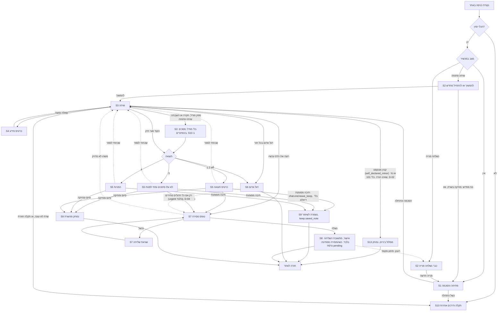
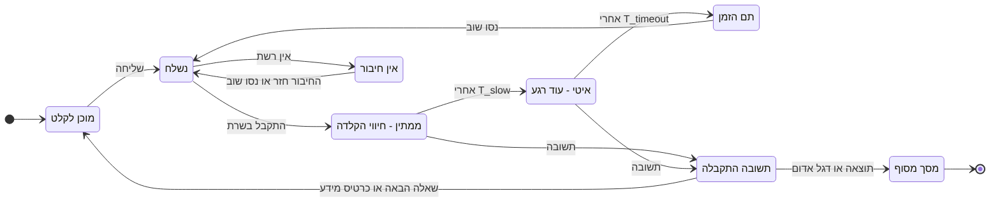
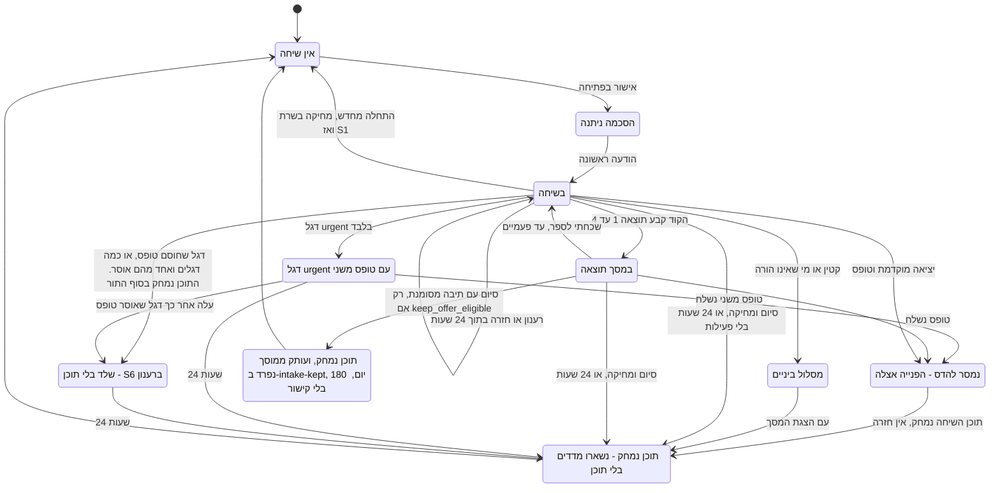
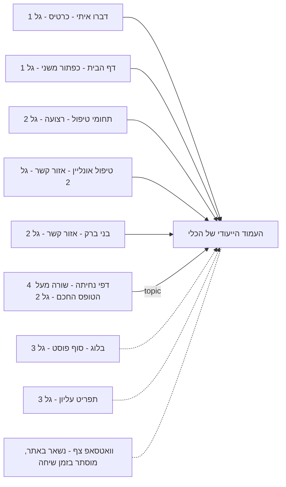
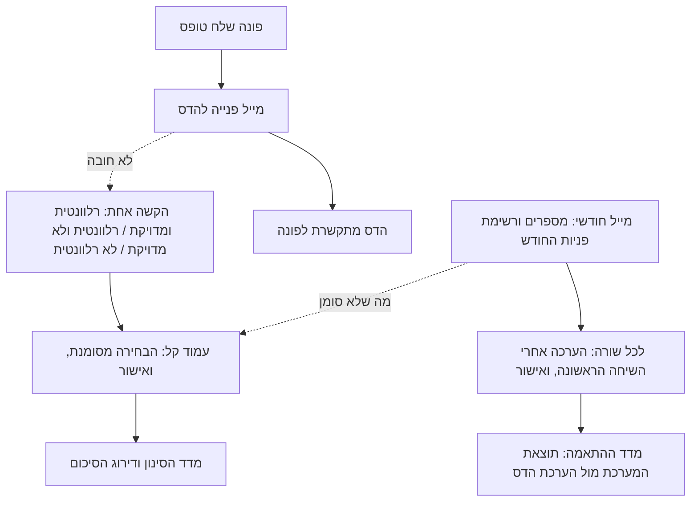

# מפרט חוויית משתמש — שיחת ההיכרות לפונים חדשים

סטטוס: טיוטה 4.4 · 2026-10-06 · תפקיד 1 (UX) · כפוף ל-`GOALS.md` (טיוטה 2) · מיושר ל-`ARCHITECTURE.md` (טיוטה 3, אחרי סבב 4) ול-`DECISIONS.md` (D-01–D-14, ו"הכרעות אליה (שער 1)").
**טיוטה 4.4 מיישמת את הכרעות שער 1** (`consults/propagation_plan.md`, P1–P3 ו-P7; פירוט ב-§0.6): "סיום" מוחק הכול, ובסוף השיחה תיבת רשות לשמירה (D-01b); בלי 101 ובלי קווי סיוע בהודעות הקבועות של S13 (D-02); בלי כפתורי גיל, והגיל בתיבת ההסכמה (D-13 ענף ב׳); בלי מדידת בסיס (D-11 בוטל).
טיוטה 4.1 סגרה שלוש נקודות פתוחות (פירוט ב-§0.3): S8 כשהמסירה ממתינה, שורת סגירה בלי טופס במסך הדגל המשולב, ואישור האורך של `minor.self.before_text`.
טיוטה 4.2 מיישמת את בקשות מבקר הנגישות לפני שער 1 (`consults/round2_accessibility.md`, פירוט ב-§0.4): מכריז אחד בלי `role="log"`, מנגנון אחד בכל מעבר, S6 בלי `alert`, סדר מיקוד ב-S5, אישור והכשל של ההעתקה ב-S13, גובה קצר וזום 400%, ורמז הכפתורים בהקשת הגיל.
טיוטה 4.3 מחליפה את הכותרת והפוטר של האתר בכותרת ופוטר סטטיים של הכלי עצמו (`consults/round2_frontend.md`, ממצא 1: הכותרת והפוטר של האתר טוענים מ-Firestore ושוברים את D-06). היא מגדירה את הדרך חזרה לאתר, ומוסיפה מצב בלי JavaScript למלאי המסכים (פירוט ב-§0.5).
**D-13 הוכרעה: ענף ב׳, בלי כפתורי גיל.** הגיל נכנס לתיבת ההסכמה ב-S1 (`consent.checkbox@v3`). ענף א (הקשת גיל) נשמר במסמך כמסומן "לא פעיל", לחזרה אפשרית אם עורך הדין (שאלה 17) יקבע שההצהרה לא מספיקה.
קוראים עיקריים: מעצב UI (2), מעצב שיחה (3), SEO ואנליטיקה (4), ארכיטקט (6), Frontend (8), מבקרים (12–15).

**מה המסמך הזה לא מחליט:** תוכן קליני (מה שואלים, מתי ניתנת איזו תוצאה) — הדס ותפקיד 5;
נוסחים סופיים וטקסטים משפטיים — תפקיד 3, מבקר הסיכונים ועורך הדין; חוזים, שלבים ושמירת מצב —
הארכיטקט; צבעים, צורות ותנועה — מעצב ה-UI. כל טקסט כאן בסוגריים מרובעים `[...]` הוא ממלא-מקום
שמראה אורך בלבד.

---

## 0. ההחלטות בקצרה

1. **בית אחד לכלי — עמוד ייעודי, עם כותרת ופוטר סטטיים משלו.** כל נקודות הכניסה באתר מובילות לאותו
   עמוד. הכותרת והפוטר של האתר טוענים תוכן מ-Firestore, ולכן לא משתמשים בהם כאן (D-06): לעמוד כותרת ופוטר
   מינימליים משלו, עם דרך ברורה חזרה לאתר (§3.0). במובייל, ברגע שהשיחה מתחילה, העמוד עובר ל"מצב מיקוד":
   הכותרת והפוטר של הכלי וכפתור הוואטסאפ הצף מוסתרים, ו-✕ בפס העליון הוא הדרך החוצה.
   אין חלון צ'אט קופץ מעל דפים אחרים.
2. **אין כפתור צף בגרסה 1.** במובייל שתי הפינות התחתונות כבר תפוסות (וואטסאפ מימין, נגישות
   משמאל). הכלי מוצע בהקשר, כקריאה לפעולה משנית ליד הקריאות הקיימות, ולא במקומן.
3. **התוצאה היא כרטיס קבוע, לא בועה.** הסיכום החם שהמודל כותב מופיע כבועה אחרונה של העוזר.
   נוסח התוצאה הקבוע מופיע בכרטיס נפרד מבחינה חזותית, וההסתייגות בתוכו. כך תמיד ברור מה טקסט
   קבוע ומאושר ומה ניסוח של מודל.
4. **דגל אדום עוצר הכול בכל תור.** הדגל מחליף את כל המסך, מציג רק נוסח קבוע לפי סוג הדגל, ומסיר
   את שדה הקלט. אין בו סיכום של מודל. טופס להדס (D-04): בחירום, בקו סיוע ובבטיחות ילד **אין**; בבירור
   רפואי בהקדם הוא משני. בכל הדרגות יש שורת הסתייגות קטנה אחרי הפעולות (S6). **כמה דגלים: מסך אחד.**
   בלוק ראשי (הדרגה הגבוהה), ובלוק נוסף לכל דגל קו סיוע נוסף. הטופס מוצע רק אם **כל** הדגלים מתירים אותו,
   וכשהוא חסום אין במסך אף משפט שמבטיח טופס: בבלוק `urgent` מוצג `redflag.after.no_form` במקום `redflag.after`.
5. **הפונה רואה מה יישלח להדס לפני השליחה.** בטופס יש תצוגה מקדימה (נפתחת) של העובדות
   שיישלחו, וקישור "משהו לא מדויק? חזרה לשיחה". זה מחזק אמון, דיוק והסכמה מדעת.
6. **טופס המסירה: שם, טלפון, הסכמה. אין שדה טקסט חופשי.** תוכן נמסר רק בשיחה, שבה כל טקסט עובר
   בדיקת דגלים אדומים. מי ששכח משהו לוחץ "שכחתי לספר משהו" וחוזר לשיחה.
7. **רענון לא מאבד כלום.** מערכת הפעלה של מובייל זורקת לשונית ברקע כשקופצים לוואטסאפ, וזה מקרה
   שכיח. השיחה משוחזרת בדיוק למקום שבו נעצרה, כולל מסך התוצאה והטופס, **עד 24 שעות מההודעה
   האחרונה** (cookie מאובטח ותיק בשרת, ARCHITECTURE §8.2).
8. **הודעות מופיעות שלמות, בלי הזרמה.** הפלט נבדק לפני שליחה (GOALS), וקורא מסך מקריא הודעה
   שלמה פעם אחת. חיווי ההקלדה נושא את זמן ההמתנה.
9. **הדס עובדת מהמייל בלבד, ובמינימום.** לכל פנייה יש סימון אחד ואופציונלי במייל (רלוונטית ומדויקת /
   רלוונטית ולא מדויקת / לא רלוונטית): קישור, ואז אישור בעמוד קל. האישור נדרש כי סורקי דואר פותחים
   קישורים לבד. את ההערכה אחרי השיחה הראשונה היא ממלאת **פעם בחודש** מרשימה אחת. אין תזכורות, אין
   דשבורד ואין התחברות (§5). **המייל של כל פנייה הוא גם ההתראה (D-14):** תגית קבועה בנושא ומסנן Gmail
   עם התראה בטלפון, בלי ערוץ נוסף ובלי סיכום שבועי.
10. **"סיום ומחיקה" מוחק באמת (D-01, D-01b).** פעולה אחת: תוכן השיחה נמחק מיד מהשרת, אחרי אישור קצר. שיחה
    שננטשה נמחקת בתום 24 שעות. נשארות רק רשומת מדדים ורשומת הסכמה, בלי תוכן. כרטיס הפניה שהפונה צריך
    נשאר על המסך עד שעוזבים את הדף (S9). **שמירה לשיפור, רק בהסכמה (D-01b):** במסך תוצאה בלי טופס (S5), ורק כש-`keep_offer_eligible`,
    מופיעה מעל קישור הסיום תיבת רשות לא מסומנת (`keep.optin.checkbox`, `keep.optin.note`). מי שלא נוגע בה לא מקיש דבר נוסף.
    מי שסימן: קישור הסיום מתחלף ל-`chat.end.leave_keep` (בלי "ומחיקה", L-04), ובלחיצה תוכן השיחה נמחק ועותק ממוסך נשמר
    בנפרד, 6 חודשים ואז נמחק אוטומטית, בלי קוד מחיקה (D-01b'). אחר כך S9 בגרסת השמירה (`keep.saved_note`). **אחרי שליחת הטופס אין "שכחתי לספר"** (S8). **מסך האישור נבנה
    מתשובת השליחה בלבד**, כי התוכן כבר נמחק באותה בקשה. רענון מציג S2 "כבר נשלחה" לפי סימון מקומי.
    **כשהמסירה עוד ממתינה (`delivery: pending`) המסך לא מבטיח שהדס כבר קיבלה ולא נותן זמן תגובה שמתחיל
    מעכשיו:** כותרת, "מה קורה עכשיו" ו"מתי" מוחלפים בגרסאות `.pending`, ושורת הגיבוי נשארת (S8).
11. **קטין, ומי שאינו הורה, נעצרים מוקדם (D-02).** נוסח קבוע וחם, בלי טופס, בלי טלפון ובלי סיכום. התיק
    נמחק. **בהודעה הקבועה אין 101 ואין קווי סיוע (D-02):** הודעת חירום מוצגת רק אם זוהה דגל אדום, דרך S6 הרגיל.
    דגלים אדומים פעילים תמיד וקודמים למסלול הזה (S13). **אין שאלת גיל (D-13 ענף ב׳):** הגיל מוצהר בתיבת
    ההסכמה ב-S1, וקטין נעצר רק כשהוא כותב את גילו או משפט מזהה (`self_declared_minor`). הסיכון המוכר: נער שמסמן בלי לקרוא.
12. **אין GA ו-Ads בנתיב הכלי (D-06).** המשפך נמדד ברשומות מדדים בשרת, בלי תוכן ובלי זהות (§6).

### 0.1 מונחים

| מונח | משמעות במסמך |
|---|---|
| פונה | מי שמקליד בשיחה |
| מושא | מי שהקושי שלו (לפעמים הפונה עצמו) |
| תיק | הפרטים שהקוד אוסף. המבנה בבעלות הארכיטקט |
| שלב תצוגה | אחד מ-3 שלבים שהפונה רואה (היכרות / השלמת פרטים / סיכום), ממופים לשלבי המנוע |
| תוצאה 1–5 | כמו ב-GOALS |
| מסירה | שליחת התיק ופרטי הקשר להדס |
| מסך מסוף | מסך שהשיחה לא ממשיכה ממנו: תוצאה 1–4, דגל אדום, אישור, תקלה קשה |
| מצב מיקוד | תצוגת מובייל שבה הכלי תופס את כל המסך (הכותרת והפוטר של הכלי מוסתרים) |
| מעטפת הכלי | הכותרת והפוטר הסטטיים של עמוד הכלי. **לא** `Header` ו-`Footer` של האתר (§3.0) |
| יציאה | עזיבת הדף, או "לצאת" בדיאלוג. השיחה זמינה לחזרה 24 שעות מההודעה האחרונה, ואז התוכן נמחק מעצמו |
| סיום ומחיקה | פעולה מפורשת אחת (D-01), זמינה ממסכי התוצאה, מהתפריט, מ-S2 ומדיאלוג היציאה: תוכן השיחה (תיק ו-trace) נמחק מיד מהשרת. נשארות רשומת מדדים ורשומת הסכמה, בלי תוכן |
| שמירה לשיפור | (D-01b) בחירת רשות בסוף שיחה בלי טופס: תיבה לא מסומנת ב-S5. מי שסימן ולחץ סיום, תוכן השיחה נמחק ועותק ממוסך, בלי שם, טלפון או קישור לסשן, נשמר במאגר נפרד (`intake-kept`) 180 יום מרגע ההסכמה ואז נמחק אוטומטית. אין קוד מחיקה ואין ביטול לפני כן (D-01b'). מוצעת רק כש-`keep_offer_eligible` (S5) |
| מסלול ביניים | עצירה קבועה לקטין שפונה על עצמו, או למי שאינו הורה ופונה על ילד (D-02, S13) |
| שלד | תיק בלי תוכן שיחה: מזהי הדגלים, הדרגות והנוסחים בלבד. נשאר 24 שעות אחרי דגל שחוסם טופס, כדי שרענון יציג את אותו S6 (ARCHITECTURE §1.5) |
| מצב בלי מודל | `degraded`: שיחה פתוחה ממשיכה בלי קריאה למודל (3 כשלים רצופים, השבתה, תקרת עלות או תקציב כתובת). מסכים בכפתורים, ואז תוצאה וטופס (S10) |

### 0.2 מה השתנה בטיוטה 4 (יישור לסבב 4 של הארכיטקט)

| נושא | איפה |
|---|---|
| S8 נבנה מתשובת השליחה בלבד, רענון מציג S2 מסימון מקומי; שורת גיבוי; שורת פרטיות לפי מצב המסירה | S8, §1.5 (כז, כח), §4.1 |
| S6 משולב: בלוק ראשי ובלוק לכל דגל קו סיוע נוסף; אין טופס אם דגל אחד אוסר; שלד לרענון; בלי כפתור חדר מיון | S6, §0(4), §4.3, §7.7 |
| דגל שחוסם טופס מוחק את התוכן בסוף התור | §4.3, §1.5 (כ) |
| הודעה מעל 32KB: לא נשלחת, `chat.input.too_long_block` עם 101, הטקסט נשאר בשדה | §1.5 (טו), S3, §7.3 |
| S10: וריאציה בלי מודל; `system.unavailable` רק לשיחה חדשה | S10, S3, §1.5 (יח), §7.4 |
| התחלה מחדש מובילה ל-S1 (מחיקה, הסכמה חדשה) | S2, S11, S12, §1.5 (כז), §4.1, §4.3 |
| תקרת התור בשרת 12 שניות | §1.5 (יז), S3 |
| `lead_ref` במקום שם פרטי; ההתראה הוכרעה (D-14: המייל עצמו); בלי "כפילות אפשרית" | §5.2, §5.5, §7.11, §8 |
| `outcome.extraction_gap` בכרטיס התוצאה | S5, §7.6 |
| "סיום" בתוצאה 3 מוחק בשרת | §1.3 |
| `page.tool.not_this` מעל תיבת ההסכמה | S1, §7.2 |
| **D-13, ממתין לאליה:** הקשת גיל אחרי "על עצמי", ו-`minor.self.before_text` *(הוכרע ב-4.4: ענף ב׳, לא פעיל, §0.6)* | S3, S13, §1.2, §1.5 (כה), §4.1, §7.3, §7.7 |

### 0.3 מה השתנה בטיוטה 4.1 (שלוש החלטות, אחרי בקשות מעצב השיחה והאבטחה)

| נושא | ההחלטה | איפה |
|---|---|---|
| S8 כש-`delivery: pending` | כותרת, "מה קורה עכשיו" ו"מתי" מוחלפים בגרסאות `.pending`. "מתי" מעוגן להגעת הסיכום, ולא למועד הלחיצה. שורת הגיבוי, המספר, ההסתייגות ו-`add_later` נשארים כמו שהם. שורת הפרטיות לפי טבלת 4 הצירופים, כולל `both_pending`. אין כפתור "בדיקת סטטוס" | S8, §1.5 (כט), §4.1, §7.0, §7.8 |
| מסך דגל משולב | כשהטופס חסום (כל דגל שעלה אוסר, או שאחד מהם אוסר), בבלוק `urgent` מוצג `redflag.after.no_form` במקום `redflag.after` ו-`redflag.cta.form`. השרת בוחר לפי `form` במעטפה, לא הממשק. אחרי 403 מלשונית ישנה נוספת שורה `redflag.form_not_sent` | S6, S7, §1.5 (כ), §4.3, §7.0, §7.7 |
| `minor.self.before_text` | **מאושר כמו שהוא**, 46 מילים. התקרה לנוסח הזה ב-§7.7 הייתה ונשארת 50. ה-40 חל על `minor.self` | S13, §7.7 |

### 0.4 מה השתנה בטיוטה 4.2 (בקשות מבקר הנגישות, לפני שער 1)

| נושא | ההחלטה | איפה |
|---|---|---|
| הכרזות | **אין `role="log"` ואין `aria-live` על התמליל.** מכריז אחד מוסתר, קיים ב-DOM מטעינת העמוד, מחוץ לעץ שמתחלף, ואין אזורים חיים מקוננים. הודעות הפונה לא מוכרזות | §3.13, S3, §3.0 |
| מנגנון אחד בכל מעבר | בכל שינוי מסך או מצב **או** מעבירים מיקוד **או** מכריזים, ולא את שניהם. טבלת המעברים ב-§3.13. יוצא דופן יחיד ומסודר: S1 ל-S3 (המיקוד בשדה, ההכרזה אחריו, לבדיקה במכשיר) | §3.13, S1, S3, S7 |
| S6 | המיקוד לכותרת בלבד, בלי `role="alert"` ובלי assertive, בלי הכרזה. מרוקנים את המכריז בכניסה. **ועוד מהייעוץ:** השם הנגיש של כפתור 101 כולל את הטקסט הגלוי (2.5.3) | S6, §7.7 |
| S5 | **המיקוד עובר פעם אחת, לבועת הסיכום, בלי הכרזה ובלי טיימר.** הכרטיס בא אחריה בסדר הקריאה, כדי שהסיכום לא ייחתך באמצע | S5 |
| S13 העתקה | "הועתקו" מוכרז דרך המכריז, בלי להזיז מיקוד. אם ההעתקה נכשלה: "לא הועתק" והפרטים נחשפים כטקסט לבחירה. **אסור להציג "הועתקו" בלי הצלחה מאומתת** | S13, §7.0 |
| גובה קצר, זום 400% | הרכיבים הקבועים עוברים לזרימת הגלילה בשלבים, וההסתייגות אחרונה: היא הופכת לפריט הראשון בתמליל, ונשארת בתוך כל כרטיס תוצאה ודגל. **ממתין לאישור משפטי** | §3.0, §3.13, §8 |
| הקשת הגיל | קבוצת הכפתורים נקראת בשם השאלה, והכפתורים לפני השדה ב-DOM. **רמז `a11y.buttons_hint` חובה** בהכרזה ובטקסט המוסתר של ההודעה, כי הוא תנאי בטיחות | S3, §7.0, §7.10 |

### 0.5 מה השתנה בטיוטה 4.3 (כותרת ופוטר של הכלי, ייעוץ Frontend לפני שער 1)

| נושא | ההחלטה | איפה |
|---|---|---|
| כותרת ופוטר | עמוד הכלי **לא** מציג את `Header` ו-`Footer` של האתר (Firestore, D-06). יש לו כותרת ופוטר סטטיים משלו, מינימליים: לוגו וקישור גלוי "חזרה לאתר", בלי ניווט של האתר ובלי קריאות לפעולה. כל מקום שהניח כותרת או פוטר של האתר הוחלף | §0(1), §0.1, §3.0, S6, §8 |
| S6 בדסקטופ | כותרת **הכלי** נשארת (עם "חזרה לאתר"), בלי פוטר. במובייל מצב המיקוד נשאר, בלי כותרת | S6, §8 |
| דרך חזרה לאתר | לוגו וקישור בכותרת, קישור בפוטר, ✕ בפס העליון, וכפתור "חזרה לאתר" במסכי המסוף. יעד אחד: דף הבית. **כשיש שיחה פתוחה (S3 עד S5, S7) כל אחד מהם פותח את דיאלוג היציאה הקיים**, לא ניווט ישיר | §3.0, S11 |
| מצב בלי JavaScript | שורה חדשה אחת ב-S10 (וריאציה ד): בלוק סטטי עם 101, הטלפון של הדס ווואטסאפ, מאותו מחולל של `system.unavailable` | S10 |

### 0.6 מה השתנה בטיוטה 4.4 (הכרעות אליה, שער 1)

מקור: `DECISIONS.md` "הכרעות אליה (שער 1)", `consults/propagation_plan.md` (P1–P3, P7; המזהים המשותפים מחייבים), `consults/d01b.md`.
**שורות קודמות ב-§0.2–§0.5 על D-13 ענף א, על הקשת הגיל ועל 101 וקווי הסיוע ב-S13 הן היסטוריה, והטבלה הזו מחליפה אותן.**

| נושא | ההחלטה | איפה |
|---|---|---|
| **D-01b: "סיום" מוחק הכול, ושמירה ברשות** | ברירת המחדל לא השתנתה: "סיום" מוחק. **תיבת הרשות יושבת ב-S5, בבלוק הסגירה, מיד לפני קישור הסיום**, ורק כשהשרת מסמן `keep_offer_eligible` (relation ∈ {self_adult, parent_of_child}, אין דגל אדום בשום דרגה, אין `mask_incomplete`, לא נשלחה פנייה, לא S13). `keep.optin.checkbox` לא מסומנת, ומתחתיה `keep.optin.note` גלוי. **מסומנת:** הקישור מתחלף ל-`chat.end.leave_keep` (בלי "ומחיקה", L-04), ולחיצה סוגרת **בלי** דיאלוג המחיקה: הסימון הוא הפעולה המכוונת. **לא מסומנת:** הכול כמו היום. **מחיר:** אפס הקשות למי שמתעלם, הקשה אחת למי שמסכים, ואף פעם לא שער. **לא מוצעת:** בדיאלוג היציאה (S11), ב-S2, בתפריט, ב-S6, S8, S10 ו-S13. **אין קוד מחיקה** (D-01b'). אחרי שמירה: S9 בגרסת `keep.saved_note`. למה דווקא S5 ולא הדיאלוג: ראו S5, "בלוק הסגירה" | §0(10), §0.1, §1.3, §1.4 (ג), §1.5 (ל–לד), S1, S5, S9, S11, S12, S13, §3.13, §4.1, §4.3, §5.6, §6.2, §7.0, §7.6, §7.9, §8 |
| **D-02: בלי 101 ובלי קווי סיוע ב-S13** | `minor.self`, `minor.self.before_text@v2` ו-`reporter.not_parent`: בלי 101 ובלי ער"ן וסה"ר. הודעת חירום רק אם זוהה דגל, דרך S6 הרגיל, שקודם למסלול. **נגד המלצת הקליני, ואליה החליט ביודעין** (§8 → קליני). הוסרו מ-S13 קישורי הסיוע, רמז הלשונית החדשה של סה"ר ותנאי השורות הנפרדות | §0(11), §1.2, §1.5 (כה), S13, §7.0, §7.7, §8 |
| **D-13 ענף ב׳: בלי כפתורי גיל** | אין הקשת גיל אחרי "על עצמי". הגיל בתיבת ההסכמה, `consent.checkbox@v3` ⚖️ ("מעל 18, או הורה שכותב על ילדו"), ונרשם `age_declaration: "adult_or_parent"` עם גרסת הנוסח. קטין שכותב את גילו נעצר (`self_declared_minor` → S13a). **הסיכון המוכר: נער שמסמן בלי לקרוא.** `goal.self_age_band.*`, `q.self_age_band.opt.*` ו-`minor.self.before_text` **לא נמחקים**: `active: false`, לחזרה אפשרית לפי שאלה 17 לעו"ד | §0(11), §1.1, §1.2, §1.4 (א), §1.5 (כה), S1, S3, S13, §4.1, §7.0, §7.2, §7.3, §7.10, §8 |
| **D-11 בוטל: אין מדידת בסיס** | הוסרו: "אחרי מדידת בסיס" (§2.3), שורת "השוואה לכמות הפניות היום" ו"מול הבסיס" (§5.8). מדדי המשפך בלי תוכן (§6) נשארים כמו שהם | §2.3, §5.8, §6.3, §8 |
| **P4, D-07 + Cloudflare** | UX לא מונה מעבדים. "מי רואה" ו"מה נשמר" מוצגים מ-`about.data` ו-`meta.who_sees` של תפקיד 3 (S12), שנושאים את רשימת D-07 ואת Cloudflare. אין כאן שינוי | S12 |
| **P6, D-06 (אימות בלבד)** | נבדק: אין GA או Ads בנתיב הכלי (§6.1). המרת Ads מהשרת: כבויה עד עו"ד | §6.1, §8 → SEO |
| **P9: לא משתנה** | D-03 (תוצאה 3 כבויה), D-14 (המייל הוא ההתראה) והמייל להדס נשארים כמו שהם | — |

---

## 1. מסעות משתמש

### 1.1 שלד השיחה כפי שהפונה חווה אותה

| שלב תצוגה | מה קורה | מה הפונה רואה |
|---|---|---|
| 1 · היכרות | פתיחה: על מי מדובר, ו"ספרו במילים שלכם" | הודעת פתיחה, 4 כפתורי קשר (על עצמי / על הבן שלי / על הבת שלי / על מישהו אחר, לפי `q.relation.opt.*` של תפקיד 3), כפתור "יש לי שאלה", ושדה טקסט חופשי |
| 2 · השלמת פרטים | הקוד שואל רק את מה שחסר, שאלה אחת בכל הודעה | בועות. לפעמים כפתורי בחירה (כן / לא / לא בטוח, טווחי גיל) |
| 3 · סיכום | סיכום חם (מודל), כרטיס תוצאה (קבוע), טופס, אישור | כרטיס, טופס, מסך אישור |

כללי חוויה:
- **שתי דלתות בהודעה הראשונה.** מי שמתלבט לוחץ כפתור. מי שרוצה לשפוך כותב. מי שכתב הכול
  בהודעה הראשונה מדלג ישר לשלב 2 או 3, ושלב 1 פשוט מסומן כ"הושלם".
- **בן ובת בנפרד.** ההצעה של תפקיד 3 מאומצת: כך המערכת יודעת את מגדר הילד בלי לשאול עליו.
  4 כפתורים נכנסים בפריסת 2×2 במובייל. מי שמקליד חופשי מקבל את הנוסח הנייטרלי (`.child.n`).
- **אין שאלת גיל במסלול "על עצמי" (D-13 ענף ב׳).** אחרי "על עצמי" עוברים ישר לשיחה. הגיל מוצהר פעם אחת, בתיבת
  ההסכמה ב-S1. (הקשת הגיל של ענף א מתוארת ב-S3 כלא פעילה, לחזרה אפשרית לפי שאלה 17 לעו"ד.)
- **"לא בטוח" הוא תשובה לגיטימית.** כל שאלה סגורה מציעה אותה. זה חשוב להטיה השמרנית: "לא
  יודע" מונע תוצאה 3, ולכן הפונה לא צריך לנחש כדי "לעבור".
- **כפתורים הם קיצור, לא כלוב.** אפשר תמיד להקליד במקום ללחוץ. הכפתורים נעלמים אחרי שימוש,
  והבחירה מופיעה כבועה של הפונה.
- **תיקון בהקלדה.** הפונה כותב "סליחה, היא בת 5". אין כפתורי עריכה על בועות. בסתירות מטפל הקוד,
  והן מסומנות להדס.
- **יעד של כ-5 דקות.** אין טיימר גלוי ואין "שאלה 3 מתוך 8". מחוון השלבים הוא 3 שלבים בשמם,
  ומותר לו לדלג קדימה.
- **אין נדנוד.** אין הודעות "עדיין כאן?" ואין חלונות יציאה.

### 1.2 מה משתנה לפי סוג הפונה

| | על עצמי | על הילד שלי | על מבוגר אחר |
|---|---|---|---|
| זיהוי | כפתור, או חילוץ מהטקסט | כנ"ל | כנ"ל, ואז שאלת קשר (בן/בת זוג, הורה, אחר) אם חסר |
| התייחסות למושא | גוף שני | "הילד/ה", או השם אם נאמר. **לא שואלים את שם הילד** | לפי מה שנאמר ("אבא שלך") |
| כפתורים שהממשק צריך לתמוך בהם (התוכן בבעלות תפקיד 5) | — | טווחי גיל | סוג הקשר |
| מי ממלא את הטופס, ולמי הדס חוזרת | הפונה | ההורה | **הפונה, לא המושא**. מסך האישור אומר זאת במפורש |
| רגישות מיוחדת | מי שהקושי שלו בדיבור אולי מעדיף כתיבה על פני טלפון (ראו שאלה פתוחה על ערוץ מועדף) | הורה מודאג. הטון לא מבהיל, ואין שום חזות של "הצלחה" או "תקין" | לעיתים נוירולוגי או בליעה, ודגל אדום שכיח יותר. ייתכן שהמושא לא יודע שפונים בשמו (שאלה למבקר המשפטי) |
| קטין שפונה על עצמו | "על עצמי" וגיל מתחת ל-18 שנכתב בטקסט → **S13a** (D-02): נוסח קבוע, בלי טופס, בלי טלפון ובלי 101 (דגל → S6). **D-13 ענף ב׳:** אין הקשת גיל. ההגנה המוקדמת היא ההצהרה בתיבת ההסכמה, והעצירה רק מציטוט או מגיל שנאמר (`self_declared_minor`) | | |
| מי שאינו הורה, על ילד | | גננת, מורה, סבתא → **S13b** (D-02): הפנייה להורים, בלי פרטים מזהים ובלי טופס | מבוגר על מבוגר אחר: מותר, עם מינימום פרטים, עד תשובת עורך הדין (D-02) |

### 1.3 מטריצה: 3 סוגי פונים × 5 תוצאות

| תוצאה | על עצמי | על הילד שלי | על מבוגר אחר |
|---|---|---|---|
| **1 · בתחום, מומלץ לפנות** | כרטיס תוצאה, טופס עם הפרטים של הפונה, אישור: "הדס תחזור אליך" | אותו מסלול. הטופס מבקש את פרטי ההורה, והכרטיס מתייחס ל"הילד/ה" | פרטי הפונה. האישור מבהיר שהדס תחזור לפונה, ושהוא מתאם מול המושא |
| **2 · שווה שיחת התייעצות** | אותו טופס כמו ב-1. ההבדל בטון: דלת פתוחה, בלי דחיפות. לעיתים קרובות מגיעים לכאן בגלל "לא בטוח", אז הכרטיס לא רומז שהפונה "לא ענה טוב" | כאן נוחתים גם הגילאים שהדס מחריגה מתוצאה 3. זה תקין מבחינת החוויה | מקרה שכיח לנוירולוגי או בליעה בתוך התחום (לפי הדס) |
| **3 · לא עלו סימנים שמצריכים פנייה כעת** (**כבויה בהשקה, D-03:** המקרים מקבלים 2, ונרשם `would_be_outcome_3`) | כרטיס עם הסתייגות מלאה בתוכו, רשימת "מתי כן לפנות", וטופס זמין באותה בולטות כמו ב-1 ו-2. "סיום" משני (מוחק בשרת מיד, כמו בכל תוצאה, D-01). הסיכון: שהפונה יקרא את זה כ"אני בסדר". לכן ההסתייגות בגוף הכרטיס ולא בהערת שוליים | הורה שחיפש הרגעה. אסור סימן וי ירוק או צבע "הצלחה". הערך המרכזי הוא רשימת הסימנים לשים לב אליהם | כמו בעצמי. הרשימה צריכה להיות מובנת גם בלי השיחה, כי הפונה אולי יספר עליה למושא |
| **4 · לא בתחומה של הדס** | כרטיס הפניות מהרשימה של הדס: למי, על מה, ואיך פונים. קישור צנוע "חושבים שלא הבנו נכון?". אין טופס בולט | כנ"ל | המקרה השכיח ביותר לפי GOALS (נוירולוגי או בליעה מחוץ לתחום). הכרטיס צריך מקומות קונקרטיים, לא "פנו לגורם מוסמך" |
| **שמירה לשיפור (D-01b)** | מוצעת במסכי 1–4 כשלא נשלח טופס (S5) | כנ"ל, כשהפונה הוא ההורה | **לא מוצעת.** הפונה לא יכול להסכים בשם מבוגר אחר (`consults/d01b.md`, משפטי) |
| **5 · דגל אדום** | מסך מלא ונוסח קבוע לפי סוג הדגל. בסוג חירום, כפתור 101 גדול. **ייתכן שהפונה עצמו מתקשה לדבר**, ולכן ייתכן שהנוסח צריך "בקשו ממישהו לידכם להתקשר" וחלופה טקסטואלית לחירום. התוכן אצל הדס ותפקיד 3 | הורה בבהלה: הפעולה קודם, משפטים קצרים | ייתכן שהפונה לא נמצא פיזית ליד המושא, ואולי יצטרך "אם אינכם לידו...". התוכן אצל הדס ותפקיד 3 |

### 1.4 מסעות לדוגמה

> התחומים והתוצאות כאן הם להמחשה בלבד. **התוצאה בפועל נקבעת בקוד לפי טבלת ההחלטה של הדס.**

**א. יעל, 38, מורה, על עצמה (מובייל, 22:40, מגיעה מדף הנחיתה "קול")**
1. גוללת עד הטופס החכם ורואה שורה: `[מעדיפים לספר במילים שלכם? שיחה קצרה עם העוזר הדיגיטלי]`.
2. עוברת לעמוד הכלי עם רמז הנושא "קול". קוראת את ההסתייגות, מסמנת ומתחילה.
3. לוחצת "על עצמי" וכותבת שתי שורות על צרידות. הקוד שואל רק את מה שחסר, שאלה אחת בכל פעם. אין שאלת גיל:
   את גילה היא הצהירה בתיבת ההסכמה (D-13 ענף ב׳).
4. באמצע עוברת לוואטסאפ לענות להודעה. מערכת ההפעלה זורקת את הלשונית. כשהיא חוזרת, העמוד נטען
   מחדש והשיחה ממשיכה מאותה שאלה (מסע קצה 1.5-ג).
5. בועת סיכום חם, ואחריה כרטיס תוצאה 1 או 2. "להשאיר פרטים להדס".
6. בטופס פותחת את "מה יישלח להדס", רואה שהעובדות נכונות, ממלאת שם וטלפון, מסמנת הסכמה ושולחת.
7. במסך האישור: מה קורה עכשיו, מתי, ומאיזה מספר הדס תתקשר, ושורה שאומרת מה לעשות אם לא חזרו אליה.
   תוכן השיחה כבר נמחק מהשרת, והמסך נבנה מתשובת השליחה בלבד.

**ב. אבי, אבא לילדה בת 4 (מובייל, מגיע מדף הבית)**
1. כפתור משני בכותרת הדף: `[לא בטוחים מאיפה להתחיל? שיחת היכרות קצרה]`.
2. "על הילד שלי", ואז כפתורי גיל.
3. באמצע כותב "כמה זה עולה?". מופיע כרטיס מידע מדף העובדות של הדס, ואחריו השאלה שחיכתה
   נשאלת שוב בעדינות.
4. עונה "לא בטוח" על פרט קריטי. הקוד מגיע לתוצאה 2. הכרטיס מזמין, ולא רומז ל"כישלון".
5. טופס, ואז אישור.

**ג. נועה, על אביה בן 74 (דסקטופ, מגיעה מעמוד תחומי טיפול)**
1. רצועה בתחתית עמוד תחומי טיפול: `[לא בטוחים איזה תחום מתאים?]`.
2. "על מישהו אחר", "הורה". מספרת על קושי אחרי אירוע רפואי לפני כמה חודשים.
3. תוצאה 4: כרטיס הפניות. לוחצת על אחת ההפניות, והיא נפתחת בלשונית חדשה.
4. "סיום ומחיקה", אישור: השיחה נמחקת גם מהשרת (S9). כרטיס ההפניה נשאר על המסך עד שהיא עוזבת את הדף.
   **הדס לא מקבלת דבר.** תיבת השמירה לשיפור לא מוצגת לה: היא כותבת על מבוגר אחר (D-01b).
   *(אילו כתבה על עצמה: מעל "סיום ומחיקה" הייתה תיבה לא מסומנת. סימון הופך את הקישור ל-`chat.end.leave_keep`, ולחיצה
   מובילה ל-S9 בגרסת השמירה. בלי סימון, בדיוק כמו כאן.)*

**ד. בן זוג, בהודעה הראשונה: "מהבוקר הדיבור שלו משובש" (מובייל)**
1. מקליד בשדה החופשי בלי ללחוץ על כפתור.
2. הקוד מזהה דגל אדום בתור הראשון. המסך מוחלף מיד במסך הדגל האדום: ההודעה הקבועה, כפתור 101.
   המיקוד עובר לכותרת, ובלי הכרזה נפרדת (מנגנון אחד, §3.13).
3. אין שדה קלט, אין טופס (זה סוג חירום), ואין סיכום מודל. "חזרה לאתר".

**ה. רונית, אמא לבן 6, מתלבטת (מובייל)** — *כשתוצאה 3 תופעל. בהשקה (D-03) המקרה הזה מקבל תוצאה 2.*
1. השיחה מסתיימת בתוצאה 3. קוראת את "מתי כן לפנות".
2. **מסלול ה1:** לוחצת בכל זאת "לדבר עם הדס". טופס, אישור. במייל להדס הפנייה מתויגת
   "פנה/תה למרות שלא עלו סימנים".
3. **מסלול ה2:** לוחצת "סיום ומחיקה". כלום לא נשלח, והשיחה נמחקת.

**ו. דנה: מתחילה בעבודה וחוזרת בערב (מובייל)**
1. עוצרת באמצע שלב 2 וסוגרת את הדפדפן.
2. בערב נכנסת שוב לאתר ולוחצת שוב על הקריאה לפעולה. בעמוד הכלי מופיע: `[יש לך שיחה מהבוקר. להמשיך?]`.
   "להמשיך" מחזיר את התמליל ואת השאלה האחרונה.
3. אם התוקף פג, מופיעה הודעה קצרה ושיחה חדשה מתחילה (מסע קצה 1.5-ה).

### 1.5 מסעות קצה

| # | מצב | מה הפונה רואה | מה קורה למידע | אירוע (§6) |
|---|---|---|---|---|
| א | עוזב לפני ההסכמה | — | לא נשמר דבר | `intro_view` בלי המשך |
| ב | עוזב באמצע השיחה, בכל שלב | — | אין פרטי קשר ולכן **לא נשלח דבר להדס**. השיחה נשמרת לחזרה עד 24 שעות מההודעה האחרונה, ואז התוכן נמחק (D-01) | השלב האחרון שהושג |
| ג | רענון, או שמערכת ההפעלה זרקה את הלשונית | חזרה מיידית לאותו מקום, כולל תוצאה וטופס. אין צורך בהסכמה חוזרת | משוחזר מהשרת לפי cookie מאובטח (`__Host-intake_sid`, HttpOnly). הדפדפן לא מחזיק תוכן | `resume` (שקט, בלי שאלה) |
| ד | חוזר מאוחר יותר, באותו מכשיר ובתוך התוקף | מסך S2: "להמשיך / להתחיל מחדש" | כנ"ל | `resume` |
| ה | חוזר אחרי שהתוקף פג | בדרך כלל S1 רגיל, בלי הודעה: ה-cookie פג יחד עם השיחה, ולכן אין סימן שהייתה שיחה. השורה `error.session_expired` מופיעה רק כשה-cookie קיים והשיחה לא (למשל אחרי מחיקה בשרת) | לא ניתנת להמשך. התוכן כבר נמחק (D-01) | `session_expired`, אם הוצג |
| ו | חוזר ממכשיר אחר | שיחה חדשה (אין התחברות) | — | — |
| ז | כבר שלח פנייה | S2: `[כבר שלחת פנייה להדס ב-{תאריך}]`, ואפשרות "פנייה חדשה (למשל על מישהו אחר)" | סימון מקומי בלי תוכן: רק "נשלח" ותאריך (באישור מבקר האבטחה) | — |
| ח | לוחץ "חזור" בדפדפן באמצע השיחה | חוזר למסך הפתיחה של אותו עמוד, עם כפתור "המשך השיחה". לא יוצא מהאתר ולא מאבד דבר | נשמר | `exit_dialog` לא נרשם |
| ט | פותח שתי לשוניות | שתיהן על אותה שיחה (אותו cookie). שליחה מלשונית לא מעודכנת מקבלת 409, והתמליל מתעדכן בשקט. הטקסט שהוקלד נשאר בשדה, והפונה שולח שוב אם עדיין רלוונטי. אין הודעת "לשונית אחרת" | מקור אמת אחד בשרת (CAS) | — |
| י | "אני רוצה לדבר עם הדס" באמצע | הצעה: `[אפשר לעבור עכשיו לטופס, עם מה שסיפרת עד כה]`. אם מסכים, טופס בגרסת "תיק חלקי" | המנוע מחשב תוצאה על התיק החלקי ו**לא מציג אותה** (לרוב 2). התיק נשלח מתויג "יציאה מוקדמת". אם עלה דגל, מוצג S6 במקום הטופס (ARCHITECTURE §4) | `early_handoff` |
| יא | שואל רק שאלה נפוצה ועוזב | כרטיס מידע | — | `faq_topic` |
| יב | שואל שאלה קלינית ("זה נורמלי ש...?", "איזה תרגיל?") | הסטה מנומסת קבועה וחזרה לשאלה. אין אבחנה ואין טיפים | — | `clinical_deflect` |
| יג | כותב בשפה אחרת | הודעה קבועה: כרגע רק בעברית, ודרכי קשר ישירות | — | `language_unsupported` |
| יד | ג'יבריש, הצקות, ניסיון הזרקה | אין ממשק מיוחד. נוסח החזרה קבוע. אחרי N פעמים סיום מנומס ומסך S10 (המספר נקבע אצל הארכיטקט) | — | `error{rate_limited}` אם נחסם |
| טו | הודעה ארוכה | **שני סיפים, ואין `maxlength` ואין חיתוך, גם של טקסט מודבק** (SEC-06). **(1) מעל 800 תווים, עד 32KB (כ-16,000 תווי עברית):** השליחה לא נחסמת. מונה תווים מ-640, ומעל 800 שורת רמז (`chat.input.too_long_hint`). בשליחה **כל** הטקסט עובר בדיקת דגלים בלבד, בלי מודל. דגל → S6. אין דגל → בועה `meta.too_long` (v2: לקצר; "אם משהו השתנה לאחרונה או הופיע פתאום, כדאי לכתוב את זה קודם"; 101), והטקסט חוזר לשדה כמו שהוא. **(2) מעל 32KB:** הדפדפן מחשב את גודל הגוף לפני שליחה, ו**לא שולח**. מופיעה ההודעה `chat.input.too_long_block` ליד שדה הקלט: ההודעה ארוכה מכדי לשלוח, מה לכתוב קודם, ובמצב חירום 101. **הטקסט נשאר בשדה בדיוק כמו שהודבק**, לעריכה. כפתור השליחה לא מושבת (כמו ב-S1: כפתור מושבת לא מסביר למה). **אין קיצוץ שקט ואין הצעה לקצץ מהסוף.** הטקסט שלא נשלח גם לא נבדק לדגלים, ולכן ההודעה כוללת 101 ומבקשת לכתוב קודם מה שהשתנה לאחרונה | לא נשמר טקסט. בסף (1) נרשמים רק אורך ותוצאת הבדיקה. בסף (2) לא נרשם דבר, אלא קוד `input_too_large` אם הבקשה הגיעה לשרת (שהוא אוכף את אותה תקרה, 413) | `long_input` (סף 1). בסף 2 אין אירוע |
| טז | החיבור נפל בזמן שליחה | פס "אין חיבור". ההודעה נשארת בבועה המסומנת "לא נשלחה" עם "נסו שוב" | ההודעה לא אבדה | `error{offline}` |
| יז | תשובה איטית או זמן שתם | ראו S3: מצבי המתנה. בשרת יש תקרה של **12 שניות** לתור, ואחריה עונה שאלת תבנית, בלי מצב תצוגה נפרד. ספי הדפדפן (T_slow 8 שניות, T_timeout 25 שניות) מכסים את זה: T_timeout הוא רשת ביטחון לבקשה שהשרת לא ענה עליה בכלל | — | `slow_shown`, `error{timeout}` |
| יח | המנוע לא זמין | **שיחה חדשה כשהכלי מושבת** (השבתה, תקרת עלות ב-80%, תקציב כתובת): S10 עם `system.unavailable`, בלי טופס. **שיחה פתוחה בלי מודל** (3 כשלי מודל רצופים, השבתה, תקרת עלות 100%, תקציב כתובת): לא S10 אלא ממשיכה במצב בלי מודל: מסכים בכפתורים, ואז תוצאה וטופס (S10, וריאציה ב). **השרת לא עונה**: S10 סטטי מהבאנדל | תיק חלקי נשלח רק אם הפונה בחר בטופס | `error{unavailable}` |
| יט | המנוע לא זמין ברגע שליחת הטופס | שגיאה בטופס. הפרטים נשמרים, יש "נסו שוב", ואחרי כישלון שני גם וואטסאפ/טלפון | הפרטים לא אבדו. **לינק הוואטסאפ נושא רק את הטקסט הכללי, בלי תוכן מהשיחה** (מידע רפואי לא נכנס ל-URL) | `form_failed` |
| כ | דגל אדום בתור הראשון / באמצע / אחרי "שכחתי לספר". גם **כמה דגלים** בהודעה אחת או בשיחה | S6 בכל המקרים, בווריאציה לפי סוג הדגל. עלו כמה: מסך אחד, בלוק ראשי ובלוק לכל דגל קו סיוע נוסף. הטופס נעלם גם אם הוצע קודם, אם דגל אחד אוסר אותו, ובבלוק `urgent` מוצג `redflag.after.no_form` במקום `redflag.after` (אין משפט שמבטיח טופס חסום) | בסוג חירום אין מסירה. בסוגים אחרים, מסירה רק אם הפונה בחר בטופס המשני (אם אושר) ו**כל** הדגלים מתירים אותו. **דגל שחוסם טופס מוחק את התוכן בסוף התור**, ונשאר שלד בלי תוכן לרענון (§4.3) | `outcome{5}` |
| כא | נוסח ההסתייגות השתנה בין ביקורים | בחזרה לשיחה פתוחה: S1 שוב, ואז המשך | נרשמת הסכמה בגרסה החדשה | `consent_given` |
| כב | שכח לספר משהו אחרי שראה תוצאה, או בטופס לפני שליחה | "שכחתי לספר משהו" מחזיר לשיחה. הקוד מעריך מחדש, והתוצאה עשויה להשתנות (גם לדגל אדום). **עד פעמיים בשיחה** (`reopen_count`). אחר כך הקישור פשוט לא מוצג | — | `reopen` |
| כג | נזכר במשהו **אחרי** ששלח את הטופס | **אין "שכחתי לספר"**: השיחה סגורה, ומידע חדש לא היה מגיע להדס. S8 מציע לכתוב להדס ישירות בוואטסאפ או בטלפון (`confirm.add_later`) | — | — |
| כד | לוחץ "סיום ומחיקה" במסך מסוף | דיאלוג אישור, ואז S9 ("השיחה נמחקה"). כרטיס ההפניה או הרשימה נשארים על המסך, רק בזיכרון הדף | **נמחק מיד מהשרת** (D-01). נשארות רשומות מדדים והסכמה בלי תוכן | `deleted{from: finish}` |
| כה | קטין כותב על עצמו | S13a (אחרי בדיקת דגלים: דגל → S6). **D-13 ענף ב׳:** אין הקשת גיל. S13a מופיע מציטוט ("אני בכיתה ח'") או מגיל שנאמר (`self_declared_minor`), בנוסח `minor.self`, **בלי 101 ובלי קווי סיוע** (D-02). קטין שלא מציין גיל ולא כותב משפט מזהה ממשיך כמבוגר, וההגנה היחידה היא ההצהרה שסימן ב-S1. **הסיכון המוכר: נער שמסמן בלי לקרוא** (DECISIONS D-13) | התיק נמחק עם הצגת המסך. אין טופס ואין טלפון. הגיל לא מגיע להדס | `interim_route{minor}` |
| כו | גננת, מורה או סבתא כותבת על ילד | S13b (אחרי בדיקת דגלים) | כנ"ל | `interim_route{not_parent}` |
| כז | התחלה מחדש (מ-S2 או מהתפריט) | דיאלוג אישור (`resume.restart_confirm`: השיחה הקודמת תימחק), ואחריו **S1 מההתחלה**: הסכמה חדשה, ולא שיחה ריקה | מחיקה בשרת (אותו `DELETE`), cookie חדש ורשומת הסכמה חדשה. ההסכמה לא עוברת משיחה לשיחה | `resume{choice: restart}`, `consent_given` |
| כח | רענון במסך האישור (S8) | S2 "כבר נשלחה פנייה" (`resume.submitted.*`). את S8 המלא אי אפשר לשחזר, כי נבנה מתשובת השליחה בלבד. שורות קבועות שאינן תוכן שיחה (הטלפון של הדס, 101) יכולות להופיע ב-S2 מהבאנדל, והניסוח אצל תפקיד 3 | אין שיחה בשרת (`GET /session` מחזיר 404). הסימון המקומי הוא תאריך בלבד | `resume` |
| כט | נשלח טופס, והמסירה (המייל להדס) או מחיקת התוכן עוד ממתינות | S8 בגרסת `pending`: כותרת "בדרך להדס", "מה קורה עכשיו" ו"מתי" ב-`.pending`, שורת הגיבוי כרגיל, ושורת פרטיות מארבע לפי הצירוף. אין "נסו שוב" ואין בדיקת סטטוס (S8) | פנייה מוצפנת עד 7 ימים, ניסיונות כל שעה. התוכן נמחק או יימחק בניקוי השעתי. הסימון המקומי לא נושא את מצב המסירה | `form_submitted` (בלי שינוי) |
| ל | (D-01b) מסמן את תיבת השמירה ב-S5 ולוחץ `chat.end.leave_keep` | בלי דיאלוג מחיקה. S9 בגרסת השמירה: `keep.saved_note` במקום `chat.delete.done`, וכרטיס ההפניה נשאר על המסך כמו ב-S9 | תוכן השיחה נמחק מהשרת (אותו `DELETE`). עותק ממוסך, בלי שם, טלפון, `session_id`, `lead_ref` או `metrics_id`, נשמר ב-`intake-kept` 180 יום מרגע ההסכמה ואז נמחק. נרשמת הסכמה בנפרד (`keep_for_improvement`). אין קוד מחיקה ואין ביטול (D-01b') | `deleted{from: finish}`, כמו בלי שמירה (ראו §6.2) |
| לא | (D-01b) סימן ולחץ, והשמירה לא התאפשרה (מיסוך שנכשל, כשל בטוח) | S9 הרגיל (`chat.delete.done`): נכון כי התוכן נמחק. **אסור להציג `keep.saved_note` בלי שמירה מאומתת** (כמו "הועתקו" ב-S13). האם צריך גם משפט "לא נשמרה": שאלה לתפקיד 3 (§8) | התוכן נמחק. לא נשמר דבר | `deleted{from: finish}` |
| לב | (D-01b) הבקשה נכשלה ברשת | נשארים ב-S5, התיבה מסומנת, `chat.error.server` עם "נסו שוב". שום דבר לא נמחק ולא נשמר | השיחה בשרת כמו שהייתה (24 שעות) | `error{server}` |
| לג | (D-01b) סימן, ואז בחר בטופס, ב"שכחתי לספר", ב-✕ או ברענון | הסימון **לא עובר הלאה ולא נשמר בשום מקום**: הוא קיים רק בזיכרון הדף, עד הלחיצה על הסיום. ב-✕ דיאלוג היציאה הרגיל, ו"לצאת ולמחוק" מוחק (התווית המפורשת קובעת, בכיוון הבטוח). אחרי "שכחתי לספר" או רענון, הכרטיס החדש מגיע עם תיבה לא מסומנת והשרת מחשב שוב את הזכאות | אחרי טופס: אין הצעה (`keep_offer_eligible` שקר) | — |
| לד | (D-01b) הפונה לא זכאי (על מבוגר אחר, דגל בכל דרגה, `mask_incomplete`, נשלחה פנייה, S13) | **התיבה פשוט לא מוצגת**, בלי הסבר. S5 נראה כמו בטיוטה 4.3 | — | — |

---

## 2. נקודות כניסה

### 2.1 ההמלצה

**עמוד ייעודי אחד מארח את הכלי. אליו מובילות קריאות לפעולה משניות ובהקשר מכמה דפים, בהשקה
בגלים. אין כפתור צף בגרסה 1.**

למה עמוד ייעודי ולא חלון קופץ:
- **מצב אחד, רענון אחד, כתובת אחת.** שחזור אחרי רענון, כפתור "חזור" וקישור ישיר פשוטים יותר,
  וגם קל לבדוק אותם.
- **מובייל ומקלדת.** שיחה של 5 דקות עם מקלדת פתוחה צריכה את כל הגובה. חלון קופץ מעל דף אחר
  במובייל מייצר בעיות גלילה כפולה, מלכודות מיקוד, ומאבק עם `z-index` מול ווידג'ט הנגישות (9999)
  והוואטסאפ (999).
- **ההסתייגות נראית.** עמוד מלא מאפשר להציג את ההסתייגות בפתיחה בלי לקפל אותה.
- **מעטפת SEO.** תפקיד 4 צריך דף עם כותרת ותוכן. מצבי השיחה עצמם לא נסרקים.
- **לא "ווידג'ט צ'אט גנרי"** — זו דרישה בכרטיס של מעצב ה-UI.

**שם הכלי והנתיב.** הסטאב הנוכחי ב-`/ai-assessment` נקרא "מערכת אבחון AI". GOALS מוציא אבחנה מהתחום
במפורש. ההמלצה: שם שמדבר על **שיחת היכרות**, ובלי "אבחון", "הערכה" או "בדיקה". השם הסופי אצל
תפקיד 3. הנתיב, וההפניה מהנתיב הישן, אצל תפקיד 4.

**כל קריאה לפעולה אומרת במפורש שמדובר בעוזר דיגיטלי**, כדי שלא תהיה התחזות להדס. למשל
`[שיחה קצרה עם העוזר הדיגיטלי · כ-5 דקות]`.

### 2.2 מפת נקודות הכניסה

| דף | מיקום | צורה | רמז נושא | גל |
|---|---|---|---|---|
| ישירות (קישור) | — | — | — | 0 (מצב צל, noindex, משחק 5 המטופלים של הדס) |
| דברו איתי `/contact` | כרטיס נוסף בגריד ה-bento, ליד טלפון / וואטסאפ / מייל | כרטיס | — | 1 |
| דף הבית `/` | בכותרת הדף, מתחת לכפתור "קביעת פגישת ייעוץ" | קישור או כפתור משני. **הכפתור הראשי לא משתנה** | — | 1 |
| תחומי טיפול `/services` | רצועה אחרי תחנות התחומים, לפני "איך מתנהל הטיפול" | רצועה עם כותרת וכפתור | — | 2 |
| טיפול אונליין `/online-therapy` | בתוך אזור "בואו נתחיל" (`#contact`), כרטיס ליד הטופס | כרטיס | — | 2 |
| בני ברק `/bnei-brak` | בתוך אזור "בואו נדבר" (`#contact`) | כרטיס | — | 2 |
| 4 דפי הנחיתה `/landing/{gimgum,kol,higuy,peh}` | באזור `#consultation-form`, שורה מעל `SmartLeadForm` | שורה וקישור. **לא נוגעים בכפתור הראשי בכותרת** (מבחני A/B רצים ב-edge functions) | `stutter` / `voice` / `articulation` / `oral` | 2 |
| פוסט בבלוג `/blog/:slug` | רצועה בסוף הפוסט | רצועה | — | 3, לפי נתונים |
| תפריט עליון | פריט "שיחת היכרות" (כרגע `Header` מסנן את `/ai-assessment` בכוונה) | פריט ניווט | — | 3, אחרי השקה מדורגת |
| דף נחיתה, ניסוי | הכלי כקריאה הראשית בכותרת, כגרסת A/B נוספת | — | כנ"ל | 3, החלטה של אליה ותפקיד 4 |

**רמז הנושא הוא רמז בלבד.** ההמלצה: הוא לא ממלא אף פרט בתיק. מותר לו להשפיע רק על הניסוח או על
סדר הכפתורים, ורק באישור הפונה, כי מי שהגיע מדף "קול" יכול לפנות על ילד עם גמגום. ההכרעה אצל
הארכיטקט.

**פרמטרים בכתובת** (בלי שום מידע אישי): `from` (מזהה נקודת הכניסה, רשימה סגורה) ו-`topic` (רק
מדפי נחיתה). הקנוני של העמוד בלי פרמטרים (תפקיד 4).

### 2.3 למה לא כפתור צף בגרסה 1

- **אין פינה פנויה במובייל.** `floating-whatsapp` יושב ב-`bottom:20px; right:20px` (מובייל בלבד),
  ו-`accessibility-toggle-btn` ב-`bottom:20px; left:20px` (בכל המסכים). כפתור שלישי צף ייצור
  עומס, ויתחרה בכפתור הוואטסאפ, שהוא היום המרת Google Ads.
- **בועת צ'אט צפה נקראת כ"צ'אט שירות לקוחות גנרי".** זה מנוגד לשפת האתר ולכרטיס של מעצב ה-UI.
- **בדסקטופ** כפתור הוואטסאפ הצף מוסתר, ולכן הפינה הימנית פנויה. כפתור צף לדסקטופ בלבד יכול להיות
  ניסוי בגל 3. (בלי תנאי מוקדם של מדידה: D-11 בוטל.)

### 2.4 חיים לצד הוואטסאפ

- **מחוץ לכלי** כפתור הוואטסאפ הצף לא משתנה.
- **בעמוד הכלי, לפני תחילת השיחה (S1)** הוא נשאר.
- **בזמן השיחה (מצב מיקוד)** הוא מוסתר. הוא היה מכסה את אזור הקלט בפינה, והפעימה שלו מסיחה. וואטסאפ
  וטלפון זמינים בתפריט הכלי (`menu.talk_to_hadas`), ובמסכי התקלה, התוצאה והאישור.
- **בשלב 2 (וואטסאפ)** אותו מנוע יענה גם שם למספרים חדשים. שתי הדלתות מובילות לאותה שיחה, ולכן אין
  תחרות ארוכת טווח. יתרון האתר: הפונה מוסר טלפון רק בסוף, ורק אם רוצה. כשהבוט יעלה בוואטסאפ,
  כדאי לעדכן את ההודעה הממולאת מראש (`WHATSAPP_MESSAGES.default`), עם תפקיד 3 ותפקיד 9.

### 2.5 חיים לצד הטפסים הקיימים

- `SmartLeadForm` (דפי נחיתה) וטפסי EmailJS (צור קשר, אונליין, בני ברק) **נשארים כמו שהם בגרסה 1.**
  הכלי מוצע כחלופה, `[מעדיפים לספר במילים שלכם?]`, ולא כתחליף.
- `SmartLeadForm` הוא כבר מיני-מיון (סוג מטופל וקשיים). אם הכלי ימיר טוב יותר, ההחלטה להחליף אותו
  תתקבל לפי מבחן A/B (גל 3), לא לפי דעה.
- **הדס תקבל שני סוגי מיילים.** למיילים של הכלי חייבת להיות שורת נושא מזוהה (`[שיחת היכרות]`) כדי
  שתבדיל ביניהם בתיבת הדואר.

### 2.6 כשהכלי לא זמין

אם תקרת העלות נוצלה, השירות מושבת או במצב תחזוקה, נקודות הכניסה לא שולחות אנשים לכלי מת. הקריאה
לפעולה מתחלפת ב-`entry.unavailable`, שמפנה לדף "דברו איתי", או נעלמת. ההחלטה עם מעצב ה-UI.
**מסופק:** `GET /api/intake/status` → `{available, reason}` (ARCHITECTURE §8.2).

---

## 3. מלאי מסכים

### 3.0 שלד ורכיבים קבועים

**מובייל (ברירת המחדל):**

```
┌─────────────────────────────┐
│ ✕   העוזר הדיגיטלי של הדס  ⋮ │  ← פס עליון: יציאה (צד ההתחלה), שם ותגית "עוזר דיגיטלי", תפריט
│      ● היכרות ○ פרטים ○ סיכום │  ← מחוון 3 שלבים
│ [שורת הסתייגות קבועה] · עוד  │  ← לא נגללת, שורה אחת (עד 2 בזום 200%). בגובה קצר: ראו "גובה קצר" למטה
├─────────────────────────────┤
│                             │
│   בועות (אזור עם תווית, ol)  │  ← תמליל נגלל. בלי role=log ובלי aria-live
│                             │
├─────────────────────────────┤
│ [כפתורי בחירה מהירה]        │  ← מעל הקלט, נשברים לשורות (לא גלילה אופקית)
│ [שדה קלט ............] [שליחה]│  ← דביק לתחתית, מעל המקלדת, safe-area
└─────────────────────────────┘
```

- **מצב מיקוד** נכנס לפעולה מההודעה הראשונה: הכותרת והפוטר של הכלי (ראו "מעטפת הכלי" למטה) וכפתור הוואטסאפ מוסתרים. **חל במובייל
  ובטאבלט, מתחת ל-1024px** (מאושר, לבקשת מעצב ה-UI, בגלל התנגשות הכפתורים הצפים).
- **כפתור הנגישות של האתר חייב להישאר זמין, אבל לא במיקומו הנוכחי.** בפינה השמאלית התחתונה הוא
  יושב בדיוק על כפתור השליחה (ב-RTL השליחה בצד שמאל). ההחלטה על המיקום אצל מעצב ה-UI
  (למשל אייקון בפס העליון של הכלי).
- **דסקטופ:** עמודה ממורכזת (בערך 720px) בתוך מעטפת הכלי, עם אותם רכיבים. **כותרת הכלי** נשארת, גם במסך
  הדגל האדום (S6), שמחליף רק את לוח הכלי.
- **אווטאר:** **לא תמונה של הדס.** סמל של העוזר. הדס היא אדם, והעוזר הוא בוט (GOALS: אין התחזות).
- **שורת ההסתייגות הקבועה:** תמיד גלויה, מנוסחת בעדינות. "עוד" פותח את S12 (על הכלי).
- **מחוון שלבים:** 3 שלבים בשם, בלי אחוזים ובלי מספר שאלות. קורא מסך שומע "שלב 2 מתוך 3: השלמת פרטים".
- **שדה קלט:** גדל אוטומטית עד 4 שורות. גופן לפחות 16px כדי ש-iOS לא יגדיל את המסך אוטומטית. בדסקטופ
  Enter שולח ו-Shift+Enter מוסיף שורה. במובייל Enter מוסיף שורה ושולחים בכפתור, כמו המוסכמה בוואטסאפ.
- **מעטפת הכלי: כותרת, פוטר ודרך חזרה לאתר (טיוטה 4.3).** `Header` ו-`Footer` של האתר טוענים תוכן מ-Firestore
  (`yamlLoader`), ושימוש בהם בעמוד הכלי היה מכניס בקשות לצד שלישי ושובר את D-06 (`consults/round2_frontend.md`,
  ממצא 1). לכן לעמוד כותרת ופוטר **סטטיים משלו**, מינימליים, שנבנים בזמן build מ-`header.yml` ו-`footer.yml`. אין בהם
  תוכן שנטען, ניווט של האתר, קריאות לפעולה או מעקב, וכל קישור בהם הוא `<a>` רגיל.
  - **כותרת:** לוגו (קישור לדף הבית של האתר) וקישור טקסט גלוי "חזרה לאתר" (`page.header.back`). לוגו לבדו אינו דרך
    חזרה ברורה. **לא דביקה ולא קבועה:** נגללת עם הדף, כדי שלא תאכל גובה (ראו "גובה קצר" למטה).
  - **פוטר:** קישור "חזרה לאתר" שני, ומדיניות הפרטיות והצהרת הנגישות כשיהיו (שתיהן תלויות להשקה, §8). שני הקישורים
    האחרונים נפתחים בלשונית חדשה עם רמז מוסתר, כמו `outcome.4.external_hint`, ולכן אינם עוזבים שיחה פתוחה. שום דבר אחר.
  - **איפה מופיעות:** בדסקטופ בכל המסכים, חוץ מהפוטר ב-S6. במובייל ובטאבלט (מתחת ל-1024px): לפני תחילת השיחה
    (S1, S2, S10, מצב בלי JS), ומוסתרות במצב מיקוד (גם בזום 400%, שבו הרוחב קטן מ-1024px).
  - **דרך חזרה לאתר:** יעד אחד, דף הבית של האתר (ניווט מלא, כי הכלי הוא עמוד נפרד). חזרה לדף שממנו הגיעו אינה
    בגרסה 1. מה קורה בלחיצה תלוי במסך:

    | מסך | הדרך החוצה | מה קורה |
    |---|---|---|
    | S1, S2, S10, בלי JS | קישור בכותרת, או בפוטר | ניווט רגיל, בלי דיאלוג. ב-S2 השיחה הפתוחה נשמרת (24 שעות), ושם גם "למחוק" |
    | שיחה, תוצאה, טופס (S3 עד S5, S7) בדסקטופ | קישור בכותרת, קישור בפוטר, או ✕ בפס העליון | **דיאלוג היציאה הקיים (S11), לא ניווט ישיר** |
    | שיחה, תוצאה, טופס (S3 עד S5, S7) במובייל | ✕ בפס העליון (הכותרת והפוטר מוסתרים) | אותו דיאלוג |
    | S6, S8, S9, S13 | קישור בכותרת (דסקטופ), וכפתור "חזרה לאתר" במסך עצמו (`rf.back_to_site`, `confirm.back_to_site`), גם במובייל | ניווט רגיל, בלי דיאלוג: אין שיחה פתוחה שאפשר לחזור אליה (התוכן נמחק או נשלח) |

  - **שיחה פתוחה והדיאלוג:** הקישורים נשארים `<a href>` אמיתיים, ו-JavaScript מיירט אותם רק כשמוצג אחד ממסכי השיחה, התוצאה
    או הטופס. שלוש הפעולות כמו ב-S11: **"להמשיך בשיחה"** סוגר, והמיקוד חוזר למה שפתח אותו (קישור או ✕). **"לצאת"**
    מנווט לדף הבית, והשיחה נשמרת 24 שעות. **"לצאת ולמחוק"** פועל כמו תמיד: `DELETE` ואז S9, גם כשפתח אותו קישור
    החזרה, כדי שהפונה יראה שהמחיקה הצליחה (או `error.delete_failed`) ויבחר "חזרה לאתר" בעצמו. הדיאלוג נפתח רק מבקרת
    יציאה שנלחצה. סגירת לשונית, "חזור" בדפדפן (מסע 1.5-ח) וניווט אחר אינם מציגים אותו. אין אירוע חדש: `exit_dialog` רושם
    את הבחירה בלי הבחנה בין ✕ לקישור.
- **גובה קצר (טיוטה 4.2, מבקר הנגישות 4א.2): הרכיבים הקבועים לא יכולים לאכול את התמליל.** בזום 400% במסך
  1280×720 נשאר שטח של כ-320×180px, ובטלפון לרוחב עם מקלדת פתוחה כ-150px. פס עליון, מחוון, הסתייגות וקלט
  (כ-176px) לא משאירים מקום להודעה, ומסתירים את מה שבמיקוד (1.4.10, ו-2.4.11 אם WCAG 2.2 מחייב; לאימות). **הכלל הוא
  קריטריון ולא מספר:** מה שנשאר לתמליל אחרי הרכיבים הקבועים חייב להספיק לשלוש שורות טקסט ולא להסתיר את הרכיב שבמיקוד.
  כשהקריטריון נכשל, רכיבים עוברים מהאזור הקבוע **לזרימת הגלילה**, בסדר הזה: **(1)** מחוון השלבים, **(2)** הפס העליון,
  **(3) ההסתייגות, אחרונה.** **שדה הקלט נשאר הרכיב הקבוע היחיד** (כשהוא קיים). את הספים בפיקסלים קובע מעצב ה-UI
  אחרי מדידה במכשירים (בטלפון לאורך עם מקלדת פתוחה כנראה נעצרים אחרי שלב 1 או 2, ובזום 400% ובטלפון לרוחב עם
  מקלדת מגיעים לשלב 3). לא נועלים כיוון מסך (1.3.4).
  **איך ההסתייגות נשארת נוכחת בלי להיות קבועה (שלב 3):** היא הופכת **לפריט הראשון בתוך אזור התמליל**, במלואה
  ובלי "עוד" (לא מקופלת), מעל ההודעה הראשונה. בתחילת שיחה היא בתוך המסך, וכל גלילה לראש מחזירה אותה. בנוסף
  היא נמצאת **בתוך כל כרטיס שבו ההחלטה נלקחת**: `outcome.common.disclaimer` בכרטיס התוצאה ו-`redflag.footer` בדגל
  האדום, שני מסכים בלי שדה קלט ובלי רכיב קבוע בכלל. ההסתייגות המלאה נרשמה גם בהסכמה (S1, `texts_shown`).
  **דחינו** את החלופה "מקופלת מאחורי 'עוד'": היא פחות נוכחת מגלילה לראש. **ממתין לאישור משפטי (13) ועורך הדין:** GOALS
  דורש שההסתייגות תהיה גלויה, וכאן "גלויה" פירושו נוכחת בזרימה, בתחילת התמליל ובכל כרטיס, ולא על המסך בכל רגע. אם
  התשובה שלילית, לא נחזיר פס קבוע בגובה קצר (זה השבר שהמבקר מצא). הפתרון יהיה סמל בשורת הקלט שפותח את S12, ועלות
  המקום שלו תיבדק.

**כפתורי הפעולה בכל האתר מנוסחים כשם פעולה** ("שליחה", "המשך", "סיום") כדי לא להכריע מגדר. האסטרטגיה
המלאה אצל תפקיד 3.

---

### S0 · נקודת כניסה (בדפי האתר)

| מצב | מה רואים |
|---|---|
| רגיל | קריאה לפעולה משנית (§2.2): כותרת, שורת משנה שמגלה שמדובר בעוזר דיגיטלי ובכ-5 דקות, וכפתור או קישור |
| הכלי לא זמין | `entry.unavailable`, או הסתרה |

טון: מזמין, לא דוחף. "לא בטוחים?" ולא "בדקו עכשיו!".

---

### S1 · פתיחה והסכמה (זה גם תוכן העמוד הייעודי)

**מטרה:** להבין מה זה ומה זה לא, ולהסכים במפורש.

**תוכן, לפי הסדר:**
0. **הצגת העוזר** (`intro.greeting` של תפקיד 3) כטקסט בראש המסך, **לא כבועת צ'אט**. השיחה עצמה
   מתחילה רק אחרי ההסכמה, ולכן לפני ההסכמה אין בועות
1. כותרת ושורה אחת (`intro.title`, `intro.body`)
2. "איך זה עובד" ב-3 נקודות קצרות (`page.how.1–3`): עוזר דיגיטלי, שאלה אחת בכל פעם, כ-5 דקות; הדס
   מקבלת סיכום רק אם תבחרו לשלוח; אפשר לעצור ולמחוק בכל רגע
3. **ההסתייגות, גלויה במלואה ולא מקופלת** (`consent.disclaimer`). סעיף החירום (101) שבתוכה מודגש חזותית, במקום שורה נפרדת (מאושר, לבקשת מעצב ה-UI), ו-101 נראה במסך הראשון
3א. **"מה זה לא": `page.tool.not_this` ⚖️, מעל תיבת הסימון** (ARCHITECTURE §12, L-09). הוא חלק מהסט שנרשם
   עם ההסכמה (`texts_shown`: `intro.greeting`, `page.tool.not_this`, `page.tool.steps`, `consent.emergency`
   וההסכמה עצמה), ולכן חייב להופיע במסך כפי שנרשם, בלי קיפול ובלי הסתרה
4. תיבת סימון לא מסומנת (`consent.checkbox@v3` ⚖️), עם קישור למדיניות הפרטיות. **אין כרגע דף מדיניות
   פרטיות באתר, וזו תלות.** **הצהרת הגיל בתוך התיבה (D-13 ענף ב׳):** "מעל גיל 18, או הורה שכותב על ילדו" (הנוסח
   אצל תפקיד 3 והמשפטי). אין לה שדה, כפתור או שאלה נפרדים, והיא לא מוסיפה הקשה. היא נרשמת ברשומת ההסכמה
   כ-`age_declaration: "adult_or_parent"` עם גרסת `consent.checkbox`. **הסיכון המוכר, שאליה קיבל:** נער שמסמן בלי לקרוא
   ממשיך לשיחה. הרשת שאחריו: `self_declared_minor` על כל טקסט חופשי (S13a), ובדיקת הדגלים בכל תור (S6)
5. כפתור התחלה (`consent.start`), ולצידו כפתור משני "לא עכשיו" (`consent.button.decline`)
6. בתחתית: `intro.alt_contact`, "מעדיפים לדבר ישירות?", עם טלפון ווואטסאפ

**מקור הנוסחים:** נוסחי S1 מגיעים מ-`GET /api/intake/bootstrap` עם מזהה וגרסה. אם הבקשה נכשלת, עוברים
ל-S10 הסטטי. תוכן ה-SEO של העמוד הוא סטטי ושל תפקיד 4, ואינו חלק מההסכמה.

**כמה תיבות סימון:** ברירת המחדל במסמך היא אחת. אם המבקר המשפטי או עורך הדין ידרשו שתיים (למשל
תנאים בנפרד מהסכמה לעיבוד מידע רפואי או מידע על קטין), המסך תומך בכך בלי שינוי מבנה (`consent.checkbox.ack`
ו-`.data`, שמתעדכנים גם הם בהצהרת הגיל). **הסכמת השמירה לשיפור (D-01b) לא נמצאת כאן:** היא נפרדת, בסוף השיחה (S5).

| מצב | מתי | מה רואים | מיקוד והקראה |
|---|---|---|---|
| רגיל | כניסה | כמתואר | מיקוד טבעי בראש הדף |
| חסרה הסכמה | לחיצה על התחלה בלי סימון | הודעת שגיאה צמודה לתיבה (`consent.checkbox.error`). **הכפתור לא מושבת מראש**: כפתור מושבת לא מקבל מיקוד ולא מסביר למה | המיקוד עובר לתיבה. השגיאה מקושרת אליה (`aria-describedby`) ולכן נקראת כחלק מהמיקוד, **בלי הכרזה נפרדת** (מנגנון אחד, §3.13) |
| מתחיל | אחרי לחיצה תקינה | הכפתור במצב טעינה (`consent.start_loading`), לחיצה כפולה חסומה | "מתחילים..." מוכרז פעם אחת דרך המכריז. המיקוד נשאר בכפתור (הכרזה בלבד, §3.13) |
| כשל התחלה | השרת לא זמין או מוגבל | מעבר ל-S10 | המיקוד לכותרת S10 |
| "לא עכשיו" | לחיצה על `consent.button.decline` | `consent.declined`: בלי לחץ, ודרכי קשר ישירות (טלפון, וואטסאפ, "דברו איתי"). לא נשמר דבר | המיקוד להודעה |
| הסכמה מחדש | נוסח ההסתייגות התעדכן ויש שיחה פתוחה | אותו מסך, עם שורה: `[עדכנו את הנוסח — נשמח לאישור מחדש]` | כנ"ל |

**טון:** שקוף, רגוע, ענייני. ההסתייגות כתובה כמידע ולא כאזהרה מאיימת.
**תיעוד (לארכיטקט):** זמן ההסכמה, גרסת הנוסח שהוצגה, ו-`age_declaration`.

---

### S2 · חזרה (וריאציות של העמוד הייעודי)

| מצב | מתי | מה רואים | פעולות |
|---|---|---|---|
| שיחה פתוחה | יש שיחה בתוקף במכשיר | `resume.prompt`, ומתי התחילה (יחסית: "מהבוקר"). **שום תוכן לא מוצג לפני "להמשיך"** (מכשיר משותף, SEC-19) | שלוש פעולות **באותו משקל חזותי**: "להמשיך" · "להתחיל מחדש" (עם אישור; **מוחק את הקודמת בשרת, ואז חוזרים ל-S1 מההתחלה**, עם הסכמה חדשה) · "למחוק" (`resume.delete`, עם אישור → S9) |
| פג תוקף | ה-cookie קיים אבל השיחה לא (נדיר, מסע 1.5-ה) | שורה `error.session_expired`, ומתחת S1 | — |
| כבר נשלחה פנייה | סימון "נשלח" במכשיר | `resume.submitted.title` ו-`resume.submitted.body`. **בתנאי מבקר האבטחה (2.1.6):** רק תאריך, בלי מזהה, בלי תוצאה ובלי שם, TTL של 14 יום, והנוסח לא אומר על מי הייתה הפנייה | "פנייה חדשה" · "חזרה לאתר" · קישור "הסרת הסימון" (`resume.marker_remove`) |

**רענון (מסע 1.5-ג) לא מציג את S2.** הוא חוזר ישר לשיחה. כדי לדעת אם יש שיחה פתוחה, העמוד קורא ל-`GET /api/intake/session`
בכל טעינה, כי ה-cookie הוא HttpOnly והדפדפן לא יכול לקרוא אותו. מצב "כבר נשלחה פנייה" נשען על הסימון
המקומי (תאריך בלבד), בכפוף למבקר האבטחה.

---

### S3 · שיחה

**מטרה:** להרגיש שמקשיבים, לענות בקלות, ולא ללכת לאיבוד.

| מצב | מתי | מה רואים | מיקוד והקראה | טון |
|---|---|---|---|---|
| פתיחה | הודעה ראשונה | השאלה הראשונה (`q.relation`), 4 כפתורי קשר, "יש לי שאלה" (`chat.quick.have_question`), ושדה קלט עם `chat.composer.placeholder` | **המעבר מ-S1 הוא היוצא דופן היחיד ב-§3.13:** המיקוד עובר לשדה הקלט (שם הוא נשאר לאורך השיחה), ו**רק אחרי שהוא התייצב** שם המכריז מקריא את השאלה הראשונה, ואחריה `a11y.buttons_hint`. לא באותו רגע. הכפתורים נמצאים לפני השדה ב-DOM, ושם הקבוצה הוא השאלה עצמה (`aria-labelledby` אל בועת השאלה). לבדיקה במכשיר | חם, קצר, אומר שזה עוזר דיגיטלי |
| ~~גיל, אחרי "על עצמי"~~ **לא פעיל (D-13 ענף ב׳).** נשמר לחזרה אפשרית אם עורך הדין (שאלה 17) יקבע שההצהרה בתיבת ההסכמה לא מספיקה. אז גם D-02 על `minor.self.before_text` נפתח מחדש לאליה (§8). המצב הפעיל: אחרי "על עצמי" אין שאלה, והשיחה ממשיכה לשאלה הבאה | (תיאור ענף א, לא פעיל:) מיד אחרי ההקשה "על עצמי", לפני ההודעה החופשית הראשונה | שאלה קצרה של העוזר (`goal.self_age_band.ask`) ושני כפתורים **באותו משקל חזותי**: "מתחת ל-18" · "18 ומעלה". **בלי "מעדיף/ה לא לומר"**. הקשה אחת, לא נספרת בתקציב השאלות, ולא מגיעה להדס. "18 ומעלה" → השאלה הבאה. "מתחת ל-18" → S13a באותו תור, בנוסח `minor.self.before_text` (v2: בלי 101 ובלי קווי סיוע, D-02). אם הפונה מקליד במקום ללחוץ והגיל לא ברור מהטקסט: ממשיכים כמבוגר, וההצהרה בתיבת ההסכמה נשארת גיבוי. אם כתב גיל או "אני בכיתה ט'": המנוע מזהה ועוצר כרגיל | **הכרזה בלבד, והמיקוד נשאר בשדה הקלט** (מבקר הנגישות 4ד). המכריז אומר את השאלה ואז `a11y.buttons_hint` ("יש כפתורי בחירה") **תמיד, ללא תנאי**: הכפתורים לפני השדה ב-DOM, ומי שלא יודע עליהם מקליד, וטקסט לא ברור ממשיך כמבוגר. לכן הרמז כאן **תנאי בטיחות** ולא נוחות. אותו רמז מופיע גם כטקסט מוסתר בסוף בועת השאלה, כדי שיישמע גם בניווט הודעה-הודעה. שם הקבוצה הוא השאלה, לא "אפשרויות תשובה". **הבחירה נשארת בתמליל כבועת פונה.** **לבדיקה במכשיר (רק אם ענף א יחזור):** איך הקולות העבריים מקריאים "ל-18" (יש סיכון ל"מינוס"). אם זה קורה, התוויות הן "מתחת לגיל 18" ו"גיל 18 ומעלה" (תפקיד 3). אחרי "מתחת ל-18" המיקוד לכותרת S13a, **בלי הכרזה** | ענייני, בלי חשד. זו שאלה אחת, לא בדיקת זהות |
| הקלדה | הפונה מקליד | כפתור השליחה פעיל | — | — |
| נשלח | אחרי שליחה | בועת הפונה מופיעה מיד. השדה מתרוקן, והמיקוד נשאר בו | `a11y.message_sent` בשקט (לא חובה) | — |
| ממתין | עד קבלת תשובה | חיווי הקלדה (`chat.status.typing`), מוצג לפחות כ-600ms כדי שלא יהבהב. **אפשר להמשיך להקליד, אבל לא לשלוח** (הכפתור מסביר: `chat.composer.wait`) | "העוזר כותב תשובה" מוכרז **פעם אחת**, לא בלולאה, דרך המכריז היחיד. בועת ההקלדה עצמה **אינה אזור חי** (בלי `role="status"` בתוך התמליל) | — |
| איטי | אחרי T_slow (ברירת מחדל 8 שניות) | שורה רכה מתחת לחיווי: `chat.status.slow`. **השרת עצמו עונה תוך 12 שניות לכל היותר** (תקרת התור; אחריה נוסח תבנית, בלי מצב תצוגה נפרד), כך ש"איטי" נמשך לכל היותר כ-4 שניות | מוכרז פעם אחת דרך המכריז | מרגיע, לא מתנצל יתר על המידה |
| תם הזמן | אחרי T_timeout (ברירת מחדל 25 שניות) | בועה מערכתית: `chat.error.timeout` עם "נסו שוב". הודעת הפונה נשמרת. זו רשת ביטחון לבקשה שהשרת לא ענה עליה בכלל, ולא מה שרואים בתור איטי רגיל | המיקוד ל"נסו שוב" | ענייני |
| אין חיבור | הרשת נפלה | פס עליון `chat.error.offline`. הבועה האחרונה מסומנת "לא נשלחה" עם "נסו שוב". ניסיון אוטומטי אחד כשהחיבור חוזר | הפס מוכרז דרך המכריז (הפס עצמו אינו אזור חי) | ענייני |
| תשובה חדשה | הגיעה תשובה | ההודעה מופיעה שלמה. **גלילה לראש ההודעה, לא לסופה**, כדי שהודעה ארוכה תיקרא מההתחלה. אם הפונה גלל למעלה לקרוא, לא "חוטפים" אותו, ומופיעה תווית "הודעה חדשה" | **הכרזה בלבד.** ההודעה מוכרזת במלואה דרך המכריז היחיד, אחרי תווית דובר שמוסתרת חזותית (`a11y.speaker.bot`). אם בהודעה כפתורי בחירה, ההכרזה נגמרת ב-`a11y.buttons_hint`. המיקוד לא זז מהשדה. הודעות הפונה לא מוכרזות | — |
| כפתורי בחירה | בשאלה סגורה | כפתורים מעל הקלט, ותמיד אפשר גם להקליד. אחרי בחירה הם נעלמים, והבחירה מופיעה כבועת פונה | אפשר להגיע אליהם ב-Tab (הם לפני שדה הקלט ב-DOM). שם הקבוצה הוא השאלה, והרמז `a11y.buttons_hint` מוכרז עם ההודעה | — |
| הודעה ארוכה | מ-640 תווים; המגבלה הרכה 800 (ARCHITECTURE §6.1, §10.4) | מונה תווים. מעל 800: שורת רמז `chat.input.too_long_hint`, **והשליחה לא נחסמת** (SEC-06). בשליחה: בדיקת דגלים בלבד על כל הטקסט → S6, או בועה `meta.too_long` (v2), והטקסט חוזר לשדה כמו שהוא (מסע 1.5-טו). **אין `maxlength` ואין חיתוך של טקסט מודבק** | המונה מוכרז ב-800 דרך המכריז. הבועה מוכרזת כרגיל | ענייני, בלי נזיפה |
| הודעה מעל 32KB | הגוף (UTF-8, כ-16,000 תווי עברית) חורג, נבדק בדפדפן **לפני** שליחה | **לא נשלח.** `chat.input.too_long_block` מוצג ליד שדה הקלט (לא בועה בתמליל), עם 101. הטקסט נשאר בשדה כמו שהודבק, והכפתור לא מושבת (מסע 1.5-טו) | ההודעה מוכרזת פעם אחת דרך המכריז. המיקוד נשאר בשדה | ענייני וברור, בלי נזיפה |
| התנגשות (409) | שליחה מלשונית לא מעודכנת | התמליל נמשך מחדש בשקט. הטקסט נשאר בשדה | בלי הכרזה, חוץ מההודעות החדשות שנוספו | — |
| יציאה מוקדמת | הפונה מבקש את הדס | בועה עם `chat.early_handoff.offer` ושני כפתורים | — | מכבד, בלי לשכנע להישאר |
| שאלה קלינית | "מה יש לו?", "איזה תרגיל?" | `chat.clinical_deflect`, וחזרה לשאלה | — | חם, ברור, בלי להטיף |
| שפה לא נתמכת | — | `chat.language_unsupported` ודרכי קשר | — | — |
| פג תוקף באמצע | רק אחרי 24 שעות בלי הודעה | `error.session_expired` עם "להתחיל מחדש" | המיקוד לכפתור | — |
| חסום או מוגבל | הגבלת קצב, או שיחה חדשה כשהכלי מושבת (השבתה, תקרת עלות, תקציב כתובת) | מעבר ל-S10 | — | — |
| בלי מודל | שיחה פתוחה: 3 כשלי מודל רצופים, השבתה, תקרת עלות 100%, או תקציב כתובת | **נשארים ב-S3** (לא S10): מסכי הסינון שנותרו בכפתורים. טקסט חופשי מקבל `system.model_free` (101) ואת המסך הבא. אחרי המסכים: תוצאה וטופס. פירוט ב-S10, וריאציה ב | הכפתורים מוכרזים כקבוצה. `system.model_free` מוכרזת כבועה רגילה | ענייני, לא מתנצל |
| תקלת שרת | שגיאה כללית אחרי ניסיון חוזר | `chat.error.server` עם "נסו שוב". אחרי כישלון שני, S10 | — | — |

**מחוון השלבים לא זז אחורה.** `display_stage` מגיע מהשרת (1 או 2 לפי המטרה, ו-3 מ-`wrap_up` והלאה). הממשק
מציג את המקסימום שהושג. כך "שכחתי לספר" לא מחזיר את המחוון ל"השלמת פרטים".

**נפילה לתבנית (מאושר ב-ARCHITECTURE §1.10):** הנפילה ל"שאלת תבנית" כשהמודל נכשל צריכה להיות שקופה לפונה, כלומר עוד תשובה
רגילה, אולי מעט פחות "חמה". ההנחה שלי היא שזה לא מצב תצוגה נפרד.

---

### S4 · שאלה נפוצה בתוך השיחה (רכיב בתוך S3)

**איך מגיעים:** (א) מקלידים שאלה בכל רגע; (ב) כפתור "יש לי שאלה" בהודעה הראשונה ובתפריט. הכפתור
פותח שורה קצרה של העוזר (`faq.topic.prompt`, למשל "על מה השאלה?"), ומתחתיה כפתורי נושא (מחיר · מיקום ·
קופות · אונליין · שעות · "שאלה אחרת"), שממופים לפריטי דף העובדות. השורה נותנת הקשר לקורא מסך ושומרת על
תמליל קריא.
"שאלה אחרת" מבקשת להקליד. הכפתור לא מופיע בכל תור, כדי לא להעמיס.

| מצב | מה רואים |
|---|---|
| יש מידע | **כרטיס מידע** (שונה חזותית מבועה), עם תווית `faq.card.label` ("מידע מהדס") ותוכן מדף העובדות המאושר. **התשובה היא הנוסח המאושר מדף העובדות, מילה במילה** (ARCHITECTURE, החלטה 8), לא ניסוח של המנסח. אחריו בועת העוזר חוזרת לשאלה שחיכתה (`faq.return`) |
| אין מידע | `faq.unknown`: אין לי מידע על זה, והדס תשמח לענות בשיחה. אם הפונה מגיע למסירה, השאלה נרשמת במייל להדס |
| כמה שאלות ברצף | כרטיס לכל שאלה, ואז חזרה אחת לשאלה שחיכתה |

**טון:** עובדתי. הכרטיס הוא "הדף של הדס", לא העוזר שממציא. מחירים, קופות ושעות מופיעים רק מהדף.

---

### S5 · מסכי תוצאה 1–4 (מבנה משותף)

**מבנה, מלמעלה למטה:**
1. **בועת סיכום חם** (מודל). זו הבועה האחרונה בתמליל.
2. **כרטיס תוצאה** (קבוע, לא בועה, נבדל חזותית):
   כותרת (`outcome.N.title`), גוף (`outcome.N.body`), **שורת הסתייגות בתוך הכרטיס, גלויה ולא
   מקופלת** (`outcome.common.disclaimer`, או `outcome.3.disclaimer` המורחבת), תוכן ייעודי לתוצאה,
   תוספות קבועות אם יש (`addenda` במעטפה), **שורת `outcome.extraction_gap` ⚖️ אם הודעה של הפונה לא נקלטה**
   (מצב בלי מודל, או חילוץ חוזר שנכשל), ופעולה ראשית.
3. **קישורים משניים:** "שכחתי לספר משהו" (`outcome.add_more`, חוזר לשיחה, עד פעמיים בשיחה) ו"סיום
   ומחיקה" (`outcome.finish`). הוא פותח את דיאלוג המחיקה (S11), ואחר כך S9. התווית מדויקת: לפי D-01
   המחיקה בשרת מיידית.
   **בלוק הסגירה (D-01b, טיוטה 4.4):** כש-`keep_offer_eligible`, בין "שכחתי לספר" לבין קישור הסיום, ראו "שמירה לשיפור" למטה.
4. **תווית קבועה לכרטיס** (`outcome.card.label`, הצעת מעצב ה-UI) — מאושר.

**שמירה לשיפור: בלוק הסגירה (D-01b, טיוטה 4.4).**

| | |
|---|---|
| **מתי מוצג** | רק כשהמעטפה של התוצאה נושאת `keep_offer_eligible: true`. **השרת מחשב, והממשק רק מציג** (כמו `form` ב-S6): relation ∈ {self_adult, parent_of_child}, אין דגל אדום בשום דרגה, אין `mask_incomplete`, לא נשלחה פנייה, לא S13. כשהוא שקר, הבלוק לא קיים ב-DOM, בלי הסבר ובלי מקום ריק |
| **איפה** | בתחתית אזור הקישורים המשניים, **מיד לפני קישור הסיום**, אחרי הפעולה הראשית ואחרי "שכחתי לספר". כך התיבה והפעולה שהיא משנה צמודות, והיא לא נקראת כחלק מהטופס להדס או מההסכמה שבו |
| **מה רואים** | תיבה **לא מסומנת** `keep.optin.checkbox` ⚖️, ומתחתיה `keep.optin.note` ⚖️ **גלוי, לא מקופל**, בגופן משני: המטרה, 6 חודשים ואז מחיקה אוטומטית, מי קורא, שהסרת השמות חלקית, ושאין דרך לבטל לפני 6 חודשים. **בלי** כפתור "למה?", חלונית, אנימציה או הדגשה. זה מידע, לא בקשה |
| **לא מסומנת (ברירת המחדל)** | `outcome.finish` "סיום ומחיקה", דיאלוג המחיקה, S9. **בדיוק כמו בטיוטה 4.3, אפס הקשות נוספות** |
| **מסומנת** | הקישור מתחלף ל-`chat.end.leave_keep` (**בלי "ומחיקה"**, L-04). לחיצה **לא** פותחת את דיאלוג המחיקה: הסימון הוא הפעולה המכוונת, ונוסח הדיאלוג ("נמחקת עכשיו גם מהשרת") לא היה נכון. עוברים ישר ל-S9 בגרסת השמירה. **מחיר: הקשה אחת** (הסימון), ושתי הקשות בסך הכול, כמו בברירת המחדל (סיום ואישור) |
| **ביטול סימון** | אפשר, כל עוד לא נלחץ הסיום. הקישור חוזר ל-`outcome.finish` |
| **לא שער ולא מותנה** | שום פעולה לא מחכה לתיבה, שום דבר לא ננעל בלעדיה, והיא לא מוצגת שוב בדיאלוג או במסך אחר. הטופס להדס, ההפניות ו"שכחתי לספר" זמינים בדיוק כמו בלעדיה |
| **הסימון חי רק בזיכרון הדף** | לא נשלח לשרת לפני הלחיצה על הסיום, ולא נכתב לדפדפן. מעבר לטופס, "שכחתי לספר", ✕ או רענון מבטלים אותו (מסע 1.5-לג). **דיאלוג היציאה לא מושפע ממנו:** "לצאת ולמחוק" מוחק, כי התווית המפורשת קובעת |
| **מיקוד והקראה** | תיבה אמיתית (`input type=checkbox` עם `label`), ו-`keep.optin.note` מקושר אליה ב-`aria-describedby`, ולכן נקרא כחלק מהמיקוד. **החלפת תווית הקישור לא מוכרזת** (אין שינוי מסך; מנגנון אחד, §3.13): היא נשמעת כשמגיעים לקישור, והוא בא מיד אחרי התיבה בסדר ה-DOM. אחרי הלחיצה: המיקוד לכותרת S9, כמו תמיד |

**למה ב-S5 ולא בדיאלוג היציאה (S11):** (1) S5 הוא סוף השיחה בפועל, והקישור שם הוא "סיום" שעליו D-01b מדבר. (2) בדיאלוג היציאה
כבר יש 3 פעולות, ותיבה עם פירוט ארוך בתוך חלון מודאלי במובייל היא עומס ובקשה בתוך רגע של יציאה. (3) בדיאלוג, כש"לצאת" (24 שעות) ו"לצאת
ולשמור" יושבים יחד, לא ברור מה קורה לתיבה מסומנת אם בוחרים "לצאת". (4) נוסחי `chat.end.confirm` ו-`chat.delete.confirm` אומרים "נמחק",
ובדיאלוג הם היו סותרים תיבה מסומנת. ב-S5 התיבה לא מוסיפה הקשה למי שמתעלם, והיא נראית רק למי שהגיע לסוף. **המחיר:** מי שיוצא דרך ✕
לא רואה את ההצעה. זה מקובל, כי זו הצעה ולא דרישה, וחשש העייפות של אליה מעדיף פחות הצגות.
**בתוצאות 1 ו-2,** שבהן הטופס הוא הפעולה הראשית, הבלוק נמצא אחרי הטופס ו"שכחתי לספר", כך שמי שהולך לטופס לא צריך לקרוא אותו.
מי שסימן ואז שלח טופס: ההצעה פוקעת (`keep_offer_eligible` שקר אחרי מסירה), והסימון לא עובר.

**תוצאה 3 כבויה בהשקה (D-03):** המקרים האלה מקבלים תוצאה 2, ונרשם `would_be_outcome_3`. העמודה של
תוצאה 3 בטבלה כאן מתארת את המסך לקראת הפעלה עתידית.

- שדה הקלט **מוסר** כשמוצגת תוצאה, כדי שלא יהיה צ'אט פתוח אחרי סגירת התיק.
- מחוון השלבים עובר ל"סיכום", בשקט (לא מוכרז).
- **סדר המיקוד וההקראה (טיוטה 4.2, מבקר הנגישות נספח ב).** מעבר מסוף: **מיקוד בלבד, בלי הכרזה.** ב-NVDA העברת מיקוד
  קוטעת דיבור, ולכן הנוסח הקודם (בועת הסיכום מוכרזת, ואחרי 120ms המיקוד עובר לכרטיס) היה חותך את הסיכום באמצע. עכשיו:
  1. **ציור אחד שלם:** בועת הסיכום (הבועה האחרונה בתמליל) והכרטיס (אזור עם תווית, `a11y.outcome_region`) נכנסים
     יחד, והכרטיס **מיד אחרי הסיכום בסדר ה-DOM**, בלי שום דבר ביניהם. שדה הקלט מוסר באותו רגע. אם ה-UI מעדיף לעטוף
     את שניהם באזור אחד עם תווית, מקובל.
  2. **המכריז מרוקן ולא מקבל דבר.** הסיכום לא עובר דרכו.
  3. **המיקוד עובר פעם אחת, לבועת הסיכום** (`tabindex="-1"`, עם תווית דובר מוסתרת), אחרי שהציור הסתיים. **אין טיימר
     ואין מעבר מיקוד שני.** קורא המסך מקריא את הסיכום עד סופו.
  4. **ההמשך הוא סדר הקריאה הרגיל:** כותרת הכרטיס (כותרת אמיתית, `h2`, לניווט בכותרות), גוף, הסתייגות, תוכן
     ייעודי, פעולה ראשית, קישורים משניים, ובסופם (כשמוצג) בלוק הסגירה: תיבת השמירה, הפירוט, וקישור הסיום. מי שרוצה לדלג עוזב את הסיכום בעצמו.
  5. **אין סיכום** (`outcome.summary.fallback`, או שהסיכום נפסל): היעד הוא הנוסח הקבוע שבא במקומו. אם גם הוא
     חסר, היעד הוא כותרת הכרטיס.
  לבדיקה במכשיר (NVDA, VoiceOver, TalkBack): שהסיכום מוקרא כולו אחרי המעבר, ושההמשך לכרטיס לא דורש חיפוש.

| | 1 · מומלץ לפנות | 2 · שווה התייעצות | 3 · לא עלו סימנים כעת | 4 · לא בתחום |
|---|---|---|---|---|
| תוכן ייעודי | — | — | `outcome.3.when.title` ורשימת "מתי כן לפנות" (מטבלת הדס, לפי תחום) | רשימת הפניות: שם או סוג גורם, על מה, ואיך פונים. קישורים חיצוניים בלשונית חדשה ומסומנים ככאלה |
| פעולה ראשית | "להשאיר פרטים להדס" (`outcome.cta.form`) → S7, ומתחתיו "או להתקשר" (`outcome.cta.phone`) | כנ"ל | **אותה בולטות כמו ב-1 ו-2** (מתיישר עם תפקיד 3; זה עקבי עם האסימטריה ב-GOALS, שבה "לא צריך" שגוי מסוכן יותר). "סיום" משני. ההבדל מ-1 ו-2 הוא בנוסח הכרטיס, לא במשקל הכפתור | ההפניות עצמן |
| טופס | כן | כן | זמין תמיד, באותה בולטות. אבל **ההסתייגות והרשימה באות לפני הכפתור** | **לא בולט.** קישור צנוע `outcome.4.misunderstood` לדף "דברו איתי" (שאלה פתוחה להדס) |
| טון | ברור, חם, צעד הבא אחד | מזמין, דלת פתוחה, בלי דחיפות ובלי "בעיה" | כן, לא מבטל, לא מרגיע יתר על המידה. **אסור סימן וי ירוק או צבע של הצלחה** (נקרא כ"תקין") | מכבד ומועיל. לא "לצערנו", אלא "הנה מי שיכול לעזור" |
| הסתייגות | שורה רגילה | שורה רגילה | הסתייגות מלאה, בולטת | שורה רגילה |
| תגית במייל להדס | — | — | אם נשלח טופס: "פנה/תה למרות שלא עלו סימנים" | — |

**מצבים נוספים במסכי התוצאה:**

| מצב | מתי | מה רואים |
|---|---|---|
| הסיכום החם נכשל | המודל לא החזיר סיכום, או שהסיכום נפסל בבדיקת הפלט | נוסח קבוע (`outcome.summary.fallback`) במקום הבועה. **כרטיס התוצאה לא תלוי במודל ותמיד מוצג** |
| הודעה לא נקלטה (`extraction_gap`) | חילוץ חוזר שנכשל לפני התוצאה, או מצב בלי מודל (S10, וריאציה ב) | בתוך הכרטיס, מעל הפעולה הראשית, `outcome.extraction_gap` עם 101 ועם הטלפון של הדס: חלק ממה שנכתב לא נקלט, ואם יש בו משהו חשוב כדאי לספר להדס ישירות. **תוצאה 3 לא ניתנת** במצב הזה. הכרטיס והטופס זמינים כרגיל. לא אומרים "תקלה" ולא מאשימים את הפונה |
| אין הפניה מתאימה | תוצאה 4, ואין פריט ברשימה של הדס | `outcome.4.no_referral` במקום ההפניה. (לפי החוזה, הפניה היא **פריט אחד** עם עד 4 דרכי קשר, לא רשימה. שאלה פתוחה) |
| חזרה לשיחה | "שכחתי לספר" (עד פעמיים) | הכרטיס נשאר בתמליל אבל מסומן "לפני עדכון". שדה הקלט חוזר עם שאלת `wrap_up_ask`. תוצאה חדשה תופיע ככרטיס חדש. אחרי הפעם השנייה הקישור לא מוצג. **בכרטיס הישן אין בלוק סגירה**: תיבת השמירה מופיעה רק בכרטיס האחרון, לא מסומנת, לפי הזכאות שהשרת חישב מחדש |
| שמירה לשיפור נכשלה | ברשת, או שהמיסוך נכשל בשרת | ברשת: נשארים ב-S5 עם `chat.error.server` ו"נסו שוב" (מסע 1.5-לב). מיסוך שנכשל: S9 הרגיל, בלי `keep.saved_note` (מסע 1.5-לא) |

---

### S6 · דגל אדום (תוצאה 5)

**מטרה:** פעולה אחת, מיד, ברוגע.

- **מחליף את כל המסך**, לא מוצג כבועה או כרטיס בתוך התמליל. התמליל, שדה הקלט והתפריט נעלמים.
- **נוסח קבוע שנכתב מראש בלבד**, בלי סיכום מודל. כותרת (`redflag.title`), ואז הנוסח לפי סוג הדגל:
  `redflag.emergency` מעל `redflag.generic` ו-`redflag.type.*` (מבנה של תפקיד 3).
- **שורת הסתייגות קטנה אחרי הפעולות, בגופן משני** (`redflag.footer`, L-19), בכל הדרגות. לא בפתיחה, כדי
  לא להחליש את הדחיפות. כך מתקיימת דרישת GOALS להסתייגות בכל מסך תוצאה.
- `rf.back_to_site` בתחתית.
- **בלי אנימציה, בלי הבהוב, בלי אדום אזעקה.** רציני ורגוע (מעצב ה-UI).
- **דסקטופ:** המסך מחליף את לוח הכלי. **כותרת הכלי** נשארת (טיוטה 4.3), אבל אין לצידה פוטר, קריאות לפעולה או תוכן אחר.
  "חזרה לאתר" בכותרת היא ניווט רגיל, בלי דיאלוג: אין כאן שיחה שאפשר לחזור אליה. **במובייל** מצב המיקוד נשאר, בלי כותרת,
  ו-`rf.back_to_site` היא הדרך החוצה.

**המסך תומך בווריאציות לפי סוג הדגל.** רשימת הסוגים היא החלטה קלינית (הדס ותפקיד 5). המבנה:

| וריאציה (`red_flag_tier`) | דוגמה לסוגים (טיוטה של תפקיד 3) | פעולה ראשית | טופס להדס (`form_after_message`) |
|---|---|---|---|
| **חירום** (`emergency`) | הופעה פתאומית | כפתור 101 גדול (`redflag.cta.call`, קישור `tel:`), ומתחתיו שורת טקסט משנית (`redflag.secondary.emergency`). **אין כפתור חדר מיון** (הוחלט, ARCHITECTURE §20) | **לא.** הדאגה: מי שממלא טופס ומחכה לתשובה במקום לחייג. במקום טופס, שורה פסיבית: אחרי בדיקה רפואית אפשר לפנות להדס, עם הטלפון כטקסט. המלצה: `none` |
| **בירור רפואי בהקדם** (`urgent`) | בליעה, נסיגה התפתחותית | `redflag.type.*` עם הפעולה (רופא, רופא ילדים). 101 רק בתוך הנוסח, אם יש קושי נשימה | **אפשרי, כמשני**, אחרי הנוסח: `redflag.after` ו-`redflag.cta.form`. **רק באישור הדס, ורק כש-`form: secondary` במעטפה.** כשהטופס חסום: `redflag.after.no_form` (ראו "שורת סגירה" למטה). המלצה: `secondary` |
| **קו סיוע** (`hotline`) | מצוקה, אם יוחלט שהסוג קיים | קו סיוע לפי הנוסח המאושר | לא. המלצה: `none` |
| **בטיחות ילד** (`child_safety`) | ממתין לנוסח שעורך הדין יאשר | לפי הנוסח המאושר | **לא** (D-04), עד תשובת עורך הדין על חובת דיווח |

**כמה דגלים: מסך משולב אחד** (ARCHITECTURE §1.5, חוסם 2). מי שכתב "מאז שאבא שלו מכה אותו הוא הפסיק לדבר"
העלה שני דגלים בהודעה אחת (נסיגה התפתחותית ובטיחות ילד), ולא יראה רק את הפנייה לרופא. הכלל חל על דגלים
שעלו באותה הודעה, ועל דגלים שעלו בתורות שונות.

| חלק במסך | מה מוצג |
|---|---|
| **בלוק ראשי** | הדרגה הגבוהה: `emergency` מעל `urgent` מעל `hotline` (בין שווים, הראשון שעלה). כותרת `redflag.title.<tier>` ונוסח הדגל, עם הפעולה הראשית של הדרגה (101 בחירום) |
| **בלוק נוסף לכל דגל `hotline` נוסף** | נוסח אותו דגל (`distress` או `child_safety`) כבלוק משני **שלם בפני עצמו**, מתחת לראשי, עם הפעולה שלו (ב-`distress`, קו הסיוע). `urgent` **לא** מתווסף מתחת ל-`emergency`. לכל היותר 3 בלוקים. הבלוק המשני נבדל חזותית מהראשי, והעיצוב אצל מעצב ה-UI |
| **הסתייגות** | שורה אחת בלבד, `redflag.footer`, אחרי כל הבלוקים (לא אחרי כל בלוק) |
| **טופס להדס** | **רק אם כל הדגלים שעלו מתירים אותו.** דגל אחד עם `none` (חירום, קו סיוע, בטיחות ילד) מבטל את הטופס **לכל השיחה**, גם טופס שהוצע קודם ועוד לא נשלח. אז אין `redflag.after` ואין `redflag.cta.form`, **ובבלוק `urgent` מוצג במקומם `redflag.after.no_form`** (ראו למטה) |
| **דוגמאות** | נסיגה התפתחותית + בטיחות ילד: בלוק `urgent` ובלוק בטיחות ילד, בלי טופס, בלי פנייה ובלי מייל. מצוקה + `urgent`: אותו דבר. `urgent` בלבד: הטופס המשני כמתואר |

**שורת סגירה: מה אומר הבלוק הראשי על הדס (טיוטה 4.1).** `redflag.after@v2` אומר "אפשר גם להשאיר פרטים כבר
עכשיו", וזו הבטחה לטופס. לכן הוא מוצג **רק** כשהמעטפה נושאת `form: secondary`. בכל מסך אחר שבו בלוק `urgent`
הוא הראשי והטופס חסום, מוצג `redflag.after.no_form` ⚖️ (נוסח חדש, בלי משפט טופס). הכלל הוא פונקציה של `form`
במעטפה ולא של הדרגות, ולכן הוא חל גם בלי דגלים נוספים: אם הדס לא תאשר טופס משני ל-`urgent` (D-04), אותו
נוסח מוצג ב-`urgent` בלבד.

| הבלוק הראשי | שורת הסגירה על הדס | כפתור הטופס |
|---|---|---|
| `emergency` | `redflag.after.emergency` (כמו היום, שורה פסיבית, הטלפון כטקסט) | אין |
| `urgent`, `form: secondary` | `redflag.after@v2` | `redflag.cta.form` |
| `urgent`, `form: none` (דגל נוסף אוסר, או הדס לא אישרה) | **`redflag.after.no_form`** | אין |
| `hotline` | אין שורה על הדס (כמו היום) | אין |

- **שורה אחת על הדס בכל מסך**, בבלוק הראשי בלבד. בלוק קו סיוע משני לא מוסיף שורה כזו.
- **השרת בוחר את המזהה** לפי `form`, והממשק מציג מה שקיבל. כך נכונות הנוסח לא תלויה בלוגיקת הממשק (המלצת מעצב
  השיחה). הצעה לארכיטקט: בדיקת `intake:check` שלא קיימת מעטפה עם `form: none` שמפנה ל-`redflag.after` או ל-
  `redflag.cta.form` (§8).
- **רענון והשלד:** המסך נבנה מחדש לפי אותם כללים, וה-`form` נגזר מהדגלים השמורים. אין צורך לשמור אותו בנפרד.
- **תוכן הנוסח (המעצב כותב):** אחרי הבדיקה הרפואית אפשר לפנות להדס, עם הטלפון כטקסט בלבד. בלי "להשאיר פרטים",
  בלי "כבר עכשיו", בלי כפתור. משמר את הרעיון של v2 שאין לחכות לתשובה ממנה לפני הבדיקה. עד 15 מילים. מותר
  שהמשפט ייראה כמו `redflag.after.emergency`. אם מותר להציג טלפון של הדס ליד בלוק `child_safety` הוא חלק משאלה 23
  לעורך הדין (D-04), ולא כאן.

הטופס נחסם גם בצד השרת (403). שליחה מלשונית ישנה אחרי שעלה דגל כזה לא תעבור, והלשונית תציג S6 (ראו S7).
**במסך שמגיעים אליו אחרי 403** (ולא מהשיחה) נוספת שורה `redflag.form_not_sent` ⚖️, אחרי הבלוקים ולפני
ההסתייגות: הפרטים שמולאו בטופס לא נשלחו להדס. בלי זה הפונה, שזה עתה לחץ "שליחה", עלול להאמין שהפנייה יצאה.
השורה לא מופיעה בשום כניסה אחרת למסך (שם הפונה לא שלח דבר, ו"הפרטים לא נשלחו" היה מבלבל). עד 12 מילים. לא חוסם,
ואפשר להסירה אם המשפטי או מעצב השיחה חושבים שהיא מיותרת.
**אין חזרה לשיחה אחרי דגל:** "שכחתי לספר" לא קיים במסך הזה. כשהטופס חסום, **התוכן נמחק בסוף התור**, ונשאר שלד בלי תוכן שמאפשר לרענון להציג את אותו מסך (§4.3).

**אם נשלח טופס אחרי דגל אדום** (וריאציה "בירור רפואי"):
- המייל להדס נפתח בבאנר `summary.redflag_banner`.
- מסך האישור (S8) חוזר על שורת הפעולה הרפואית לפני "מה קורה עכשיו" (`form.confirmation.redflag_reminder`).

**`primary` לעולם לא בדגל אדום.** הפעולה הרפואית תמיד ראשית.

**ברירת המחדל (D-04, ממתין להדס):** `emergency`, `hotline` ו-`child_safety` בלי טופס. `urgent` עם טופס משני.
זה תואם את ההמלצה המקורית כאן.

| מצב | מה רואים | מיקוד והקראה |
|---|---|---|
| רגיל | כמתואר, לפי הווריאציה | **המיקוד לכותרת בלבד (טיוטה 4.2).** **אין `role="alert"`, אין `aria-live="assertive"` ואין הכרזה.** מנגנון אחד: המיקוד. הכותרות עומדות בפני עצמן ("חשוב לפנות עכשיו לעזרה רפואית"), והפעולה ו-101 באים מיד אחריהן. ראו "מיקוד והקראה ב-S6" למטה |
| רענון או חזרה | **אותו מסך**, בכל הבלוקים, נבנה מהשלד (מזהי דגלים ודרגות, בלי תוכן שיחה). מדגל אדום לא חוזרים לשיחה. השלד נמחק אחרי 24 שעות, ואז S1 רגיל | אותו מיקוד, **בלי הכרזה נוספת** |

**מיקוד והקראה ב-S6 (טיוטה 4.2, מבקר הנגישות 4ב):**
- **הסיבה למנגנון אחד:** שדה הקלט שבו היה המיקוד נמחק מה-DOM, ולכן העברת מיקוד היא חובה (אחרי הציור). אם גם
  התראה (`alert`) תושמע באותו רגע, NVDA עלול להקריא פעמיים, ו-VoiceOver או TalkBack עלולים לבלוע אחת מהן (לבדיקה במכשיר).
- **היעד הוא הכותרת של הבלוק הראשי** (`h1`). כותרות של בלוקים משניים הן `h2`, לניווט בכותרות.
- **בכניסה למסך המכריז מרוקן**, כדי שהכרזה שהמתינה בתור (למשל "ההודעה בדרך") לא תיקרא אחרי הכותרת.
- **2.5.3 (רמה A): השם הנגיש של כפתור ה-101 חייב לכלול את הטקסט הגלוי "חיוג ל-101".** התווית הנוכחית
  (`redflag.cta.call.a11y`, "חיוג למד"א 101") לא כוללת אותו כמו שהוא. שתי דרכים לתפקיד 3: להסיר את התווית (הטקסט
  הגלוי כבר ברור), או לפתוח אותה בטקסט הגלוי ("חיוג ל-101, מד"א"). המלצת UX: להסיר. אותו עיקרון חל על `redflag.cta.call_1201` אם יתווסף לו שם נגיש נפרד.
| "זה לא חדש / עניתי בטעות" | **לא קיים בגרסה 1** (שאלה פתוחה להדס ולארכיטקט) | — |

**טון:** משפטים קצרים, הפעולה קודם, בלי "אל דאגה" ובלי "לצערנו".

---

### S7 · טופס מסירה

**מטרה:** לשלוח להדס בקלות, ולדעת בדיוק מה נשלח.

**תוכן:**
1. `form.title` ו-`form.intro`
2. **"מה יישלח להדס"** (`form.preview.title`): אזור שנפתח ונסגר, סגור כברירת מחדל. בפנים: מי פונה, על
   מי, גיל, תחום כפי שנאמר, ועובדות מרכזיות במילים של הפונה. זה אותו תוכן שהדס מקבלת, בלי הנימוקים
   הפנימיים. קישור `form.preview.fix` ("משהו לא מדויק? חזרה לשיחה")
3. שם (`form.name.label`): **של הפונה**, לא של הילד
4. טלפון (`form.phone.label`): `type=tel`, `dir=ltr`, עם אותה בדיקת מספר ישראלי כמו ב-`SmartLeadForm`
5. *(הצעה, דורשת אישור של אליה והדס)* מתי נוח שתחזור (`form.best_time.label`: בוקר / צהריים / ערב),
   ואיך (`form.channel_pref`: שיחה / וואטסאפ). אלה כפתורים, לא שדה חופשי, כדי שלא ייכנס טקסט שעוקף
   את בדיקת הדגלים
6. תיבת הסכמה (`form.consent.label`): להעביר את הסיכום להדס ולקבל ממנה טלפון. נפרדת מההסכמה שבפתיחה
7. כפתור שליחה (`form.submit`)

**אין שדה "הערות".** הסיבה: כל טקסט חופשי חייב לעבור בדיקת דגלים אדומים, ושדה הערות היה עוקף את
השיחה. מי שרוצה להוסיף משהו חוזר לשיחה.

| מצב | מתי | מה רואים | מיקוד והקראה |
|---|---|---|---|
| רגיל | פתיחה | כמתואר | המיקוד לכותרת הטופס |
| תיק חלקי | יציאה מוקדמת (מסע 1.5-י) | שורה `form.partial_note` מעל התצוגה המקדימה | — |
| שגיאות שדה | שליחה לא תקינה | שגיאה ליד כל שדה (`form.name.error.*`, `form.phone.error.*`, `form.consent.error`) ותקציר בראש הטופס | המיקוד לשדה השגוי הראשון, והשגיאה מקושרת אליו ונקראת כחלק מהמיקוד. התקציר נשאר גלוי ו**לא מוכרז** בנפרד (מנגנון אחד, §3.13) |
| שולח | אחרי לחיצה | הכפתור במצב טעינה, לחיצה כפולה חסומה | `form.submitting` מוכרז דרך המכריז. המיקוד נשאר בכפתור |
| כשל | השרת נכשל | `form.error.failed` עם "נסו שוב". **הפרטים לא נמחקים** | המיקוד לשגיאה |
| כשל חוזר | כישלון שני | גם `form.error.fallback`: וואטסאפ (טקסט כללי בלבד) וטלפון | — |
| הטופס נחסם | שליחה (למשל מלשונית ישנה) אחרי שעלה דגל שאוסר טופס: השרת מחזיר 403 | **S6 במקום הטופס**, בשורת סגירה בלי טופס (`redflag.after.no_form`) ועם `redflag.form_not_sent`: מה שהוקלד בטופס לא נשלח, והפונה מקבל על זה הודעה מפורשת. אין "נסו שוב" | המיקוד לכותרת S6 |
| הצלחה | אישור מהשרת | מעבר ל-S8 | — |

**טון:** קצר וענייני. הטופס הוא המשך טבעי, לא "שער".

---

### S8 · אישור

**מטרה:** שקט נפשי. מה קורה עכשיו, מתי, ומי יתקשר.

**תוכן:**
- `confirm.title` (`form.confirmation.title`; **כש-`delivery: pending`: `form.confirmation.title.pending`**)
- `confirm.what_now` (`form.confirmation.what_now`): הדס תקרא את הסיכום. **כש-`pending`: `form.confirmation.what_now.pending`** (ראו "S8 כשהמסירה ממתינה")
- `confirm.when` (`form.confirmation.when`): תוך כמה זמן, **מדף העובדות של הדס**. **כש-`pending`: `form.confirmation.when.pending`**, מעוגן להגעת הסיכום. דפי הנחיתה מבטיחים היום "תוך 24 שעות", וזה
  צריך לבדוק. **הנוסח צריך להיות מודע לשבת וחג** (למשל "עד סוף יום העבודה הבא"), כי פנייה ביום שישי בערב
  לא תיענה תוך 24 שעות. כשהדס בחופשה הנוסח מתחלף ל-`response_time_away`, בלי deploy
- `confirm.from_number`: מאיזה מספר תגיע השיחה, כי אנשים לא עונים למספרים לא מוכרים
- **שורת גיבוי: `form.confirmation.fallback`** (עובדה), מיד אחרי `confirm.when`: אם לא חזרו אליך עד
  `{{followup_time}}`, ייתכן שהפנייה לא הגיעה, ואפשר לכתוב להדס בוואטסאפ (קישור, טקסט כללי בלבד) או להתקשר. **זו
  ההגנה היחידה** מהמקרה שבו המסירה נכשלה או שהמייל נפל לספאם, כי הפונה עצמו הוא הגיבוי. היא **לא** אותה שורה
  כמו `add_later`: זו שורה על "לא חזרו אליי", וההיא על "נזכרתי במשהו". שתיהן נדרשות (מבקר התכנון 10(א))
- `confirm.who`: במקרה של "מבוגר אחר" מבהירים שהדס תחזור לפונה
- `form.confirmation.redflag_reminder`: רק אחרי טופס ממסך דגל `urgent`, **לפני** "מה קורה עכשיו". שורת
  הפעולה הרפואית חוזרת (S6)
- `confirm.disclaimer`
- `form.confirmation.add_later`: נזכרת במשהו? אפשר לכתוב להדס ישירות, בוואטסאפ או בטלפון
- **שורת הפרטיות, אחת מארבע לפי תשובת השליחה** (`delivery` ו-`content_deleted`; ARCHITECTURE §13.1, L-04). המסך
  **לא אומר "נשלחו"** לפני שהמסירה קרתה, ולא "נמחק" לפני שהמחיקה קרתה. הטבלה מתארת את הצירופים (הניסוח
  אצל תפקיד 3; ב-`pending` הניקוי השעתי יכול לחרוג בשעה, ולכן "כשבוע" ולא "7 ימים"):

  | `delivery` | `content_deleted` | שורת הפרטיות |
  |---|---|---|
  | `delivered` | `true` | `form.confirmation.privacy` (v2) ⚖️: תוכן השיחה נמחק, והסיכום ופרטי הקשר נשלחו להדס ונשמרים אצלה |
  | `delivered` | `false` | `form.confirmation.privacy.delete_pending` ⚖️: תוכן השיחה יימחק מהשרת כשעה מעכשיו. הסיכום נשלח |
  | `pending` | `true` | `form.confirmation.privacy.pending` (v2) ⚖️: הפרטים נשלחים להדס, עד שיגיעו נשמרים במערכת ובכל מקרה נמחקים תוך כשבוע. השיחה נמחקה |
  | `pending` | `false` | `form.confirmation.privacy.both_pending` ⚖️: שני המשפטים. אין בו "נמחק" ואין בו "נשלחו" |

- `confirm.back_to_site`

**כללי המסך:**
- **S8 נבנה מתשובת השליחה בלבד** (`handoff_result` ופריטי המסך שהשרת מחזיר באותה תשובה: `delivery`,
  `content_deleted`, `submitted_on`, `form.confirmation.who` ושורת הפעולה הרפואית). אחרי התשובה אין שום תוכן
  של שיחה בשרת, ולכן אין ממה לבנות אותו מחדש. הוא נשאר **בזיכרון הדף בלבד**, ולא נכתב לשום אחסון בדפדפן.
- **תוכן השיחה כבר נמחק** באותה בקשת שליחה (D-01; הפנייה עצמה, כלומר סיכום ופרטי קשר, נשמרת ונשלחת).
  ה-cookie מתנקה. הדפדפן כותב רק סימון "נשלח" ותאריך (ראו S2).
- **רענון מציג S2** במצב "כבר נשלחה פנייה" לפי הסימון המקומי, בלי שום קריאה לתוכן. את S8 המלא אי אפשר
  לשחזר (מסע 1.5-כח). לכן כל מה שהפונה צריך לזכור, כמו המספר שממנו תגיע השיחה ושורת הגיבוי, מופיע במסך
  הזה בזמן שהוא עליו.
- **אין "שכחתי לספר" אחרי שליחה.** השיחה עוברת ל-`closed`, ומידע חדש לא היה מגיע להדס. מי שנזכר במשהו
  פונה אליה ישירות (`confirm.add_later`).
- המיקוד עובר לכותרת. **אין קונפטי.**

**S8 כשהמסירה ממתינה (`delivery: pending`, טיוטה 4.1).** המייל לא יצא בתוך 6 השניות של הבקשה. הפנייה שמורה
מוצפנת, והמערכת מנסה שוב כל שעה עד 7 ימים (ARCHITECTURE §13.1). הפונה לא יכול לדעת מתי זה יסתיים, והדס עוד לא
יודעת שהפנייה קיימת. **ההחלטה:** שלוש שורות מוחלפות, כי הנוסח הרגיל שלהן שגוי כשהמסירה לא קרתה, ושאר המסך
נשאר:

| שורה | מסירה הצליחה | מסירה ממתינה | למה |
|---|---|---|---|
| כותרת | `form.confirmation.title` | `form.confirmation.title.pending` (קיים) | "נשלחו" לא נכון עד שהמסירה הצליחה |
| מה קורה עכשיו | `form.confirmation.what_now` | **`form.confirmation.what_now.pending`** ⚖️ (חדש) | "הדס תקרא את הסיכום ותחזור אליך" מניח שהסיכום אצלה |
| מתי | `form.confirmation.when` | **`form.confirmation.when.pending`** (חדש, עובדה) | "הדס חוזרת בדרך כלל {{response_time}}" נקרא כזמן מעכשיו, ובפועל הוא מתחיל בהגעה |
| שורת גיבוי | `form.confirmation.fallback` | **אותה שורה, ללא שינוי, ותמיד מוצגת** | היא נכונה כמו שהיא ("ייתכן שהפנייה לא הגיעה"), והיא ההגנה היחידה אם המסירה נתקעת |
| מספר, "מבוגר אחר", הסתייגות, `add_later`, תזכורת דגל | כרגיל | כרגיל | לא תלויים בהגעה. המספר נכון גם כשהדס תתקשר מאוחר יותר |
| שורת פרטיות | לפי הטבלה למעלה | לפי הטבלה למעלה | `both_pending` כשגם המחיקה ממתינה |

**מה הנוסחים החדשים צריכים לומר (תפקיד 3 כותב; ⚖️ רק ל-`what_now.pending`):**
- `what_now.pending` (עד 30 מילים): ההעברה להדס עוד לא הושלמה והמערכת ממשיכה לנסות. כשהסיכום יגיע אליה היא תקרא
  ותחזור בעצמה. משמר את "מכאן ממשיכים עם הדס, לא עם העוזר הדיגיטלי". **בלי** "נשלח", "התקבל", "הגיע" או
  "תקלה" (בלי האשמה), ובלי הבטחה שזה ייקח שעה או יום.
- `when.pending` (עד 20 מילים): "אחרי שהסיכום יגיע אליה, היא חוזרת בדרך כלל {{response_time}}". אותו
  `response_time` מדף העובדות, כולל המודעות לשבת ולחג. **לבדוק שגם `response_time_away` נקרא נכון אחרי
  משפט העיגון**, ואם לא, להוסיף עיגון רק לגרסה הרגילה.

**כללים:**
- **השרת בוחר את המזהים** לפי `delivery` ו-`content_deleted` (ארבעה צירופים, כולל הטבלה למעלה) ומחזיר אותם
  בתשובת השליחה. הממשק לא בוחר נוסח, כי S8 נבנה מהתשובה בלבד. הצירוף הרביעי (`pending` ו-`content_deleted:
  false`) משתמש באותם `title.pending`, `what_now.pending` ו-`when.pending`. **רק שורת הפרטיות משתנה בו.**
- **בלי כפתור "נסו שוב" ובלי "בדיקת סטטוס".** ה-cookie כבר נוקה, התוכן נמחק, ובדף אין זהות. אין שום נקודה
  שאפשר לשאול אותה, ולהוסיף כזו פירושו להשאיר מזהה שמקשר לפנייה. הדרך של הפונה היא שורת הגיבוי.
- **אין סמל הצלחה (וי, אישור) ב-`pending`.** המסך נראה כמו S8 הרגיל, בטון שקט, בלי סימן שאומר "הושלם".
  העיצוב אצל מעצב ה-UI.
- **רענון:** כמו תמיד, S2 לפי הסימון המקומי. `resume.submitted.body` אומר "נשלחה פנייה" במובן של הגשה מהמכשיר,
  וזה נכון גם כשהמסירה ממתינה, והוא כולל "אם עוד לא חזרו אליך, אפשר להתקשר". לכן הסימון המקומי **לא** נושא מצב
  מסירה (נשאר תאריך בלבד).
- **מצד הדס** (שאלה פתוחה, לא החלטה): פנייה שהגיעה באיחור כבר חיכתה. תגית אפשרית במייל, `hadas.email.tag.delivered_late`,
  תדרוש מהארכיטקט שדה ב-`lead-record` (§8).

**טון:** חם, שקט, מדויק.

---

### S9 · השיחה נמחקה (אחרי "סיום ומחיקה"), וגרסת השמירה לשיפור

**מתי:** "סיום ומחיקה" במסך תוצאה, "לצאת ולמחוק" בדיאלוג היציאה, "למחוק" ב-S2, או "מחיקה" מהתפריט.
בכל המקרים עוברים קודם בדיאלוג המחיקה (S11). **ובנוסף (D-01b):** `chat.end.leave_keep` מבלוק הסגירה ב-S5, בלי דיאלוג,
לגרסת "נשמרה לשיפור" (בטבלת המצבים למטה).

**ההחלטה (D-01):** "סיום" **מוחק מיד בשרת** את תוכן השיחה, כלומר התיק וה-trace עם התוכן
(`DELETE /api/intake/session`). "למחוק עכשיו" התמזג לתוכו: יש פעולה אחת, לא שתיים. נשארות רק רשומת
מדדים בלי תוכן (סוג תוצאה, תורות, דגל כן/לא וסוגו, `would_be_outcome_3`, זמנים) ורשומת הסכמה בלי תוכן.
פנייה שכבר נשלחה נשארת אצל הדס. (העיצוב הקודם, שבו "סיום" השאיר עותק 30 יום, בוטל.)
**D-01b לא משנה את ברירת המחדל:** "סיום" מוחק הכול. עותק נשמר רק למי שסימן את תיבת הרשות ב-S5, והוא ממוסך,
במאגר נפרד בלי קישור לסשן, 6 חודשים ואז נמחק אוטומטית.

**תוכן:**
- `chat.delete.done` (v2): השיחה נמחקה, גם מהשרת. נשאר רק רישום טכני בלי תוכן
- **מה שהפונה צריך נשאר על המסך, רק בזיכרון הדף:** בתוצאה 4, כרטיס ההפניה (שם ודרכי קשר); בתוצאה 3,
  כשתופעל, רשימת "מתי לפנות". מתחתיו שורה `closed.keep_note`: "הפרטים מוצגים עכשיו בלבד ולא יישמרו
  אחרי סגירת הדף". בלי זה, המחיקה המיידית הייתה מוחקת לפונה בדיוק את ההפניה שבשבילה הגיע
- `chat.ended`: אפשר לפנות להדס בכל זמן, עם הטלפון
- `confirm.back_to_site`

| מצב | מה רואים | מיקוד |
|---|---|---|
| רגיל | כמתואר | לכותרת |
| **נשמרה לשיפור (D-01b, טיוטה 4.4)** | אחרי `chat.end.leave_keep` מבלוק הסגירה ב-S5, **ורק כשתשובת השרת מאשרת שהעותק נשמר**. אותו מסך, ושורה אחת מתחלפת: **`keep.saved_note` ⚖️ במקום `chat.delete.done`** (השיחה נסגרה, תוכן השיחה נמחק, ועותק בלי שם ובלי טלפון נשמר לשיפור ל-6 חודשים ואז יימחק). כרטיס ההפניה ו-`closed.keep_note`, `chat.ended` ו-`confirm.back_to_site` כמו ברגיל. **אין קוד מחיקה, אין "ביטול" ואין קישור לשיחה שנשמרה** (D-01b'). אין סמל הצלחה | לכותרת |
| השמירה לא התאפשרה | המיסוך נכשל (כשל בטוח, לא נשמר דבר): S9 הרגיל, עם `chat.delete.done`. אסור `keep.saved_note` בלי אישור שמירה מהשרת (מסע 1.5-לא) | לכותרת |
| המחיקה נכשלה | `error.delete_failed`: לא הצלחנו למחוק עכשיו, השיחה תימחק אוטומטית תוך כ-24 שעות, ו"נסו שוב". נכון לפי D-01. **גם בדרך השמירה:** אם מחיקת התוכן נכשלה, לא מציגים `keep.saved_note` (לשאלת הארכיטקט: האם העותק נשמר לפני המחיקה או אחריה, §8) | לשגיאה |
| רענון | S1 רגיל. כרטיס ההפניה לא חוזר, וזו בדיוק המטרה. גם אחרי שמירה: שום דבר לא מצביע על העותק | — |

**טון:** שקט וענייני. בלי "להתראות!" נלהב.

---

### S10 · תקלה, לא זמין, נפילה

**מתי:** השרת לא זמין בפתיחה, תקלה חוזרת באמצע, הגבלת קצב, השבתה או תקרת עלות לשיחה חדשה, או
**שיחה פתוחה שנשארה בלי מודל** (וריאציה ב), או **JavaScript שלא רץ** (וריאציה ד).

**תוכן משותף לוריאציות המסך המלא (א, ג):** `fallback.title`, `fallback.body` (בלי פרטים טכניים), **שורת חירום עם
101, תמיד**, ודרכי קשר: וואטסאפ (טקסט כללי), טלפון, ודף "דברו איתי".

| וריאציה | מתי | מה רואים |
|---|---|---|
| **א. שיחה חדשה כשהכלי מושבת** (`system.unavailable`, 101) | השבתה, `credit_guard`, תקרת עלות ב-80% ומעלה, או תקציב הכתובת | S10 מלא, **בלי טופס**. נקודות הכניסה מסתירות את הכלי לפי `GET /status` (§2.6). **שיחה שכבר פתוחה לא נקטעת**: בהשבתה או בתקציב כתובת היא ממשיכה בלי מודל (וריאציה ב), וב-80% עד 100% מהתקרה היא ממשיכה כרגיל |
| **ב. בלי מודל** (מצב `degraded`) | **שיחה פתוחה**: אחרי 3 כשלי מודל רצופים, בהשבתה, בתקרת עלות 100%, או בתקציב הכתובת | **לא מסך חדש.** השיחה ממשיכה ב-S3, בלי קריאה למודל, ובשלושה חלקים: **(1) מסכי הסינון שנותרו, בכפתורים בלבד**, אחד אחרי אחד, באותו מראה של שאלות סגורות. **(2) טקסט חופשי** מקבל בועה `system.model_free` (101) ואת המסך הבא. בדיקת הדגלים רצה על כל טקסט גם עכשיו, ולכן דגל שהוקלד עדיין מוביל ל-S6. **(3) כשנגמרו המסכים:** כרטיס תוצאה לפי טבלת ההחלטה על מה שידוע, עם `outcome.extraction_gap` (101), **בלי תוצאה 3**, ואז הטופס (S7) כרגיל, כי הוא לא תלוי במודל. אין באנר ואין הודעת מעבר (הנחת UX: הפונה רואה שאלות בכפתורים, וזה טבעי). `fallback.saved` לא רלוונטי כאן: השיחה נשמרת וממשיכה |
| **ג. השרת לא עונה** (Blobs או רשת) | בפתיחה או באמצע | בלי טופס. **טקסט סטטי מהבאנדל** (הנוסח היחיד שחי בצד הלקוח, ARCHITECTURE §10.8) |
| **ד. JavaScript לא רץ** (כבוי, חסום או נכשל בטעינה) | לפני שהאפליקציה עולה, או כשלא עלתה | בלוק סטטי ב-HTML של העמוד (וגם `<noscript>`), מוחלף כש-React עולה: 101 (קישור `tel:`), הטלפון של הדס וקישור וואטסאפ (טקסט כללי), מאותו מחולל של `system.unavailable`, לא נכתב ביד. בלי טופס ובלי שיחה. כותרת ופוטר הכלי (סטטיים) נשארים |

**טון:** אחראי ולא מאשים. אף פעם לא "משהו השתבש :(".

---

### S11 · דיאלוגים

| דיאלוג | מתי | תוכן | פעולות |
|---|---|---|---|
| יציאה | ✕ בפס העליון, או קישור "חזרה לאתר" בכותרת או בפוטר של הכלי כשמוצג מסך שיחה, תוצאה או טופס (§3.0, "מעטפת הכלי") | `chat.end.title`, ו-`chat.end.confirm` (v3): מה שסיפרת לא יישלח להדס. אפשר לצאת ולחזור תוך 24 שעות, ואחר כך השיחה נמחקת מעצמה. או לצאת ולמחוק עכשיו | **3 פעולות:** "להמשיך בשיחה" (`chat.end.stay`, ראשי, מקבל מיקוד) · "לצאת" (`chat.end.leave`, נשמר 24 שעות) · "לצאת ולמחוק" (`chat.end.leave_delete`, ישירות ל-`DELETE` ול-S9. הבחירה בדיאלוג היא האישור) |
| התחלה מחדש | מהתפריט או מ-S2 | `resume.restart_confirm`: השיחה הקודמת **תימחק** | אישור · ביטול. **אחרי אישור:** מחיקה בשרת (אותו `DELETE`) ו**חזרה ל-S1 מההתחלה**: הסכמה חדשה, cookie חדש. לא שיחה ריקה ולא S9 (מסע 1.5-כז) |
| מחיקה (משמש גם ל"סיום ומחיקה") | "סיום ומחיקה" במסך תוצאה, "למחוק" ב-S2, או מהתפריט | `chat.delete.title`, ו-`chat.delete.confirm` (v2): השיחה תימחק עכשיו **גם מהשרת**, ואי אפשר לבטל, לחזור אליה או לשלוח את הפרטים להדס. לא "מהמכשיר הזה" | "מחיקה" (`chat.delete.yes`) · "ביטול" (`chat.delete.no`, מקבל מיקוד). אחרי מחיקה → S9 |

דיאלוג מודאלי אמיתי: מלכודת מיקוד, Esc סוגר (כמו "להמשיך"), והמיקוד חוזר לכפתור שפתח אותו.

**שמירה לשיפור (D-01b) לא מוצעת באף דיאלוג.** התיבה יושבת רק בבלוק הסגירה של S5 (הנימוק שם). הדיאלוגים לא משתנים:
"לצאת ולמחוק" ו"מחיקה" מוחקים, גם אם בבלוק הסגירה התיבה סומנה לפני שנפתח הדיאלוג. `chat.end.leave_keep` אינו פעולה
בדיאלוג היציאה: הוא התווית של קישור הסיום ב-S5 כשהתיבה מסומנת.

---

### S12 · תפריט ודף "על הכלי"

**תפריט (⋮):**
- `menu.talk_to_hadas`: וואטסאפ וטלפון
- `menu.about`: פותח את דף "על הכלי"
- `menu.restart`: דיאלוג אישור (S11), מחיקה בשרת, וחזרה ל-S1
- `menu.delete`
- (אם הוחלט) `menu.accessibility`

**דף "על הכלי"** (חלונית או גיליון): מה זה, מה זה לא (לא אבחנה, לא טיפול, לא הדס), מה נשמר ולכמה זמן,
ההסתייגות המלאה, וקישור למדיניות הפרטיות. **"מה נשמר" ו"מי רואה" מגיעים מ-`about.data` ו-`meta.who_sees` של תפקיד 3**
(רשימת המעבדים של D-07 ו-Cloudflare, P4), ו**כוללים את השמירה לשיפור בהסכמה** (D-01b: 6 חודשים, רק אליה והדס). UX לא מונה מעבדים בעצמו.

---

### S13 · מסלולי ביניים: קטין, ומי שאינו הורה (D-02)

**עיקרון:** לעצור מוקדם, לפני שנאסף מידע מזהה או רפואי, בלי טופס ובלי טלפון, ובחום. **דגלים אדומים
פעילים בכל המקרים, וקודמים:** אם עלה דגל, מוצג S6 ולא המסלול הזה.
**בלי 101 ובלי קווי סיוע בכרטיסים (D-02, טיוטה 4.4).** `minor.self` ו-`reporter.not_parent` הם הודעה קבועה בלי מספרי
חירום. הודעת חירום מוצגת **רק** אם זוהה דגל, דרך S6 הרגיל, שרץ על כל טקסט לפני הניתוב. **זה נגד המלצת הקליני**,
שביקש 101 בהודעה, ו**אליה החליט ביודעין** (DECISIONS D-02; §8 → קליני). בענף ב׳ של D-13 העצירה ב-S13a באה תמיד אחרי
טקסט שכבר נסרק לדגלים, ולכן אין מסלול שבו קטין נעצר לפני כל בדיקה.

| | S13a · קטין על עצמו | S13b · מי שאינו הורה, על ילד |
|---|---|---|
| טריגר (הקוד מחליט) | "על עצמי" וגיל מתחת ל-18 שנאמר בטקסט, או אמירה מפורשת ("אני בכיתה ח'"): `self_declared_minor`, שרץ על כל טקסט חופשי. **אין טריגר מהקשה** (D-13 ענף ב׳) | המושא ילד, והפונה אינו הורה או אפוטרופוס: גננת, מורה, סבתא (D-02) |
| סדר השאלות (D-13 ענף ב׳, הוכרע) | אין שאלת גיל. הגיל מוצהר בתיבת ההסכמה (`consent.checkbox@v3`). קטין שלא מציין גיל ולא כותב משפט מזהה **לא נעצר ומגיע לטופס**, וההגנה היחידה היא ההצהרה. **סיכון מוכר שאליה קיבל:** נער שמסמן בלי לקרוא. (ענף א, הקשת גיל מיד אחרי "על עצמי", נשמר כלא פעיל ב-S3, לחזרה לפי שאלה 17 לעו"ד) | במסלול "על מישהו אחר", שאלת הקשר כוללת אפשרות בהקשה אחת, למשל "ילד/ה, ואני לא ההורה" (התוכן אצל תפקיד 3). `core_age` נשאל גם למושא שעשוי להיות קטין (נכד, אח), ואם לא ידוע, מתקבלת אותה עצירה |
| מה רואים | כרטיס קבוע (לא בועה ולא כרטיס תוצאה), `minor.self` ⚖️: השיחה לגיל 18 ומעלה; כדאי לעשות את זה יחד עם הורה או מבוגר שסומכים עליו; הטלפון של הדס, בשביל ההורים. **בלי 101 ובלי קווי סיוע** (D-02). **אין הבטחת סודיות מההורים**. (`minor.self.before_text@v2` ⚖️, לעצירה מהקשת הגיל לפני כל טקסט, **לא פעיל** בענף ב׳ ונשמר לחזרה. גם הוא בלי 101 ובלי קווי סיוע, D-02) | כרטיס קבוע: `reporter.not_parent` ⚖️, **בלי 101** (D-02). הפנייה נעשית על ידי ההורים; אפשר להעביר להם את פרטי הקשר של הדס; לא לכתוב כאן שם או פרטים מזהים של הילד |
| מה לא קורה | אין טופס, אין איסוף טלפון, אין סיכום מודל, אין "שכחתי לספר", **אין הצעת שמירה לשיפור** (D-01b) | כנ"ל |
| מידע | **התיק נמחק עם הצגת המסך** (המלצת UX לפי D-01 ו-SEC-02; לאישור הארכיטקט). נשארת רשומת מדדים בלי תוכן. שורה `interim.deleted_note`: מה שנכתב כאן נמחק | כנ"ל |
| פעולות | קישור טלפון של הדס · "חזרה לאתר". **אין קישורי חיוג או סיוע** (D-02) | "העתקת פרטי הקשר של הדס" (`reporter.copy_contact`: טלפון וכתובת האתר בלבד, בלי שום פרט מהשיחה; אחרי העתקה `reporter.copied`) · "חזרה לאתר" |
| טון | חם ומכבד. לא נוזף ולא מתנשא. לא "אסור לך", אלא "כדאי לעשות את זה יחד עם הורה" | מעריך את האכפתיות, וברור שהפנייה היא של ההורים |
| מיקוד והקראה | **המיקוד לכותרת הכרטיס, בלי הכרזה** (מנגנון אחד, §3.13; מבקר הנגישות 4ג.6). **שם נגיש לקישור הטלפון** של הדס חייב לכלול מילים, לא רק ספרות ("התקשרות להדס", 2.4.4; `a11y.call_hadas`, שם עבודה). (רמז הלשונית החדשה לקישור סה"ר הוסר יחד עם הקישור, D-02) | **המיקוד לכותרת הכרטיס, בלי הכרזה.** הפרטים של הדס מוצגים בכרטיס גם **כטקסט** (כמו ב-`reporter.not_parent`), וההעתקה היא נוחות ולא הדרך היחידה. שם נגיש לקישור הטלפון כמו ב-S13a |
| העתקת הפרטים | אין כפתור העתקה ב-S13a | לחיצה על `reporter.copy_contact`. **הצלחה:** `reporter.copied` מוכרז דרך המכריז היחיד, **בלי להזיז מיקוד** (נשאר על הכפתור), והטקסט גם נשאר גלוי לצד הכפתור. **לא** כותבים אותו לאזור חי שמוסתר ונחשף (הוא בדרך כלל לא מוכרז). **כשל:** `navigator.clipboard` נכשל בדפדפנים בתוך אפליקציות (אינסטגרם, פייסבוק) וכשאין הרשאה. אז מוכרז ומוצג `reporter.copy_failed` (נוסח חדש, §7.0), והכרטיס **חושף את הפרטים כטקסט לבחירה ידנית** (תוכן `reporter.copy_payload`). **אסור להציג "הועתקו" אלא אחרי הצלחה מאומתת** |
| רענון | S1 (השיחה נמחקה) | כנ"ל |

**`minor.self.before_text` (טיוטה 4.4): לא פעיל, ובלי שורות סיוע.** ההחלטה של טיוטה 4.1 על האורך (46 מילים, עם שורות 101,
1201 וסה"ר) **בוטלה ב-D-02**: אין בנוסח 101 ואין קווי סיוע, ולכן גם תנאי הממשק לשורות סיוע נפרדות, ל-`dir=ltr` של המספרים
ולאימות המספרים וכתובת סה"ר (L-16) כבר לא חלים על S13. הנוסח נשאר בקובץ כלא פעיל (D-13 ענף ב׳), ואם יחזור, התקרה שלו
כמו `minor.self`, עד 40 מילים. **אם הקשת הגיל תחזור** (שאלה 17), העצירה תבוא שוב לפני כל טקסט, בלי סריקת דגלים, וזו בדיוק
הנקודה שבה הקליני ביקש 101. לכן חזרה לענף א פותחת מחדש את D-02 לגבי הנוסח הזה (§8 → אליה, → קליני).

**מבוגר על מבוגר אחר** מותר (D-02), עם מינימום פרטים, עד תשובת עורך הדין. אין מסך נוסף: מסך האישור כבר
מבהיר שהדס חוזרת לפונה (`form.confirmation.who`). אם תיתווסף השאלה הלא-חוסמת "האם הפנייה בידיעת
{{subject_ref}}?" (L-10), התשובה מוצגת בולט במייל להדס.

---

### 3.13 נגישות רוחבית (לתפקידים 2, 8 ו-14)

- **התמליל הוא אזור עם תווית, בלי `role="log"` ובלי `aria-live`** (טיוטה 4.2, מבקר הנגישות סעיף 1).
  `role="log"` מכריז על כל תוספת ל-DOM, כולל ההודעה של הפונה עצמו וכל התמליל כש-React ממלא אותו אחרי רענון, וכל
  קורא מסך מתייחס אחרת לאזור חי שנגזר מה-role. התמליל הוא `section` עם `a11y.log_label` ו-`tabindex="0"`, וההודעות הן
  `ol > li` לניווט הודעה-הודעה, כל אחת עם תווית דובר מוסתרת חזותית.
- **מכריז אחד.** אלמנט מוסתר חזותית, `aria-live="polite"` ו-`aria-atomic="true"`, עם `lang="he"` ו-`dir="rtl"`. הוא
  **קיים ב-DOM, ריק, מרגע שהמעטפת עולה**, ויושב **מחוץ לעץ שמתחלף** (כך שהחלפת מסך לא מוחקת אותו). לפני כל הכרזה
  מרוקנים אותו, כדי שגם הודעה זהה תוכרז. **כל ההכרזות עוברות דרכו ורק דרכו:** הודעה חדשה של העוזר (שלמה, פעם אחת, עם
  תווית דובר), "כותב תשובה", "עוד רגע", "אין חיבור", מונה התווים, `chat.input.too_long_block`, "נשלח", "הועתקו".
  הודעות הפונה לא מוכרזות.
- **אין אזורים חיים מקוננים.** לא בועת ההקלדה, לא הודעת מערכת בתוך התמליל, לא פס "אין חיבור", לא אישור ההעתקה:
  אף אחד מהם אינו `role="status"`, `alert` או `aria-live`. הם אלמנטים רגילים, והמכריז הוא שאומר אותם.
- **מנגנון אחד בכל שינוי מסך או מצב: או מעבירים מיקוד, או מכריזים. אף פעם לא את שניהם.** שניהם יחד נוטים
  להקרא פעמיים, או לבלוע אחד את השני, וכל קורא מסך אחרת (לבדיקה במכשיר). הטבלה:

  | מעבר | מנגנון | מיקוד | הכרזה |
  |---|---|---|---|
  | הודעה רגילה של העוזר בתוך S3 (גם עם כפתורי בחירה) | **הכרזה** | נשאר בשדה הקלט | ההודעה במלואה. עם כפתורי בחירה: נגמרת ב-`a11y.buttons_hint` |
  | סטטוס: כותב, עוד רגע, אין חיבור, מונה, `too_long_block`, "נשלח", "הועתקו" | **הכרזה** | לא זז | הטקסט, דרך המכריז |
  | S5 תוצאה (1 עד 4) | **מיקוד** | לבועת הסיכום, פעם אחת (S5) | אין. המכריז מרוקן |
  | S6 דגל אדום | **מיקוד** | לכותרת הבלוק הראשי, `h1` (S6) | **אין, ואין `alert`** |
  | S8, S9, S10, S13, S2 | **מיקוד** | לכותרת | אין |
  | דיאלוג (S11) | **מיקוד** | לפקד המסומן בדיאלוג | אין (שם הדיאלוג נקרא כחלק מהמיקוד) |
  | שגיאת שדה (S1 הסכמה, S7 טופס) | **מיקוד** | לשדה השגוי הראשון | אין. השגיאה מקושרת אליו (`aria-describedby`) ולכן נקראת כחלק מהמיקוד. תקציר השגיאות נשאר גלוי ואינו מוכרז |
  | S1 ל-S3 (תחילת שיחה) | **יוצא דופן יחיד:** שניהם, **בסדר** | לשדה הקלט | **רק אחרי שהמיקוד התייצב** שם, השאלה הראשונה והרמז. לא באותו רגע. לבדיקה במכשיר |
  | כפתור בשליחה ("מתחילים...", `form.submitting`) | **הכרזה** | נשאר בכפתור | הטקסט, דרך המכריז |
  | (4.4) סימון תיבת השמירה ב-S5, והחלפת תווית קישור הסיום | **אף אחד** (אין שינוי מסך) | נשאר בתיבה | אין. מצב התיבה נקרא מהפקד עצמו, והתווית החדשה נשמעת כשמגיעים לקישור |

  **הערה על היוצא דופן:** בתחילת השיחה הפקד שיעמוד במיקוד הוא שדה הקלט, והשאלה הראשונה חייבת להישמע. שדה קלט איננו
  יעד שנקרא כהכרזה, ולכן אין כאן שני מנגנונים שמתחרים על אותו תוכן, אבל הסדר חייב להיות מוגדר (מיקוד, התייצבות, ואז
  הכרזה). אם בבדיקה במכשיר יתברר שזה לא יציב, החלופה היא להעביר את המיקוד לבועת השאלה הראשונה, שהכפתורים והשדה
  באים אחריה בסדר ה-DOM, ולוותר על ההכרזה.
- **כללי מיקוד:** המיקוד לא זז עם הודעות רגילות (נשאר בשדה הקלט). הוא זז במסכי מסוף (תוצאה, דגל
  אדום, אישור, S10, S13) ובדיאלוגים, וחוזר כשהם נסגרים. **במסך מסוף אין הכרזה.**
- **ניווט הודעה-הודעה** לקורא מסך: כל הודעה היא `li` ברשימה, עם תווית דובר מוסתרת.
- **שם קבוצת כפתורי בחירה הוא השאלה עצמה** (`aria-labelledby` אל בועת השאלה), לא "אפשרויות תשובה" הכללי
  (`a11y.quick_replies` נשאר רק כשאין שאלה לקשר אליה). הכפתורים נמצאים **לפני** שדה הקלט ב-DOM, ולכן `a11y.buttons_hint`
  נוסף **גם** כטקסט מוסתר בסוף בועת השאלה, כדי שיישמע גם בניווט הודעה-הודעה ולא רק בהכרזה.
- **מקלדת:** כל הפעולות זמינות ב-Tab, Enter ו-Esc, כולל כפתורי הבחירה. הכפתורים הם `button` אמיתיים.
- **זום 200% וגופן גדול** (`text-large` ו-`text-xlarge` של `AccessibilityWidget`): שדה הקלט נשאר גלוי,
  והשורה הקבועה עולה לכל היותר לשתי שורות.
- **זום 400% וגובה קצר** (טלפון לרוחב עם מקלדת פתוחה): הרכיבים הקבועים עוברים לזרימת הגלילה בשלבים, והקלט
  נשאר היחיד הקבוע. **ההסתייגות נשארת נוכחת** כפריט הראשון בתמליל וכשורה בתוך כרטיס התוצאה והדגל האדום, ולא נעלמת
  מאחורי "עוד". הכלל המלא, והשאלה למשפטי, ב-§3.0 וב-§8.
- **ניגודיות גבוהה** (`high-contrast`): הכרטיסים עדיין נבדלים מהבועות בלי להסתמך על צבע בלבד.
- **עצירת אנימציות** (`stop-animations` ו-`prefers-reduced-motion`): חיווי ההקלדה הופך לטקסט סטטי, והגלילה
  לא חלקה.
- **מגבלת זמן (WCAG 2.2.1):** התוקף הוא 24 שעות מההודעה האחרונה (ARCHITECTURE §8.2). זה מעל חריג 20
  השעות, ולכן לא נדרשת אזהרה לפני פקיעה.
- **מקלדת מובייל:** שדה הקלט נשאר מעל המקלדת, ושום רכיב קבוע לא מכסה אותו.
- **אין הצהרת נגישות באתר**, ולכן הכלי צריך גם אותה (לתפקיד 14).

---

## 4. תרשימי זרימה

### 4.1 המסלול הראשי



**טיוטה 4.4:** אין צומת גיל אחרי "על עצמי" (D-13 ענף ב׳; הגיל מוצהר ב-S1). חצי "תיבה מסומנת" קיימים רק כש-`keep_offer_eligible`
(S5, "בלוק הסגירה"). בלי סימון, "סיום ומחיקה" מוביל ל-S9 כמו קודם.

### 4.2 תור אחד בשיחה



### 4.3 מחזור החיים של שיחה (רענון, חזרה, סיום ומחיקה)

לפי D-01: שחזור אפשרי עד 24 שעות מההודעה האחרונה. שיחה שפגה, שנמחקה, שהתחילה מחדש, שנמסרה, שהגיעה
למסלול ביניים, או שעלה בה דגל שחוסם טופס, התוכן שלה נמחק. נשארות רק רשומות מדדים והסכמה, בלי תוכן.
**במסירה, במסלול ביניים ובדגל שחוסם טופס המחיקה קורית באותה בקשה או בסוף אותו תור**, לא אחרי 24 שעות.
**שמירה לשיפור (D-01b, טיוטה 4.4)** אינה מצב של השיחה: גם בה תוכן השיחה נמחק, באותה בקשה. מה שנשאר הוא עותק ממוסך
**מחוץ למחזור החיים הזה**, ב-`intake-kept`, עם מפתח נפרד ובלי `session_id`, `lead_ref` או `metrics_id`, 180 יום מרגע ההסכמה ואז
נמחק אוטומטית. אין דרך מהשיחה, מהדפדפן או מרשומת המדדים להגיע אליו, ואין קוד מחיקה (D-01b'). מוצע רק ממצב "במסך תוצאה".



**דגל שחוסם טופס מוחק את התוכן מיד** (ARCHITECTURE §1.5, §4). הגורמים: דגל `emergency`, `hotline` או
`child_safety`, או כמה דגלים שאחד מהם אוסר טופס (גם `urgent` יחד עם אחד מאלה). בסוף התור שבו עלה הדגל נמחקים
התיק וה-traces, ונשאר **שלד בלי תוכן**: מזהי הדגלים, הדרגות והנוסחים, כדי שרענון יציג את אותו S6 (בכל
הבלוקים, בלי תמליל). אין טופס ואין חזרה לשיחה, ולכן אין סיבה לשמור את הטקסט, ובפרט גילוי של בטיחות ילד.
בדגל `urgent` בלבד, עם טופס משני, התיק נשאר עד שליחה (ואז נמחק, S8) או עד 24 שעות. עצירת ניתוב (S13) מבטלת כל
טופס, גם את המשני של `urgent`. **המסך שנבנה מהשלד אינו מציע טופס, ולכן בבלוק `urgent` שלו מוצג
`redflag.after.no_form`** (S6, "שורת סגירה").

**התחלה מחדש מובילה ל-S1** ולא לשיחה חדשה ריקה: אותה מחיקה בשרת, ואז הסכמה חדשה, cookie חדש ורשומת הסכמה
חדשה (ההסכמה נרשמת לפי שיחה ולא עוברת הלאה).

### 4.4 נקודות הכניסה



### 4.5 הצד של הדס



---

## 5. הצד של הדס

### 5.1 עקרונות

- **בלי דשבורד ובלי התחברות.** הכול מהמייל, ובמובייל.
- **מינימום עומס (ממצא המבקר).** לכל פנייה יש לכל היותר סימון אחד ואופציונלי: הקשה ואישור. ההערכה
  אחרי השיחה הראשונה נאספת פעם בחודש, ברשימה אחת. אין תזכורות. אף פעולה לא דורשת הקלדה.
- **הדס רואה את מה שהפונה אמר, לא את מה שהמודל "חושב".** עובדות עם ציטוט, ותוצאת המערכת עם הסיבה.
- **השורה הראשונה בגוף המייל היא ההסתייגות.** זה גם מה שמופיע בתצוגה המקדימה של ההתראה במסך הנעול,
  במקום מידע רפואי.

### 5.2 מייל הפנייה

```
נושא: [שיחת היכרות] פנייה חדשה · תוצאה 1 · 14.10 21:40
═══════════════════════════════════════════════
סיכום אוטומטי של דברי הפונה, לא הערכה מקצועית
═══════════════════════════════════════════════
דנה ישראלי · 050-0000000
[ חיוג ]  [ וואטסאפ ]
נוח לחזור: ערב · מעדיפה: וואטסאפ          ← רק אם יאושר השדה
התקבל: יום ג' 14.10 · 21:40 · כניסה: דף נחיתה "היגוי"
───────────────────────────────────────────────
מי פונה:       הורה, על הילד/ה
גיל המושא:     4
תחום:          היגוי (כפי שעלה מדברי הפונה)
תוצאת המערכת:  1 · בתחום — מומלץ לפנות
למה:           כל הפרטים הקריטיים מולאו; התאים לשורה "…" בטבלת ההחלטה
תגיות:         —   (אפשריות: יציאה מוקדמת · פנה/תה למרות 3 · חזר/ה לשיחה · הסיכום לא זמין)
───────────────────────────────────────────────
עובדות מרכזיות (במילים של הפונה)
• משך:         "כבר יותר משנה"
• בגן:         "הגננת אמרה שלא תמיד מבינים אותה"
• …
עוד דברים שסופרו
• "יש לה אח גדול שגם היה אצל קלינאית"
הסיכום החם כפי שהוצג לפונה (ניסוח אוטומטי)
• "…"
לא ידוע / לא נאמר
• … (הפונה ענה/תה "לא בטוח/ה")
לבדיקה
• סתירה: בהתחלה "בת 3", אחר כך "בת 4"
שאלות בדרך
• מחיר · קופות · "האם אפשר בשישי?" (לא היה מידע)
───────────────────────────────────────────────
סימון מהיר (לא חובה):
[ רלוונטית · הסיכום מדויק ]  [ רלוונטית · הסיכום לא מדויק ]  [ לא רלוונטית ]
───────────────────────────────────────────────
מזהה פנייה (lead_ref) K7Q-2M · נוסחים 1.3 · טבלה 0.9 · 6 דק' · 9 תורות
```

| אזור | תוכן | מקור |
|---|---|---|
| שורת נושא | תגית מזהה, תוצאה ושעה. **ברירת המחדל: בלי תחום ובלי גיל** (מסך נעול). הדס יכולה לבקש אחרת | מערכת |
| שורה ראשונה | ההסתייגות הקבועה, מילה במילה: "סיכום אוטומטי של דברי הפונה, לא הערכה מקצועית" | נוסח קבוע |
| קשר | שם, טלפון עם קישורי חיוג ווואטסאפ, העדפות (אם יאושרו), זמן ונקודת כניסה | טופס ומערכת |
| מי, על מי, גיל, תחום | כפי שחולץ. אם לא ברור, כתוב "לא ברור" | תיק |
| תוצאה ולמה | מספר, שם, וסיבה בשפה פשוטה (איזו שורה בטבלה, איזה פרט חסר, "יציאה מוקדמת"). **זה מה שמאפשר להדס לכייל את הטבלה** | מערכת (נדרש מהארכיטקט) |
| תגיות | "פנה/תה למרות תוצאה 3" · "יציאה מוקדמת, תיק חלקי" · "חזר/ה לשיחה אחרי תוצאה" · "הסיכום לא זמין". **אין תגית "כפילות אפשרית"**: זיהוי כפילויות קוצץ מגרסה 1 (ARCHITECTURE §0.1, §7.1) | מערכת |
| עובדות מרכזיות | פרט: ערך, וציטוט קצר מדברי הפונה | תיק (חילוץ עם ציטוט מקור) |
| עוד דברים שסופרו | ציטוטים שלא נכנסו לאף פרט, עם מגבלת כמות | תיק |
| לא ידוע | פרטים שנענו "לא בטוח" או שלא נאספו | תיק |
| לבדיקה | סתירות שהקוד זיהה | תיק |
| שאלות בדרך | נושאי השאלות הנפוצות שנשאלו, ושאלות שלא היה עליהן מידע (ציטוט) | מערכת |
| משוב | סימון אחד אופציונלי, 3 כפתורים (§5.3) | מערכת |
| שוליים | `lead_ref` (מזהה קצר, אפשר לחפש אותו ב-Gmail ומופיע גם ברשימה החודשית), גרסאות נוסח וטבלה, משך, מספר תורות | מערכת |

**תמליל מלא:** ברירת המחדל היא לא לצרף אותו (צמצום מידע). שאלה פתוחה להדס ולמבקר האבטחה.

**המייל הוא גם ההתראה (D-14).** אין ערוץ התראה נוסף. מה שעושה את המייל להתראה: **תגית קבועה בתחילת הנושא**
(`[שיחת היכרות]`), **ההסתייגות בשורה הראשונה** (כך שבמסך הנעול לא מופיע מידע רפואי), ו**מסנן Gmail** שמוגדר
בטלפון של הדס **לפני ההשקה**: על התגית, "לעולם לא לשלוח לספאם", תווית, והתראה בטלפון. הוא נבדק עם פנייה
לדוגמה, ובודקים שההתראה באמת מצלצלת (פעולה של אליה והדס, ARCHITECTURE §13.2). המייל הוא גם הדרך שבה הדס
יודעת שהפנייה הגיעה, ולכן שורת הגיבוי בצד הפונה (S8, `form.confirmation.fallback`) חיונית: אם המייל נפל
לספאם או שהמסירה נכשלה, הפונה הוא שיפנה אליה.

### 5.3 משוב מינימלי: סימון אחד לפנייה, ואיסוף חודשי

ממצא המבקר: שלושה רגעים, תזכורות וסיכום שבועי הם עומס, והתא הקריטי במטריצה (מערכת 3 מול הדס 1 או 2)
ממילא ריק. הגרסה כאן היא המינימום שעדיין מזין את שלושת מדדי ההדס ב-GOALS.

| רגע | מתי | מה | מזין את המדד |
|---|---|---|---|
| **א. סימון מהיר** (אופציונלי) | בקריאת המייל | 3 כפתורים: **רלוונטית · הסיכום מדויק** / **רלוונטית · הסיכום לא מדויק** / **לא רלוונטית**. קישור, ואז אישור בעמוד הקל. אין שאלות המשך | סינון (רלוונטית/לא), ודירוג הסיכום בשתי רמות (במקום שלוש) |
| **ב. הערכה אחרי שיחה ראשונה** | פעם בחודש, מהמייל החודשי (§5.5) | לכל פנייה: 5 אפשרויות שממופות 1:1 לתוצאות, ו"לא התקיימה שיחה". קישור, ואז אישור | התאמה: תוצאת המערכת מול הערכת הדס |

**מיפוי ל-`lead-record` (ARCHITECTURE §13.3):** `triage` ← relevant / not_relevant. `summary_rating` ← accurate_useful /
inaccurate (בלי `partial`), רק כשרלוונטית. `first_call` ← רגע ב: `happened` ("לא התקיימה שיחה" = false), ו-`hadas_outcome`
כשהתקיימה. כל סימון נשמר עם `history.source` (`lead_email` או `monthly_list`), והאחרון קובע. `lead_ref` חובה.
**יוצאים מגרסה 1:** `unsure`, `partial`, תגיות סיבה, פירוט שגיאות, `domain_correct`, `critical_miss`,
`missed_slot_ids` ו-`became_patient`. **תאריך השיחה הראשונה לא נמדד בגרסה 1, בכוונה** (אין מדד כזה ב-GOALS, ושאלה
על תאריך מוסיפה עומס; אם אליה תרצה, בחירה גסה אחת ברגע ב בשער 2).

### 5.4 מכניקת הקישורים

- כל כפתור במייל הוא קישור עם אסימון חתום וייעודי (פנייה, רגע וערך), שתוקפו כ-60 יום.
- **הקישור לא רושם כלום לבדו.** סורקי דואר פותחים קישורים אוטומטית. הקישור פותח עמוד קל שבו הבחירה
  כבר מסומנת, וכפתור "אישור" אחד רושם אותה (ARCHITECTURE §13.3).
- אחרי אישור: "נרשם" וקישור "שינוי". אין שאלה נוספת.
- העמוד: מובייל, noindex, בלי כותרת האתר, בלי GA ובלי התחברות. קישור שפג מציג `hadas.page.expired`.
- אפשר לסמן מחדש בכל עת. הסימון האחרון קובע.

### 5.5 מייל חודשי (במקום תזכורות וסיכום שבועי)

- **פעם בחודש** (ברירת מחדל: יום א' הראשון בחודש, בבוקר), מייל אחד להדס:
  1. **מספרי החודש, בלי תוכן:** שיחות, פניות, הפניות (תוצאה 4), דגלים אדומים, מסלולי ביניים.
  2. **רשימת הפניות של החודש** שעוד לא סומנו: **`lead_ref`** (לא שם פרטי), תאריך ותוצאת המערכת. לכל שורה
     קישור לעמוד הקל עם רגע ב, וגם רגע א אם לא סומן. הדס מחפשת את `lead_ref` ב-Gmail כדי להגיע למייל
     הפנייה (שמופיע בשוליו). כך גם המייל החודשי לא מכיל שמות, ואפשר להציג אותו לאליה.
- אפשר לעבור על הרשימה לבד בכעשר דקות, או בפגישה חודשית עם אליה (הצעת המבקר). **אליה רואה רק מזהה
  פנייה וערכים**, לא שמות (L-26).
- **אין תזכורות לכל פנייה, ואין סיכום שבועי בגרסה 1.** מה שהיה בסיכום השבועי עבר למקומות אחרים: ספירת הפניות
  ("N פניות נשלחו", להשוואה למה שהדס ראתה) במייל החודשי, וכשלי מסירה לאליה בערוץ נפרד (ARCHITECTURE §13.2).
- **ההתראה על פנייה חדשה הוכרעה (D-14): המייל של הפנייה הוא ההתראה**, עם מסנן Gmail והתראה בטלפון (§5.2). אין
  התראת וואטסאפ בגרסה 1 (שלב 2, דורשת Business Platform), ואין קוד או מעבד נוסף. UX מקבל. אם אחרי חודש הדס
  אומרת שהמייל לא מספיק, החלופה היא התראה בלי תוכן דרך שירות הניטור, והיא החלטה חדשה של אליה.

### 5.6 ביקורת סינון — לא בגרסה 1

לפי D-01, אין מדגם סינון שבועי ואין שמירת תוכן משיחות שלא נמסרו. החמצות של הסינון נמדדות בעקיפין: דרך
`would_be_outcome_3` ותוצאה 4 ברשומות המדדים, ודרך סט הבדיקות (תפקיד 11).
**חריג אחד, בהסכמה (D-01b):** שיחות שהפונה בחר לשמור לשיפור (S5, "בלוק הסגירה"). הן ממוסכות, בלי פרטי קשר ובלי
קישור לפנייה או לרשומת המדדים, 6 חודשים, ו**רק אליה והדס קוראים**, בכלי צפייה עם יומן גישה ו-2FA, בלי ייצוא ובלי AI
(ARCHITECTURE §11). זה לא מדגם ולא משימה קבועה של הדס: אין תזכורת, אין מייל ואין ספירה במייל החודשי. **כלי הצפייה עצמו
לא מתוכנן כאן** (שאלה לארכיטקט, §8). המדגם מוטה, כי רק מי שבחר לשמור נמצא בו, ולכן הוא לא מחליף את מדדי §5.8.

### 5.7 מה הדס **לא** מקבלת

שיחות שננטשו, תוצאות 3 ו-4 בלי טופס, מסלולי ביניים, ודגלים אדומים שלא הושאר אחריהם טופס. בכולם רק
מספרים במייל החודשי. אם נשלח טופס אחרי דגל `urgent`, המייל נפתח בבאנר הדגל, ובשורת הנושא מופיעה
התגית `[דגל אדום]`.

### 5.8 מיפוי למדדי ההצלחה ב-GOALS

| מדד ב-GOALS | מקור |
|---|---|
| % שיחות בתחום שמסתיימות בפנייה | רשומות המדדים בשרת: תוצאה 1 או 2, ומסירה. **בלי השוואה למצב היום** (D-11 בוטל, GOALS) |
| סינון: לא רלוונטיות כמעט לא מגיעות | רגע א, או הרשימה החודשית למה שלא סומן |
| דירוג סיכום | רגע א (מדויק / לא מדויק) |
| התאמה בין תוצאת המערכת להערכת הדס | רגע ב, מול תוצאת המערכת לפי מזהה פנייה |
| % השלמה, נקודות נטישה, עד כ-5 דקות | רשומות המדדים בשרת (§6) |
| בטיחות | סט הבדיקות (תפקיד 11). מספר דגלים אדומים לפי דרגה, ברשומות המדדים |
| **מדדים ששורדים בלי הדס** | התפלגות תוצאות (כולל `would_be_outcome_3`), השלמה ונטישה, משך, ופניות בחודש |

---

## 6. מדידת משפך

### 6.1 כללים (D-06, SEC-04)

- **בנתיב הכלי לא נטענים תגי GA ו-Google Ads בכלל.** המנגנון אצל הארכיטקט ותפקיד 4. לכן אין אף אירוע
  GA מתוך הכלי, ובפרט אין outcome, referral או 101, גם לא כהמרה.
- **המשפך שבתוך הכלי נמדד ברשומות המדדים בשרת** (`intake-metrics`): בלי תוכן, בלי זהות, ובלי שום חיבור
  ל-GA. רוב הנתונים כבר נמצאים במנוע (שלב, תור, תוצאה). אירועים שקורים רק בדפדפן נשלחים ב-beacon לשרת
  שלנו, ומצטרפים לרשומת המדדים של אותה שיחה. לפני שיש שיחה (S1), נשמרים רק מונים יומיים אנונימיים.
- **ב-GA**, בדפי האתר האחרים שבהם התגים נטענים, נשלח רק `intake_cta_click`.
- מותר רק enum ומספרים מעוגלים. אין טקסט, שם, טלפון, גיל, תחום או ציטוט. משוב הדס נשמר ברשומת הפנייה.

### 6.2 מה נמדד

| מדד | מתי | שדות | נרשם ע"י |
|---|---|---|---|
| `intake_cta_click` | לחיצה על נקודת כניסה | `entry_point`, `page_type` | **GA**, בדפי האתר בלבד |
| `intro_view` | S1 הוצג | `entry_point`, `topic_hint` | מונה יומי אנונימי |
| `consent_error` · `consent_declined` | ניסיון בלי הסכמה · "לא עכשיו" | — | מונה יומי אנונימי |
| `consent_given` | נרשמה הסכמה | `disclaimer_version` | מנוע |
| `stage_reached` · `phase_reached` | הגעה ראשונה | `stage` (1/2/3) · `phase` (ARCHITECTURE §4) | מנוע |
| `turns` | לכל שיחה | מספר, `input_mode` (typed/quick_reply) | מנוע |
| `faq_topic` · `clinical_deflect` · `language_unsupported` · `template_fallback` | כשקרה | נושא מרשימה סגורה | מנוע |
| `long_input` | הודעה מעל 800 תווים ועד 32KB. **מעל 32KB לא נשלחת ולא נמדדת** (קוד `input_too_large` בלוג רק אם הגיעה לשרת) | דלי אורך, `flag_hit` כן/לא | מנוע |
| `error` | שגיאה | `error_type` (timeout/offline/server/rate_limited/session_expired/unavailable/delete_failed) | מנוע, או beacon לשגיאות צד לקוח |
| `slow_shown` · `retry` | בדפדפן | — | beacon |
| `resume` | שחזור, ובחירה ב-S2 | `trigger` (refresh/return), `choice` (continue/restart/delete) | מנוע ו-beacon |
| `early_handoff` · `reopen` | כשקרה | ספירה | מנוע |
| `outcome` | תוצאה הוצגה | 1–5, `would_be_outcome_3`, `red_flag_tier` | מנוע (**לא GA**) |
| `interim_route` | S13 | minor / not_parent | מנוע |
| `form_view` · `preview_open` · `preview_fix` · `form_error` | בדפדפן | `field` (name/phone/consent) | beacon |
| `form_submitted` · `form_failed` | השרת אישר או נכשל | `early_handoff`, `attempt` | מנוע |
| `exit_dialog` · `exit_to_contact` | ✕, או וואטסאפ/טלפון מתוך הכלי | `choice` (stay/leave/leave_delete), `channel` | beacon |
| `deleted` | מחיקה | `from` (finish/exit/s2/menu/interim). **גם בסיום עם שמירה לשיפור נרשם `from: finish`**, בלי שדה נוסף, כדי שרשומת המדדים לא תגלה ולא תקשר לעותק השמור (D-01b) | מנוע |
| `keep_saved` *(הצעה, לאישור 12 ו-6)* | עותק נשמר לשיפור (D-01b) | — | **מונה יומי אנונימי בלבד**, כמו לפני הסכמה, ולא ברשומת המדדים של השיחה. בלי אירוע "הוצעה", כי זה נגזר מהזכאות |
| `abandoned` | נגזר בפקיעה: 24 שעות בלי תוצאה | השלב והפאזה האחרונים | מנוע |
| `duration` | לכל שיחה | דלי | מנוע |
| ~~`referral_click`~~ · ~~`emergency_click`~~ | — | **לא נמדדים בגרסה 1** (D-06). אם יוחלט לספור חיוגי 101: מונה יומי אנונימי בלבד, באישור תפקיד 12 | — |

### 6.3 מדדים נגזרים

- **משפך:** cta_click (GA) → intro_view → consent_given → stage 1/2/3 → outcome → form_view → form_submitted
- **% השלמה:** outcome חלקי consent_given
- **נטישה לפי שלב ופאזה** (`abandoned`)
- **המרה בתחום:** form_submitted חלקי outcome 1+2
- **`would_be_outcome_3`:** כמה היו מקבלים 3, וכמה מהם שלחו טופס (נתון להחלטת D-03)
- **אין מדד "מול המצב היום"** (D-11 בוטל). כל המדדים כאן פנימיים לכלי, בלי תוכן ובלי זהות
- **משך חציוני · התפלגות שאלות נפוצות · שיעור שגיאות, "איטי" ונפילות לתבנית · יציאה לוואטסאפ או טלפון · מסלולי ביניים**

### 6.4 ⚠ המאזין הגלובלי ב-`GoogleAnalytics.jsx`

המאזין סופר כל קישור `tel:` ווואטסאפ כהמרת Ads, ובקישורי `tel:` מבטל את הניווט עד שה-callback של gtag
רץ. עם gtag חסום, כפתור 101 לא היה עושה כלום. נבדק באתר החי ב-2026-10-04: המאזין **לא פעיל**. לפי D-06
התגים לא נטענים בנתיב הכלי, וזה מסיר את הסיכון שם. **הדרישה בכל זאת נשארת** (SEC-05): לתקן את המאזין
עצמו (אף פעם לא `preventDefault` על `tel:`), `data-track-ignore` על קישורי הכלי, ובדיקת e2e עם gtag חסום
שמוודאת שהחיוג ל-101 קורה (תפקידים 4, 8 ו-11).

---

## 7. מזהי טקסט

כל הנוסחים כותב תפקיד 3. הטקסט בסוגריים הוא ממלא-מקום לאורך בלבד. ✱ מסמן נוסח שעובר את מבקר
הסיכונים ועורך הדין. כל המזהים מנוהלים בגרסאות (GOALS).

### 7.0 יישור מול `content/texts.he.md` (טיוטה 1 של תפקיד 3)

תפקיד 3 כתב במקביל קובץ נוסחים עם מרחב מזהים משלו (`<אזור>.<שם>@vN`). **המזהים שלו קנוניים.** הרשימות
ב-7.1 עד 7.11 הן רשימת הדרישות של המסכים, והשמות שבהן הם שמות עבודה. איפה שיש מקבילה, משתמשים במזהה של
תפקיד 3. איפה שאין, זה פער שצריך להוסיף לקובץ שלו.

**מקבילות (שם עבודה כאן → מזהה קנוני):**

| כאן | תפקיד 3 |
|---|---|
| `entry.*.cta` / `entry.*.title` | `entry.button` / `entry.teaser`. וריאנטים לפי מיקום רק אם צריך |
| `page.h1` · `page.how.1–3` · `page.not_for` · `intro.alt_contact` | `page.tool.h1` · `page.tool.steps` · `page.tool.not_this` · `page.tool.direct` (ו-`page.tool.sub`) |
| `intro.bot_identity` | `intro.greeting` (ב-S1, לא כבועה) |
| `consent.checkbox.label` · `consent.start` | `consent.checkbox` · `consent.button.accept` (ונוספו `consent.button.decline`, `consent.declined`, `consent.title`) |
| `resume.title`/`.body` · `dialog.restart.body` · `resume.expired` | `resume.prompt` · `resume.restart_confirm` · `error.session_expired` |
| `chat.header.badge` · `chat.disclaimer.line` | `chat.header.subtitle` · `chat.disclaimer_line` (ו-`.short` לזום 200%) |
| `chat.opening` · `chat.chip.*` · `chat.chip.unsure` | `q.relation` · `q.relation.opt.{self,son,daughter,other}` · `chat.quick.dont_know` (ונוסף `chat.quick.have_question`) |
| `chat.composer.placeholder` · `.send` · `.too_long` · `chat.status.typing` | `chat.input.placeholder` · `chat.send.label` · `meta.too_long` · `chat.typing` |
| `chat.clinical_deflect` · `chat.language_unsupported` · `chat.input_redirect` · `chat.early_handoff.offer` | `meta.diagnosis_request` / `meta.advice_request` / `meta.reassurance_request` · `meta.language` · `meta.off_topic` · `meta.want_human` |
| `a11y.speaker.bot` / `.user` | `chat.sr.bot_label` / `chat.sr.user_label` |
| `dialog.exit.*` | `chat.end.button` · `chat.end.confirm` (`.yes`/`.no`) · `chat.ended` |
| `chat.error.timeout` · `.offline` · `.server` · `.retry` · `form.error.failed` | `error.timeout` · `error.network` · `error.generic` / `error.persistent` · `error.retry.button` · `error.form_send` (ו-`error.rate_limit`) |
| `faq.card.label` · `faq.unknown` · `faq.return` | `faq.source_note` · `faq.missing` · `faq.return` / `transition.returning_to_question` (ו-`faq.answer_frame`) |
| `outcome.common.disclaimer` · `outcome.N.cta` · `outcome.3.when.*` · `outcome.4.referral.template` | `outcome.disclaimer` · `outcome.cta.form` + `outcome.cta.phone` · `outcome.3.when_to_contact.*` · `outcome.4.referral_item` (ו-`outcome.summary.label`/`.fallback`, `outcome.4.no_referral`, `outcome.4.referral_disclaimer`, `outcome.3.door_open`, `transition.to_outcome`) |
| `rf.title` · `rf.body` · `rf.call_101` · `rf.contact_hadas` | `redflag.title` · `redflag.generic` + `redflag.type.*` + `redflag.emergency` · `redflag.cta.call` · `redflag.after` + `redflag.cta.form` |
| `form.*.error.*` · `form.consent.label` · `form.submitting` · `form.time_pref` | `form.validation.*` · `form.consent.checkbox` · `form.sending` · `form.best_time.label` (ו-`form.privacy_note`) |
| `confirm.title` · `confirm.what_now` + `confirm.when` | `form.confirmation.title` · `form.confirmation.body` (עם `{{response_time}}`) |
| `hadas.email.disclaimer` ומקטעי המייל | `summary.disclaimer` (`.detail`) · `summary.outcome_label` · `summary.unknown` · `summary.not_mentioned` · `summary.faq_missing.label` · `summary.consent_record` · `summary.redflag_banner` |

**מצב הפערים בסבב 3** (נבדק מול `texts.he.md` ב-2026-10-05). רוב הפערים מהסבבים הקודמים כבר נסגרו
בקובץ של תפקיד 3.

**להוסיף (חסרים):** `redflag.footer` (L-19; הנוסח של המבקר המשפטי) · `minor.self` · `reporter.not_parent`
(D-02; הנוסחים של המבקר המשפטי) · `interim.deleted_note` · `reporter.copy_contact` · `reporter.copied` ·
`closed.keep_note` · `error.delete_failed` · `resume.delete` · `resume.marker_remove` · `faq.topic.prompt` ·
`outcome.card.label` (UI) · `form.confirmation.add_later` · `chat.input.too_long_hint` (SEC-06) ·
`chat.input_end` · `form.error.fallback` · `hadas.email.feedback.question` עם `.relevant_accurate`,
`.relevant_inaccurate` ו-`.not_relevant` · `hadas.monthly.subject` · `hadas.monthly.counts` · `hadas.monthly.row` ·
והפערים שמעצב ה-UI מנה (COMPONENTS §10): `chat.new_message`, `form.preview.row.*`, `form.best_time.opt.*`,
`rf.call_1201` (אם נדרש), `dialog.exit.title` (אם לא `chat.end.title`), וטקסט מוסתר לשחזור שיחה.

**לעדכן (גרסה חדשה):**
- `outcome.finish`: "סיום ומחיקה" נשאר מדויק, כי עכשיו הוא באמת מוחק. ההערה צריכה לומר "פותח את דיאלוג
  המחיקה ומוחק בשרת".
- `chat.delete.confirm` v2: "גם מהשרת", לא "מהמכשיר הזה", ושאי אפשר יהיה לשלוח את הפרטים להדס.
- `chat.delete.done` v2: נמחק גם מהשרת, ונשאר רישום טכני בלי תוכן.
- `chat.end.confirm` v3: "לצאת" שומר 24 שעות ואז נמחק מעצמו. "לצאת ולמחוק" מוחק עכשיו.
- `resume.restart_confirm`: השיחה הקודמת נמחקת.
- `resume.submitted.body`: לא מזכיר על מי הייתה הפנייה (2.1.6).
- `form.confirmation.privacy` v2: תוכן השיחה נמחק, והסיכום ופרטי הקשר אצל הדס.
- `meta.too_long` v2: 101, ו"אם משהו השתנה לאחרונה או הופיע פתאום, כדאי לכתוב את זה קודם".
- `consent.checkbox`: להסיר את ההערה "הכפתור לא פעיל עד שמסמנים" (UX: הכפתור לא מושבת).
- `hadas.email.judgment.*`: נשאר, אבל משמש בעמוד שנפתח מהמייל החודשי ולא במייל הפנייה.

**להסיר (UX כבר לא צריך):** `resume.other_tab` ו-`resume.here` (שתי לשוניות מסתנכרנות ב-409) ·
`hadas.email.relevance.*` ו-`hadas.email.rating.*` (הוחלפו ב-`hadas.email.feedback.*`) · `hadas.reminder.*` ·
`hadas.digest.*` · `hadas.email.stop_reminders` · `hadas.page.reason_tags.*` · `hadas.page.rating_detail.*`.
**שמות עבודה שלי שנזנחו** (מעולם לא היו בקובץ): `closed.data_note`, `closed.delete_now`,
`dialog.exit.resume_hint` (מכוסה ב-`chat.end.confirm`), `chat.end.confirm.delete` (במקומו `chat.end.leave_delete`).
**`consent.emergency`:** קיים כמזהה נפרד אצל תפקיד 3 ומוצג **מודגש בתוך אותה תיבת הסכמה** (מאושר ל-UI). הוא חלק
מ-`texts_shown` (ARCHITECTURE §12), ו-101 נראה במסך הראשון. (בטיוטה 3 כתבתי שהוא לא נדרש, וזה הוסר.)

**שינויים בטיוטה 4** (סבב 4, מול ARCHITECTURE טיוטה 3; לתפקיד 3, ולממיר ב-`build_texts_json`). נוסחים שכבר כתובים
בקובץ של תפקיד 3 מסומנים "קיים", והם נוספים כאן לרשימת הדרישות כדי ש-Frontend ו-UI יבנו לפיה.

**להוסיף (חדש):**
- `chat.input.too_long_block` · **בבאנדל** (מוצג בלי תשובת שרת), עם 101: ההודעה ארוכה מכדי לשלוח, מה לכתוב קודם
  (§7.3, מסע 1.5-טו)
- `system.model_free` · עם 101 (§7.4, S10 וריאציה ב)
- `form.confirmation.privacy.pending` ⚖️ · `form.confirmation.privacy.delete_pending` ⚖️ · `form.confirmation.privacy.both_pending` ⚖️ (§7.8, S8)
- **(היסטוריה; ב-4.4 לא פעילים, D-13 ענף ב׳)** **אם D-13 תאושר (ממתין לאליה, ענף א בלבד):** `goal.self_age_band.ask` · `.clarify` · `.rephrase`, ושתי תוויות
  כפתור (שמות עבודה: `goal.self_age_band.opt.under18` · `goal.self_age_band.opt.adult`), ו-`minor.self.before_text` ⚖️
  (חייב 101 **וגם** ער"ן 1201 וסה"ר) (§7.3, §7.7)

**להוסיף לרשימת הדרישות כאן (קיימים אצל תפקיד 3):** `form.confirmation.fallback` (שורת הגיבוי, §7.8; מבקר
התכנון 10(א)) · `form.confirmation.redflag_reminder` (§7.8) · `outcome.extraction_gap` ⚖️ (§7.6) ·
`redflag.secondary.emergency` (שורה בלבד, §7.7) · `page.tool.not_this` ⚖️ (מעל התיבה ב-S1, §7.2).

**לעדכן:**
- `form.confirmation.privacy` v2: אחת מארבע גרסאות של שורת הפרטיות, לפי `delivery` ו-`content_deleted` (בטיוטה 4 הייתי כותב שלוש, וחסרה `.both_pending`).
- `resume.submitted.body`: לשקול 101 ושורות קבועות שאינן תוכן שיחה, כי רענון ב-S8 מוביל אליו (מסע 1.5-כח).
- `error.delete_failed`: "תוך **כ-**24 שעות" (המחיקה הפיזית היא בין 24 ל-25 שעות).
- `hadas.monthly.row`: `{lead_ref}` במקום `{first_name}`.
- `consent.emergency`: מזהה נפרד (ראו למעלה).
- `rf.secondary` → `redflag.secondary.emergency`: **שורת טקסט, לא כפתור**.
- `fallback.saved`: S10 החדש לא משתמש בו (שיחה פתוחה ממשיכה בלי מודל במקום להיעצר). תפקיד 3 מחליט אם להוציא.

**להסיר:** `hadas.email.tag.possible_duplicate` (אין תגית כזו ב-`lead-record`; זיהוי כפילויות קוצץ) ·
`redflag.cta.er` (אין כפתור חדר מיון).

**שינויים בטיוטה 4.1** (לתפקיד 3 ולממיר ב-`build_texts_json`; מזהים קנוניים, לא שמות עבודה):

**להוסיף (חדש, 4):**
| מזהה | איפה | אורך | הערה |
|---|---|---|---|
| `form.confirmation.what_now.pending` ⚖️ | S8, `delivery: pending`, במקום `form.confirmation.what_now` | עד 30 מילים | ההעברה עוד לא הושלמה והמערכת ממשיכה לנסות. כשהסיכום יגיע, הדס תקרא ותחזור בעצמה. משמר "מכאן ממשיכים עם הדס". בלי "נשלח", "התקבל", "הגיע", "תקלה" |
| `form.confirmation.when.pending` (עובדה) | S8, `delivery: pending`, במקום `form.confirmation.when` | עד 20 מילים | מעוגן להגעה: "אחרי שהסיכום יגיע אליה, הדס חוזרת בדרך כלל {{response_time}}". לבדוק שגם `response_time_away` נקרא נכון |
| `redflag.after.no_form` ⚖️ | S6, בלוק `urgent` ראשי כש-`form: none`, במקום `redflag.after@v2` | עד 15 מילים | "אחרי הבדיקה הרפואית אפשר לפנות להדס" והטלפון כטקסט. בלי "להשאיר פרטים", בלי "כבר עכשיו". מותר שיהיה דומה ל-`redflag.after.emergency` |
| `redflag.form_not_sent` ⚖️ (לא חוסם) | S6, **רק** אחרי 403 מלשונית ישנה, אחרי הבלוקים ולפני `redflag.footer` | עד 12 מילים | הפרטים שמולאו בטופס לא נשלחו להדס. אפשר להסיר אם המשפטי או מעצב השיחה חושבים שמיותר |

**קיימים בקובץ, נוספים לרשימת הדרישות כאן:** `form.confirmation.title.pending` ⚖️ · `form.confirmation.privacy.pending@v2` ⚖️
(מ"כשבוע", לא "7 ימים") · `form.confirmation.privacy.both_pending` ⚖️ · `form.confirmation.privacy.delete_pending` ⚖️.
**לא משתנים:** `form.confirmation.fallback`, `.from_number`, `.who`, `.disclaimer`, `.add_later`, `.redflag_reminder`.
**אין מזהה חדש** לצירוף `pending` יחד עם `content_deleted: false`: משתמשים ב-`.title.pending`, `.what_now.pending`
ו-`.when.pending`, ורק שורת הפרטיות היא `.both_pending`.

**לעדכן:** `form.confirmation.title.pending` מכיל הערה פתוחה ("`what_now` ו-`when` מניחים שהמסירה קרתה"). **היא נסגרת
כאן:** שתיהן מוחלפות. `minor.self.before_text`: **ללא שינוי, מאושר** (§0.3, S13), והחריגה מ-40 מילים אינה חריגה,
כי 50 היא התקרה שלו. *(בוטל ב-4.4: D-02 הוציא את שורות הסיוע, והנוסח לא פעיל, §0.6.)*

**שינויים בטיוטה 4.2** (בקשות מבקר הנגישות; לתפקיד 3 ולממיר):

| מזהה | איפה | הערה |
|---|---|---|
| `a11y.buttons_hint` (שם עבודה: **המעצב קובע את המזהה והנוסח**) | **חדש.** מוכרז בסוף כל הודעה שיש בה כפתורי בחירה, ומופיע גם כטקסט מוסתר בסוף בועת השאלה | עד 6 מילים, למשל "יש כפתורי בחירה". **חובה בשאלת הגיל** (S3, תנאי בטיחות: הכפתורים לפני השדה ב-DOM). נוסח אחד לכל ההודעות, בלי הבדל לפי נושא |
| `reporter.copy_failed` | **חדש.** S13b, אחרי כשל בהעתקה. מוכרז ומוצג | עד 15 מילים: הפרטים לא הועתקו, והם מוצגים כאן לבחירה ידנית. בלי "לא הצלחנו" (VOICE 1.4) |
| `a11y.call_hadas` (שם עבודה) | **חדש.** השם הנגיש של קישור הטלפון של הדס ב-S13 (2.4.4): "התקשרות להדס" | 2 מילים. גם בכל מקום אחר שבו הקישור הוא ספרות בלבד |
| `redflag.cta.call.a11y` | **להסיר, או לפתוח בטקסט הגלוי** "חיוג ל-101" (2.5.3, רמה A). המלצת UX: להסיר | השם הנגיש חייב לכלול את התווית הגלויה |
| `a11y.quick_replies` | **משנה תפקיד:** שם הקבוצה הוא השאלה עצמה. הוא נשאר רק לקבוצה בלי שאלה לקשר אליה | |
| `a11y.log_label` | שם אזור התמליל (`section`), כבר לא של `role="log"` | ללא שינוי בטקסט |
| `goal.self_age_band.opt.under18` · `.adult` (לא פעיל ב-4.4) | **אם בבדיקה במכשיר יתברר שהקולות העבריים מקריאים "ל-18" כ"מינוס":** "מתחת לגיל 18" ו"גיל 18 ומעלה" | לבדיקה במכשיר, לא חוסם עכשיו |

**שינויים בטיוטה 4.4** (הכרעות שער 1; המזהים מ"מזהים משותפים" ב-`consults/propagation_plan.md`, ואין כאן מזהה חדש משלי):

| מזהה | מה | איפה | הערת UX (האורך הצעה; הנוסח של תפקיד 3) |
|---|---|---|---|
| `keep.optin.checkbox@v1` ⚖️ | **חדש.** תווית תיבת הרשות, לא מסומנת מראש (D-01b) | S5, בלוק הסגירה, רק כש-`keep_offer_eligible` | עד 20 מילים. נפרדת מכל הסכמה אחרת ולא מותנית בכלום. בלי "בלי שם" אם המיסוך חלקי (שאלה 34 לעו"ד) |
| `keep.optin.note@v1` ⚖️ | **חדש.** שורת פירוט מתחת לתיבה | S5, גלויה, מקושרת לתיבה ב-`aria-describedby` | עד 45 מילים: מטרה, 6 חודשים ואז מחיקה אוטומטית, מי קורא, שהסרת השמות חלקית, ושאין דרך לבטל לפני 6 חודשים (D-01b') |
| `chat.end.leave_keep@v1` | **חדש.** תווית קישור הסיום כשהתיבה מסומנת, **בלי "ומחיקה"** (L-04) | S5, במקום `outcome.finish`. **לא** בדיאלוג היציאה | 1–2 מילים |
| `keep.saved_note@v1` ⚖️ | **חדש.** אישור אחרי שמירה, מקביל ל-`interim.deleted_note` | S9, גרסת השמירה, במקום `chat.delete.done`, רק אחרי אישור שמירה מהשרת | עד 25 מילים. תוכן השיחה נמחק, ועותק בלי פרטי קשר נשמר ל-6 חודשים ואז יימחק. בלי קוד, בלי "ביטול" |
| `consent.checkbox@v3` ⚖️ | **לעדכן.** כולל את הצהרת הגיל ("מעל 18, או הורה שכותב על ילדו"), D-13 ענף ב׳. `consent.checkbox.ack` ו-`.data` מתעדכנים בהתאם | S1 | נרשם עם `age_declaration: "adult_or_parent"` |
| `minor.self` · `reporter.not_parent` | **לעדכן.** בלי 101 ובלי קווי סיוע (D-02) | S13a, S13b | — |
| `minor.self.before_text@v2` ⚖️ | **לעדכן ולסמן לא פעיל.** בלי 101 ובלי קווי סיוע (D-02). בלי טריגר בענף ב׳ | S13a (לא פעיל) | אם יחזור: עד 40 מילים, כמו `minor.self` |
| `goal.self_age_band.*` · `q.self_age_band.opt.*` | **לא נמחקים.** `active: false`, סיבה "D-13 ענף ב׳, ממתין לשאלה 17 לעו"ד" | S3 (לא פעיל) | שמות העבודה שלי `goal.self_age_band.opt.under18`/`.adult` הם `q.self_age_band.opt.*` הקנוניים |
| `a11y.buttons_hint` | **ללא שינוי בנוסח.** נשאר בכל הודעה עם כפתורי בחירה. הוא כבר לא "תנאי בטיחות" של שאלת הגיל | S3 | — |

**שאלות פתוחות לתפקיד 3 מהטבלה** (במקום להמציא מזהים): ראו §8 → מעצב שיחה, 4.4.

**הנחה לגבי מקור הנוסחים:** ARCHITECTURE §1.10 קובע שה-Frontend לא מחזיק נוסחים קבועים בתוך הכלי. לכן
ההנחה היא שגם מחרוזות הממשק (תפריט, דיאלוגים, תוויות נגישות, שמות שלבים, שדה הקלט) מגיעות מהשרת, דרך
`bootstrap` או המעטפה. אם לא, צריך חריג מפורש (שאלה פתוחה לארכיטקט).

### 7.1 נקודות כניסה ועמוד

| מזהה | תכלית | אורך |
|---|---|---|
| `entry.home.cta` | כפתור משני בכותרת דף הבית | 4–7 מילים |
| `entry.home.sub` | שורת משנה: עוזר דיגיטלי, כ-5 דקות | עד 6 מילים |
| `entry.services.title` / `.body` / `.cta` | רצועה בעמוד תחומי טיפול | 5 / 15 / 4 מילים |
| `entry.contact.title` / `.body` / `.cta` | כרטיס בגריד של "דברו איתי", באונליין ובבני ברק | 4 / 12 / 3 |
| `entry.landing.inline` | שורה מעל `SmartLeadForm` בדפי הנחיתה | עד 10 מילים |
| `entry.blog.title` / `.cta` | רצועה בסוף פוסט (גל 3) | 6 / 3 |
| `entry.unavailable` | מחליף את הקריאה לפעולה כשהכלי מושבת | עד 8 מילים |
| `page.title`, `page.meta_description` | מעטפת SEO (תפקיד 4) | — |
| `page.h1` | כותרת העמוד | 3–6 מילים |
| `page.how.1` · `.2` · `.3` | "איך זה עובד" | עד 12 מילים כל אחד |
| `page.not_for` ✱ | מה זה לא: אבחנה, טיפול, חירום | עד 20 מילים |
| `page.header.back` | **(4.3)** "חזרה לאתר": קישור גלוי בכותרת הכלי ובפוטר (שם עבודה; מקבילה אפשרית: `rf.back_to_site`, אותו נוסח) | 2–3 מילים |
| `page.header.logo.a11y` | **(4.3)** שם נגיש ללוגו בכותרת, כולל "דף הבית" (2.5.3) | עד 4 מילים |

### 7.2 פתיחה, הסכמה וחזרה

| מזהה | תכלית | אורך |
|---|---|---|
| `intro.title` | כותרת S1 | 3–6 מילים |
| `intro.body` | מה זה, במשפט | עד 25 מילים |
| `intro.bot_identity` ✱ | "אני עוזר דיגיטלי, לא הדס" | עד 15 מילים |
| `intro.alt_contact` | "מעדיפים לדבר ישירות?" וקישורים | עד 8 מילים |
| `page.tool.not_this` ✱ | "מה זה לא": **מעל תיבת ההסכמה** ב-S1, חלק מ-`texts_shown` (L-09). אותו נוסח כמו `page.not_for` ב-§7.1 | עד 20 מילים |
| `consent.disclaimer` ✱ | ההסתייגות המרכזית, גלויה במלואה | 40–70 מילים |
| `consent.checkbox.label` ✱ (`consent.checkbox@v3`) | תווית תיבת ההסכמה, עם קישור לפרטיות. **v3 כוללת את הצהרת הגיל** (D-13 ענף ב׳): "מעל 18, או הורה שכותב על ילדו" | עד 25 מילים בטיוטה 3; עם הצהרת הגיל התקרה לפי הנוסח של תפקיד 3 והמשפטי |
| `consent.checkbox2.label` ✱ | שמור לתיבה שנייה אם תידרש | עד 25 מילים |
| `consent.checkbox.error` | חסרה הסכמה | עד 8 מילים |
| `consent.start` | כפתור התחלה | 1–3 מילים |
| `consent.start_loading` | בזמן פתיחה | 1–2 מילים |
| `consent.reconsent_note` | הנוסח עודכן | עד 12 מילים |
| `resume.prompt` | יש שיחה פתוחה. כולל `{relative_time}`. בלי שום תוכן מהשיחה | עד 15 מילים |
| `resume.continue` · `resume.restart` | כפתורים | 1–3 |
| `resume.submitted.title` · `.body` · `.new` | כבר נשלחה פנייה. כולל `{date}` | 5 / 15 / 3 |

### 7.3 מסגרת השיחה

| מזהה | תכלית | אורך |
|---|---|---|
| `chat.header.title` | "העוזר הדיגיטלי של הדס" | 3–5 מילים |
| `chat.header.badge` ✱ | תגית "עוזר דיגיטלי" | 1–2 מילים |
| `chat.disclaimer.line` ✱ | השורה הקבועה | עד 10 מילים (שורה אחת במובייל) |
| `chat.disclaimer.more` | "עוד" | 1 מילה |
| `chat.stage.1` · `.2` · `.3` | שמות השלבים | 1–2 מילים |
| `chat.opening` | הודעת הפתיחה הקבועה | עד 35 מילים |
| `chat.chip.self` · `.child` · `.other` | כפתורי קשר | 2–4 מילים |
| `chat.chip.unsure` | "לא בטוח/ה" בנוסח נייטרלי | 1–3 מילים |
| `chat.composer.placeholder` | שדה ריק | עד 6 מילים |
| `chat.composer.wait` | "רגע, עוד לא קיבלתי תשובה" כשהשליחה חסומה | עד 6 מילים |
| `chat.composer.send` | כפתור שליחה (גם תווית נגישות) | 1 מילה |
| `chat.input.too_long_hint` | רמז מעל 800 תווים. **השליחה לא נחסמת** (SEC-06) | עד 12 מילים |
| `chat.input.too_long_block` | **מעל 32KB: לא נשלח**, ליד שדה הקלט, בבאנדל. מה לכתוב קודם, ו-101. הטקסט נשאר בשדה | עד 30 מילים |
| `goal.self_age_band.ask` · `.clarify` · `.rephrase` | **לא פעיל (D-13 ענף ב׳)**, נשמר לחזרה לפי שאלה 17. שאלת הגיל אחרי "על עצמי" (S3) | עד 10 מילים |
| `goal.self_age_band.opt.under18` · `.adult` (קנוני: `q.self_age_band.opt.*`) | **לא פעיל (D-13 ענף ב׳).** תוויות שני הכפתורים, בלי "מעדיף/ה לא לומר" | 2–3 מילים כל אחת |
| `chat.status.typing` | חיווי, לקורא מסך | 2–4 מילים |
| `chat.status.slow` | "עוד רגע" | עד 6 מילים |
| `chat.early_handoff.offer` · `.yes` · `.no` | מעבר לטופס באמצע | 20 / 3 / 3 |
| `chat.clinical_deflect` ✱ | הסטת שאלה קלינית | עד 30 מילים |
| `chat.language_unsupported` | רק עברית | עד 20 מילים |
| `chat.input_redirect` | חזרה לנושא אחרי קלט לא ענייני או הזרקה | עד 20 מילים |
| `chat.input_end` | סיום מנומס אחרי קלט חוזר לא ענייני | עד 20 מילים |

> שאלות התבנית לכל מטרה (הנפילה כשהמודל נכשל) הן תוכן של תפקיד 3 ותפקיד 5, ולא רשומות כאן.

### 7.4 שגיאות ונפילה

| מזהה | תכלית | אורך |
|---|---|---|
| `chat.error.timeout` | תם הזמן | עד 15 מילים |
| `chat.error.offline` | אין חיבור (פס) | עד 8 מילים |
| `chat.error.not_sent` | תווית על בועה שלא נשלחה | 2 מילים |
| `chat.error.server` | תקלה כללית | עד 15 מילים |
| `chat.error.session_expired` | תוקף פג באמצע | עד 15 מילים |
| `system.model_free` | בועה לטקסט חופשי בשיחה פתוחה בלי מודל (S10 ב), עם 101, ומיד אחריה המסך הבא | עד 20 מילים |
| `chat.error.retry` | "נסו שוב" | 1–2 מילים |
| `fallback.title` · `fallback.body` | S10 | 5 / 25 מילים |
| `fallback.saved` | מה שסיפרת שמור (רק אם נכון). **ב-S10 של טיוטה 4 לא בשימוש** (תפקיד 3 מחליט אם להוציא) | עד 15 מילים |
| `fallback.whatsapp` · `.phone` · `.contact` | שלוש דרכים | 2–4 כל אחד |
| `fallback.whatsapp_prefill` | **טקסט כללי בלבד** בקישור הוואטסאפ | עד 15 מילים |

### 7.5 שאלות נפוצות בתוך השיחה

| מזהה | תכלית | אורך |
|---|---|---|
| `faq.card.label` | "מידע מהדס" | 2–3 מילים |
| `faq.unknown` | אין מידע, הדס תענה בשיחה | עד 20 מילים |
| `faq.return` | מסגרת לחזרה לשאלה (אם קבועה) | עד 12 מילים |

> התשובות עצמן מגיעות מדף העובדות של הדס (תפקיד 5), לא מכאן.

### 7.6 תוצאות

| מזהה | תכלית | אורך |
|---|---|---|
| `outcome.common.disclaimer` ✱ | שורת ההסתייגות בכרטיס (1, 2, 4) | עד 20 מילים |
| `outcome.add_more` | "שכחתי לספר משהו" | 2–4 מילים |
| `outcome.finish` | "סיום ומחיקה" (D-01: מוחק בשרת, אחרי דיאלוג) | 2 מילים |
| `outcome.card.label` | תווית קבועה לכרטיס התוצאה (UI) | 2–3 מילים |
| `outcome.extraction_gap` ✱ | **בתוך הכרטיס** כשהודעה לא נקלטה (חילוץ חוזר שנכשל, או מצב בלי מודל). 101 חובה, והטלפון של הדס. תוצאה 3 נחסמת. בלי "תקלה" ובלי האשמה (S5) | עד 40 מילים |
| `closed.keep_note` | S9: ההפניה מוצגת עכשיו בלבד ולא תישמר. מופיע גם בגרסת השמירה של S9 (לבדיקת תפקיד 3 שהוא לא סותר את `keep.saved_note`, §8) | עד 15 מילים |
| `keep.optin.checkbox` ✱ | **(4.4, D-01b)** תיבת רשות לא מסומנת, בבלוק הסגירה של S5, רק כש-`keep_offer_eligible` | עד 20 מילים |
| `keep.optin.note` ✱ | **(4.4)** פירוט גלוי מתחת לתיבה: מטרה, 6 חודשים ואז מחיקה, מי קורא, מיסוך חלקי, אין ביטול | עד 45 מילים |
| `chat.end.leave_keep` | **(4.4)** תווית קישור הסיום ב-S5 כשהתיבה מסומנת, במקום `outcome.finish`. בלי "ומחיקה" (L-04) | 1–2 מילים |
| `outcome.1.title` ✱ · `.body` ✱ · `.cta` | בתחום, מומלץ לפנות | 4 / 30 / 4 |
| `outcome.2.title` ✱ · `.body` ✱ · `.cta` | שווה שיחת התייעצות | 4 / 30 / 4 |
| `outcome.3.title` ✱ | לא עלו סימנים שמצריכים פנייה כעת | עד 8 מילים |
| `outcome.3.body` ✱ | גוף: מדווח מה לא עלה, לא קובע מצב | 30–50 מילים |
| `outcome.3.disclaimer` ✱ | הסתייגות מורחבת | 25–40 מילים |
| `outcome.3.when.title` | "מתי כן לפנות" | 2–4 מילים |
| `outcome.3.when.items` | **תוכן קליני מטבלת הדס, לפי תחום** | 3–6 פריטים |
| `outcome.3.cta` | "בכל זאת לדבר עם הדס" | 3–5 מילים |
| `outcome.4.title` ✱ · `.body` ✱ | לא בתחומה | 5 / 30 |
| `outcome.4.referrals.title` | כותרת רשימת ההפניות | 2–5 מילים |
| `outcome.4.referral.template` | תבנית לפריט: `{name}` · `{what}` · `{how}` | — |
| `outcome.4.external_hint` | "נפתח בלשונית חדשה" (לנגישות) | 3 מילים |
| `outcome.4.misunderstood` | "חושבים שלא הבנו נכון?" | עד 6 מילים |

### 7.7 דגל אדום

| מזהה | תכלית | אורך |
|---|---|---|
| `rf.title` ✱ | כותרת | עד 6 מילים |
| `rf.body` ✱ | ההודעה הקבועה, **הפעולה קודם** | 25–45 מילים |
| `rf.call_101` ✱ | כפתור חיוג | 2–3 מילים |
| `rf.call_101.a11y` | **4.2: להסיר, או לפתוח בטקסט הגלוי "חיוג ל-101"** (2.5.3). השם הנגיש חייב לכלול את התווית הגלויה | עד 6 מילים |
| `reporter.copy_failed` | **חדש (4.2).** S13b, כשההעתקה נכשלה. הפרטים נחשפים כטקסט לבחירה | עד 15 מילים |
| `rf.secondary` ✱ | פעולה משנית. **בחירום: שורת טקסט** `redflag.secondary.emergency`, **בלי כפתור חדר מיון** (בדרגות אחרות, הפעולה היא בתוך `redflag.type.*`) | עד 15 מילים |
| `rf.self_variant` ✱ | אם יוחלט: למי שמתקשה לדבר בעצמו | עד 20 מילים |
| `rf.away_variant` ✱ | אם יוחלט: לפונה שאינו ליד המושא | עד 20 מילים |
| `rf.contact_hadas` | טופס משני (`redflag.after` + `redflag.cta.form`), רק ב-`urgent` עם `form: secondary` ורק אם הדס תאשר. בסוג חירום: שורה פסיבית "אחרי בדיקה רפואית אפשר לפנות להדס" | עד 15 מילים |
| `redflag.after.no_form` ⚖️ | **חדש (4.1).** שורת סגירה בבלוק `urgent` הראשי כש-`form: none`: אחרי הבדיקה הרפואית אפשר לפנות להדס, הטלפון כטקסט, בלי משפט טופס | עד 15 מילים |
| `redflag.form_not_sent` ⚖️ | **חדש (4.1), לא חוסם.** רק אחרי 403 מלשונית ישנה: הפרטים שמולאו בטופס לא נשלחו להדס | עד 12 מילים |
| `rf.back_to_site` | "חזרה לאתר" | 2–3 מילים |
| `redflag.footer` ✱ | הסתייגות קטנה אחרי הפעולות, בכל הדרגות (L-19) | עד 15 מילים |
| `minor.self` ✱ | S13a: קטין על עצמו (D-02), עצירה אחרי שנכתב טקסט (`self_declared_minor`). **בלי 101 ובלי קווי סיוע** (D-02, 4.4) | עד 40 מילים |
| `minor.self.before_text` ✱ (v2) | **לא פעיל (D-13 ענף ב׳)**, נשמר לחזרה. S13a מהקשת הגיל, לפני כל טקסט. **v2: בלי 101 ובלי קווי סיוע** (D-02, 4.4). ההחלטה של 4.1 (46 מילים עם שורות סיוע) בוטלה | עד 40 מילים, כמו `minor.self` |
| `reporter.not_parent` ✱ | S13b: מי שאינו הורה, על ילד (D-02). **בלי 101** (4.4) | עד 40 מילים |
| `interim.deleted_note` ✱ | S13: מה שנכתב כאן נמחק | עד 10 מילים |
| `reporter.copy_contact` · `reporter.copied` | S13b: העתקת פרטי הקשר של הדס | 3–4 / 2 |

### 7.8 טופס ואישור

| מזהה | תכלית | אורך |
|---|---|---|
| `form.title` · `form.intro` | כותרת והסבר | 4 / 20 מילים |
| `form.partial_note` | תיק חלקי (יציאה מוקדמת) | עד 15 מילים |
| `form.preview.title` | "מה יישלח להדס" | 3–4 מילים |
| `form.preview.fix` | "משהו לא מדויק? חזרה לשיחה" | עד 6 מילים |
| `form.name.label` · `.error.empty` | שם הפונה | 2 / 5 |
| `form.phone.label` · `.hint` · `.error.empty` · `.error.invalid` | טלפון | 1 / 4 / 5 / 5 |
| `form.time_pref.label` + 3 אפשרויות | **אם יאושר** | 4 / 1 כל אחת |
| `form.channel_pref.label` + 2 אפשרויות | **אם יאושר** | 4 / 1–2 |
| `form.consent.label` ✱ | הסכמה להעברה ולחזרה טלפונית | עד 25 מילים |
| `form.consent.error` | חסרה הסכמה | עד 8 מילים |
| `form.errors_summary` | תקציר שגיאות לקורא מסך. כולל `{count}` | עד 8 מילים |
| `form.submit` · `form.submitting` | כפתור ומצב טעינה | 2 / 1–2 |
| `form.error.failed` · `form.error.fallback` | כשל שליחה וכשל חוזר | 12 / 15 |
| `confirm.title` (`form.confirmation.title`) | כותרת האישור, `delivery: delivered` | 2–4 מילים |
| `form.confirmation.title.pending` ✱ | כותרת האישור כש-`delivery: pending` ("בדרך", לא "נשלחו") | 2–4 מילים |
| `confirm.what_now` (`form.confirmation.what_now`) | מה קורה עכשיו, `delivered` | עד 20 מילים |
| `form.confirmation.what_now.pending` ✱ | **חדש (4.1).** `pending`: ההעברה עוד לא הושלמה, המערכת ממשיכה לנסות, ואז הדס תקרא ותחזור. בלי "נשלח/התקבל/הגיע" | עד 30 מילים |
| `confirm.when` (`form.confirmation.when`) | תוך כמה זמן (מדף העובדות), `delivered` | עד 15 מילים |
| `form.confirmation.when.pending` | **חדש (4.1).** `pending`: מעוגן להגעת הסיכום, אותו `response_time` | עד 20 מילים |
| `confirm.from_number` | מאיזה מספר תגיע השיחה | עד 12 מילים |
| `confirm.who` | למקרה של "מבוגר אחר": הדס חוזרת לפונה | עד 15 מילים |
| `confirm.disclaimer` ✱ | שורת הסתייגות | עד 20 מילים |
| `form.confirmation.add_later` | נזכרת במשהו? לכתוב להדס ישירות (אין "שכחתי לספר" אחרי שליחה) | עד 15 מילים |
| `form.confirmation.fallback` | **שורת הגיבוי** (עובדה): אם לא חזרו עד `{{followup_time}}`, כתבו להדס בוואטסאפ או התקשרו. אחרי `confirm.when`. לא אותה שורה כמו `add_later` | עד 25 מילים |
| `form.confirmation.privacy` ✱ | v2, `delivery: delivered`: תוכן השיחה נמחק, והסיכום ופרטי הקשר נשלחו להדס ונשמרים אצלה (D-01) | עד 25 מילים |
| `form.confirmation.privacy.pending` ✱ | v2, `pending` ו-`content_deleted: true`: הפרטים נשלחים להדס, ועד שיגיעו נשמרים במערכת ובכל מקרה נמחקים תוך כשבוע. השיחה נמחקה | עד 30 מילים |
| `form.confirmation.privacy.delete_pending` ✱ | `delivered` ו-`content_deleted: false`: תוכן השיחה יימחק מהשרת תוך כשעה. הסיכום נשלח | עד 25 מילים |
| `form.confirmation.privacy.both_pending` ✱ | `pending` **וגם** `content_deleted: false`: שני משפטי הזמן. בלי "נמחק" ובלי "נשלחו" | עד 40 מילים |
| `form.confirmation.redflag_reminder` ✱ | רק אחרי טופס מדגל `urgent`, לפני `confirm.what_now`: הבדיקה הרפואית עדיין חשובה | עד 20 מילים |
| `confirm.back_to_site` | "חזרה לאתר" | 2–3 מילים |

### 7.9 דיאלוגים, תפריט ו"על הכלי"

| מזהה | תכלית | אורך |
|---|---|---|
| `chat.end.title` · `chat.end.confirm` ✱ · `.stay` · `.leave` · `.leave_delete` | יציאה, 3 פעולות (v3: 24 שעות ואז מחיקה) | 3 / 25 / 2 / 1 / 2 |
| `chat.delete.title` · `.confirm` ✱ · `.yes` · `.no` · `.done` ✱ | מחיקה, משמש גם ל"סיום ומחיקה" ("גם מהשרת"). **לא מוצג בדרך השמירה לשיפור** (4.4) | 2 / 25 / 1 / 1 / 15 |
| `keep.saved_note` ✱ | **(4.4, D-01b)** S9, גרסת השמירה, במקום `chat.delete.done`, רק אחרי אישור שמירה מהשרת | עד 25 מילים |
| `resume.delete` · `resume.marker_remove` | S2: "למחוק" · "הסרת הסימון" | 1–2 / 2 |
| `error.delete_failed` | S9: המחיקה נכשלה, תימחק אוטומטית תוך כ-24 שעות | עד 20 מילים |
| `dialog.restart.title` · `.body` · `.confirm` · `.cancel` | התחלה מחדש | 3 / 15 / 2 / 1 |
| `menu.talk_to_hadas` · `menu.about` · `menu.restart` · `menu.delete` · `menu.accessibility` | פריטי תפריט | 2–4 כל אחד |
| `about.title` · `about.body` ✱ · `about.data` ✱ · `about.disclaimer_full` ✱ · `about.privacy_link` | דף "על הכלי" | 3 / 60 / 40 / 80 / 3 |

### 7.10 תוויות נגישות (מוסתרות חזותית)

| מזהה | תכלית |
|---|---|
| `a11y.log_label` | שם אזור התמליל ("שיחה עם העוזר הדיגיטלי") |
| `a11y.speaker.bot` · `a11y.speaker.user` | תווית דובר לכל הודעה |
| `a11y.quick_replies` | שם קבוצת הכפתורים ("אפשרויות תשובה"). **4.2: רק כשאין שאלה לקשר אליה**, אחרת השם הוא השאלה (`aria-labelledby`) |
| `a11y.buttons_hint` | **חדש (4.2).** "יש כפתורי בחירה": בסוף ההכרזה ובטקסט מוסתר בסוף בועת השאלה, בכל הודעה עם כפתורים. (שאלת הגיל, שבה היה תנאי בטיחות, לא פעילה ב-4.4) |
| `a11y.call_hadas` | **חדש (4.2), שם עבודה.** שם נגיש לקישור הטלפון של הדס ב-S13 ("התקשרות להדס") |
| `a11y.message_sent` | "נשלח" (אופציונלי) |
| `a11y.stage` | "שלב {n} מתוך 3: {name}" |
| `a11y.outcome_region` | שם אזור כרטיס התוצאה |
| `a11y.new_message_pill` | "הודעה חדשה, מעבר אליה" |
| `a11y.exit` · `a11y.menu` | כפתורי הפס העליון |

### 7.11 הצד של הדס

| מזהה | תכלית | אורך |
|---|---|---|
| `hadas.email.subject` · `.subject_redflag` | תבנית: `[שיחת היכרות] פנייה חדשה · תוצאה {n} · {datetime}` | — |
| `hadas.email.disclaimer` ✱ | "סיכום אוטומטי של דברי הפונה, לא הערכה מקצועית" (קבוע, גם כ-preheader) | — |
| `hadas.email.section.*` | כותרות המקטעים | 1–3 מילים |
| `hadas.email.tag.*` | תגיות. **בלי `possible_duplicate`** | 3–6 מילים |
| `hadas.email.outcome.1–5` | שמות התוצאות בשפה של הדס | 2–5 מילים |
| `hadas.email.feedback.question` · `.relevant_accurate` · `.relevant_inaccurate` · `.not_relevant` | הסימון המהיר (§5.3, רגע א) | 3 / 3–4 כל אחד |
| `hadas.email.judgment.question` · `.o1–o5` · `.none` | רגע ב, **בעמוד שנפתח מהמייל החודשי** | 6 / 2–5 |
| `hadas.monthly.subject` · `.counts` · `.row` | המייל החודשי: נושא, שורת מספרים, שורת פנייה (`{lead_ref}` · `{date}` · `{outcome}`; **בלי שם פרטי**) | 5 / 15 / — |
| `hadas.page.confirm` · `.done` · `.change` · `.expired` | העמוד הקל | 1 / 2 / 1 / 10 |

## 8. שאלות פתוחות

### → מעצב UI (2): תשובות לשאלות שלך (COMPONENTS §10)
1. **דיאלוג היציאה: 3 פעולות.** "להמשיך בשיחה" (ראשי) · "לצאת" (נשמר 24 שעות) · "לצאת ולמחוק". קובץ
   הנוסחים כבר כולל 3 (`chat.end.stay`, `.leave`, `.leave_delete`). "סיום ומחיקה" ממסך תוצאה, "למחוק" ב-S2
   ו"מחיקה" מהתפריט פותחים את דיאלוג המחיקה, שיש בו 2 פעולות.
2. **אחרי "שכחתי לספר" המחוון נשאר ב"סיכום".** הוא לא חוזר ל"השלמת פרטים": זו שאלה אחת (`wrap_up_ask`),
   וחזרה אחורה נחווית כמו "מתחילים מחדש". הממשק מציג את המקסימום שהושג (S3).
3. **כן, עם תיקון בטיוטה 4.3.** בדסקטופ מסך הדגל מחליף רק את לוח הכלי, ו**כותרת הכלי** (לא כותרת האתר) נשארת. אין לידה
   פוטר או קריאות לפעולה, והמיקוד עובר לכותרת הדגל (S6, §3.0).
4. **כן,** מצב מיקוד מתחת ל-1024px (§3.0).
5. **מאשר.** כפתור ההתחלה לא מושבת מראש (S1). ביקשתי מתפקיד 3 להסיר את ההערה מ-`consent.checkbox`.
6. (ה) **כן, שורה קצרה** לפני כפתורי הנושא (`faq.topic.prompt`, S4).

**עוד שאושר:** H1 לפני הצגת העוזר · `outcome.card.label` · הדגשת סעיף החירום בתוך ההסתייגות במקום שורה
נפרדת · קובץ הלוגו האמיתי. **חדש בשבילך:** S9 (נמחק, וכרטיס ההפניה נשאר על המסך) · S13 (שני כרטיסי
ביניים) · שלוש פעולות באותו משקל ב-S2 · `redflag.footer` אחרי הפעולות · שורת רמז לטקסט ארוך במקום חסימה.

**חדש בשבילך בטיוטה 4** (לפי סבב 4 של הארכיטקט): **(1)** S6 משולב: בלוק ראשי ובלוק משני שלם לכל דגל קו סיוע נוסף
(עד 3 בלוקים), שורת הסתייגות אחת בסוף, והעיצוב של הבלוק המשני אצלך. **(2)** **בלי כפתור חדר מיון**: בחירום
שורת טקסט משנית מתחת לכפתור 101. **(3)** הודעת `chat.input.too_long_block` מוצגת **ליד שדה הקלט** (לא כבועה),
הטקסט נשאר בשדה והכפתור לא מושבת. **(4)** S8: שורת גיבוי חדשה (`form.confirmation.fallback`) ושלוש גרסאות של שורת
הפרטיות. המסך נבנה מתשובת השליחה בלבד, ולכן אין מצב טעינה מהשרת ואין שחזור ברענון. **(5)** S10 ב (בלי מודל) הוא
S3 עם כפתורים בלבד, בלי באנר ובלי מסך חדש. **(6)** *(לא פעיל ב-4.4)* **ממתין לאליה (D-13, ענף א):** שורת שאלת גיל ב-S3 עם שני
כפתורים באותו משקל, ו-S13a בנוסח `minor.self.before_text` עם קישורי סיוע. **(7)** התחלה מחדש מובילה ל-S1.

**חדש בשבילך בטיוטה 4.1:** **(1)** S8 כש-`delivery: pending` נראה כמו S8 הרגיל, **בלי סמל הצלחה** (וי או אישור), כי
ההעברה לא הושלמה. אין רכיב חדש. **(2)** ב-S6 משולב בלי טופס מוצגת `redflag.after.no_form` (שורת טקסט, כמו
`redflag.after.emergency`), ואחרי 403 מלשונית ישנה גם `redflag.form_not_sent`, שורת טקסט משנית לפני ההסתייגות. **(3)** ב-S13a
(`minor.self.before_text`) כל שורת סיוע היא שורה נפרדת עם קישור, והכרטיס לא מתקפל לפסקה.

**חדש בשבילך בטיוטה 4.2** (בקשות מבקר הנגישות, `consults/round2_accessibility.md`; ה-COMPONENTS צריך להתאים):
**(1) COMPONENTS §7.1:** מכריז אחד מוסתר, קיים ב-DOM מטעינת העמוד, מחוץ לעץ שמתחלף, `aria-live="polite"`
`aria-atomic="true"` `lang="he"` `dir="rtl"`, מרוקנים לפני כל הכרזה. התמליל הוא `section` עם תווית ו-`tabindex="0"`,
וההודעות `ol > li`, **בלי `role="log"`**. **אין אזורים חיים מקוננים**: במוקאפ, `shell()`, `typing()` ו-`sys()` הם היום
`role="status"` בתוך התמליל, וצריכים להפוך לאלמנטים רגילים. **(2) §7.3:** הכלל "מנגנון אחד בכל מעבר" וטבלת המעברים
ב-§3.13 (מיקוד או הכרזה, לא שניהם), כולל S5: המיקוד עובר פעם אחת לבועת הסיכום והכרטיס בא אחריה בסדר ה-DOM, בלי
טיימר של 120ms. S1 ל-S3: ההכרזה הראשונה רק אחרי שהמיקוד התייצב בשדה. **(3) §3.14:** ב-S6 אין `role="alert"` ואין
assertive, רק מיקוד ל-`h1` בבלוק הראשי, והשם הנגיש של כפתור 101 כולל את הטקסט הגלוי. **(4) §3.14א:** אישור ההעתקה
עובר דרך המכריז (לא אזור חי ש"נחשף"), ויש מצב כשל: `reporter.copy_failed` ופרטים לבחירה ידנית. **(5) גובה קצר, זום
400%** (§3.0): הכלל לפי קריטריון (שלוש שורות לתמליל, ושום דבר לא מסתיר את מה שבמיקוד), הרכיבים הקבועים עוברים לזרימה
בשלושה שלבים, ו**אתה קובע את הספים בפיקסלים** אחרי מדידה. ההסתייגות היא האחרונה לעבור, והופכת לפריט הראשון בתמליל.
(COMPONENTS §3.1 ו-§6.) **(6) הקשת הגיל:** הכפתורים לפני השדה ב-DOM, ושם הקבוצה הוא השאלה.

**חדש בשבילך בטיוטה 4.3** (ייעוץ Frontend, `consults/round2_frontend.md` ממצא 1; ה-COMPONENTS והמוקאפ צריכים להתאים): **(1)** אין `Header` ו-`Footer` של
האתר בעמוד הכלי. כותרת ופוטר סטטיים משלו, מינימליים, בלי ניווט של האתר ובלי קריאות לפעולה. **(2) כותרת:** לוגו
(קישור לדף הבית) **וקישור טקסט גלוי "חזרה לאתר"**, לא דביקה ולא קבועה. **(3) פוטר:** "חזרה לאתר" שני, ופרטיות ונגישות
בלשונית חדשה כשיהיו. **(4)** מצב מיקוד (מתחת ל-1024px) מסתיר את שתיהן, ו-✕ הוא הדרך החוצה. **(5) S6 בדסקטופ:** כותרת הכלי
נשארת, בלי פוטר. **(6) שיחה פתוחה:** כל קישור חזרה לאתר פותח את דיאלוג היציאה הקיים (3 פעולות, מיקוד חוזר לפותח).
**(7)** מצב בלי JS: בלוק סטטי אחד ב-S10 (ד), בעיצוב של S10 ובלי טופס. **(8)** כל קישור בכותרת ובפוטר הוא `<a>` רגיל,
בלי `firebase` ובלי `yamlLoader`.

**חדש בשבילך בטיוטה 4.4** (הכרעות שער 1; COMPONENTS והמוקאפ צריכים להתאים): **(1) רכיב חדש, בלוק הסגירה ב-S5** (D-01b): תיבה
לא מסומנת ופירוט גלוי בגופן משני, מיד לפני קישור הסיום ואחרי "שכחתי לספר". כשמסומנת, תווית הקישור מתחלפת ל-`chat.end.leave_keep`.
בלי הדגשה, אנימציה, "למה?" או חלונית. רק כש-`keep_offer_eligible`. **לבדיקה בעין לפני שער** (המלצת היעילות 4): לא נראה כמו חלק
מהטופס להדס, ובתוצאות 1–2 לא מתחרה בפעולה הראשית. **(2) S9, גרסת השמירה:** אותו מסך, שורה אחת מתחלפת (`keep.saved_note`), בלי סמל
הצלחה. **(3) הקשת הגיל ב-S3 לא פעילה** (D-13 ענף ב׳): הסעיפים 4(6) ו-4.2(6) למעלה הם היסטוריה. **(4) S13a ו-S13b בלי 101 ובלי שורות
סיוע** (D-02): סעיף 4.1(3) למעלה בוטל, ונשארים קישור הטלפון של הדס ו"חזרה לאתר". **(5)** תיבת ההסכמה ב-S1 לא משתנה במבנה, רק הנוסח.

### → ארכיטקט (6)

**נסגרו בסבב 2:** שחזור של 24 שעות · סימון "נשלח" מקומי · `display_stage` ו-`phase` · `choices` · "למה"
להדס · יציאה מוקדמת · "שכחתי לספר" עד פעמיים ולא אחרי שליחה · `GET /status` · תקציב השהיה ·
`message_id` אידמפוטנטי · טופס ב-`system.unavailable` (הוחלף בסבב 4 במצב בלי מודל, S10 ב) · אסימוני משוב · שתי לשוניות דרך 409.
**נסגר בסבב 3:** `form_after_message` (D-04).
**נסגרו בסבב 4** (ARCHITECTURE טיוטה 3, ויושרו בטיוטה 4): D-01 במימוש (כל המחיקות הן אותו `DELETE`; מחיקה
באותה בקשת שליחה; ניקוי ה-cookie; S8 מתשובת השליחה בלבד) · SEC-06 (תקרת 32KB בלי `maxlength`, והודעה מפורשת
מעליה) · beacon ומונים לפני הסכמה (`POST /api/intake/event`) · טריגרי S13 (D-02) · `lead-record` מופשט לפי
§5.3 · מחרוזות ממשק בבאנדל (`chat.*`, `resume.*`, `closed.keep_note`) · התחלה מחדש מוחקת וחוזרת ל-S1 · S6
משולב ושלד לרענון · תקרת תור 12 שניות · ההתראה על פנייה (D-14).

**נסגר בשער 1:** D-13, ענף ב׳ (בלי הקשת גיל; `age_declaration` ברשומת ההסכמה; `goal.self_age_band.*` ו-`q.self_age_band.opt.*` ב-`active: false`).

**פתוחות:**
1. **(4.4, D-01b) הסיום עם שמירה.** UX מניח: (א) `keep_offer_eligible` מגיע במעטפת התוצאה, והממשק לא מחשב אותו. (ב) "סיום עם
   שמירה" הוא אותה בקשת מחיקה עם סימון הסכמה (scope `keep_for_improvement`), ותשובתה אומרת במפורש אם העותק נשמר. רק אז מוצג
   `keep.saved_note`. (ג) מיסוך שנכשל: לא נשמר, התוכן נמחק, והתשובה אומרת "לא נשמר" (S9 הרגיל). (ד) **סדר:** האם העותק נכתב לפני
   מחיקת התוכן? אם המחיקה נכשלת אחרי שהעותק נשמר, מה מציגים? UX מציע `error.delete_failed` בלי `keep.saved_note`, כדי לא לטעון
   לשני דברים כשרק אחד קרה. (ה) הזכאות מחושבת מחדש בכל כרטיס תוצאה (אחרי "שכחתי לספר" ייתכן דגל). (ו) **כלי הצפייה** לאליה ולהדס
   (יומן גישה, 2FA, בלי ייצוא ובלי AI) לא מתוכנן ב-UX. מי מתכנן אותו, ומתי?
2. **(4.4) `keep_saved` כמונה יומי אנונימי** (§6.2) ו-`deleted{from: finish}` בלי שדה נוסף, כדי שלא יהיה קישור בין רשומת המדדים לעותק. מקובל?
3. **D-06:** מנגנון שלא יטען gtag בנתיב הכלי (עם תפקיד 4).
4. **תוצאה 4:** `referral` הוא פריט אחד. מספיק?
5. **רמז הנושא** לא ממלא אף פרט. מאשר?
6. **(4.1) בחירת נוסחי S6 ו-S8 בשרת.** השרת בוחר `redflag.after` או `redflag.after.no_form` לפי `form` במעטפה, ואת
   שלישיית S8 (`title`, `what_now`, `when`) לפי `delivery`, ומחזיר אותם בתשובה. הצעה: בדיקת `intake:check`
   שלא קיימת מעטפה עם `form: none` שמפנה ל-`redflag.after` או ל-`redflag.cta.form`, ובדיקה לארבעת צירופי
   `delivery` × `content_deleted` שכל אחד מהם מחזיר שורת פרטיות נכונה ולא מערבב `.pending` עם `.delivered`.
7. **(4.1, לא חוסם, לא החלטה) מייל שהגיע באיחור.** פנייה שהמסירה שלה נתקעה כבר חיכתה, והפונה קיבל "בדרך".
   האם `lead-record` יכול לשאת סימון ש-`delivery` הייתה `pending` (או מספר ניסיונות), כדי שהמייל יציג תגית
   `hadas.email.tag.delivered_late`? שעת "התקבל" כבר מציגה את מועד ההגשה. אם לא, לא נורא.

### → מעצב שיחה (3)
1. **§7.0:** עודכן בטיוטה 4 ("שינויים בטיוטה 4"): נוסחים חדשים, קיימים שנוספו לרשימת הדרישות, ועדכונים.
   בקשות חדשות: `chat.input.too_long_block` (בבאנדל), `system.model_free`, שלוש גרסאות שורת הפרטיות ב-S8, וב-D-13
   (ממתין לאליה) `goal.self_age_band.*` ו-`minor.self.before_text` *(לא פעילים ב-4.4)*.
   **(4.1) בקשות חדשות, בפירוט ב-§7.0:** `form.confirmation.what_now.pending` ⚖️ · `form.confirmation.when.pending` ·
   `redflag.after.no_form` ⚖️ · `redflag.form_not_sent` ⚖️ (לא חוסם). עיגון `when.pending` להגעת הסיכום, ובדיקה
   שגם `response_time_away` נקרא נכון אחריו. ההערה הפתוחה ב-`form.confirmation.title.pending` נסגרה.
   **`minor.self.before_text` מאושר בלי חיתוך** (S13). המספרים וכתובת סה"ר עדיין לאימות לפני השקה. *(בוטל ב-4.4, D-02: בלי שורות סיוע, והנוסח לא פעיל.)*
   **(4.2) בקשות חדשות מהנגישות, בפירוט ב-§7.0:** `a11y.buttons_hint` (רמז שיש כפתורי בחירה; **המזהה והנוסח שלך**,
   חובה בשאלת הגיל) · `reporter.copy_failed` · `a11y.call_hadas` (שם עבודה) · `redflag.cta.call.a11y`: להסיר או לפתוח
   ב"חיוג ל-101" · אם הקולות העבריים מקריאים "ל-18" כ"מינוס" בבדיקה במכשיר: "מתחת לגיל 18" ו"גיל 18 ומעלה".
   **(4.4) הכרעות שער 1, בפירוט ב-§7.0 "שינויים בטיוטה 4.4".** המזהים מהתוכנית בלבד: `keep.optin.checkbox` ⚖️, `keep.optin.note` ⚖️,
   `chat.end.leave_keep`, `keep.saved_note` ⚖️, `consent.checkbox@v3` ⚖️, `minor.self.before_text@v2` ⚖️, ו-`minor.self` ו-`reporter.not_parent`
   בלי 101. **שאלות שלא פתרתי בלי מזהה חדש:**
   (א) **מיסוך שנכשל:** אחרי לחיצה על `chat.end.leave_keep` הפונה רואה את `chat.delete.done` בלבד. האם צריך גם משפט "השיחה לא נשמרה"?
   אם כן, זה מזהה חדש שלך, ולא שלי.
   (ב) **`closed.keep_note`** ("הפרטים מוצגים עכשיו בלבד ולא יישמרו") מופיע גם בגרסת השמירה של S9. האם הוא לא נקרא כסתירה ל-`keep.saved_note`?
   (ג) **`chat.end.leave_keep` מוצג ב-S5**, במקום `outcome.finish`, ולא בדיאלוג היציאה. מתאים לך כשם, או שהמקום מצדיק `outcome.*`?
   (ד) **`a11y.buttons_hint`** כבר לא חובה בשאלת הגיל (לא פעילה). להשאיר בהערת הנוסח רק את השימוש הכללי.
2. `rf.self_variant` ו-`rf.away_variant`: למי שהדיבור שלו עצמו נפגע, ולפונה שאינו ליד המושא.
3. **שאלת הקשר** צריכה לאפשר "ילד/ה, ואני לא ההורה" בהקשה אחת (S13b).
4. **שם הכלי** בלי "אבחון", "הערכה" או "בדיקה". כל קריאה לפעולה מגלה שזה עוזר דיגיטלי.

### → קליני (5)
1. **D-02, טיוטה 4.4: אין 101 ואין קווי סיוע בהודעות הקבועות של S13** (`minor.self`, `reporter.not_parent`, `minor.self.before_text@v2`). זה
   **נגד ההמלצה שלכם** (101 בהודעה כתנאי ל-D-13), ו**אליה החליט ביודעין** (DECISIONS D-02). מה נשאר: בדיקת הדגלים רצה על כל טקסט
   **לפני** הניתוב, ודגל בכל דרגה מציג S6 הרגיל, כולל 101 בחירום וקו סיוע ב-`distress`, במקום S13. בענף ב׳ של D-13 קטין נעצר רק
   אחרי טקסט שכבר נסרק, ולכן אין מסלול שבו הוא נעצר לפני כל בדיקה.
2. **אימות ממוקד (המלצת היעילות 6, ההחלטה שלכם):** שהודעת החירום מופיעה כשיש דגל במסלול קטין או לא-הורה, ושההחרגה של בדיקת
   NEEDS_101 ל-S13 מתועדת. לא נדרש מכם אישור להכרעה עצמה.
3. **אם הקשת הגיל תחזור** (שאלה 17 לעו"ד): `minor.self.before_text` שוב יופיע לפני כל טקסט, בלי 101. זו הנקודה שבה ההמלצה שלכם
   חלה, וההחלטה תחזור לאליה (§8 → אליה, 5).

### → הדס
1. **תוך כמה זמן את חוזרת, ומאיזה מספר?** ומה עם שבת וחג?
2. **D-04:** טופס אלייך רק אחרי דגל `urgent`. מסכימה? והאם אפשרות "זה לא חדש / עניתי בטעות" מתקבלת על
   דעתך?
3. **תוצאה 4:** לאפשר "חושבים שלא הבנו? צרו קשר"?
4. **שדות אופציונליים בטופס:** שעה נוחה וערוץ מועדף.
5. **המשוב:** סימון אחד אופציונלי לכל פנייה, ומייל חודשי אחד להערכה אחרי השיחה הראשונה. מתאים?
6. **ההתראה על פנייה חדשה (D-14):** המייל של הפנייה הוא ההתראה, עם מסנן Gmail והתראה בטלפון שלך, בלי ערוץ
   נוסף (וואטסאפ רק בשלב 2). הדעה של UX: מקבל. מתאים לך?
7. **(4.4, D-01b) שיחות שנשמרו לשיפור:** רק את ואליה קוראות אותן, בכלי צפייה נפרד, כשתרצו. אין לך משימה קבועה, תזכורת או
   מייל עליהן, והן לא קשורות לפנייה או למייל שלך. מתאים?

### → מבקר סיכונים משפטיים (13) ועורך הדין
1. **תיבת הסכמה אחת או שתיים.**
2. **מידע על צד שלישי** (מבוגר אחר, D-02).
3. **התצוגה המקדימה "מה יישלח להדס"** כחלק מהסכמה מדעת.
4. **מדיניות פרטיות והצהרת נגישות:** שתיהן תלויות להשקה.
5. **`child_safety`:** חובת דיווח (D-04).
6. **S13:** מחיקה מיידית של התיק במסלול ביניים, ונוסח שלא מבטיח סודיות מההורים. מספיק?
7. **(4.2) ההסתייגות בגובה קצר (זום 400%, טלפון לרוחב עם מקלדת): לאישור משפטי ועורך הדין.** GOALS דורש
   שההסתייגות תהיה גלויה. בגובה קצר, רכיבים קבועים אוכלים את כל התמליל (מבקר הנגישות 4א), ולכן ההסתייגות עוברת
   מהאזור הקבוע לזרימת הגלילה: היא הפריט הראשון בתמליל, במלואה ובלי "עוד", ונשארת גם בתוך כרטיס התוצאה
   (`outcome.common.disclaimer`) ובמסך הדגל האדום (`redflag.footer`), ובהסכמה בפתיחה. האם "נוכחת בזרימה ובכל כרטיס"
   מספיקה בגובה קצר? אם לא, ההצעה היא סמל בשורת הקלט שפותח את S12, ולא פס קבוע.
8. **(4.4, D-01b) מיקום תיבת השמירה ב-S5, בלי דיאלוג אישור.** התיבה לא מסומנת, נפרדת מההסכמה ב-S1 ומהטופס, ולא מותנית בכלום.
   כשהיא מסומנת הקישור אומר `chat.end.leave_keep` (בלי "ומחיקה", L-04), ולחיצה שומרת ישר, כי הסימון הוא הפעולה המכוונת. הפירוט
   (`keep.optin.note`) גלוי ליד התיבה ולא מקופל. האם זו הסכמה מדעת מספיקה כשאין ביטול לפני 6 חודשים (D-01b', שאלות 29 ו-34)?
9. **(4.4, D-13 ענף ב׳) הצהרת הגיל בתוך תיבת ההסכמה** (`consent.checkbox@v3`): מספיקה, או שנדרשת הקשת גיל (שאלה 17)? המסמך שומר את
   הקשת הגיל כלא פעילה, לחזרה בלי עיצוב מחדש. הסיכון המוכר: נער שמסמן בלי לקרוא.

### → מבקר אבטחה ופרטיות (12)
1. **מבנה המדידה בשרת** (§6.1): beacon שמצטרף לרשומת המדדים של השיחה, ומונים אנונימיים לפני הסכמה.
   מקובל?
2. **חיוגי 101:** האם לספור אותם כמונה יומי אנונימי, או לא לספור בכלל (ברירת המחדל: לא)?
3. **הסימון המקומי** אומץ לפי 2.1.6.
4. **(4.4, D-01b) מה הממשק יודע על השמירה:** סימון התיבה חי רק בזיכרון הדף ולא נשלח לפני הלחיצה. S9 בגרסת השמירה לא מציג מזהה, קוד או קישור,
   ורענון מחזיר S1. `deleted{from: finish}` זהה עם שמירה ובלעדיה, ו-`keep_saved` הוא מונה יומי אנונימי (§6.2). מספיק כדי שלא יהיה קישור
   בין רשומת המדדים לעותק? **ומכשיר משותף:** S9 בגרסת השמירה אומר שנשמר עותק. מי שרואה את המסך אחר כך לא יכול להגיע אליו. מקובל?

### → SEO ואנליטיקה (4)
1. **D-06:** gtag נטען היום מ-`index.html` בכל נתיב. צריך מנגנון שלא יטען אותו בנתיב הכלי (עם הארכיטקט).
2. **לתקן את המאזין** ב-`GoogleAnalytics.jsx` (SEC-05) ולהוסיף בדיקת e2e עם gtag חסום.
3. **שם הנתיב,** הפניה מ-`/ai-assessment`, וקנוני בלי פרמטרים.
4. **מבחן A/B עתידי** בדף נחיתה.
5. **המרת Ads ממסירה בכלי:** לא אפשרית בגרסה 1 (D-06). **הוכרע בשער 1:** המרה מהשרת כבויה עד אישור עו"ד.

### → אליה
1. **סדר הגלים** (§2.2).
2. **פריט בתפריט העליון:** רק בגל 3?
3. **השדות האופציונליים בטופס.**
4. **D-01b ו-D-02 הוכרעו, והמפרט מיושר אליהם (§0.6).** ההסתייגות הקודמת (D-01 מבטל את מדידת החמצות הסינון) מתרככת חלקית:
   שיחות שנשמרו בהסכמה (D-01b) נותנות מבט, אבל מוטה, כי רק מי שבחר לשמור נמצא בו (§5.6).
5. **D-13 הוכרעה (ענף ב׳).** הקשת הגיל נשמרה כלא פעילה. **אם שאלה 17 תחזיר אותה,** העצירה של קטין תבוא שוב לפני כל טקסט, בלי
   סריקת דגלים, ובנוסח `minor.self.before_text` בלי 101 (D-02). זו בדיוק הנקודה שבה הקליני ביקש 101, ולכן חזרה לענף א מחזירה אליך גם
   את D-02 לגבי הנוסח הזה.
6. **D-14, פעולה לפני ההשקה (עם הדס):** מסנן Gmail על `[שיחת היכרות]` ("לעולם לא לספאם", תווית, התראה בטלפון),
   ובדיקה עם פנייה לדוגמה שההתראה באמת מצלצלת.
7. **(4.4, D-01b) הפשרה שבחרתי בגלל חשש העייפות:** תיבת השמירה מוצגת רק בבלוק הסגירה של S5, ולא בדיאלוג היציאה. מי שיוצא ב-✕ לא
   רואה אותה. פחות הצגות ופחות שיחות שנשמרות. אם תרצה יותר שיחות שמורות, אפשר להוסיף אותה גם לדיאלוג, וזה מחייב נוסח דיאלוג חדש
   (תפקיד 3), כי "לצאת ולמחוק" ו"נמחק" לא נכונים כשהיא מסומנת.
